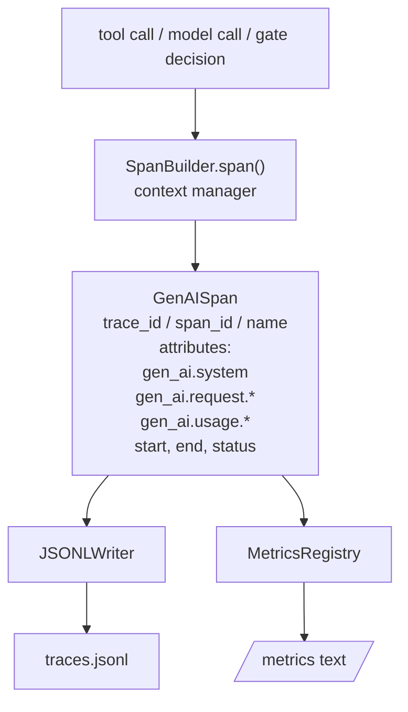
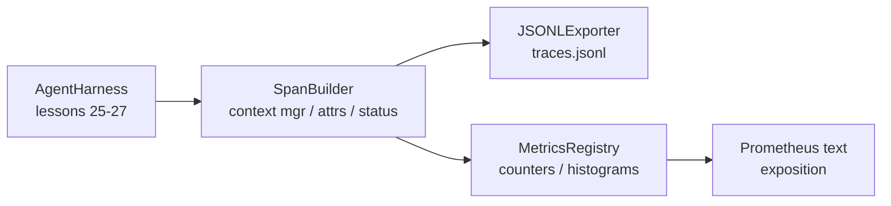

# Capstone Lesson 28: Observability with OTel GenAI Spans and Prometheus Metrics / 用 OTel GenAI Span 与 Prometheus Metrics 做可观测性

> 没有 observability 的 Agent harness，是一个会花钱的黑盒。本课手写一个 span builder，发出符合 OpenTelemetry GenAI semantic conventions 的 records，以每行一个 span 的 JSON-Lines 文件写出，并用 Prometheus text format 暴露 counters 和 histograms。整个实现都是 stdlib Python，可离线运行。

**类型：** 构建
**语言：** Python（stdlib）
**前置知识：** 第 19 阶段 · 25（verification gates）, 第 19 阶段 · 26（sandbox）, 第 19 阶段 · 27（eval harness）, 第 13 阶段 · 20（OpenTelemetry GenAI）, 第 14 阶段 · 23（OTel GenAI conventions）
**时间：** 约 90 分钟

## Learning Objectives / 学习目标

- 构建符合 OpenTelemetry GenAI semantic conventions 的 span data class。
- 实现 JSONL exporter，每行写出一个自包含 span。
- 构建带 labels 的 counters 与 histograms，并以 Prometheus text-format 暴露。
- 用 span context manager 包住任意 callable，记录 duration、status 和 exceptions。
- 验证发出的 spans 能通过 `json.loads` roundtrip，并匹配 spec shape。

## The Problem / 问题

生产中的 coding agent 每一轮都会产生三类观测记录：model call、tool execution 和 verification gate decision。没有结构化 telemetry，这三者都没法用。

第一种失败是 missing trace。周二出了问题，但唯一记录是一段 500 行 chat log。没有哪个工具运行了、耗时多久、prompt 进了多少 tokens、gate 有没有拒绝。agent 作者只能猜。

第二种失败是 unparseable trace。harness 写了 spans，但使用自创字段名。Grafana、Honeycomb、Jaeger 或本地 CLI 都读不懂。团队已有的 tooling 因非标准 spans 被浪费。

第三种失败是 unaggregated metric。你能在 trace 里看到一次慢 tool call，却回答不了“过去一小时 read_file 的 p95 latency 是多少？”因为只有 traces，没有 metrics。

OpenTelemetry GenAI semantic conventions 正是为此存在。它们定义了一组 LLM framework 共享的标准 attributes。只要 harness 写出这些 attributes，任何 OTel-compatible backend 都可以读取。

## The Concept / 概念



harness 中每个 operation 都产生一个 span。span 有 trace id（整个 agent invocation）、span id（当前 operation）、name（例如 `gen_ai.chat`、`gen_ai.tool.execution`）、符合 GenAI conventions 的 attributes、开始和结束时间、status。

GenAI conventions 标准化了这些 attribute keys：`gen_ai.system`（provider，例如 `anthropic`、`openai`）、`gen_ai.request.model`、`gen_ai.request.max_tokens`、`gen_ai.usage.input_tokens`、`gen_ai.usage.output_tokens`、`gen_ai.response.model`、`gen_ai.response.id`、`gen_ai.operation.name`，以及 tool-specific keys `gen_ai.tool.name` 和 `gen_ai.tool.call.id`。

exporter 写 JSONL。每行一个 JSON object。这是下游 tooling 最容易 stream、grep 和 import 的格式。真实 OTel exporter 会说 OTLP gRPC；本课的 JSONL exporter 是离线等价物，能在每台工作站上零退出。

metrics 与 traces 并列存在。counter 在每次 tool call 时递增：`tools_called_total{tool="read_file"}`。histogram 记录 observed latency：`tool_latency_ms{tool="read_file"}`。二者都会序列化为 Prometheus text exposition format，这是 pull-based metrics 的事实标准。

```figure
trace-spans
```

## Architecture / 架构



span builder 是一个小类，提供 `span(name, attrs)` 方法并返回 context manager。进入 context 时记录 start time，退出时记录 end time，如果有 exception 则附加，并把 finalized span 推给 exporter。

metrics registry 是两个 dict。Counters 是 `{(name, frozen_labels): int}`。Histograms 把 raw samples 保存在 list 中，并在 exposition 时序列化为 Prometheus histogram buckets。

## Build It / 动手构建

`main.py` 交付：

1. `GenAISpan` dataclass：trace_id、span_id、parent_span_id、name、attributes、start_unix_nano、end_unix_nano、status、status_message、events。
2. `SpanBuilder` class，带 `span(name, attrs, parent=None)` context manager。
3. `JSONLExporter` class，`export(span)` 追加一行。
4. `Counter` 和 `Histogram` classes，以及 `MetricsRegistry`。
5. `prometheus_exposition(registry)`，生成 text-format output。
6. `wrap_tool_call(name)` decorator，发出 span 并更新 metrics。
7. demo：合成完整 agent invocation（`gen_ai.chat` span 包住 tool spans）、写 `traces.jsonl`、打印 Prometheus exposition，并以零退出。

span id 和 trace id 是 16-byte hex strings，由 `os.urandom` 生成。这匹配 OTel 的 W3C trace context。exporter 不会抛出；IO errors 会暴露，但 harness 继续运行。

histogram 使用固定 buckets（OTel 对毫秒 latency 的默认：5、10、25、50、100、250、500、1000、2500、5000、10000、+Inf）。samples 存成 list；exposition 按需计算每个 bucket 的 count。

## Use It / 应用它

本课手写而不是直接用 `opentelemetry-sdk`，因为 OTel Python SDK 是真实依赖，也有数千行代码、OTLP exporter 的多进程和超出 lesson budget 的运行成本。手写版本教的是 wire format。生产中你把同一组 attributes 接入真实 SDK，就能获得 OTLP exporter、batching 和 resource detection。

conventions 是稳定的。本课发出的 wire format 到 2030 年仍应能 parse，因为 OTel 不会破坏 GenAI attribute names；它们只会新增字段。

## Ship It / 交付它

运行：

```bash
cd phases/19-capstone-projects/28-observability-otel-traces
python3 code/main.py
python3 -m pytest code/tests/ -v
```

demo 会在 lesson working dir 写出 `traces.jsonl`（结束时清理），打印三个 span 的样例，再打印 counters 和 histograms 的 Prometheus exposition。测试验证 spans 可序列化 round-trip、canonical GenAI attributes 存在、counters 正确递增、histogram exposition 包含期望 bucket counts。

第 25 课产生 gate chain，第 26 课产生 sandbox，第 27 课产生 eval harness。第 28 课让三者都可观察。第 29 课会把端到端 demo 的每一步都包进 span，并在结束时打印 Prometheus text。

## Exercises / 练习

1. 给 gate decision 增加 `gen_ai.guardrail.decision` attribute，并在 DENY 时设置 span status 为 ERROR。
2. 为 `tools_called_total` 增加 `status` label，区分 success、denied、timeout。
3. 把 JSONL exporter 改成 batch flush，并说明 crash 时会丢多少 span。
4. 增加 parent/child span 测试，确认 tool span 正确挂到 chat span 下。
5. 写一个小 CLI，读取 `traces.jsonl` 并输出每个 tool 的 p95 latency。

## Key Terms / 关键术语

| 术语 | 常见说法 | 实际含义 |
|------|-----------------|------------------------|
| GenAI span | “LLM trace span” | 带标准 `gen_ai.*` attributes 的 OTel span |
| JSONL exporter | “Local traces” | 每行一个 span JSON，方便离线 grep、stream 和 import |
| Prometheus exposition | “/metrics text” | counters 和 histograms 的 pull-based text format |
| Histogram bucket | “Latency bucket” | 对 observed samples 计算累计 bucket counts |
| Trace id | “Invocation id” | 把一次 agent invocation 中的多个 spans 关联起来的 id |

## Further Reading / 延伸阅读

- Phase 13 · 20：OpenTelemetry GenAI。
- Phase 14 · 23：OTel GenAI conventions。
- OpenTelemetry semantic conventions。
- Prometheus text exposition format。
