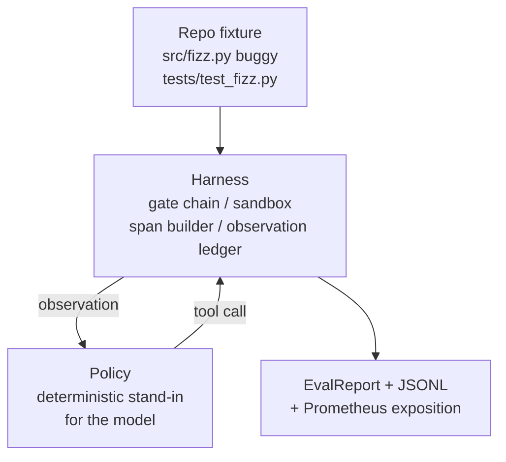
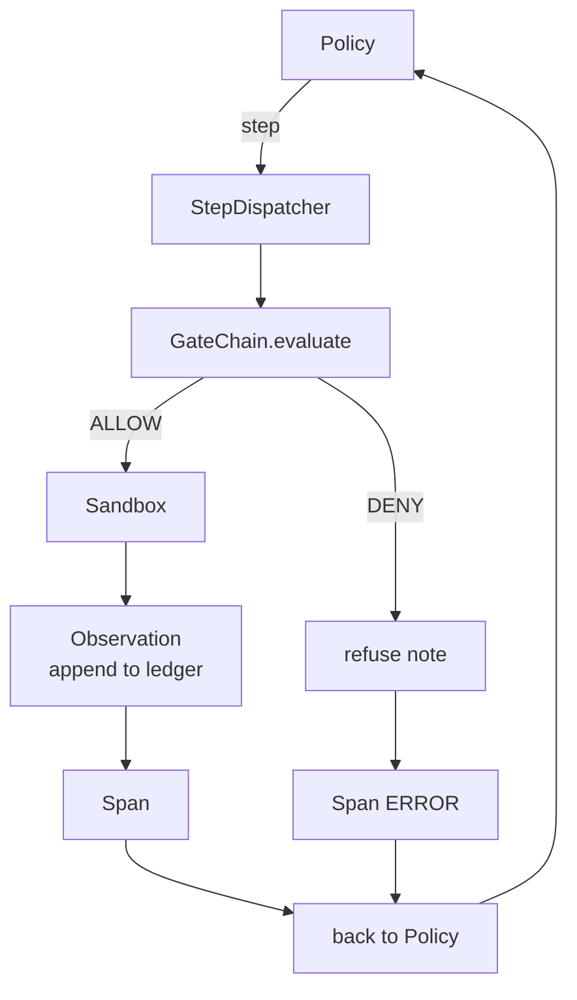

# Capstone Lesson 29: End-to-End Coding Agent on the Harness / Harness 上的端到端 Coding Agent

> Track A 的回报在这里。本课把 gate chain、sandbox、eval harness 和 OTel spans 缝成一个可工作的 coding agent，用它修复一个真实但很小的多文件 Python fixture bug。agent 使用 deterministic policy，而不是 LLM；这个替换让课程可复现，也说明真正关键的部分一直是 harness。契约完全相同：真实模型会插在 policy seam 上。

**类型：** 构建
**语言：** Python（stdlib）
**前置知识：** 第 19 阶段 · 25（verification gates）, 第 19 阶段 · 26（sandbox）, 第 19 阶段 · 27（eval harness）, 第 19 阶段 · 28（observability）, 第 14 阶段 · 38（verification gates）, 第 14 阶段 · 41（workbench for real repos）, 第 14 阶段 · 42（agent workbench capstone）
**时间：** 约 90 分钟

## Learning Objectives / 学习目标

- 把 gate chain、sandbox、eval harness 和 span builder 组合成单个 agent loop。
- 实现 deterministic policy，使用 read_file、run_tests 和 write_file 修复 fixture bug。
- 在端到端运行中同时强制 global step budget 和 observation token budget。
- 为完整运行发出 OTel GenAI traces 和 Prometheus metrics。
- 验证 agent 在少于 12 步内解决 fixture，并且合法工具上零 gate trips。

## The Problem / 问题

大多数 agent demo 都孤立工作：单独的 sandbox、单独的 eval harness、单独的 span emitter。看起来都没问题。一组合，接口问题就出现了。

gate chain 说 ALLOW，但 sandbox 因 chain 没预料到的理由拒绝。eval harness 记录 pass，但 OTel spans 显示 gate 拒绝了一个 agent 声称用过的工具。Prometheus counter 被加了两次，理论上只该加一次。observation budget 超了，但 agent 继续跑，因为 budget 在 chain 里，sandbox 不知道。

本课是整条 track 的 integration test。agent 必须按顺序做四件事：读 project、跑 tests、从 test failure 识别 bug、写 fix、重跑 tests、停止。每个 operation 经过 gate chain。每次 tool execution 经过 sandbox。每个 step 都包在 span 中。最后由 eval harness 评分。

## The Concept / 概念



agent 的 policy 是一个状态机，有五个状态。

`SURVEY`：agent 读取 project listing。下一个状态是 RUN_TESTS。

`RUN_TESTS`：agent 运行 test command。如果 tests pass，状态机以 success 停止。否则进入 INSPECT。

`INSPECT`：agent 读取失败源文件。下一个状态是 FIX。

`FIX`：agent 写入修正后的文件。下一个状态是 VERIFY。

`VERIFY`：agent 再次运行 test command。如果 tests pass，停止成功；否则停止失败。

每个状态对应一次 tool call。每个 tool call 都经过 gate chain。如果 tool call 被拒绝，agent 在 trace 中报告 refusal 并停止。

fixture bug 是 `fizz.py` 里的 off-by-one。deterministic policy 通过 regex 从 test failure message 识别 bug，并发出修正后的文件。把 policy 换成 LLM 不改变 harness contract。

## Architecture / 架构



本课是自包含的。`main.py` 会以最小规模重新实现 prior lessons primitives（gate、sandbox、ledger、span），因此不需要 import sibling lessons 即可运行。命名与 lessons 25-28 完全一致，让概念映射没有歧义。

## Build It / 动手构建

`main.py` 交付：

1. 最小 harness primitives，名称与 lessons 25-28 一致：`GateChain`、`Sandbox`、`ObservationLedger`、`SpanBuilder`、`MetricsRegistry`。
2. `CodingAgentPolicy` class：五状态 state machine。
3. `Repo` helper：准备带 bundled buggy fixture 的 scratch dir。
4. `AgentRun` class：驱动 policy，通过 harness dispatch，并返回 `AgentRunReport`。
5. bundled fixture（`fixture_repo/`）：包含 src/fizz.py、tests/test_fizz.py，以及 eval harness 用的 expected/ tree。
6. demo：端到端运行 policy，打印 step-by-step trace，断言 pass，打印 metrics。

bundled fixture 与第 27 课 task structure 形状相同：一个 buggy file 和一个 tests file。test failure message 包含 deterministic policy 识别 fix 所需的信息。真实 LLM 会做同样的工作，只是更慢、召回更广；但 harness 的期望不变。

## Use It / 应用它

本课不使用真实 LLM，是为了可复现。真实 LLM 需要 API key、网络调用和不可验证的随机性，而本课关注的是 harness。替换成 deterministic policy 后，课程可以在任何开发者机器上无外部依赖运行，测试也能断言精确 step count。

lesson policy 是 LLM agent 行为的严格子集：读取 repo、看到失败测试、定位行、发出 fix。LLM 也会走同一个 loop，使用同一个 harness contract；bookkeeping 完全相同。

## Ship It / 交付它

端到端 demo 在退出时断言五件事，测试套件也会程序化重断言。

policy 在少于 12 步内解决 fixture。

observation budget 从未超出。

合法工具上零 gate denials。（agent 从未编造 denied tool name。）

每个 step 在 `traces.jsonl` 中都有对应 span。

Prometheus exposition 包含 `tools_called_total{tool="read_file"}` 条目和 `tool_latency_ms` histogram。

运行：

```bash
cd phases/19-capstone-projects/29-end-to-end-coding-task-demo
python3 code/main.py
python3 -m pytest code/tests/ -v
```

demo 打印 per-step trace、final eval report 和 Prometheus exposition，exit code 为零。测试覆盖 policy state transitions、synthetic tool calls 上的 gate refusals、bundled fixture 上的端到端 run，以及 step-budget invariants。

## Exercises / 练习

1. 把 deterministic policy 的 bug pattern 改成另一种 fixture，并补一个对应 eval task。
2. 故意让 policy 请求一个不在 whitelist 里的工具，确认 trace 中 span status 与 refusal count 正确。
3. 把 observation budget 降低到第一次 `run_tests` 后会触发，确认 agent 干净停止。
4. 增加一个真实 model adapter seam，但默认仍用 deterministic policy。
5. 将 JSONL exporter 替换为 OTLP exporter mock，保持 span attributes 不变。

## Key Terms / 关键术语

| 术语 | 常见说法 | 实际含义 |
|------|-----------------|------------------------|
| Deterministic policy | “Fake LLM” | 可复现的模型替身，用同一 harness contract 发 tool calls |
| Integration test | “End-to-end demo” | gate、sandbox、eval 和 observability 同时工作的系统测试 |
| Observation budget | “Context cap” | 端到端运行中模型可读取 tool output 的 token 上限 |
| Step budget | “Max steps” | agent 在失败或循环前允许执行的全局 step 上限 |
| AgentRunReport | “Run summary” | 解题结果、steps、spans、metrics 和 eval outcome 的结构化报告 |

## Further Reading / 延伸阅读

- Phase 19 · 25：verification gates。
- Phase 19 · 26：sandbox runner。
- Phase 19 · 27：eval harness。
- Phase 19 · 28：observability。
- Phase 14 · 42：agent workbench capstone。
