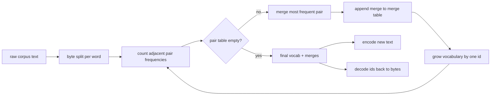
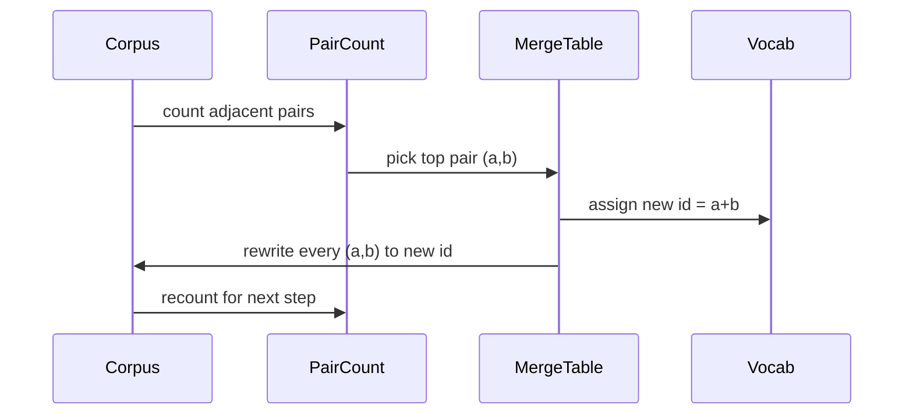

# BPE Tokenizer From Scratch / 从零构建 BPE Tokenizer

> bytes 进来，ids 出去，再把 ids 还原成同一串 bytes。构建每个现代文本模型仍然离不开的 tokenizer。

**类型：** 构建
**语言：** Python
**前置知识：** 第 04 阶段 课, 第 07 阶段 transformer 课
**时间：** 约 90 分钟

## Learning Objectives / 学习目标

- 从原始文本 corpus 训练 Byte-Pair Encoding vocabulary：反复合并最高频的相邻 symbol pair。
- 实现确定性的 merge table，并把它应用到新文本上，产生 subword id stream。
- 让任意 UTF-8 输入都能无信息损失地 encode 到 ids 再 decode 回来。
- 保留并保护 special tokens（`<|endoftext|>`、`<|pad|>`），让它们在训练和解码中都保持语义。
- 解释为什么 byte-level alphabet 是通用 tokenizer 的正确底座。

## The Problem / 问题

语言模型从不直接看文本，它看整数。从 string 到 integer list 再回来的映射就是 tokenizer。这个层出错，训练 run 中每条 loss curve 都是在测量错误对象。

通用文本模型中最主流的 subword tokenizer 家族是 Byte-Pair Encoding。想法很小：从已知 alphabet 开始，找到训练 corpus 中出现最频繁的相邻 symbol pair，把它合并成新 symbol。重复直到 vocabulary 达到目标大小。编码新文本时，按同一顺序复用同一个 merge list。

本课构建 byte-level 变体。alphabet 是 256 个 raw bytes，而不是 Unicode code points。这个选择让 tokenizer 能处理任意 UTF-8 输入，而不需要 unknown token 兜底。

## The Concept / 概念

### The pipeline / Pipeline

training side 和 inference side 共享 merge table。这是契约。如果 inference 时改变 merge order，就会得到另一条 id stream。

### The byte alphabet / Byte alphabet

前 256 个 ids 预留给 raw bytes 0x00 到 0xFF。这样任何 input string 在发生任何 merge 之前，都能表达在 vocabulary 中。byte block 之后，我们为 special tokens 预留一小段范围。training loop 永远不会把这些 ids 作为 merge target，因为它们完全不进入 pretokenized stream。

pretokenizer 在 whitespace 和 punctuation boundaries 上切分 corpus 后再交给训练。如果没有这个切分，BPE merge 会很乐意学习跨 word boundary 的 merges，vocabulary 会被常见整句短语填满。有了切分，merges 保持在 word 内，结果更可泛化。

### The training loop / 训练循环

每个训练 step 做三件事：遍历 corpus 中每个 word，按该 word 出现频率加权统计当前 symbol 序列中相邻 pair 的频率；选择 count 最高的 pair；把所有这个 pair 的出现改写成一个新 symbol，id 为下一个空闲 vocab slot；然后记录这次 merge。

每步成本与“用 symbol sequence 表达的 corpus 大小”线性相关。对一百万 words 和一万个 target vocab ids，循环能在数秒内完成，因为 merges 生效后 symbol sequences 会变短。

### Encoding fresh text / 编码新文本

inference 不调用 merge counter。它按学习到的顺序应用 merge table。对一个新 word，encoder 从 byte split 开始，扫描当前 sequence 中 rank 最低的 merge（最早学到且可应用的 merge），执行该 merge，再继续扫描。直到没有 merge 可应用。

按 rank 排序是 deterministic encoding 并匹配训练行为的关键。先学到的 merge 在 table 前面，会先应用。如果两个 merge 能在同一位置应用，rank 更低的那个胜出。

### Special tokens / Special tokens

special tokens 是 byte stream 永远无法自然产生的 ids。本课手动预留两个：

- `<|endoftext|>` 分隔 pretraining 中的 documents。它告诉模型：“新文档从这里开始，不要让上一份文档的 context 泄漏进来。”
- `<|pad|>` 填充短 sequence，让 batch 成为矩形 tensor。训练时 loss mask 会隐藏它。

encoder 接受一个 flag，决定是否允许 input 中出现 special tokens。flag 关闭时，字符串 `<|endoftext|>` 和 `<|pad|>` 会被 tokenized 成拼写它们的 bytes。flag 打开时，这些 literal strings 会映射到 reserved ids，并且不参与任何 merge。

### Round-trip guarantee / Round-trip 保证

encode 后再 decode 必须精确返回 input bytes。decoder 按顺序拼接每个 id 的 byte expansion。每个 id 要么是 raw byte，要么是两个已知 ids 的拼接，因此递归展开总会落到 raw bytes。decode 最后返回这些 bytes 所拼出的 UTF-8 string。

本课测试会在未见过的句子、带 Unicode emoji 的句子，以及包含 literal `<|endoftext|>` token 的句子上检查这个性质。

## Build It / 动手构建

`main.py` 定义四个对象。`BPETokenizer` 持有 vocabulary、merge table 和 special-token table。`train` 是训练循环。`encode` 是 inference path。`decode` 是 byte concatenation。底部 demo 在内置 corpus 上训练小 tokenizer，编码 held-out sentence，再把 ids decode 回来，并打印二者。

测试 `code/tests/test_bpe.py` 钉住 round-trip property、special-token reservation 和 merge ordering。

## Use It / 应用它

运行 demo 后，把 target vocabulary size 从 300 改成 600，观察 held-out sentence 的 encoded length 如何下降。这个曲线就是 BPE compression curve。

本课没有构建生产级 regex pretokenizer，也没有并行化 pair counter。对几千 words 的课程 corpus，Python loop 已经远低于一秒。更大 corpus 的自然扩展是按 word 并行统计 pairs，再 reduce。

## Ship It / 交付它

本课交付一个 byte-level BPE tokenizer：byte alphabet、merge table、special tokens、encode/decode round-trip 都具备。下一课会把 tokenizer 当成黑盒，在它之上构建 sliding-window dataset。

## Exercises / 练习

1. 把 vocabulary size 从 300 扫到 1000，画出 held-out encoded length 曲线。
2. 增加一个新的 special token，并确认 training loop 不会把它作为 merge target。
3. 构造一个包含 emoji、CJK 和 control bytes 的 round-trip 测试。
4. 给 pair counter 加 deterministic tie-breaker，并证明相同 corpus 多次训练 merge table 一致。
5. 实现并行 pair count，然后与单线程版本比较 merge order 是否完全一致。

## Key Terms / 关键术语

| 术语 | 常见说法 | 实际含义 |
|------|-----------------|------------------------|
| BPE | “Subword tokenizer” | 反复合并最高频相邻 symbol pair 的 vocabulary 学习算法 |
| Byte-level alphabet | “256 byte floor” | 用 raw bytes 作为初始 alphabet，避免 unknown token |
| Merge table | “BPE ranks” | 训练时学到的有序 pair merges，inference 必须按同序应用 |
| Special token | “Reserved id” | byte stream 不会自然产生、由 tokenizer 直接映射的控制 token |
| Round-trip | “Encode then decode” | ids decode 后精确回到原始 input bytes |

## Further Reading / 延伸阅读

- Phase 07 transformer lessons：后续模型会消费 tokenizer ids。
- Phase 19 lesson 31：tokenized dataset 与 sliding window。
- Byte Pair Encoding 原始算法与现代 byte-level BPE 实现。
