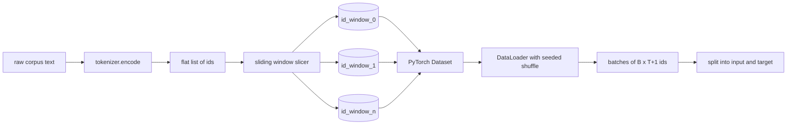
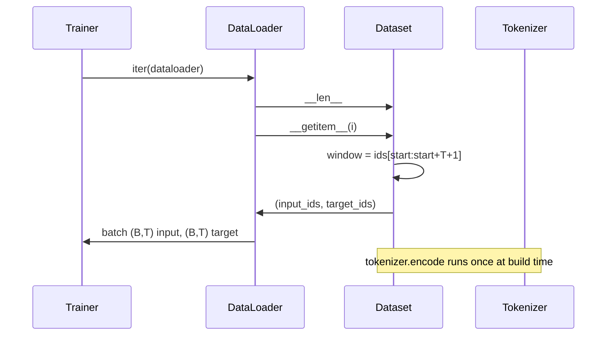

# Tokenized Dataset with Sliding Window / 带 Sliding Window 的 Tokenized Dataset

> pretraining run 是从 token ids 到 gradients 的函数。本课构建把 ids 喂进去的 conveyor。

**类型：** 构建
**语言：** Python
**前置知识：** 第 04 阶段课程，第 07 阶段 Transformer 课程，本阶段第 30 课
**时间：** 约 90 分钟

## Learning Objectives / 学习目标

- 通过一次 tokenizer 调用把 raw corpus 转成 token id stream。
- 用可配置 overlap stride 把 id stream 切成 fixed-length windows。
- 构建 PyTorch Dataset，为 next-token prediction 返回 input 和 target tensors。
- 用 per-epoch deterministic shuffle seed 把 dataset 包进 DataLoader。
- 解释 stride、redundancy 和 effective dataset size 之间的取舍。

## The Problem / 问题

pretraining run 每次读取一批 token ids，然后更新模型。每个 batch 的 shape 由训练契约固定。对 causal language model，batch 持有 `(B, T)` input ids 和 `(B, T)` target ids，target 是 input 左移一位。data pipeline 的职责，就是从可能有数 GB 的 raw text corpus 中，按需、确定性、可复现地产生这个契约。

本课构建这个 pipeline。上一课的 tokenizer 把文本变成长而扁平的 id list。sliding window 把 list 切成训练样本。custom Dataset 把样本暴露为 tensors。DataLoader 批处理并用已知 seed shuffle。

## The Concept / 概念

### The shape contract / Shape 契约

causal LM 消费形状 `(B, T)` 的 ids，其中 `B` 是 batch size，`T` 是 context length。位置 `t` 的 target 是 input 的 `t+1`。因此每个 training example 覆盖 `T+1` 个 raw ids。window stride 控制相邻 examples 的重叠程度。

slicer 不会跨过 corpus 的尾部去补窗口。如果最后一个 window 没有足够 ids 填满 `T+1`，它会被丢弃。用 `<|pad|>` 补尾也是合法选择，但会让 loss mask 复杂化。本课选择丢弃。

### Why a sliding window / 为什么使用 sliding window

pretraining corpus 是一条很长的 id stream。如果模型只看 non-overlapping windows，它每次都在同一组 `T` boundaries 上学习。调整 stride 会移动这些边界，让模型看到更多样的 next-token prediction 任务。

stride 为 `T` 时产生无重叠 windows。stride 为 `T // 2` 时有 50% overlap，effective dataset 翻倍。stride 为 `1` 时重叠最大，dataset 约增大 `T` 倍。代价是每个 epoch 计算更多。收益是边界更多样。多数 pretraining run 使用等于 context length 的 stride，因为 corpus 已经远大于模型一个 epoch 能处理的量，边界多样性的重要性较弱。

### The Dataset class / Dataset class

PyTorch Dataset 有两个必需方法。`__len__` 返回 examples 数量。`__getitem__` 返回一个样本 tensor pair。我们的 Dataset 存 encoded id stream 和 stride。索引时按需计算 window start，因此无论 stride 产生多少 examples，内存成本都是一份 id stream。

shift-by-one 发生在 `__getitem__` 内。Dataset 返回 `(input, target)`，其中 `input = window[:-1]`，`target = window[1:]`。二者都是 PyTorch long tensors。training loop 把它们当作 ground truth。

### Deterministic shuffle / 确定性 shuffle

带 `shuffle=True` 的 DataLoader 会读取 PyTorch random generator。传入按 epoch 显式 seed 的 `torch.Generator` 后，run 重启时会得到相同 shuffle。这对比较两个只差一个 hyperparameter 的 run 很关键。没有 seed，两次 run 看到的数据顺序不同，loss curves 会因为无关原因而分叉。

本课 seed 契约很简单：`epoch_seed = base_seed + epoch_index`。base seed 构造时传入。epoch index 由 trainer 在每个 epoch 顶部递增。相同 base seed 的重跑会在每个 epoch 看到相同顺序。

### Batch sampler / Batch sampler

PyTorch 默认 sampler 在无 replacement 的情况下均匀随机选择 indices。这正是 pretraining 想要的。finetuning 小数据集时契约相同。DataLoader 通过调用 `__getitem__` `B` 次并 stack 结果来组 batch。由于每个 example 长度固定，不需要 padding 逻辑。

课程保持 `num_workers=0`，方便理解。生产 run 中 workers 会并行 `__getitem__`。对我们的 pipeline 来说这几乎是 no-op，因为工作只是对 in-memory tensor 做 slice，但同一个 Dataset API 能干净支持 workers。

### Counting examples / 计算样本数

对长度为 `N` 的 id stream、context length `T` 和 stride `S`，examples 数量是 `max(0, 1 + (N - (T + 1)) // S)`。本课把这个计算暴露成 Dataset 的 static method，让 trainer 不用迭代即可计算每个 epoch 的 total steps。

## Build It / 动手构建

`main.py` 定义两个 classes 和一个 helper。`SlidingWindowDataset` 是 PyTorch Dataset。`make_dataloader` 返回带 seeded generator 的 DataLoader。`_encode_corpus_to_ids` 是一次性 tokenizer 调用。底部 demo 在进程内构建小 tokenizer，编码内置 corpus，构建 dataset 和 dataloader，打印一个 batch，并断言 shape contract。

测试 `code/tests/test_dataset.py` 钉住 window count formula、shift-by-one property、deterministic shuffle 和 stride trade-off。

## Use It / 应用它

运行 demo 后，把 context length 从 16 改成 32，观察每个 epoch 的 examples 数量如何下降。这个数字就是你的 steps-per-epoch budget。

本课不从 disk stream，corpus 会一次性 encode 并保存在单个 tensor 中。几百万 ids 的 corpus 远低于一百 MB，适合课程。disk streaming 是独立关注点，可以通过替换 storage 接入，同时保持 Dataset contract。

## Ship It / 交付它

本课交付 next-token prediction 的数据层：token id stream、sliding windows、input/target shift、seeded DataLoader 和 example-count formula。后续 embedding、attention 与 GPT model 都会消费这个 `(B, T)` 契约。

## Exercises / 练习

1. 比较 stride 为 `T`、`T//2`、`1` 时的 examples 数量和一个 epoch 的运行时间。
2. 增加 tail padding 版本，并正确 mask `<|pad|>` loss。
3. 把 `num_workers` 改成 2，确认 deterministic shuffle 顺序仍然可复现。
4. 支持多文档 corpus，并在文档之间插入 `<|endoftext|>` id。
5. 给 example count formula 加边界测试：`N < T+1`、`N == T+1`、`stride > T`。

## Key Terms / 关键术语

| 术语 | 常见说法 | 实际含义 |
|------|-----------------|------------------------|
| Sliding window | “Training slice” | 从 global id stream 中切出的 `T+1` 长度窗口 |
| Stride | “Step between windows” | 相邻 windows 起点之间的距离，控制 overlap |
| Shift-by-one | “Next-token target” | `input = window[:-1]`，`target = window[1:]` |
| Deterministic shuffle | “Seeded DataLoader” | 每个 epoch 用固定 generator seed 产生可复现顺序 |
| Steps per epoch | “Dataset length” | 由 `N`、`T`、`S` 直接计算出的窗口数量 |

## Further Reading / 延伸阅读

- Phase 19 lesson 30：BPE tokenizer。
- Phase 19 lesson 32：token 与 positional embeddings。
- PyTorch `Dataset` 与 `DataLoader` 文档。
