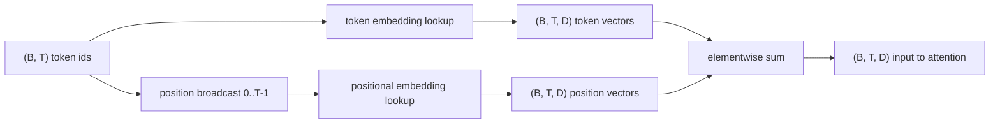
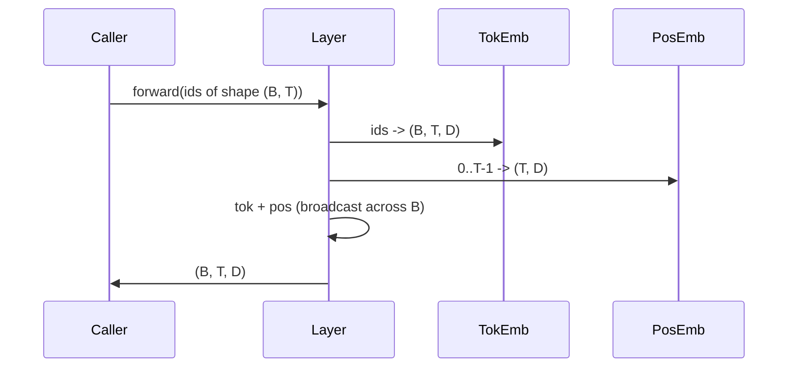

# Token and Positional Embeddings / Token 与 Positional Embeddings

> ids 是整数，而模型需要向量。中间夹着两张 lookup table；其中 positional table 的选择会塑造模型能学到什么。

**类型：** 构建
**语言：** Python
**前置知识：** 第 04 阶段课程，第 07 阶段 Transformer 课程，本阶段第 30、31 课
**时间：** 约 90 分钟

## Learning Objectives / 学习目标

- 构建 token-embedding lookup table，把 vocabulary ids 映射到 dense vectors。
- 构建按 position 索引的 learned positional-embedding lookup table。
- 构建无参数的 fixed sinusoidal positional embedding。
- 将 token 和 positional embeddings 组合成 transformer block 的单一输入。
- 对比 learned 与 sinusoidal embeddings 在 length generalization 与 parameter count 上的差异。

## The Problem / 问题

模型第一次接触 token id，是在 token-embedding matrix 中做 row lookup。这个 matrix 每个 vocabulary id 一行，每个 model dimension 一列。lookup 返回一个向量，后续模型把它当成该 id 的意义。backprop 会更新 forward pass 中用到的 rows。训练过程中，这些 rows 的几何结构会学会把相似性编码在方向中。

token ids 本身没有顺序。模型需要第二个信号来说明 position one 和 position seventeen 不同。这个信号最常见的两种选择是 learned positional embedding（第二张 lookup table，每个位置一行）和 fixed sinusoidal positional embedding（一个无参数数学公式）。选择会带来后果。learned table 是参数，并受训练时最大 context length 限制。sinusoidal table 理论上无参数，公式能扩展到任意 position；但本课的 `SinusoidalPositionalEmbedding` 在 `max_context_length` 上预计算固定 table，`forward` 超过边界会 raise，因此这里两个 module 都强制最大 context length。即使 table 足够索引，模型也可能在训练长度之外表现不稳。

本课构建两种 positional embedding，并把它们与 token embedding 相加，作为下一课 attention block 的输入。

## The Concept / 概念

### The shape contract / Shape 契约

embedding stage 的输入是形状 `(B, T)` 的 token ids。输出是形状 `(B, T, D)` 的 tensor，其中 `D` 是 model dimension。每个 batch element 有相同 context length `T`。每个 position 的 vector dimension 都是 `D`。



composition 是相加，不是拼接。相加让 `D` 在网络中保持不变，并让模型在每个 feature 上自行决定 token meaning 或 position 哪个更重要。

### The token embedding matrix / Token embedding matrix

token embedding 是形状 `(V, D)` 的参数 tensor，其中 `V` 是 vocabulary size。PyTorch 用 `nn.Embedding(V, D)` 暴露它。初始化时 entries 通常来自小 Gaussian；在 transformer-scale models 中，均值零、标准差约 `0.02` 很常见。精确初始化不如跨 run 一致重要。

forward pass 是一次 indexing operation。PyTorch 把 `(B, T)` int64 ids 通过 gather rows 映射到 `(B, T, D)` floats。backward pass 只把 gradients 累积到 forward 中触碰过的 rows。batch 中未出现的 rows 在该 step 收到零 gradient。

一个细节：token embedding 和模型末端 output projection 经常共享权重（weight tying）。发生 weight tying 时，每次 backward 都会通过 output side 触碰 embedding 的每一行。本课把二者作为独立 module 暴露，但完整模型中同一个 matrix 可以扮演两个角色。

### The learned positional embedding / Learned positional embedding

learned positional embedding 是第二个 `nn.Embedding`，形状 `(max_context_length, D)`。lookup key 是 position id `0, 1, 2, ..., T-1`。forward pass 会把 position vector broadcast 到 batch dimension。

learned table 的缺点是：如果模型只训练到 position `T-1`，就不能查询 position `T`，因为那一行不存在。使用这一方案的 production decoder-only models 会把 maximum context length 烙进 architecture，并拒绝处理更长输入。

### The sinusoidal positional embedding / Sinusoidal positional embedding

sinusoidal positional embedding 是从 position 到 vector 的函数。Position `p` 和 feature `i` 产生：

```python
angle = p / (10000 ** (2 * (i // 2) / D))
emb[p, 2k]     = sin(angle)
emb[p, 2k + 1] = cos(angle)
```

函数没有参数。每个 position 都有唯一 vector。wavelength 在 feature dimensions 上按几何方式变化，因此低维编码粗位置，高维编码细位置。

`sin` 和 `cos` 搭配带来的性质是，position `p + k` 的向量是 position `p` 向量的线性函数。这给 attention layer 学习 relative-position offsets 留了一条容易路径。模型不需要额外参数来表达“往回看五个 tokens”。

本课在构造时一次性计算完整 sinusoidal table，forward 时索引它。

### The composition / 组合

输入 pipeline 按顺序做三件事：读取 token ids，lookup token vectors，加上 positional vectors，返回和。



sum step 中的 broadcasting 会把 `(T, D)` positional tensor 沿 batch dimension 复制。PyTorch 会自动处理，因为 unsqueeze 后 positional tensor 形状是 `(1, T, D)`。

### Contrastive analysis / 对比分析

课程在同一输入上运行两种变体，并打印两个 diagnostics。

第一个是 parameter count。learned 变体在 token embedding 之外增加 `max_context_length * D` 个参数。sinusoidal 变体增加零参数。

第二个是相邻位置 embeddings 的 cosine similarity。sinusoidal 变体有平滑且可预测的衰减，因为函数是连续的。learned 变体在初始化时相似度近似随机，因为 rows 独立抽样。训练后 learned 变体通常也会发展出类似平滑结构，但它必须从数据里学到。

## Build It / 动手构建

`main.py` 定义三个 modules。`TokenEmbedding` 包住 `nn.Embedding(V, D)`。`LearnedPositionalEmbedding` 包住 `nn.Embedding(L, D)`。`SinusoidalPositionalEmbedding` 预计算 table 并把它注册为 buffer。`EmbeddingComposer` 把 token embedding 和 positional embedding 组合在一起。

底部 demo 打印 shapes、parameter counts 和 neighbour-position similarity diagnostic。测试 `code/tests/test_embeddings.py` 钉住 shape、broadcast behaviour、parameter count 和 sinusoidal formula。

## Use It / 应用它

运行 demo 后，把 model dimension `D` 从 64 改成 32，观察 sinusoidal wavelength bands 如何变化。

本课没有构建 rotary positional encoding（RoPE）或 AliBi。它们是生产 transformer 的现代选择，也遵循同一个 shape contract：对 `(B, T, D)` vectors 施加 position-dependent transformation，但它们发生在 attention-projection step，而不是输入相加处。下一课会构建 attention block，optional extension 可以把 rotary 折进 query-key projections。

## Ship It / 交付它

本课交付 embedding stage：token lookup、learned position lookup、sinusoidal position table，以及二者相加的 `(B, T, D)` 输出。下一课的 multi-head self-attention 会消费这个张量。

## Exercises / 练习

1. 给 learned positional embedding 加越界错误测试，确认 `T > max_context_length` 时 fail fast。
2. 比较 learned 与 sinusoidal 的 parameter count，改变 `D` 和 `max_context_length` 观察增长。
3. 添加 RoPE 的最小实现，只作用在下一课的 Q/K projections 上。
4. 在同一 batch 上打印不同 positions 的 cosine similarity matrix。
5. 给 token embedding 与 LM head 做 weight tying，并解释 backward 触碰 rows 的差异。

## Key Terms / 关键术语

| 术语 | 常见说法 | 实际含义 |
|------|-----------------|------------------------|
| Token embedding | “Id lookup” | `(V, D)` 参数表，把 token id 映射成 dense vector |
| Positional embedding | “Position signal” | 给模型提供 token 顺序信息的 learned table 或 fixed formula |
| Sinusoidal embedding | “No-param positions” | 用 sin/cos 公式生成 position vectors，不训练参数 |
| Broadcast sum | “Tok + pos” | 把 `(T, D)` position vectors 广播到 batch 后与 token vectors 相加 |
| Weight tying | “Shared embedding/head” | token embedding 与 output projection 共享同一个参数 tensor |

## Further Reading / 延伸阅读

- Phase 07 transformer lessons：positional encoding 与 attention 基础。
- Phase 19 lesson 33：multi-head self-attention。
- Phase 19 lesson 35：GPT model assembly。
