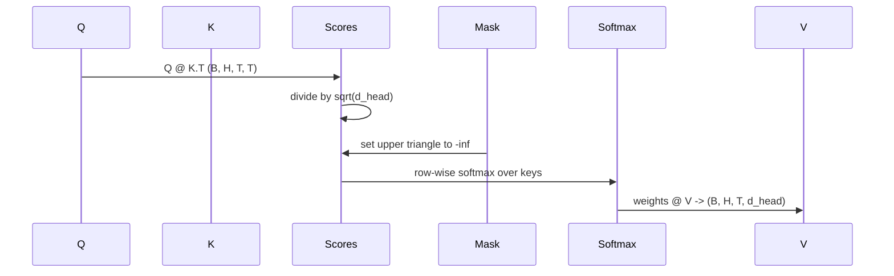

# Multi-Head Self-Attention / 多头自注意力

> 一次 linear projection，三种视图，H 个并行 heads，一个 mask。这就是模型实际使用的 attention block。

**类型：** 构建
**语言：** Python
**前置知识：** 第 04 阶段课程，第 07 阶段 Transformer 课程，本阶段第 30-32 课
**时间：** 约 90 分钟

## Learning Objectives / 学习目标

- 用一个 linear layer 实现 batched Query/Key/Value projection，并拆成 H 个 heads。
- 用正确的 normalization 和 dtype handling 计算 scaled dot-product attention。
- 应用 causal mask，防止某个 position 看到未来 positions。
- 检查固定输入的 per-head attention weights，并解释每个 head 在看什么。
- 在 toy task 上训练一个小 attention block，观察 heads specialization 时 loss 下降。

## The Problem / 问题

attention 是让一个 token representation 从同一 sequence 的其他 tokens 拉取信息的函数。self-attention 表示 queries、keys、values 都来自同一输入。multi-head 表示 projection 被拆成 H 个并行 attention problems，它们的输出被拼回并投影回来。

高效实现模式是一个 linear layer，从 `D` 投影到 `3 * D`，再切成 Q、K、V 三个 views，然后 reshape 成 H 个大小为 `D // H` 的 heads。matmul、softmax 和 weighted sum 以 batched tensor operations 执行，因此 heads 在 accelerator 上并行运行。

本课构建这个 block，并加入 causal mask，使同一代码可以作为 decoder-only language model 的 attention layer。下一课会把 block 堆成完整 transformer，再下一课训练它。

## The Concept / 概念

### The shape contract / Shape 契约

输入是 `(B, T, D)`。输出是 `(B, T, D)`。mask 是 `(T, T)` 或可 broadcast 到它。block 内部的中间 tensors 形状为 `(B, H, T, d_head)`，其中 `d_head = D // H`。约束是 `D % H == 0`。

```mermaid
flowchart LR
    A["(B, T, D) input"] --> B[Linear D -> 3D]
    B --> C["split into Q, K, V"]
    C --> D["reshape to (B, H, T, d_head)"]
    D --> E["scores = Q @ K.T / sqrt(d_head)"]
    E --> F[apply causal mask]
    F --> G[softmax over keys]
    G --> H["context = weights @ V"]
    H --> I["reshape to (B, T, D)"]
    I --> J[output Linear D -> D]
    J --> K["(B, T, D) output"]
```

两个 linear layers（QKV projection 和 output projection）是 block 中仅有的参数。mask、softmax、matmuls 和 reshapes 都无参数。

### The QKV split / QKV 拆分

naive 实现会为 Q、K、V 分别创建三个 linear layers。高效实现只用一个 layer 输出 `3 * D` features，再切分结果。二者数学等价，因为三个 `(D, D)` 权重矩阵的乘法，正好等价于一次由三者 stack 出来的 `(3D, D)` 权重矩阵乘法。

高效版更快，因为 accelerator 只启动一次 matmul，而不是三次。初始化也更容易，因为三个子矩阵在同一个 parameter tensor 中，可以一起初始化。

### The head reshape / Head reshape

split 后，Q、K、V 各自是 `(B, T, D)`。要变成 H 个并行 attention problems，我们 reshape 到 `(B, T, H, d_head)`，再 transpose 成 `(B, H, T, d_head)`。head dimension 紧挨 batch dimension，PyTorch 就会把 per-head attention 当作跨 `B * H` 个独立实例的 batched operation。

`d_head` 保持在最后一维，使 score matmul `Q @ K.transpose(-2, -1)` 收缩它。结果是 `(B, H, T, T)` 的 per-head attention scores。

### Scaling / 缩放

softmax 前，scores 要除以 `sqrt(d_head)`。没有这个缩放，dot products 会随 `d_head` 增大而变大，把 softmax 推到几乎所有质量集中在一个 entry 的区域，其余 entries 梯度接近消失，学习停滞。除以 `sqrt(d_head)` 能让 score variance 在不同 head size 下大致稳定。

### The causal mask / Causal mask

decoder-only language model 在预测下一个 token 时只能条件化过去。mask 执行这个限制。具体来说，在 softmax 前，把 `(T, T)` score matrix 对角线上方的 entries 替换成 negative infinity。softmax 后这些位置权重为零。

构造时把 mask 注册为 buffer，让它和模型位于同一 device，并且不进入 gradient graph。mask 覆盖 block 可能看到的 maximum context length。forward 时切出左上角 `(T, T)`。

### The output projection / 输出投影

得到 per-head context vectors `(B, H, T, d_head)` 后，transpose 回 `(B, T, H, d_head)`，reshape 成 `(B, T, D)`，再应用最终 `(D, D)` linear projection。output projection 让模型混合 heads。没有它，H 个 heads 只能通过后续层重新组合，block 会被人为限制。

### Attention weight inspection / Attention weight 检查

本课在 forward pass 上暴露 `return_weights=True` flag。设置后，block 在输出外还返回形状 `(B, H, T, T)` 的 per-head attention weights。demo 会打印一个短输入上某个 head 的 weight heatmap，让你看到 causal triangle structure 和 per-position focus。

训练后的模型中，不同 heads 会学到不同模式。有的 head 看紧邻前一个 token，有的看 sequence 开头，有的几乎均匀扩散 attention。这个 inspection hook 是 interpretability 工作的入口。

### The training demo / 训练 demo

`main.py` 底部 demo 把 attention block 接到 tiny LM head 上，并在 repeat task 上训练。输入每一行都是一个 random id 在 context 中重复。target 是 input 左移一位，所以模型必须学会 next token 与 previous token 相同。loss 是 cross-entropy。H=4、D=32、T=12、vocab 64 时，CPU 上三轮 epoch 内 loss 会从 random（约 `log(64) ~ 4.16`）降到远低于 `1.0`。

demo 不是为了训练有用模型，而是确认 gradients 流过 block 的每个部件，并且 heads 在答案显然的问题上学到了东西。

## Build It / 动手构建

`main.py` 定义 `MultiHeadSelfAttention`。class 持有两个 linear layers 和一个 registered mask buffer。forward pass 依次完成 project、reshape、score、mask、softmax、weight、reshape、再 project。底部 demo 构建一个小模型：attention 外包 token/positional embeddings 和 LM head，在 copy task 上训练三轮，并打印 loss curve 与 per-head attention heatmap。

测试 `code/tests/test_attention.py` 钉住 shape contract、causality property、softmax property、head-split property 和 gradient flow。

## Use It / 应用它

运行 demo 后，把 `n_heads` 从 4 增到 8（保持 `d_model=32`，因此 `d_head=4`），观察 heatmap 如何变化。

本课不添加 feed-forward block；真实 transformer layer 是 attention 后接两层 MLP，并在每个 sublayer 周围有 residual connection 和 layer norm。下一课会加这些。也不实现 rotary、AliBi 或 KV cache；它们都能接在同一 attention block 形状上，但属于独立教学点。

## Ship It / 交付它

本课交付 decoder-only LM 所需的 causal multi-head self-attention block：fused QKV、head reshape、scaled scores、causal mask、softmax、weighted values 和 output projection。下一课会把它放进 Transformer block。

## Exercises / 练习

1. 实现 `return_weights=True` 下只返回第一个 head 的 `(B, T, T)` 版本，方便可视化。
2. 在不使用 causal mask 的情况下训练 copy task，比较 loss 与未来泄漏风险。
3. 给 `D % H != 0` 加 fail-fast 错误。
4. 把 Q/K 加上 RoPE transformation，并确认 output shape 不变。
5. 实现简单 KV cache，说明 K/V shape contract 如何改变。

## Key Terms / 关键术语

| 术语 | 常见说法 | 实际含义 |
|------|-----------------|------------------------|
| QKV projection | “One linear to three” | 用一个 `D -> 3D` linear 产生 query、key、value |
| Head reshape | “Split heads” | 把 `(B,T,D)` 改成 `(B,H,T,d_head)` 并行 attention |
| Scaled dot-product | “QK over sqrt d” | `Q @ K.T / sqrt(d_head)` 后按 key 维 softmax |
| Causal mask | “Triangle mask” | 对角线上方 logits 置为 `-inf`，禁止看未来 |
| Attention weights | “Heatmap” | 每个 head 对每个 query position 分配给 key positions 的概率 |

## Further Reading / 延伸阅读

- Phase 07 self-attention lessons。
- Phase 19 lesson 34：Transformer block。
- Phase 19 lesson 35：GPT model assembly。
