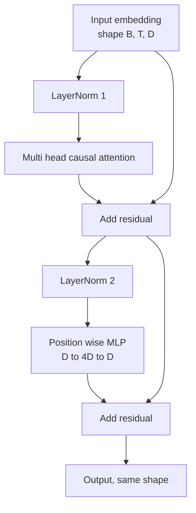
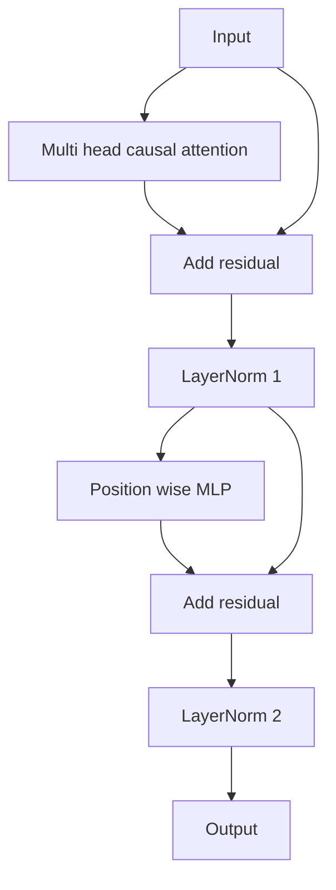

# Transformer Block from Scratch / 从零构建 Transformer Block

> 一个 block 是每个现代 decoder LLM 的基本单元。LayerNorm、multi head attention、residual、MLP、residual。pre-LN 变体无需 warmup 也能稳定训练；post-LN 是原始论文采用的版本。本课并排构建两者，并展示在常见 learning rate 下哪一个能撑住 12 层 stack。

**类型：** 构建
**语言：** Python
**前置知识：** 第 19 阶段第 30-33 课（tokenizer, embeddings, attention math, batched data loader）
**时间：** 约 90 分钟

## Learning Objectives / 学习目标

- 从四个 moving pieces 构建 PyTorch transformer block：LayerNorm、multi head causal attention、residual connections、position wise MLP。
- 把 LayerNorm 放在 pre-LN 和 post-LN 两种配置中，并解释为什么其中一种无需 warmup 也能稳定训练。
- 在 multi head attention 内实现 causal masking，使 token `i` 不能看到 tokens `j > i`。
- 追踪 12 层 stack 上两种变体的 gradient flow，并用证据读取结果。
- 在下一课组装 124 million parameter GPT 时复用这个 block 作为 drop-in unit。

## The Problem / 问题

transformer 是一个 block 的重复。block 错一次，重复十二次，就会得到第一轮 epoch 发散的模型，或一路依赖 warmup hack 的模型。本课会看到两个并不罕见的失败模式：attention layer 看到未来；LayerNorm 放在无法驯服深层 residual signal 的位置。

看清楚后，修复是机械的。block 正好有两条 residual path，正好有两个 normalization positions。位置选对后，stack 剩下只是 bookkeeping。

## The Concept / 概念

每个 decoder-only transformer block 都是一个函数：输入形状 `(batch, sequence, embedding)` 的 tensor，返回同形状 tensor。内部有两个 sublayers。



这是 pre-LN 变体。LayerNorm 位于 residual branch 内、sublayer 前面。residual connection 把未归一化 signal 向前传。

post-LN 变体把 LayerNorm 移到 residual add 后面。



shape 相同，训练行为不同。post-LN 中，沿 residual path 反传的 gradient 必须经过 LayerNorm。在 12 层和 learning rate `3e-4` 下，这条 gradient 会缩小到足以需要 warmup schedule。pre-LN 让 residual path 不被 normalize，因此 gradient 能干净传播到 embedding layer。GPT-2 之后的配置采用 pre-LN，原因就在这里。

### Causal multi head attention / Causal multi-head attention

attention sublayer 把输入三路投影到 query、key、value tensors。每个都从 `(B, T, D)` reshape 到 `(B, H, T, D/H)`，其中 `H` 是 head count。scaled dot product attention 对每个 head 计算 `softmax(Q K^T / sqrt(d_k))`，把 upper triangle mask 到 negative infinity，通过 softmax 应用 mask，再乘以 `V`。heads concat 回单个 `(B, T, D)` tensor，并再投影一次。mask 是让模型 causal 的唯一部件。忘掉 mask，就会训练出作弊模型。

### The MLP / MLP

position wise MLP 对每个 token 独立应用同一套两层网络。hidden width 是 embedding width 的四倍，activation 是 GELU，第二个 linear 后接 dropout。MLP 内部 token 之间不通信，所有 token mixing 都发生在 attention。

### Residual connections do two things / Residual connection 的两件事

它们让跨 depth 的 gradient path 变成 additive，从而让 gradient norm 在十二层中保持尺度。它们也让每个 block 学习对 running representation 的 additive update，而不是完整替换。二者都是 block 可扩展的原因。

## Build It / 动手构建

`code/main.py` 实现：

- 带 learnable scale 和 shift 的 `class LayerNorm`，带 biased eps，并按 token vector 应用。
- `class MultiHeadAttention`：`num_heads`、`head_dim = d_model // num_heads`、fused QKV projection、registered causal mask、attention dropout 和 residual dropout。
- `class FeedForward`：两个 linear layers、GELU activation、dropout。
- `class TransformerBlock`：带 `pre_ln` flag，在两种变体之间切换。
- demo：构建一个 6 层 pre-LN stack 和 6 层 post-LN stack，输入相同，打印 (a) output shape，(b) 一次 backward 后 embedding gradient norm。

运行：

```bash
python3 code/main.py
```

输出：两个 stack 的 shape check 和 gradient norms 对比。在相同 learning rate 下，pre-LN stack 的 embedding gradient 通常比 post-LN 大一个数量级，这就是 pre-LN 无需 warmup 也能训练的经验信号。

## Stack / 技术栈

- `torch` 负责 tensor math、autograd 和 `nn.Module` plumbing。
- 不使用 `transformers`，不加载 pretrained weights。block 从 primitives 实现。

## Production Patterns / 生产模式

三种模式把 textbook block 变成可交付实现。

**Fused QKV projection.** 三个独立 linear layers 需要三次 kernel launches 和三次 matmuls。一个宽度为 `3 * d_model` 的 linear 做同样的工作，只需一次 launch，然后沿最后一维 split。fused path 在每种 accelerator 上都更快，并匹配 GPT-2、LLaMA、Mistral 的参考实现。

**Registered causal mask buffer.** mask 只依赖 maximum context length。构造时用 `register_buffer` 分配一次，forward 时切 active window，避免每次分配。忘掉这点会让长 context 下的 mask 成为 allocator hotspot。

**Dropout in two places, not three.** dropout 属于 attention softmax 之后（attention dropout）和 MLP 第二个 linear 之后（residual dropout）。放在 residual 自身上的 dropout 会破坏让深层 gradient 流动的 additive identity。早期一些实现犯过这个错，代价是训练脆弱。

## Use It / 应用它

- 本课 block 可以不修改地接入第 35 课 GPT assembly。
- pre-LN 是现代 open weights LLM 使用的变体；post-LN 是 2017 原始 attention paper 的变体。知道二者，就能读懂大多数 decoder architecture。
- 把 GELU 换成 SiLU，就得到 LLaMA family activation。把 LayerNorm 换成 RMSNorm，就得到 LLaMA family normalization。骨架不变。

## Ship It / 交付它

本课交付可堆叠的 decoder transformer block。它保持 `(B, T, D)` shape，不泄漏未来 tokens，并给你一个可实测的 pre-LN/post-LN 稳定性对比。

## Exercises / 练习

1. 给 block 中每个 linear 增加 `bias=False` flag。现代 open weights LLM 的 linear layers 不带 bias。测量 12 层 768 维模型能省多少参数。
2. 用手写 RMSNorm 替换 `nn.LayerNorm`，验证 output shape 不变。
3. 增加一个 flag，返回第一个 head 的 attention weights，形状为 `(B, T, T)`。画出 upper triangle，确认 softmax 后为零。
4. 构建 sanity check：给两种变体输入 `(2, 16, 384)` tensor，`H=6`，在 weights 初始化相同且 dropout 为零时，断言 forward outputs 不同（例如 `not torch.allclose`）。

## Key Terms / 关键术语

| 术语 | 常见说法 | 实际含义 |
|------|-----------------|------------------------|
| Pre-LN | "Pre norm" | LayerNorm inside the residual branch, before each sublayer; the residual carries the unnormalized signal |
| Post-LN | "Post norm" | LayerNorm after the residual add; what the 2017 paper shipped and what needs warmup |
| Causal mask | "Triangle mask" | The upper triangle of the attention logits set to negative infinity so token i cannot read token j when j is greater than i |
| Fused QKV | "Combined projection" | One linear of width 3D instead of three linears of width D; one kernel, one matmul |
| Residual stream | "Skip connection" | The unnormalized tensor that flows top to bottom through every block; what each block adds to |

## Further Reading / 延伸阅读

- Phase 7 lesson 02 (self attention from scratch) for the attention math underneath this block.
- Phase 7 lesson 05 (full transformer) for the encoder decoder version of the same skeleton.
- Phase 10 lesson 04 (pre training mini GPT) for the training procedure that this block plugs into.
- Phase 19 lesson 35 (this track) which stacks twelve of these blocks into a GPT model.
