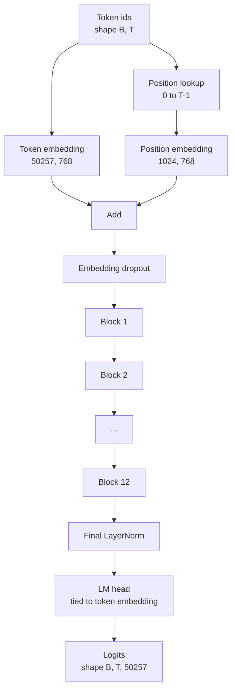
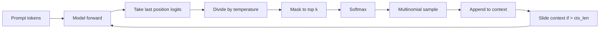

# GPT Model Assembly / GPT 模型组装

> 十二个 blocks、一个 token embedding、一个 learned position embedding、一个 final LayerNorm，以及一个 tied language model head。这就是完整的 124 million parameter GPT model。本课把这些部件组装成可工作的 class，数参数确认模型匹配 reference 124M 形状，并用 multinomial sampling、temperature 和 top-k 生成文本。

**类型：** 构建
**语言：** Python
**前置知识：** 第 19 阶段第 30-34 课
**时间：** 约 90 分钟

## Learning Objectives / 学习目标

- 把第 34 课的 transformer block 组装成完整 GPT model：token embedding、position embedding、N blocks、final LayerNorm、language model head。
- 复现 124 million parameter 配置：vocab 50257、context 1024、embedding 768、twelve heads、twelve layers。
- 把 language model head 权重与 token embedding 绑定，并解释为什么这个规模能节省约 38 million parameters。
- 使用 multinomial sampling、temperature scaling 和 top-k truncation 从 prompt 生成文本，并用 sliding window 保持 context length。
- 对照 124M 目标测量 parameter count 和 forward pass cost。

## The Problem / 问题

transformer block 本身什么也做不了。你需要把 token ids 变成 vectors，混入 positional information，送进 stack，再投影回 vocabulary logits。漏掉四步中的任意一步，模型要么无法 forward，要么 position information 漂移，要么不会“说话”。

模型形状也很重要。reference GPT-2 small 在上述精确配置下是 124 million parameters。数字不是魔法。Vocab 50257 乘 embedding 768 是 token table。Position 1024 乘 768 是 position table。十二个 blocks 每个约 7 million parameters，共 84 million。final head 通过 weight tying 复用 token table。把这些加起来就是 124 million。组装出的模型 parameter count 不匹配 reference，往往说明 wiring 出错。

## The Concept / 概念



token ids 变成 token vectors。position ids 变成 position vectors。二者相加后进入 stack。final LayerNorm 是 blocks 外、所有现代变体都保留下来的部件。LM head 复用 token embedding matrix，这就是 weight tying。

### Weight tying / 权重绑定

token embedding 形状是 `(vocab, d_model)`。language model head 需要从 `d_model` 投影回 `vocab`。二者互为转置。绑定意味着它们字面上使用同一个 parameter tensor，使用两次。vocab 50257、d_model 768 时，这个 matrix 是 38 million parameters。不绑定时要付两份；绑定时只付一份，同时 gradient signal 更干净，因为 embedding 和 head 一起更新。

### Position embedding is learned, not sinusoidal / Position embedding 是 learned，不是 sinusoidal

GPT-2 使用 learned position embedding。position table 是一个形状 `(1024, 768)` 的 parameter tensor。每次 forward 查 position 0 到 T-1，并加到 token embedding 上。这是最简单的位置方案（RoPE、ALiBi、T5 relative bias 是替代品），也是 124M reference 使用的方案。

### Generation: temperature, top-k, multinomial / 生成：temperature、top-k、multinomial

generation 是 autoregressive 的。每一步，模型在每个 position 上返回全 vocab logits。你只取最后一个 position，除以 temperature，可选地把 top k 之外的 logits mask 到 negative infinity，softmax 得到 probabilities，再从分布中 sample 一个 token。



三个 knob 对应三种行为。temperature 接近零会塌缩成 greedy。temperature 为一保持模型自然分布。top-k 为一就是 greedy。top-k 四十会过滤长尾。组合很重要；下一课训练中会把 generation 用作 qualitative eval signal。

## Build It / 动手构建

`code/main.py` 实现：

- `class GPTConfig` dataclass，包含 124M defaults：`vocab_size=50257`、`context_length=1024`、`d_model=768`、`num_heads=12`、`num_layers=12`、`mlp_expansion=4`、`dropout=0.1`、`use_bias=True`、`weight_tying=True`。
- `class GPTModel`，包含 token embedding、position embedding、embedding dropout、十二个 `TransformerBlock`、final LayerNorm，以及在 flag 打开时与 token embedding 绑定的 `lm_head`。
- `count_parameters` helper，返回 unique parameter count（因此 honor weight tying）。
- `generate` function，实现 temperature、top-k、multinomial 和 sliding window context。
- demo：构建模型，打印 parameter count 与 reference 124M 对照，并从固定 prompt 生成短序列，展示 pipeline 端到端工作。

运行：

```bash
python3 code/main.py
```

输出：parameter count 与 124M reference、随机 prompt 生成的 token ids，以及 tying 开启时 LM head 与 token embedding 共享 storage 的确认。

为了让 demo 快速运行，脚本还会端到端运行一个 tiny config（`d_model=64`、`num_layers=2`），并 inline 打印 generated token sequence。124M config 会构建出来，但只做 parameter count 和一次 forward pass。

## Stack / 技术栈

- `torch` 负责 tensor math、autograd 和 module plumbing。
- `code/main.py` 在本地重新实现第 34 课的 block pattern。

## Production Patterns / 生产模式

三种模式决定模型是“能跑”还是“能交付”。

**Initialize the residual projections small.** attention output projection 和 MLP 第二个 linear 都直接进入 residual add。如果用和其他 linear 相同的 std 初始化，residual stream 会随 depth 增长，把 final LayerNorm 推进 hot regime。对这两个 projection，把 std 乘以 `1 / sqrt(2 * num_layers)`；十二层内 residual stream 会保持在合理范围。

**Cache the position id tensor, do not recompute.** `torch.arange(T)` 每次 forward 都分配新内存。在 `__init__` 中按最大 context 分配一次，每次只 slice 前 T 个，跳过 allocator 往返。

**Tie weights at parameter level, not just by copying.** 设置 `lm_head.weight = token_embedding.weight` 共享 tensor；copy 不共享。optimizer 需要更新一个 parameter，autograd graph 也需要一次 accumulation。如果 copy，head 会和 embedding 漂移，weight tying 失效。

## Use It / 应用它

- 本课 model class 与下一课训练的 model shape 相同。
- 把 learned position embedding 换成 RoPE，就得到 LLaMA family 的位置方案，block 或 head 不需要改。
- 把 GELU 换成 SiLU、LayerNorm 换成 RMSNorm，就得到 LLaMA family 的其余变化。
- generation function 能接任意 logits source，不只限于本模型。第 37 课从 pretrained GPT-2 file 拉 logits 时也能复用同一 generation loop。

## Ship It / 交付它

本课交付完整 GPT class：embedding、blocks、final norm、tied LM head、parameter count 和 generation。它是第 36 课 training loop 和第 37 课 pretrained weight loader 的共同目标 architecture。

## Exercises / 练习

1. 解开 LM head 与 token embedding 的绑定并重新数参数。验证 delta 是 50257 times 768 = 38 million。
2. 把 learned position embedding 换成构造时计算的 sinusoidal table。确认模型仍能 forward，parameter count 减少 786,432。
3. 给 generation 增加 `greedy=True` flag，跳过 sampling 并选择 argmax。确认序列跨 run deterministic。
4. 增加 `repetition_penalty` knob，在 softmax 前把 prompt 或 generated history 中出现过的 token logit 除以常数。用固定 prompt 展示大于一的值会减少重复。
5. 在 `top_k` 旁边加入 `top_p`（nucleus）sampling。写两行检查 kept tokens 的 probability sum 超过 `top_p`。

## Key Terms / 关键术语

| 术语 | 常见说法 | 实际含义 |
|------|-----------------|------------------------|
| Weight tying | "Tied embeddings" | The LM head and the token embedding share the same parameter tensor; saves vocab times d_model parameters and matches the GPT-2 reference |
| Position embedding | "Learned positions" | A separate table of shape (context length, d_model) added to token vectors; learned end to end |
| Sliding window context | "Context cap" | When the prompt plus generated tokens exceed the context length, drop the oldest tokens so the active window fits |
| Top-k sampling | "K truncation" | Keep the K logits with the highest values, mask the rest to negative infinity, softmax over the remainder |
| Temperature | "Sampling temperature" | Divide logits by T before softmax; T less than 1 sharpens, T equal to 1 keeps the natural distribution, T greater than 1 flattens |

## Further Reading / 延伸阅读

- Phase 19 lesson 34 for the block this model stacks.
- Phase 19 lesson 36 for the training loop that drives this model with cross entropy loss.
- Phase 19 lesson 37 for loading pretrained GPT-2 weights into this exact architecture.
- Phase 7 lesson 07 (GPT causal language modeling) for the math of next token prediction.
- Phase 10 lesson 04 (pre training mini GPT) for the original training procedure on the same architecture.
