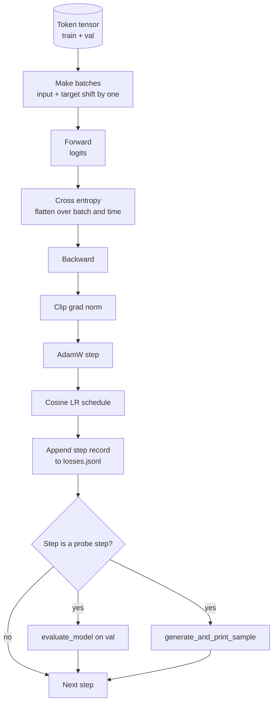

# Training Loop and Evaluation / 训练循环与评估

> 不测量的 loop 会说谎。本课构建驱动 GPT model 的 training loop：带 weight decay split 的 AdamW、warmup + cosine learning-rate schedule、`calc_loss_batch` helper、held out data 上的 `evaluate_model`、每 K steps 一次的 `generate_and_print_sample` qualitative probe，以及可后续绘图的 JSONL loss log。这个骨架可以训练你之后会构建的每个 decoder LLM。

**类型：** 构建
**语言：** Python
**前置知识：** 第 19 阶段第 30-35 课
**时间：** 约 90 分钟

## Learning Objectives / 学习目标

- 构建 training loop，用正确的 input/target alignment 计算 next-token prediction 的 cross entropy loss。
- 配置 AdamW：weight decay 只作用于 weight tensors，不作用于 LayerNorm 或 bias tensors。
- 实现 linear warmup + cosine decay 的 learning-rate schedule，并读取训练中的 LR。
- 用 `evaluate_model` 在 held out split 上评估，使 eval loss 可跨 run 比较。
- 每 K steps 用 `generate_and_print_sample` 生成 qualitative sample，在 loss curve 之前发现 divergence。
- 把 per-step loss 持久化到 JSONL，便于 reload、plot，并作为 training log 交付。

## The Problem / 问题

只打印 loss 的 training script 会以三种方式失败。它无法告诉你 loss 是否因为正确原因下降（模型可能只是在过拟合 training set）。它无法告诉你 divergence 是否正在开始（loss 可能 spike 一步后恢复，也可能 spike 后崩溃）。它也无法告诉你模型学到了什么（loss 是标量，generated sample 是段落）。不测量时，这三类失败都会隐藏。

本课的 loop 从三个角度测量：每步 training batch loss；每 K steps 的 held out batch loss；每 K steps 从固定 prompt 生成 continuation。training log 写到 JSONL，这个 artifact 就是 loop 的证词。

## The Concept / 概念



两个不显眼但关键的部分是 loss alignment 和 AdamW decay split。

### Loss alignment / Loss 对齐

模型在每个 position 预测下一个 token。如果 input batch 是 tokens `[t0, t1, t2, t3]`，target batch 必须是 `[t1, t2, t3, t4]`。cross entropy 在 flat shape `(batch * seq, vocab)` 上计算，对应 flat target `(batch * seq,)`。忘记 shift 会把模型训练成预测自己，这能收敛到零 loss，却什么有用东西都没学。

### AdamW decay split / AdamW decay 拆分

weight decay regularizes weight tensors，但不该作用于 normalization scales 或 biases。把 decay 放在 LayerNorm scale 上，会慢慢把 scale 推向零并破坏 normalization。放在 bias 上数学上通常无害，但浪费计算。标准拆分是：matrix shaped tensors（linear weights、embedding tables）带 decay；看起来像 scale 或 shift 的参数不带 decay。

### Warmup plus cosine schedule / Warmup + cosine schedule

warmup 在前几百 steps 把 learning rate 从零 ramp 到目标值，让 optimizer state 有时间填充。cosine decay 在剩余 steps 把 learning rate 平滑降回接近零，让最后阶段以小 step size 微调 weights。这个组合是 open weights LLM training 中最常见的 schedule，因为它移除了前一千步和最后一千步的大多数脆弱时刻。

### Held out evaluation / Held-out evaluation

`evaluate_model` 从 validation split 跑固定数量 batches，累积 loss，除以 batch count 后返回。无 gradient，无 dropout。在相同 seed 和 split 下，数字可复现。把 held out loss 与 training loss 并排报告，是识别 overfitting 的方式。

### Qualitative sampling as an early signal / 用 qualitative sample 提早报警

training loss 下降良好但生成全是同一个 token 的模型是坏的。loss curve 看似平，但 generated samples 开始变成连贯 words 的模型正在学习。qualitative probe 比读完整曲线更快，能抓住 scalar loss 看不到的模式。

## Build It / 动手构建

`code/main.py` 实现：

- `make_batches(token_ids, batch_size, context_length)`，把长 token tensor 切成 input/target pairs。
- `calc_loss_batch(model, inputs, targets)`，forward、flatten，并返回 scalar cross entropy。
- `evaluate_model(model, val_loader, max_batches)`，无 grad 迭代固定 validation batches 并返回 mean loss。
- `generate_and_print_sample(model, prompt, max_new_tokens)`，在固定 prompt 上调用第 35 课 generation function 并打印。
- `build_param_groups(model, weight_decay)`，生成两组 AdamW parameter list。
- `cosine_with_warmup(step, warmup_steps, total_steps, max_lr, min_lr)`，返回指定 step 的 LR。
- `train(...)`，运行 loop，持久化 `outputs/losses.jsonl`，并每 `eval_every` steps 打印 eval loss 和 sample。
- demo：在 synthetic data 上训练 tiny model 少量 steps，写 JSONL log，并在 probe points 打印 eval loss 和 sample。CPU 上远低于一分钟。

运行：

```bash
python3 code/main.py
```

输出：每步 loss line、每个 probe step 的 eval loss、每个 probe step 的 generated sample，以及最终可用 `json.loads` 按行加载的 `outputs/losses.jsonl`。

## Stack / 技术栈

- `torch` 负责 autograd、optimizer 和 modules。
- `main.py` 本地重新实现 lesson 35 的 `GPTModel` 及支撑 modules。

## Production Patterns / 生产模式

三种模式把 textbook loop 变成可以跑过夜的训练程序。

**Gradient norm clipping is non negotiable.** 一个坏 batch（异常数据、LR spike、数值边界）会产生巨大 gradient，抹掉数小时训练。`backward` 后、`step` 前执行 `torch.nn.utils.clip_grad_norm_(params, max_norm=1.0)`，把 optimizer 留在安全范围。clip 值是自由参数；1 是大多数设置下能活下来的默认值。

**Resumable JSONL logging, not pickled state.** per-step loss records 以 `{"step": int, "train_loss": float, "lr": float}` JSONL lines 保存，耐久、可 grep、可用三十行 Python 画图，也能通过最后一行恢复训练 step。pickled state 绑定到生成它的 module layout，跨 refactor 脆弱。

**Eval batches drawn from a fixed slice.** validation tokens 在脚本启动时切成 batches，而不是每次动态取。可复现依赖 eval batches 跨 run 完全相同；否则两个 run 的 eval loss 比较同时测量了 batch shuffle 和模型差异。

## Use It / 应用它

- 本课 loop 是在真实数据上训练 124M model 的同一骨架。把 synthetic token tensor 换成 `datasets` 风格 loader，loop 不变。
- JSONL log 是把训练 run 变成证据的交付物。下一课会用它比较 freshly trained checkpoint 和 pretrained checkpoint。
- qualitative sample probe 是 scalar loss 无法替代的兜底。

## Ship It / 交付它

本课交付可训练 GPT 的完整 loop：loss alignment、AdamW param groups、LR schedule、eval pass、sample probe 和 JSONL artifact。它与第 35 课模型和第 37 课权重加载器共享 architecture。

## Exercises / 练习

1. 添加 `weight_decay_groups()` unit tests，确认 scale 和 bias parameters 进入 no decay group，linear 与 embedding weights 进入 decay group。
2. 用小文本文件中的 bytes 替换 synthetic random tokens，让 demo 训练在可读数据上。验证 generated sample 使用文件中出现过的字符。
3. 给 cosine schedule 增加 `min_lr` floor，值为 `max_lr` 的 10%，并重新绘图。
4. 除 JSONL log 外，每 `eval_every` steps 保存 checkpoint。增加 `resume_from` flag，重新加载 model state 和 optimizer state。
5. 在 loss 旁边记录 per-step throughput（tokens per second），确认它保持在稳定区间。

## Key Terms / 关键术语

| 术语 | 常见说法 | 实际含义 |
|------|-----------------|------------------------|
| Loss alignment | "Shift by one" | Input tokens at positions 0..T-1, target tokens at positions 1..T; cross entropy is computed on flattened shapes |
| Decay split | "Two groups" | AdamW receives matrix shaped tensors with weight decay and scale or bias tensors with none |
| Warmup | "Ramp" | The learning rate climbs from zero to its target over a fixed number of steps so the optimizer state can populate |
| Eval batches | "Held out batches" | A fixed slice of the validation token tensor, sliced once at script start, used identically every probe |
| Qualitative probe | "Sample print" | A short generation from a fixed prompt printed every K steps to catch failure modes loss alone hides |

## Further Reading / 延伸阅读

- Phase 19 lesson 35 for the model the loop drives.
- Phase 19 lesson 37 for loading pretrained weights into the same model.
- Phase 10 lesson 04 (pre training mini GPT) for the procedure on real data.
- Phase 10 lesson 10 (evaluation) for the broader eval surface beyond cross entropy loss.
