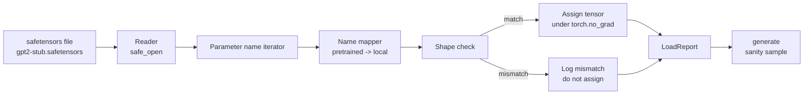

# Loading Pretrained Weights / 加载预训练权重

> 从零训练 124 million parameter model 是预算决策；加载一个公开 checkpoint 是日常操作。本课把 GPT-2 风格的 pretrained weights 从 safetensors 文件加载到第 35 课的精确 architecture 中，逐段讲清 parameter name mapping，并用 sanity generation 证明加载成功。无网络、无第三方 loader、无不透明魔法。

**类型：** 构建
**语言：** Python
**前置知识：** 第 19 阶段第 30-36 课
**时间：** 约 90 分钟

## Learning Objectives / 学习目标

- 用 `safetensors` Python library 读取 safetensors 文件，并检查 tensor names 与 shapes。
- 把每个 pretrained parameter name 映射到 lesson 35 GPT model 内部的 parameter。
- 处理公开 GPT-2 weights 与本 track model 的两套命名约定差异：`wte/wpe/h.N.attn.c_attn/c_proj` 和 `mlp.c_fc/c_proj`，对应本地 `tok_embed/pos_embed/blocks.N.attn.qkv/out_proj` 与 `mlp.fc1/fc2`。
- 在任何 weight assignment 前检测并拒绝 shape mismatch，错误要清楚。
- 用加载后的 weights 生成一段短 continuation，确认 tokens 来自加载分布，而不是随机初始化模型。

## The Problem / 问题

公开 weights 不是为你的 architecture 打包的。它们带着原始实现使用的名字。pretrained file 里有 `transformer.h.0.attn.c_attn.weight`，形状 `(2304, 768)`；你的模型期望 `blocks.0.attn.qkv.weight`，形状 `(2304, 768)`（同一矩阵的另一种 layout convention），或者你的模型用 `nn.Linear`，它存的矩阵是转置的。同一个 parameter 会以三种略有差异的身份出现：name、shape、byte layout；loader 必须同时调和三者。

盲目 copy 的 loader 会把对的 tensor 放到错的位置，模型会生成乱码。shape 不同就拒绝 copy 但不打 log 的 loader，会让你猜到底哪个 tensor 没有加载成功。本课 loader 是显式的：每次 assignment 都有 log，每个 shape 都检查，`LoadReport` 汇总 hits、misses 和 shape mismatches。

## The Concept / 概念



name mapper 只是从 string 到 string 的函数。shape check 是一个 if。assignment 在 `torch.no_grad()` 内发生，避免 autograd 跟踪加载操作。report 持有每个 name 的结果。

### The GPT-2 naming convention / GPT-2 命名约定

公开 GPT-2 weights 使用如下名称：

| Pretrained name | Shape | Meaning |
|-----------------|-------|---------|
| `wte.weight` | (50257, 768) | Token embedding |
| `wpe.weight` | (1024, 768) | Position embedding |
| `h.N.ln_1.weight` | (768,) | LayerNorm 1 scale at block N |
| `h.N.ln_1.bias` | (768,) | LayerNorm 1 shift at block N |
| `h.N.attn.c_attn.weight` | (768, 2304) | Fused QKV linear weight |
| `h.N.attn.c_attn.bias` | (2304,) | Fused QKV linear bias |
| `h.N.attn.c_proj.weight` | (768, 768) | Attention output projection |
| `h.N.attn.c_proj.bias` | (768,) | Attention output projection bias |
| `h.N.ln_2.weight` | (768,) | LayerNorm 2 scale |
| `h.N.ln_2.bias` | (768,) | LayerNorm 2 shift |
| `h.N.mlp.c_fc.weight` | (768, 3072) | MLP fc1 weight |
| `h.N.mlp.c_fc.bias` | (3072,) | MLP fc1 bias |
| `h.N.mlp.c_proj.weight` | (3072, 768) | MLP fc2 weight |
| `h.N.mlp.c_proj.bias` | (768,) | MLP fc2 bias |
| `ln_f.weight` | (768,) | Final LayerNorm scale |
| `ln_f.bias` | (768,) | Final LayerNorm shift |

需要计划两个意外点。`c_attn`、`c_proj`、`c_fc` linears 相对 `nn.Linear.weight` 的期望是转置存储的。loader 赋值时要 transpose。LM head 完全不在文件里；模型依赖与 `wte` 的 weight tying，因此 `wte` 落地后 head 通过 alias 设置。

### The local naming convention / 本地命名约定

本 track 的模型使用更描述性的名字：

| Local name | Meaning |
|------------|---------|
| `tok_embed.weight` | Token embedding |
| `pos_embed.weight` | Position embedding |
| `blocks.N.ln1.scale` | LayerNorm 1 scale at block N |
| `blocks.N.ln1.shift` | LayerNorm 1 shift |
| `blocks.N.attn.qkv.weight` | Fused QKV |
| `blocks.N.attn.qkv.bias` | Fused QKV bias |
| `blocks.N.attn.out_proj.weight` | Attention output projection |
| `blocks.N.attn.out_proj.bias` | Output projection bias |
| `blocks.N.ln2.scale` | LayerNorm 2 scale |
| `blocks.N.ln2.shift` | LayerNorm 2 shift |
| `blocks.N.mlp.fc1.weight` | MLP fc1 |
| `blocks.N.mlp.fc1.bias` | MLP fc1 bias |
| `blocks.N.mlp.fc2.weight` | MLP fc2 |
| `blocks.N.mlp.fc2.bias` | MLP fc2 bias |
| `final_ln.scale` | Final LayerNorm scale |
| `final_ln.shift` | Final LayerNorm shift |

mapping 是固定函数。本课以 dict 形式提供，loader 迭代它。

### The stub fixture / Stub fixture

真实 GPT-2 weights 约 0.5 GB。demo 不下载它们；首次运行时会生成一个小 safetensors fixture，使用完全相同的 GPT-2 naming convention，但 shape 对应 d_model 192 的 12-block model，而不是 768。fixture 结构足以覆盖 loader 的每条代码路径。把 fixture 换成真实文件后，loader 不需要改。

## Build It / 动手构建

`code/main.py` 实现：

- 一个 lesson 35 `GPTModel` 的小型 replica，保持本课自包含。
- `make_pretrained_to_local(num_layers)`，展开 per-layer entries。
- `load_safetensors(model, path)`，迭代 names、映射 names、检查 shape、transpose conv1d-style weights，并在 `torch.no_grad()` 下赋值。返回 `LoadReport`。
- `make_stub_safetensors(path, cfg)`，生成带精确 pretrained naming convention 的 fixture file。
- demo：首次运行创建 `outputs/gpt2-stub.safetensors`，构建 fresh model，从 random init 生成一个 continuation，加载 stub，再生成另一个 continuation，打印二者，并验证二者不同（加载确实改变了模型）。

运行：

```bash
python3 code/main.py
```

输出：fixture path、per-name load log、`LoadReport` summary、load 前 continuation、load 后 continuation，以及 fixture 中故意注入的单个坏 tensor 触发 shape mismatch，以覆盖失败路径。

## Stack / 技术栈

- `safetensors` 负责 on disk format 和 streaming reader。
- `torch` 负责 model 与 assignment math。
- 不使用 `transformers`、`huggingface_hub`，不做 network calls。

## Production Patterns / 生产模式

三种模式让 loader 能处理并非你自己产出的 weights。

**Always validate the file before any assignment.** 打开文件，列出每个 tensor name、dtype 和 shape，跑完整 mapping 与 shape checks，全部成功后才开始赋值。半加载模型是静默失败机器。

**Log every assignment with the source name and the destination name.** 出问题时，log 告诉你哪个 tensor 落到了哪里；替代方案是读 hexdump。`LoadReport` dataclass 跟踪 `loaded`、`missing`、`unexpected` 和 `shape_mismatch` lists，并在最后打印 summary。

**The LM head is a weight tying alias, not a separate copy.** 加载 `tok_embed` 后设置 `model.lm_head.weight = model.tok_embed.weight` 是 canonical pattern。把 embedding matrix copy 到新的 `lm_head.weight` parameter 会破坏 tying，并悄悄把 parameter count 翻倍。

## Use It / 应用它

- loader 适用于任何采用 pretrained naming convention 的 safetensors 文件。真实 GPT-2 small/medium/large/xl 都能用同一代码加载，只需 model config 不同。
- 同一模式能扩展到 LLaMA、Mistral、Qwen weights：更新 name map 即可。shape checks 和 report 保持不变。
- load 后的 sanity generation 是快速 gate：如果 post-load samples 看起来像 pre-load samples，说明加载没有改变模型，往往是 mapping 静默 miss 了所有 tensor。

## Ship It / 交付它

本课交付可审计的 safetensors loader：名称映射、shape 检查、转置处理、赋值 log、LoadReport 和 sanity generation。它把第 35 课 architecture 与公开 checkpoint 文件连接起来。

## Exercises / 练习

1. 给 loader 增加 `dtype` 参数，在赋值时把每个 tensor cast 到目标 dtype（`bfloat16`、`float16`、`float32`）。确认 `float32` model 可 downcast 到 `bfloat16` 并仍能 generate。
2. 增加 `expected_layers` 参数，拒绝加载 `h.N` indices 与模型 `num_layers` 不匹配的 checkpoint。
3. 把 loader 接到第 35 课 generation function 上，并生成并排 samples：random init 一段、loaded fixture 一段。
4. 增加 export path：用 pretrained naming convention 把当前 model state 写入 fresh safetensors 文件。round trip loader 并确认 report 没有 shape mismatches。
5. 扩展 `NAME_MAP` 处理 LLaMA naming convention（无 biases、RMSNorm、fused qkv layout），并在你生成的 stub LLaMA fixture 上重跑 loader。

## Key Terms / 关键术语

| 术语 | 常见说法 | 实际含义 |
|------|-----------------|------------------------|
| Name map | "Key remapping" | The function from pretrained tensor names to local parameter names; usually a literal dict with one entry per layer index expanded over a loop |
| Shape mismatch | "Bad shape" | The pretrained tensor exists under the mapped name but its dimensions disagree with the local parameter; the loader refuses to assign and logs the pair |
| Transpose-on-load | "Conv1d layout" | Published GPT-2 stores attention and MLP projections in the transpose of what nn.Linear expects; the loader transposes during assignment |
| Weight tying alias | "Shared LM head" | Setting model.lm_head.weight = model.tok_embed.weight so the head and embedding share storage; the head is not in the file because of this |
| Load report | "Coverage summary" | A small dataclass that tracks loaded, missing, unexpected, and shape_mismatch lists; printing it is how you tell whether the load succeeded |

## Further Reading / 延伸阅读

- Phase 19 lesson 35 for the architecture that receives the weights.
- Phase 19 lesson 36 for the training loop that produces a checkpoint of the same shape.
- Phase 10 lesson 11 (quantization) for what to do with the loaded weights when memory is tight.
- Phase 10 lesson 13 (building a complete LLM pipeline) for the full lifecycle around load and inference.
