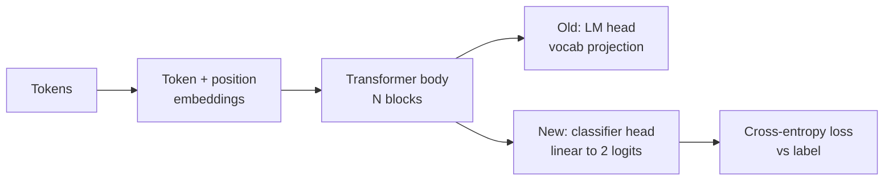
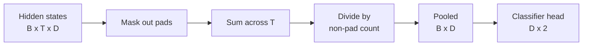
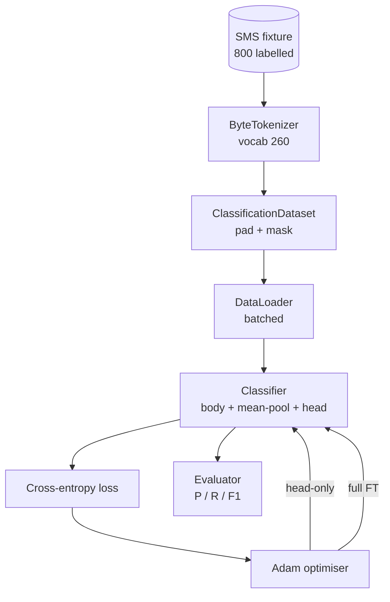

# Capstone Lesson 38: Classifier Fine-Tuning by Head Swap / 通过 Head Swap 做分类器微调

> Track B 的第一个 capstone。pretrained language model 是一叠 self-attention blocks，最后接 token-prediction head。当你要做 spam vs ham 时，head 是错的，但 body 大体是对的。本课把旧 head 拿掉，把二分类 linear layer 接到 pooled representation 上，并用两种方式训练 classifier：只训 final layer，以及 full fine-tuning。eval 是 held-out split 上的 precision、recall 和 F1。你会学到每种策略带来什么、成本是什么。

**类型：** 构建
**语言：** Python（torch, numpy）
**前置知识：** 第 19 阶段第 30-37 课（NLP LLM track: tokenizer, embedding table, attention block, transformer body, pre-training loop, checkpointing, generation, perplexity）
**时间：** 约 90 分钟

## Learning Objectives / 学习目标

- 在不重新初始化 body 的前提下，用 classification head 替换 language-model head。
- 实现两种训练 regime：frozen body（head-only）和 full fine-tuning，并共享同一个 training loop。
- 构建 tokenizer-aware data pipeline，处理 padding、padding mask 和 attention output pooling。
- 从 raw logits 计算 precision、recall、F1 和 confusion matrix。
- 解释 parameter count、training time 与 head-room 之间的取舍。

## The Problem / 问题

你已经在通用 corpus 上预训练了一个小 transformer。output head 把最后 hidden state 投影到 1000-token vocabulary。现在你有 800 条标注为 spam 或 ham 的 SMS messages，需要二分类器。有三种选择。

错误选择是用 800 个样本从零训练一个新 classifier。pretrained body 已经编码了有用结构：word identity、position、simple co-occurrence。丢掉它，就是浪费构建它的计算。

两个正确选择是：head swap 后冻结 body，或 head swap 后让 body 可训练。head-only training 快、显存几乎免费、在这么小的数据上不容易过拟合。full fine-tuning 更慢，可能在小数据上过拟合，但当 downstream domain 偏离 pretraining corpus 时能达到更高准确率。

本课同时构建两者，让你在同一个 fixture 上比较。

## The Concept / 概念

模型是函数 `f_theta(tokens) -> hidden_states`。head 是函数 `g_phi(hidden) -> logits`。head swap 表示保留 `theta`，替换 `g_phi`。body parameters 是昂贵部分。head 只是一个 linear layer。

两个 trainable parameter set 很重要：

- `theta`（body）：每个 attention block 有数万 weights。
- `phi`（head）：`hidden_dim * num_classes` weights 加 bias。

head-only training 中，你只对 `phi` 计算 gradients，并让 `theta` 的 gradients 为零。PyTorch 中通过对 body parameters 设置 `requires_grad=False` 实现。optimizer 只看到 head，body 保持 frozen。

full fine-tuning 中，gradients 会穿过整个 stack。body weights 为 classification objective 漂移。风险是在小数据上 catastrophic forgetting：body 的 pretraining 被噪声 overfit 冲掉。

### The Pooling Question / Pooling 问题

classifier 需要每个 sequence 一个 vector，而不是每个 token 一个 vector。三种常见选择：

- **Mean pool**：按 attention mask 加权，对 sequence 上的 hidden states 求平均。
- **CLS pool**：前置一个 special token，只使用它的 output。这是 BERT 的做法。
- **Last-token pool**：使用最后一个 non-padding token。这是 GPT-class classifiers 常见做法。

本课使用显式 attention-mask weighting 的 mean pooling。它最简单，跨 sequence length 信号稳定，也不需要预训练 CLS token。

### The Data / 数据

`code/main.py` 中确定性生成 800 条 SMS messages，spam 与 ham 各 400。generator 使用固定 seed，选择 templates 并填充 slot fillers，输出 5 到 25 tokens 的 messages。真实数据有 fixture 没有的噪声；fixture 的重点是可复现。

数据按 80/20 划分：640 train，160 test。split 是 stratified，因此 test set 保持 50/50 balance。known balance 的 held-out set 让 precision 和 recall 可诚实读取。

### The Metrics / 指标

二分类以 class 1 作为 positive class（spam）。计数如下：

- `TP`：预测 spam，实际 spam。
- `FP`：预测 spam，实际 ham。
- `FN`：预测 ham，实际 spam。
- `TN`：预测 ham，实际 ham。

三个 headline metrics：

- `precision = TP / (TP + FP)`。被标为 spam 的消息里，实际是 spam 的比例。
- `recall = TP / (TP + FN)`。实际 spam 中，被模型标出的比例。
- `F1 = 2 * P * R / (P + R)`。precision 与 recall 的 harmonic mean。

confusion matrix 以 2x2 grid 打印四个计数。demo 会对两种 training regime 都输出它。

## Architecture / 架构

body 是一个刻意很小的 transformer：vocab 260、hidden 64、4 heads、2 blocks、max sequence 32。CPU 上足以在 90 秒内把两种 regimes 都训到收敛。本课并不假装它已经预训练；相反，`pretrain_quick` helper 会在同一 fixture 的文本上跑五轮 LM training，让 body 有一个非平凡起点。这样课程保持自包含。

## Build It / 动手构建

实现是一个 `main.py` 加一个 test module（`code/tests/test_main.py`）。

1. `ByteTokenizer`：把 bytes 映射到 ids，并预留 pad id。
2. `Block`：带 multi-head attention 和 feed-forward layer 的 transformer block，pre-norm。
3. `LMBody`：token + position embeddings 加 stack of blocks，返回 hidden states。
4. `MeanPool`：按 mask 加权，对 sequence axis 求平均。
5. `Classifier`：body、pool、linear head。两种 regime 使用同一个 body instance。
6. `freeze_body` 与 `unfreeze_body`：切换 body parameters 的 `requires_grad`。
7. `train_classifier`：共享训练循环。接收 model 和针对当前 trainable parameter group 配置的 optimizer。
8. `evaluate`：跑 test set，返回 `Metrics(precision, recall, f1, confusion)`。
9. `run_demo`：先短暂 pretrain body，再训练并评估 head-only，接着 full，打印两份 report，并以零退出。

## Use It / 应用它

head-only regime 通常训练更快，也更稳健地 underfit。在这个 fixture 上，二十轮 head-only training 后 precision 常接近 0.9，recall 接近 0.85。full fine-tuning 大约慢三倍，结果通常在上下几个点内浮动，取决于 random seed。

本课不替你选赢家，而是教你读数字和成本。800 examples 加 tiny body 时，head-only 是合理选择。80,000 examples 加更大 body 时，full fine-tuning 开始值得。你要带走的契约是 API：同一个 `train_classifier` function 处理两种 regime，切换只是一个调用。

## Ship It / 交付它

本课交付一个 head-swap classifier fine-tuning pipeline：data generation、padding/mask、mean pooling、freeze/unfreeze、shared training loop 和 classification metrics。它是把 pretrained LM body 迁移到 supervised downstream task 的最小可运行形状。

## Exercises / 练习

- 添加第三种 regime，只解冻最后一个 block。这有时叫 partial fine-tuning。成本低于 full FT，学习能力强于 head-only。
- 添加 learning-rate scheduler。head 用 cosine schedule，body 用更小 constant rate，是常见生产设置。
- 把 mean pooling 换成 learned attention pool：一个带单个 learned query 的小 attention layer。长序列上它经常优于 mean pool。

实现已经给了 hooks，测试钉住 contract，指标上限由你继续推动。

## Key Terms / 关键术语

| 术语 | 常见说法 | 实际含义 |
|------|-----------------|------------------------|
| Head swap | “Replace the head” | 保留 pretrained body，替换输出 head 以适配新任务 |
| Frozen body | “Head-only” | body parameters 不更新，只训练 classifier head |
| Full fine-tuning | “Update everything” | gradients 穿过整个 stack，body 也为 downstream objective 调整 |
| Mean pooling | “Average hidden states” | 按 attention mask 对 token hidden states 求平均，得到 sequence vector |
| Confusion matrix | “TP/FP/FN/TN” | 分类错误类型的 2x2 计数表 |

## Further Reading / 延伸阅读

- Phase 19 lessons 30-37：本课复用的 tokenizer、body 与训练 loop。
- Phase 10 lessons on fine-tuning and evaluation。
- BERT CLS pooling 与 GPT last-token pooling 的分类器实践。
