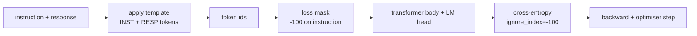
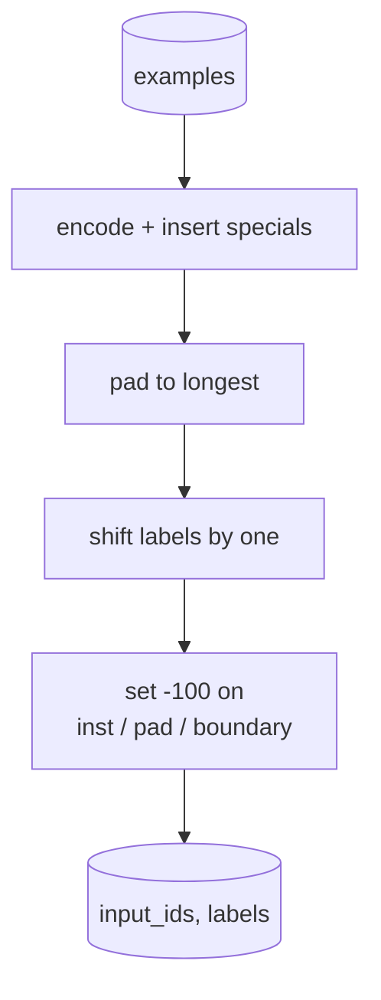
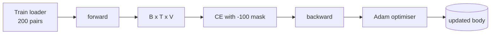

# Capstone Lesson 39: Instruction Tuning by Supervised Fine-Tuning / 用监督微调做指令微调

> pretrained base model 能续写序列，但不会遵循 instruction。Supervised fine-tuning 是修复这一点的最小改动：给模型 instruction 与 desired response 的配对样本，让 body 学会预测 response tokens。关键是 loss 只应该计算 response，而不是 instruction。本课构建 Alpaca 风格 SFT loop：custom collate function 用 `ignore_index=-100` mask instruction tokens，在 200 组 instruction-response pairs 上训练，并用 held-out split 的 exact-match 评估。

**类型：** 构建
**语言：** Python（torch, numpy）
**前置知识：** 第 19 阶段第 30-37 课（NLP LLM track: tokenizer, embedding table, attention block, transformer body, pre-training loop, checkpointing, generation, perplexity）
**时间：** 约 90 分钟

## Learning Objectives / 学习目标

- 把 paired instruction-response data 格式化成带显式 boundary tokens 的单一 causal sequence。
- 构建 collate function，mask instruction tokens，使 cross-entropy 只统计 response tokens。
- 在 SFT objective 下训练 tiny transformer body，并观察 eval metric 移动。
- 实现 greedy 与 temperature-sampled generation，并尊重 response-start boundary。
- 在 generated completions 上计算 held-out exact-match。

## The Problem / 问题

base model 通过 next-token prediction 训练，并不知道什么是 instruction。给它字符串 `"What is the capital of France?"`，它可能继续这个问题，也可能编一个新句子。模型有语言能力，但没有格式契约。

SFT 契约是一个字符串模板。每个 training example 都变成包含三个区域的单一 sequence：

```text
<INST> What is the capital of France? <RESP> The capital of France is Paris.
```

boundary tokens 是训练时预留的 special tokens。模型学习到 `<RESP>` 后面的内容是 response，response 才是被评分对象。base model 的 next-token objective 仍然适用；只是训练 corpus 中每个 example 都有这个形状。

但有一个陷阱。如果把整个 sequence 直接交给 vanilla cross-entropy loss，你也在训练模型预测 instruction tokens。instruction 是给定条件，不该产生 gradient。修复方式就是 mask。

## The Concept / 概念



`ignore_index` 是 `torch.nn.functional.cross_entropy` 的功能。任何 target position 等于 `ignore_index` 时，都贡献零 loss 和零 gradient。PyTorch 惯例是 `-100`。collate function 为每个 example 构建两个 tensors：`input_ids`（完整 sequence）和 `labels`（`input_ids` 的副本，但 instruction positions 被改写为 `-100`）。

forward pass 中模型仍然看到完整 sequence；attention 可以 attend 到 instruction。loss 只计算 response tokens。这正是目标：condition on instruction，predict response。

## The Data / 数据

`main.py` 中确定性生成 200 组 instruction-response pairs，覆盖六类任务：

- factual single-shot（capital of X）
- arithmetic
- list extraction
- one-sentence summary
- code（print、sort）
- definition

每类任务都有模板化 instruction 和确定性 response。数据刻意简单，因为 exact-match 很脆弱，本课使用的 fixture 中正确答案就是一个具体 string。真实 SFT datasets 需要 fuzzy metrics，原则相同。

split 是 160 train、40 test。test set 覆盖六个 task types，因此可以报告 per-category exact-match。

## Tokenisation and Padding / Tokenisation 与 Padding

tokeniser 是 byte-level，带三个 reserved specials：

- `INST_ID = 256`：标记 instruction region 的开始。
- `RESP_ID = 257`：标记 instruction 与 response 的边界。
- `PAD_ID = 258`：variable-length batches 的 padding。

sequence 形状是 `[INST] inst_bytes [RESP] resp_bytes [PAD]*`。collate function：

1. Tokenises 每个 example。
2. 把 batch 内每个 example pad 到 batch 中最长 sequence。
3. 构建 `labels` = `input_ids` shifted by one（causal LM target），并且：
   - instruction region 替换为 `-100`。
   - padding region 替换为 `-100`。
   - `RESP_ID` boundary position 本身替换为 `-100`（不训练模型预测 boundary token；它预测后续内容）。



shift 是标准 causal trick：`input_ids` 的 position `i` 预测 position `i+1`，因此 `labels[i] = input_ids[i+1]`（input 丢掉最后一个，target 丢掉第一个）。mask 在 shift 后应用，确保落在正确位置。

## Training / 训练



loop 是标准 PyTorch SFT loop。Adam，learning rate 大约 3e-4 到 1e-3，在这个 fixture 上训练十到二十 epochs，不用 scheduler。模型很小（hidden 96、2 blocks、max length 64），CPU 上两分钟内能收敛。

每五个 epoch，loop 在 held-out set 上跑一个小 eval pass 并打印 exact-match。看到 exact-match 从第一轮的 0.0 到第十五轮约 0.85，是本课的回报：模型同时学会格式和答案。

## Generation / 生成

eval 时，模型拿到 instruction prefix `[INST] inst_bytes [RESP]`，然后生成 tokens，直到：

- sequence 到达 `max_len`，或
- 模型触发 special stop heuristic：连续两个句末 bytes（`.`、`!`、`?`）。

本课提供 greedy decoding 和 optional temperature sampler。exact-match 使用 greedy，因为 temperature 会让 metric 随机。真实系统常常 sample 后用 fuzzy judge；那条 pipeline 在第 41 课。

## Exact-Match Evaluation / Exact-Match 评估

exact-match 是最严格的文本 metric。predicted response string 会 normalize（lowercase、strip whitespace、collapse double spaces），再与 reference response 做同样 normalize 后比较。每个 example 的 metric 是 1 或 0，aggregate 是 mean。

真实 SFT pipelines 会用 token-level F1（第 41 课）和 judge model 补充 exact-match。exact-match 仍然有用，因为它无歧义；如果它说 0.7，就表示正好 70% 的 test instructions 逐字符生成了 gold response。

## Build It / 动手构建

实现是一个 `main.py` 加 tests。

1. `InstructionTokenizer`：byte-level encoder，带 reserved specials。可以 encode instruction prefix 或完整 pair。
2. `make_dataset`：用固定 seed 生成六类任务的 200 pairs。
3. `SFTDataset`：每个 example 返回 `(input_ids, labels)`，已经准备好 mask。
4. `sft_collate`：dynamic padding，构建 batch tensor，在 instruction 和 pad positions 上设置 `-100`。
5. `TinyGPT`：transformer body 加 tied 或 untied LM head。
6. `train_sft`：SFT loop，带 per-epoch eval hooks。
7. `generate`：从 prefix causal decode，支持 greedy 或 sampled，并带 stop heuristic。
8. `exact_match`：normalized string comparison，返回 `[0, 1]` 中的 float。
9. `run_demo`：构建数据，训练二十 epochs，评估，打印 per-category breakdown，并在成功时零退出。

## Use It / 应用它

mask 是目标函数，不是润色。没有 mask 时，loss 会把 instruction tokens 当成 targets。模型会学习预测 instruction，这在两方面更糟：第一，capacity 被浪费在重构用户总会提供的输入上；第二，大多数 batch 中 instruction tokens 比 response tokens 更多，response loss 在 gradient sum 中占比更小，你关心部分的 effective learning rate 低于预期。

## Ship It / 交付它

本课交付完整 SFT 格式契约：instruction/response template、boundary tokens、response-only loss mask、collate function、SFT loop、generation 和 exact-match eval。base model 到 instruction follower 的目标函数变化，集中在一个 collate function 中。

## Exercises / 练习

- 增加 learning-rate warmup + cosine decay。SFT 对 LR 比 pretraining 更敏感。
- 记录 per-token loss 并画出训练曲线。观察早期 epochs 被 template tokens（`<RESP>`、常见 prefixes）主导，后期由真实 answer tokens 主导。
- 扩展 eval 到 BLEU-1 或 chrF。exact-match 会低估产生正确 paraphrase 的模型。
- 增加 multi-turn chat template，并在包含 follow-ups 的 fixture 上训练。

## Key Terms / 关键术语

| 术语 | 常见说法 | 实际含义 |
|------|-----------------|------------------------|
| SFT | “Instruction tuning” | 用 instruction-response pairs 监督训练 base model 的 response behavior |
| `ignore_index=-100` | “Loss mask” | cross entropy 忽略 target 为 -100 的位置，不产生 loss 或 gradient |
| Boundary token | “INST/RESP” | 显式标出 instruction 区域和 response 起点的 special token |
| Response-only loss | “Mask prompt” | 模型看见 instruction，但 loss 只统计 response tokens |
| Exact-match | “String equality” | normalize 后逐字符串比较 prediction 与 reference |

## Further Reading / 延伸阅读

- Alpaca-style instruction tuning 模板。
- Phase 19 lesson 40：DPO preference optimization。
- Phase 19 lesson 41：更完整的 eval pipeline。
