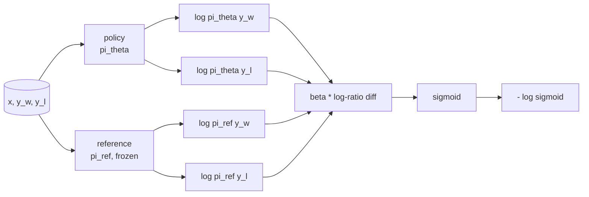
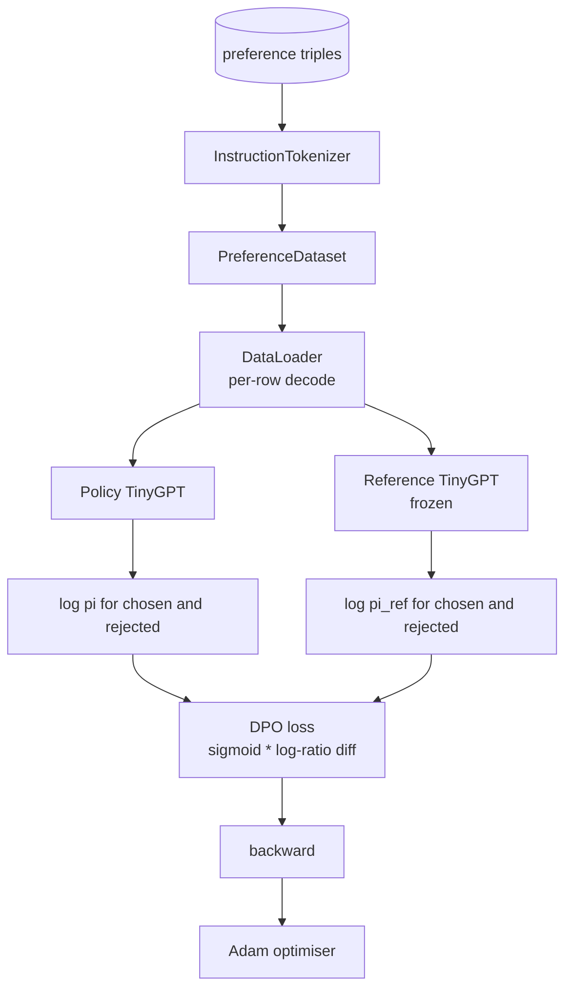

# Capstone Lesson 40: Direct Preference Optimization from Scratch / 从零实现 Direct Preference Optimization

> Reward models 和 PPO 是经典 RLHF stack。DPO 把这套 stack 折叠成一个 supervised loss，直接用 preference pairs 拟合 policy。本课从 reward-difference identity 推导 DPO loss，交付 working reference model + policy model，计算 per-token log-probabilities，并在 chosen/rejected completions 的 preference fixture 上训练 tiny transformer。测试会钉住 loss math 和 gradient direction，确保实现匹配论文。

**类型：** 构建
**语言：** Python（torch, numpy）
**前置知识：** 第 19 阶段第 30-37 课（NLP LLM track: tokenizer, embedding table, attention block, transformer body, pre-training loop, checkpointing, generation, perplexity）
**时间：** 约 90 分钟

## Learning Objectives / 学习目标

- 把 DPO loss 推导为 scaled log-ratio difference 上的 sigmoid，并连接到 implicit reward。
- 构建 reference model + policy model pair，其中 reference 冻结，policy 可训练。
- 在两个模型下计算 sequence-level log-probabilities，并 mask prompt tokens。
- 用 `(prompt, chosen, rejected)` triples 训练 policy，观察 chosen log-prob 相对 rejected 上升。
- 用测试钉住 loss math、gradient sign 和 reference invariance。

## The Problem / 问题

你有一个 SFT model。它能遵循指令，但输出质量不均：有些 completion 清楚，有些啰嗦或错误。你还有一小份 preference pairs：同一个 prompt 下，人类标出一个 completion 为 chosen，另一个为 rejected。

经典 RLHF 答案是两阶段 pipeline：先用 preferences 训练 reward model，再用 PPO 针对 reward 优化 policy。它能工作，但昂贵：PPO 期间内存中要有两个模型，要用 KL control 保持 policy 接近 reference，reward model 脆弱时还会 reward hacking。

DPO 用单个 supervised loss 替代这两阶段。reward model 不显式存在。policy 直接在 preference pairs 上训练，并带一个朝向 SFT reference 的显式 KL 锚点。在 Bradley-Terry preference model 下，最优解相同，代码少得多。

## The Concept / 概念

从 Bradley-Terry model 开始。给定 prompt `x` 和两个 completions：`y_w`（chosen）与 `y_l`（rejected），人类偏好 `y_w` 的概率是：

```text
P(y_w > y_l | x) = sigmoid( r(x, y_w) - r(x, y_l) )
```

其中 `r` 是某个 latent reward function。RLHF 先从 preferences 拟合 `r`，再用 KL anchor 训练 policy `pi` 最大化 reward：

```text
max_pi   E_{x, y~pi} [ r(x, y) ] - beta * KL(pi || pi_ref)
```

DPO 推导观察到，这个目标下的最优 policy `pi*` 可以用 `r` 写成闭式：

```text
pi*(y | x) = (1/Z(x)) * pi_ref(y | x) * exp( r(x, y) / beta )
```

重排得到 `r`：

```text
r(x, y) = beta * ( log pi*(y | x) - log pi_ref(y | x) ) + beta * log Z(x)
```

`log Z(x)` 对 `y_w` 和 `y_l` 相同（只依赖 `x`，不依赖 `y`），因此在 preference difference 中抵消：

```text
r(x, y_w) - r(x, y_l) = beta * ( log pi_theta(y_w|x) - log pi_ref(y_w|x)
                                - log pi_theta(y_l|x) + log pi_ref(y_l|x) )
```

代回 Bradley-Terry sigmoid，并对 preference pairs 取 negative log likelihood：

```text
L_DPO(theta) = - E_{(x, y_w, y_l)} [
  log sigmoid( beta * ( log pi_theta(y_w|x) - log pi_ref(y_w|x)
                       - log pi_theta(y_l|x) + log pi_ref(y_l|x) ) )
]
```

这就是 loss。每个 example 的 scalar 来自四个 log-probabilities 上的一个 sigmoid。没有单独 reward model，没有 PPO。loss 里也没有显式 KL term；KL 约束已经烙进闭式推导中。



## The Sign of the Gradient / Gradient 符号

训练前一个有用 sanity check：对 `log pi_theta(y_w | x)` 求梯度：

```text
d L_DPO / d log pi_theta(y_w | x) = - beta * (1 - sigmoid(z))
```

其中 `z` 是 sigmoid 的 argument。这个值对所有 `z` 都为负，意味着：提高 policy 对 chosen completion 的 log-probability 会降低 loss。对称地，`log pi_theta(y_l | x)` 的梯度为正：提高 rejected log-probability 会提高 loss。训练会把 chosen 往上推、rejected 往下压。reference 是 frozen，不会移动。

## The Data / 数据

本课带十二个 preference triples。每个是 `(prompt, chosen, rejected)`。chosen completion 短而准确，rejected 则啰嗦、跑题或错误。pairs 覆盖第 39 课同类任务族（capital、arithmetic、list），因此从 SFT base 出发的 policy 有合理起点。

fixture 故意很小。生产中 DPO 会用数万 preference pairs；这里重点是 loss math 和 loop 能在 tiny dataset 上端到端运行，并且 chosen-vs-rejected log-prob gap 会明显增大。

## Reference Invariance / Reference 不变性

DPO 实现必须谨慎处理 reference model。reference 是 frozen SFT model。必须满足三条性质：

- reference parameters 永远不接收 gradients。
- reference log-probabilities 在 epochs 之间不变化。
- policy 从与 reference 相同的 weights 开始。（最优 `theta` 是 reference 加 learned update；把 policy 初始化为 reference copy 是定义明确的起点。）

实现通过三点强制：

- reference forward passes 包在 `torch.no_grad()` 中。
- 对每个 reference parameter 设置 `requires_grad=False`。
- reference 构建后，用 `policy.load_state_dict(reference.state_dict())` 构造 policy。

## Architecture / 架构



model 是第 39 课使用的同一 TinyGPT（decoder-only、causal、byte tokeniser）。reference 和 policy 共享 architecture；训练时 policy weights 相对 reference 漂移，而 reference 保持固定。

## Build It / 动手构建

实现是一个 `main.py` 加 tests。

1. `InstructionTokenizer`：带 `INST` 和 `RESP` specials 的 byte tokeniser，与第 39 课同形。
2. `TinyGPT`：decoder-only transformer。与第 39 课同形，因此即使跳过 39，本课也自包含。
3. `make_preferences`：返回十二个 `(prompt, chosen, rejected)` triples。
4. `sequence_log_prob`：给定 model、prompt prefix 和 completion，返回 completion 上 next-token log-probabilities 的和（不包含 prompt positions）。
5. `dpo_loss`：接收四个 log-probabilities 和 `beta`，返回 per-example loss tensor 和用于 logging 的 implicit reward delta。
6. `train_dpo`：per-epoch loop，计算 chosen/rejected 在 policy 与 reference 下的 log-probs，应用 loss，并执行 Adam step。
7. `evaluate_margins`：返回任意时刻 policy 下的 mean chosen-rejected log-probability margin。
8. `run_demo`：从小 warm-up pretrain 构建 reference 和 policy，复制 weights，训练三十 steps，打印 per-step loss 和 margin，并在成功时零退出。

## Use It / 应用它

DPO 在 Bradley-Terry preference model 下与 RLHF 数学等价，差异在 reward parameterisation。implicit reward `r(x, y) = beta * (log pi(y|x) - log pi_ref(y|x))` 可由 preferences 识别到一个关于 `x` 的函数，该函数在差值中抵消。closed-form policy 让你跳过显式 reward model。KL constraint 结构性地执行：`pi` 偏离 `pi_ref` 越多，log-ratio 越大；sigmoid 饱和后会阻尼 gradient，避免 policy 走得太远。reference 是你的 safety net。

## Ship It / 交付它

本课交付 DPO 的完整最小实现：reference/policy pair、completion-only log-prob、DPO loss、gradient sign tests、reference invariance tests 和 margin logging。它是 SFT 后做 preference optimization 的最小可审计路径。

## Exercises / 练习

- 对 log-probability sum 增加 length normalization：除以 completion length。length bias 是 DPO 已知 failure mode，模型会偏好更短 completion，因为其 log-probability 绝对值通常更大。
- 增加 IPO loss 变体：把 sigmoid + log 换成 `(z - 1)^2`。比较 fixture 上的收敛。
- 增加 label-smoothing 参数，在 hard chosen-rejected label 和 uniform 0.5 之间插值。
- 用更小更便宜的模型替换 reference（knowledge distillation 风味）。

实现已经给了 loss、reference invariance 和 training loop。数学是本课核心，代码让数学落地。

## Key Terms / 关键术语

| 术语 | 常见说法 | 实际含义 |
|------|-----------------|------------------------|
| DPO | “RLHF without PPO” | 用 preference pairs 上的 supervised log-ratio loss 直接训练 policy |
| Reference model | “Frozen SFT” | 不更新的 anchor model，定义 policy 不应偏离太远的基线 |
| Chosen/rejected | “Preference pair” | 同一 prompt 下人类偏好的 completion 和被拒绝 completion |
| Log-ratio diff | “DPO scalar” | policy 与 reference 在 chosen/rejected 上 log-prob 差值的差 |
| Implicit reward | “Reward without model” | `beta * (log pi - log pi_ref)`，在差值中等价于 reward |

## Further Reading / 延伸阅读

- Direct Preference Optimization 原论文。
- Phase 19 lesson 39：SFT reference model。
- Phase 18 preference optimization 与 alignment lessons。
