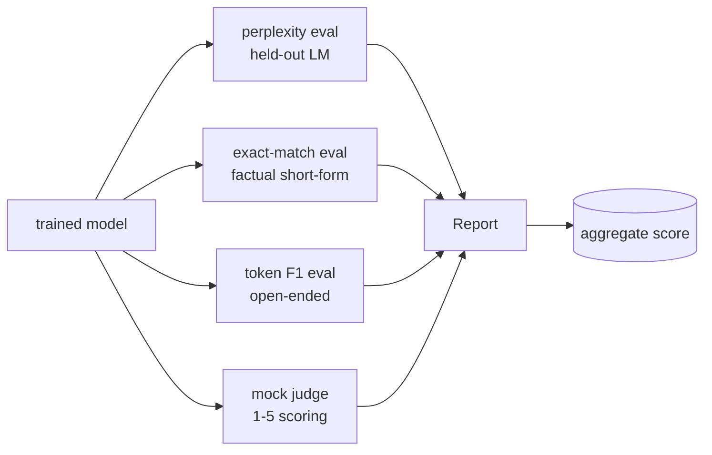
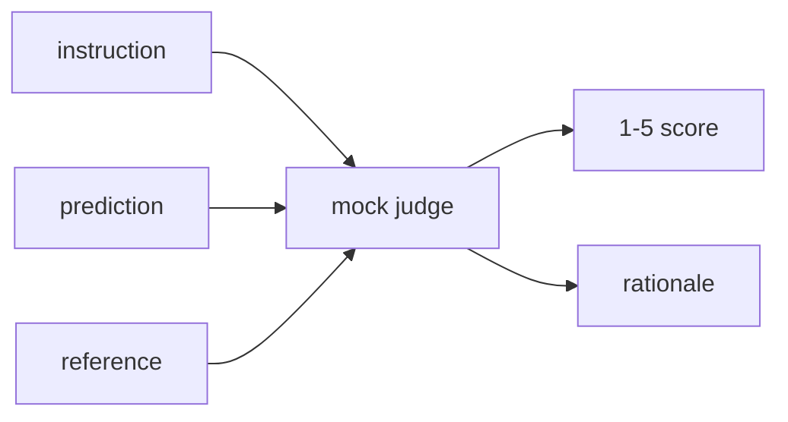
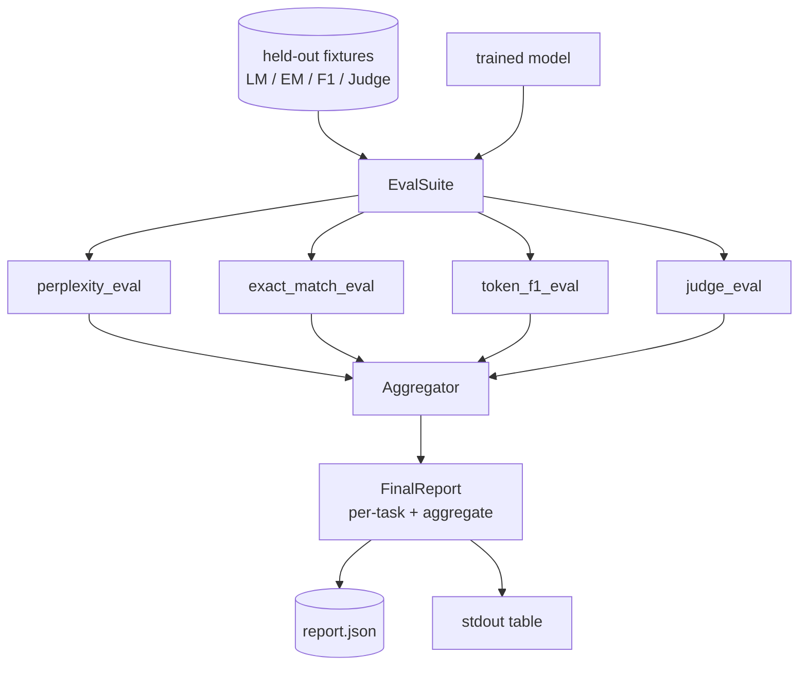

# Capstone Lesson 41: Full Evaluation Pipeline / 完整评估 Pipeline

> training 是可以用 loss curves 监控的部分；evaluation 是必须设计出来的部分。本课构建统一 eval pipeline：接收任意 trained language model，在其上运行四类异构 eval，聚合成 per-task report，并交付一个本地 mock LLM-as-judge，让整个 loop 无网络可运行。四类 eval 覆盖上线模型都需要的维度：language modelling（perplexity）、short-form correctness（exact-match）、open-form similarity（token F1）和 qualitative scoring（judge）。

**类型：** 构建
**语言：** Python（torch, numpy）
**前置知识：** 第 19 阶段第 30-37 课（NLP LLM track: tokenizer, embedding table, attention block, transformer body, pre-training loop, checkpointing, generation, perplexity）
**时间：** 约 90 分钟

## Learning Objectives / 学习目标

- 在 tiny transformer 上用 masked-token accounting 计算 held-out perplexity。
- 在 short-form factual prompts 上运行 exact-match eval。
- 在 predicted 与 reference strings 之间计算经过 normalization 的 token-level F1。
- 构建本地 mock LLM-as-judge，以 1-5 分评价 model outputs。
- 把四类 eval 聚合成一个带 per-task breakdown 的 weighted report。

## The Problem / 问题

单个 metric 永远无法描述语言模型。perplexity 说明模型拟合 language distribution 的程度，但不说明它是否回答问题。exact-match 说明模型是否输出 gold string，但会惩罚正确 paraphrase。token F1 容忍 paraphrase，但会被与错误内容的 lexical overlap 欺骗。LLM-as-judge 能捕捉 qualitative dimensions，但昂贵且随机。

你真正想要的 pipeline 要同时具备四者。每个 eval 覆盖其他 eval 缺失的维度。每个 eval 在为该 metric 设计的不同 held-out data subset 上运行。final report 把 per-task numbers 和 aggregate 并排展示，让 reviewer 一眼看出模型在做什么 trade-off。

本课在一个文件中端到端构建这条 pipeline。

## The Concept / 概念

每个 eval 都是从 `(model, dataset) -> EvalResult` 的函数。result 携带 metric value、便于检查的 per-example details，以及 aggregate 中使用的 name。pipeline 用 config 组合它们，config 声明跑哪些 eval 以及权重如何设置。

## Perplexity, properly counted / 正确计数的 Perplexity

perplexity 是 `exp(mean negative log-likelihood per token)`。实现有两个陷阱：

- mean 必须对实际 token positions 计算，而不是对 batch * sequence 计算。padding tokens 必须排除在 denominator 外，否则 perplexity 会看起来比实际更好。
- 模型预测下一个 token，因此 position `i` 的 logits 预测 position `i+1` 的 token。off-by-one 错误很隐蔽：loss 仍能训练，但 metric 失去意义。

eval 对每个 batch 累加 non-pad positions 上的 `-log p(token)` 和 token count，最后再相除。这样比平均 per-batch perplexities 更数值稳健（不会低估短 sequences），也匹配 textbook definition。

## Exact-match, with normalisation / 带 normalization 的 Exact-match

harness 在比较前会 normalize prediction 和 reference：

- Lowercase。
- Strip surrounding whitespace。
- Collapse internal whitespace runs to a single space。
- 如果两侧只因 trailing terminal punctuation（`.`、`!`、`?`）不同，则 drop。

normalization 让 exact-match 更实用。模型说 `"Paris"` 是对的；说 `"Paris."` 也是对的；说 `"  paris  "` 也是对的。metric 仍然要求 normalize 后答案是同一个 string。

## Token F1, the right way / 正确的 Token F1

Token F1 是对 bag-of-tokens 计算 precision 和 recall 后的 harmonic mean。步骤：

1. normalize prediction 和 reference（规则与 exact-match 相同）。
2. 把二者按 whitespace 切成 token list。
3. 计算 multiset intersection。
4. Precision = `intersection_count / len(pred_tokens)`。Recall = `intersection_count / len(ref_tokens)`。F1 = harmonic mean。

如果 prediction 和 reference 都为空，F1 是 1（vacuous match）。如果只有一边为空，F1 是 0。这个模式匹配 SQuAD evaluation reference，在 paraphrases 上给出稳定数字。

## Local Mock LLM-as-Judge / 本地 Mock LLM-as-Judge

真实 judge 是 API 后面的 frontier model。本课必须离线运行，因此 mock judge 是一个 deterministic scorer：输入 instruction、model prediction 和 reference，返回 `{1, 2, 3, 4, 5}` 中的 score 和一句 rationale。打分规则明确：

- normalize 后 prediction 等于 reference，则 5。
- prediction 与 reference 的 token F1 至少 0.8，则 4。
- token F1 在 `[0.5, 0.8)`，则 3。
- token F1 在 `[0.2, 0.5)`，则 2。
- 否则 1。

这不是真 judge，但接口正确。未来换成真实模型，只改一个函数。pipeline 不关心。

## Aggregation / 聚合

aggregate 是 normalized eval scores 的加权均值。每个 eval 报告 `[0, 1]` 中的数：

- Perplexity：normalize 为 `1 / (1 + log(perplexity))`。perplexity 为 1 映射到 1，无穷映射到 0。
- Exact-match：本来就在 `[0, 1]`。
- Token F1：本来就在 `[0, 1]`。
- Judge：除以 5。

weights 可配置。默认组合是 0.2 perplexity、0.3 exact-match、0.3 token F1、0.2 judge。权重选择是产品决策；本课暴露 knob 让你实验。

## Architecture / 架构

`EvalSuite` 是薄 orchestrator。每个 individual eval 是 free function，接收 `(model, tokenizer, dataset, config)` 并返回 `EvalResult`。`Aggregator` 收集 results 并产生 final report。demo 打印 table，并写一份 JSON 供下游 CI 消费。

## Build It / 动手构建

实现是一个 `main.py` 加 tests。

1. `TinyGPT`：与 lessons 38-40 使用的 decoder-only architecture 相同，内置以保持课程独立。
2. `InstructionTokenizer`：带 INST / RESP / PAD specials 的 byte tokeniser。
3. 四类 fixtures：LM corpus、EM set、F1 set、judge set。各二十条，确定性生成。
4. `perplexity_eval`：返回 `EvalResult`，包含 perplexity value 和 per-token loss histogram。
5. `exact_match_eval`：返回 mean EM 和 per-example records。
6. `token_f1_eval`：返回 mean token F1 和 per-example records。
7. `mock_judge` 与 `judge_eval`：per-example score 与 rationale，以及全 set mean score。
8. `Aggregator.normalise`：per-eval normalization rule。
9. `Aggregator.aggregate`：weighted mean 和 assembled report。
10. `run_demo`：短暂训练 tiny model，运行四类 eval，打印 report table，写 JSON，并在成功时零退出。

## Reading the report / 阅读报告

report 有三层。最上层是 aggregate score。下面是四个 per-eval numbers。再下面是用于诊断的 per-example breakdown。失败的 CI run 通常需要 aggregate；追 regression 的 reviewer 需要 per-example breakdown，看模型错在哪些输入上。

JSON dump 使用 stable keys，因此 CI dashboard 可以跨版本画 trend lines。pretty-printed table 是给训练后盯终端的人看的。

## Use It / 应用它

把这条 pipeline 接到任意 trained model 上，只需要适配 tokenizer 和 generation/eval APIs。新增 eval 时，保持“一类 eval 一个 free function、一个 `EvalResult`、一个 aggregator normalization rule”。不要把 metric 逻辑藏到 model adapter 内部，否则 report 失去可审计性。

## Ship It / 交付它

本课交付四类 eval、聚合器和 report。真实 evaluation pipelines 会叠加更多维度；模式不变：每类 eval 一个函数，一个 aggregator，一个 report。

## Exercises / 练习

- 增加 calibration eval：模型 softmax probabilities 是否匹配 accuracy？按 confidence 分桶并报告每桶 empirical accuracy。
- 增加 robustness eval：给每个 example 打 perturbation 标签（typo、paraphrase、distractor），并报告每类 perturbation 的 metric drop。
- 用 HTTP call 后面的真实模型替换 mock judge，函数签名不变。
- 增加 per-task weight learning：不用固定 weights，而是拟合一个符合目标 model preference order 的权重。

## Key Terms / 关键术语

| 术语 | 常见说法 | 实际含义 |
|------|-----------------|------------------------|
| Perplexity | “LM loss metric” | 每个 non-pad token 的平均负 log-likelihood 取指数 |
| Exact-match | “Gold string” | normalize 后 prediction 与 reference 完全一致 |
| Token F1 | “Overlap score” | bag-of-tokens precision 与 recall 的 harmonic mean |
| LLM-as-judge | “Qualitative scorer” | 用 judge 接口按 rubric 给 prediction 打分 |
| Aggregator | “Final score” | 把不同 eval normalize 后按权重合成 report |

## Further Reading / 延伸阅读

- SQuAD token F1 evaluation reference。
- Phase 19 lesson 39：SFT exact-match。
- Phase 19 lesson 40：preference optimization 后的质量评估。
- 生产 eval harness 中的 judge、calibration 与 robustness metrics。
