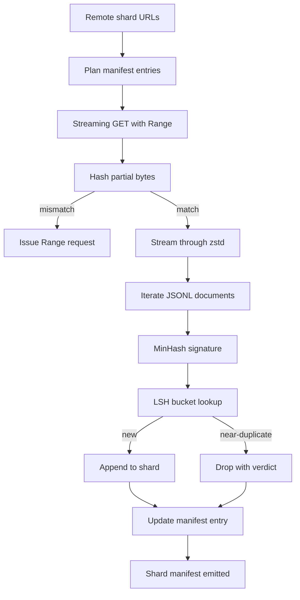

# Large Corpus Downloader / 大规模语料下载器

> 训练语言模型远在第一次 forward pass 之前就开始了。corpus 必须落到磁盘上，完成解压、去重、可寻址，并且在网络 4% 处断开之前就已经设计好 resume 故事。本课构建 streaming downloader：拉取 compressed shards，用 Zstandard 边下载边解压，用 MinHash + locality-sensitive hashing 标记 near-duplicates，并写出后续 pipeline 可以信任的 shard manifest。

**类型：** 构建
**语言：** Python
**前置知识：** 第 19 阶段第 30-37 课
**时间：** 约 90 分钟

## Learning Objectives / 学习目标

- 使用 `urllib` streaming remote shards，并用 `zstandard` 解压，避免把整个文件缓冲进内存。
- 通过对已验证 byte offset 发起 HTTP `Range` requests 恢复 partial downloads。
- 为每个 document 构建 MinHash signature，并用 LSH 分桶，让 near-duplicates 发生 collision。
- 发出包含 content hash、byte size、document count 和 dedup verdict 的 shard manifest。

## The Problem / 问题

第一次在 200 GB corpus 上训练时，网络在 41% 掉线，脚本带着 `urllib` exception 退出。第二次在 78% 掉线。等到 99% 时，你已经把 loop 重写了三遍。从第一分钟起就要设计两类失败：partial-download resume 和 duplicate document removal。二者都有成熟解法，却常被跳过，因为 pipeline 起初只是一个后来长出牙齿的 `requests.get` 单行调用。

resume 是 HTTP 问题。server 必须支持 `Range`，client 必须用磁盘记录追踪 verified offset，verified offset 必须在进程死亡后仍存在。如果 offset 和文件相差一个 byte，resumed download 就会写入垃圾，corpus 会以只有 tokenization 阶段才暴露的方式损坏。

deduplication 是 signature 问题。exact-hash dedup 抓不住 near-duplicates：同一篇 Wikipedia article 带三个不同 boilerplate footers、同一份 code file 换了 license header、同一篇 blog post 在每个链接后带 tracking parameter。MinHash + LSH 能用 sub-linear cost 抓住它们。成本是每个 document 一个 signature，以及每个 signature 一次 bucket lookup。

## The Concept / 概念



### Streaming with `urllib` / 使用 `urllib` streaming

标准库 `urllib.request.urlopen` 返回 file-like object。用 `zstandard.ZstdDecompressor().stream_reader` 包住它，bytes 就能从网络流经 decompressor 进入 document iterator，而不会把 compressed shard 或 decompressed shard 整体 materialize 到内存。内存成本只有 line buffer、当前 document 的 MinHash signature 和 LSH index。

### Resume with `Range` / 用 `Range` 恢复

downloader 为每个 shard 写两个文件：shard 本身和 `.partial.json` checkpoint。checkpoint 记录 `verified_bytes`、`expected_size`、`sha256_prefix`（对前 `verified_bytes` bytes 计算）和 source URL。启动时 downloader 读 checkpoint，重新对磁盘 bytes 计算 `sha256_prefix`，只有匹配时才 resume。如果 hash 不对，partial 被丢弃并从 byte zero 重下。因为验证的是 bytes，而不是假设 offset，silent corruption 不会发生。

### MinHash plus LSH / MinHash + LSH

MinHash 以固定空间估计两个集合的 Jaccard similarity。对 document 来说，集合是其文本 shingles（overlapping n-grams）。signature 是 `k` 个 minimum hash values，每个来自独立 hash function。Jaccard similarity 为 `s` 的两个 documents，在 signature 的任一 component 上相同的概率是 `s`。

LSH 把 `k` 个 components 分成 `b` 个 bands，每 band 有 `r` rows，且 `k = b * r`。两个 documents 至少在一个 band 中 collision 的概率是 `1 - (1 - s^r)^b`，这会在你用 `(b, r)` 调整的 `s` 附近形成陡峭 threshold。典型 corpus dedup 的 threshold 是 `s = 0.8`；LSH 文献常用 `k = 128`、`b = 32`、`r = 4` 达到它。

### Shard manifest as a contract / Shard manifest 是契约

downloader 的唯一 durable output 是 manifest。manifest 对每个 shard 保存 URL、decompressed byte count、document count、dedup 后 unique document count，以及 final shard file 的 sha256。下游 tokenization 读取 manifest，而不是 directory listing。如果某个 shard 缺失或 sha256 错误，manifest 告诉下一阶段拒绝启动。manifest 是“数据已下载”和“数据已下载且可验证”之间的判定边界。

## Build It / 动手构建

`code/main.py` 实现：

- `ShardPlanner` - 读取 shard URLs 列表并产生 planned manifest entries。
- `StreamingDownloader` - 打开可选 `Range` 的 `urllib` stream，写入 temporary file，在每个 chunk 上更新 `.partial.json` checkpoint，并在 resume 时验证 sha256 prefix。
- `ZstdDocIterator` - 用 `zstandard.ZstdDecompressor` 包住 file-like stream，并逐行 yield documents。
- `MinHasher` - 用固定 hash seeds 为 string 生成 `k`-component signature。
- `LSHIndex` - 按 band bucket signatures，并报告 collisions。
- `Dedup` - 组合 hasher 和 index，把每个 document 标记为 `keep` 或 `near_duplicate`，并记录 matching shard id。
- `ManifestWriter` - 收集 per-shard stats 并写出 `manifest.json`。

文件底部 demo 在磁盘上构建一个小 synthetic corpus，用 `zstandard` 压缩，通过 `file://` URL 下载，去重，并打印 manifest。

运行：

```bash
python3 code/main.py
```

脚本零退出并打印 manifest summary。

## Production Patterns / 生产模式

四种模式把本课扩展到真实 corpora。

**Checkpoint before write.** `.partial.json` 必须在 bytes 追加到 shard 之前 `fsync`。否则断电会让顺序反转：shard bytes 已落盘，checkpoint 没有记录它们；下一次 resume 以为 verified bytes 更少，重复 suffix bytes 会损坏文件。先 checkpoint，再 write。这和 write-ahead log 是同一纪律。

**Sharded LSH index.** 200 GB 规模下，单个全局 LSH index 装不进 RAM。按 first band hash 分区 LSH index，把 partitions 存到磁盘，只查新 signature 所属 partition。成本是每个 document 多一次 disk read；收益是 LSH index 不再是硬内存上限。

**Tombstone, not delete.** 被丢弃的 duplicates 在 manifest 中记录 verdict `near_duplicate` 和 collided keeper 的 shard id。直接删除会失去 duplicate 与 keeper 的链接。tombstone 保留审计轨迹，也允许后续 pass 修改 threshold 后重新判断。

**Per-shard sha256 in the manifest, plus a manifest sha256.** manifest 自身也要有 content hash。下游阶段在信任 per-shard entries 前先验证 manifest hash。否则 manifest 是 silent attack surface：攻击者只要改一个文件就能损坏整条 pipeline。

## Use It / 应用它

生产模式：

- **Resume on every CI run.** CI runners 是 ephemeral 的。downloader 必须假设每次运行都是 fresh disk，并从 cache 或 remote 恢复。`--cache-dir` 是一等 flag。
- **Dedup before tokenization.** tokenization 昂贵。同一 document tokenize 两次，就是为同一 loss curve 付两份成本。dedup 在 tokenization 上游，而不是下游。
- **Manifest as merge gate.** training run 从 pinned commit 读取 manifest sha256。新的 dataset version 需要新的 manifest commit。code 与 data 的链接是 git，不是口口相传。

## Ship It / 交付它

`outputs/skill-corpus-downloader.md` 在真实项目里会描述哪些 URLs 输入 downloader、checkpoint directory 如何布局、dedup 使用什么 shingle width 和 `(k, b, r)` 三元组，以及 manifest 在 version control 中的位置。本课交付 engine。

## Exercises / 练习

1. 增加 `--shingle-width` flag，测量 width 3、5、9 下 dedup verdict 的变化，并为默认值辩护。
2. 通过 sniff magic bytes 在 zstd 旁边增加 gzip 支持。downloader 不应要求调用方指定 codec。
3. 增加 `--resume-only` mode：如果找不到 checkpoint，则拒绝启动 fresh download。CI 中可避免一次 run 意外重拉 200 GB。
4. 把 LSH index 移到 shelf 或 sqlite file，并测量与 in-memory variant 的吞吐。
5. 启动时增加 manifest sha256 check。如果磁盘 manifest 与 `manifest.lock` 中 hash 不一致，downloader 应 fail closed。

## Key Terms / 关键术语

| 术语 | 常见说法 | 实际含义 |
|------|-----------------|------------------------|
| Shard | "A file" | A self-contained slice of the corpus with its own sha256, used as the unit of resume and dedup |
| MinHash signature | "Fingerprint" | A `k`-component sketch of a set, where each component is the minimum of one independent hash over the set |
| LSH band | "Bucket" | A group of `r` signature components used as a single bucket key for collision detection |
| Verified bytes | "Resume offset" | Bytes on disk whose sha256 prefix matches the checkpoint; the only safe offset to resume from |
| Manifest | "The index" | The single durable record of what the downloader produced, including content hashes |

## Further Reading / 延伸阅读

- [RFC 7233](https://datatracker.ietf.org/doc/html/rfc7233) - HTTP Range requests, the resume protocol
- [Zstandard format specification](https://datatracker.ietf.org/doc/html/rfc8478) - frame format that makes streaming decompression safe
- [MinHash](https://en.wikipedia.org/wiki/MinHash) - the signature family this lesson uses
- [Locality-sensitive hashing](https://en.wikipedia.org/wiki/Locality-sensitive_hashing) - the banding scheme behind the dedup threshold
- Phase 19 · 43 - the HDF5 tokenized corpus the downloader feeds
- Phase 19 · 44 - the cosine schedule that trains on the corpus
- Phase 19 · 45 - the AMP loop that consumes the schedule
