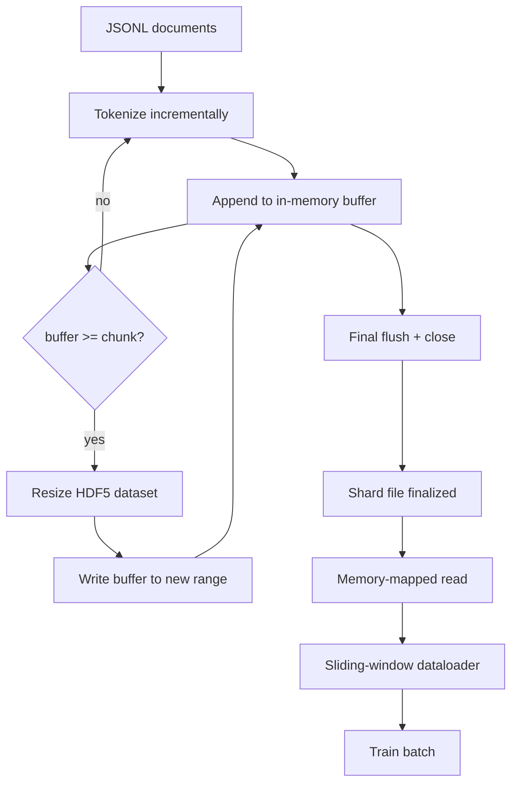

# HDF5 Tokenized Corpus / HDF5 Tokenized Corpus

> 下载好的 corpus 必须落到 trainer 能 line-speed stream 的布局里。磁盘上的 JSONL 扛不住 16 个 dataloader workers。带 resizable、chunked integer dataset 的 HDF5 可以。本课构建 streaming tokenization 到 resizable HDF5 dataset、多文件 sharded write、训练时 memory-mapped read，以及产生正确 packed fixed-length sequences 的 sliding-window dataloader。

**类型：** 构建
**语言：** Python
**前置知识：** 第 19 阶段第 30-37 课
**时间：** 约 90 分钟

## Learning Objectives / 学习目标

- 把 documents stream 进 resizable HDF5 integer dataset，并使用确定性 chunking。
- 跨多个 HDF5 files 做 sharded write，让失败范围可控且具备并行潜力。
- 通过 HDF5 的 page-cache-backed chunked layout 读回 tokens，使 dataloader 只在 batch time 复制进 batch buffers。
- 实现 sliding-window dataloader，按照显式 packing rules 发出 fixed-length training sequences。

## The Problem / 问题

现代 language-model training run 会让几十个 workers 每秒读取数十万 samples。磁盘 JSONL 在第一次 cold-cache page fault 时就会死：JSON parser 慢，document boundaries 不可寻址，seek 到 “sample 4,217,884” 需要扫描文件。即使 Parquet 压缩良好，也不是好选择，因为 trainer 不需要 columns；它需要 flat token stream 和 O(1) random access。

HDF5 适合，因为它提供 chunked、resizable、integer-only dataset，读取时对 page cache 友好。trainer 请求 `tokens[3,200,000 : 3,200,8192]`，HDF5 会把 requested hyperslab 从 page cache copy 到新 NumPy array。成本是每个 worker 一个 open file handle 和一个 chunk-sized page-cache footprint，相比解码 JSONL 的成本可忽略。

构建问题在于让写入端诚实。resizable datasets 很容易误用：逐 document write 会把 HDF5 file 碎片化到不可用；一次 resize 写完所有 documents，进程死亡会丢掉整个 shard。正确纪律是 buffer-then-extend，buffer size 匹配 chunk size，并用 sharded write 把工作切到多个 files，让 crash 最多丢一个 shard。

## The Concept / 概念



### Resizable HDF5 done right / 正确使用 Resizable HDF5

token dataset 创建时使用 `maxshape=(None,)` 和固定 `chunks=(chunk_size,)`。写入时把 tokens 缓存在长度为 `chunk_size` 的 NumPy array 中。buffer 满时，dataset 精确 resize `chunk_size`，并把 buffer 写入新 range。shard 结束时，残余 buffer 写入最后一个 partial range。除最后一次外，每次写入都是 contiguous 且 chunk-aligned；reader 会通过 shard HDF5 attributes 中记录的 `token_count` 截断最后的 partial range。

### Sharded write / Sharded write

单个 HDF5 file 是单点失败。pipeline 并行写 shards：Phase 19 lesson 42 的每个 input shard 产生一个 HDF5 output shard。`shards.json` index 对每个 shard 记录 file path、token count、document count，以及 token sha256。trainer 读取 `shards.json` 计算 global offsets 并验证 corpus。

### Memory-mapped read / Memory-mapped read

训练时，每个 worker 以 `swmr=True` 打开自己负责的 HDF5 files，并请求 `tokens[start:stop]`。chunk layout 让 chunk 热起来后读操作由 page cache 支撑。worker 永远不 materialise 整个 file：slice 被 copy 到 dataloader 的 batch buffer，随后 dataloader 在 batch time copy 到 pinned-memory training tensor。hot path 每次 chunk transition 一个 syscall，其余都是 RAM access。

### Sliding-window dataloader / Sliding-window dataloader

dataloader 是唯一知道 training-sequence length 的阶段。它在 global token stream 中选择 random start index，读取 `window_size + 1` tokens，并返回 `(input, target) = (tokens[:-1], tokens[1:])`。document boundaries 不强制：window 可以跨两个 documents，中间有显式 `boundary_token_id`，让模型学会 separator。这是标准 packing rule；初学者常忘记这点，结果 corpus 里 8% 是 training boundary tokens，92% 才是自然文本。

## Build It / 动手构建

`code/main.py` 实现：

- `Tokenizer` - demo 足够用的 byte-level deterministic tokenizer。接口是 `encode(text) -> list[int]` 和 `vocab_size`。
- `HDF5ShardWriter` - 打开 resizable integer dataset，按 chunk size 缓存 tokens，以 fixed-size strides resize/write，并在 close 时把 `token_count` 与 `sha256` 写入 HDF5 attributes。
- `ShardedTokenizationPipeline` - 迭代 input documents，把它们路由到 writer，并发出 `shards.json` index。
- `MmapTokenStore` - 打开 shard files 做 memory-mapped reads，计算 global offsets，并暴露单个 `get_slice(start, stop)` API。
- `SlidingWindowDataloader` - 从 global stream 中选择 random windows，yield `(input_ids, target_ids)` NumPy arrays。

文件底部 demo 构建 tiny in-memory corpus，tokenize 成两个 shards，通过 memory map 打开，跑 10 个 dataloader batches，并打印 per-batch shape 和 checksum。

运行：

```bash
python3 code/main.py
```

脚本零退出并打印 batch checksums。

## Production Patterns / 生产模式

四种模式把本课扩展到真实 training run。

**Chunk size equals the typical read.** trainer 每个 sample 读取 `window_size + 1` tokens。把 HDF5 chunk 设置为 `window_size` 的倍数，reads 就能 page-cache aligned。chunk 不匹配会让吞吐减半，因为每个 sample 触碰两个 chunks。

**Token count in attributes, not in the dataset.** dataset 尾部可能因为 chunk size 不能整除 document boundary 而部分填充。把真实 `token_count` 存成 HDF5 attribute，并让 reader 按它截断。否则 reader 会走到 zero-padded tokens，模型学会预测 zero。

**Sharded sha256 with parallel verification.** 每个 shard 都有基于 token bytes 的 sha256。trainer 启动前可并行验证所有 shards。错误 sha256 让 run 提早失败，而不是十六小时后的 epoch three。

**`swmr=True` on both sides, with `libver="latest"` on the writer.** Single-Writer-Multiple-Reader mode 要求 writer 用 `libver="latest"` 打开，先创建所有 datasets，再设置 `file.swmr_mode = True`。之后 writer 每次 resize 后必须调用 `dataset.flush()`，让用 `swmr=True` 打开的 reader workers 看见一致数据。跳过 `libver="latest"` 或在结构变化后才启用 SWMR，是 “file is locked” failures 的常见来源。

## Use It / 应用它

生产模式：

- **One HDF5 per source shard.** downloader（lesson 42）每个 URL 输出一个 shard；tokenization（本课）每个 source shard 输出一个 HDF5。1:1 mapping 让 resume 和 partial-failure recovery 简单。
- **Boundary token id.** boundary token 是 tokenizer vocab 的一部分，也是 dataloader 唯一注入的 token。如果模型应该忽略它，training loss 会 mask boundary token；否则模型会学习把它作为 sequence separator。
- **`shards.json` as the source of truth.** 新增 shard 意味着写 HDF5、计算 sha256、追加 entry。trainer 启动时读一次文件，之后不碰 directory listing。

## Ship It / 交付它

`outputs/skill-hdf5-tokenized-corpus.md` 在真实项目里会描述哪个 tokenizer 输入 pipeline、什么 chunk size 匹配 trainer window、`shards.json` 在 version control 中的位置，以及 dataloader workers 如何跨 files sharding。本课交付 engine。

## Exercises / 练习

1. 给 HDF5 writer 增加 `--compression gzip` flag，并测量 demo corpus 上的 throughput cost。为默认值辩护。
2. 给 sliding-window dataloader 增加 deterministic seed，并验证两个相同 seed 的 run 产生相同 batches。
3. 增加 `--validate` mode，读取每个 shard，重算 token sha256，并与 `shards.json` 对比。CI 应该在 training 前运行它。
4. 比较 chunk size 等于、半于、两倍于 window size 时的 dataloader throughput。报告 page-cache effect。
5. 增加 `--max-document-tokens` flag，在写入时截断超长 documents。说明相比 read time 决策的取舍。

## Key Terms / 关键术语

| 术语 | 常见说法 | 实际含义 |
|------|-----------------|------------------------|
| Resizable dataset | "Append-only" | An HDF5 dataset with `maxshape=(None,)` that grows via `resize` calls in chunk-sized strides |
| Chunked layout | "How HDF5 stores it" | Fixed-size on-disk pages that the kernel can memory-map and the dataloader can read contiguously |
| `swmr` mode | "Read-while-write" | Single-Writer-Multiple-Reader mode that lets dataloader workers share the file safely |
| Shard index | "shards.json" | The durable index of all token shards with offsets and content hashes |
| Sliding window | "Training sample" | A fixed-length slice of the global token stream that the trainer pairs with its shift-by-one target |

## Further Reading / 延伸阅读

- [HDF5 chunking documentation](https://docs.hdfgroup.org/hdf5/v1_14/) - the chunked, resizable dataset layout this lesson uses
- [h5py user guide](https://docs.h5py.org/en/stable/) - Python bindings for HDF5
- [NumPy memory mapping](https://numpy.org/doc/stable/reference/generated/numpy.memmap.html) - the read-side primitive HDF5 exposes through h5py
- Phase 19 · 42 - the downloader whose output this lesson tokenizes
- Phase 19 · 44 - the cosine schedule that consumes this dataloader
- Phase 19 · 45 - the AMP loop that wraps the training step
