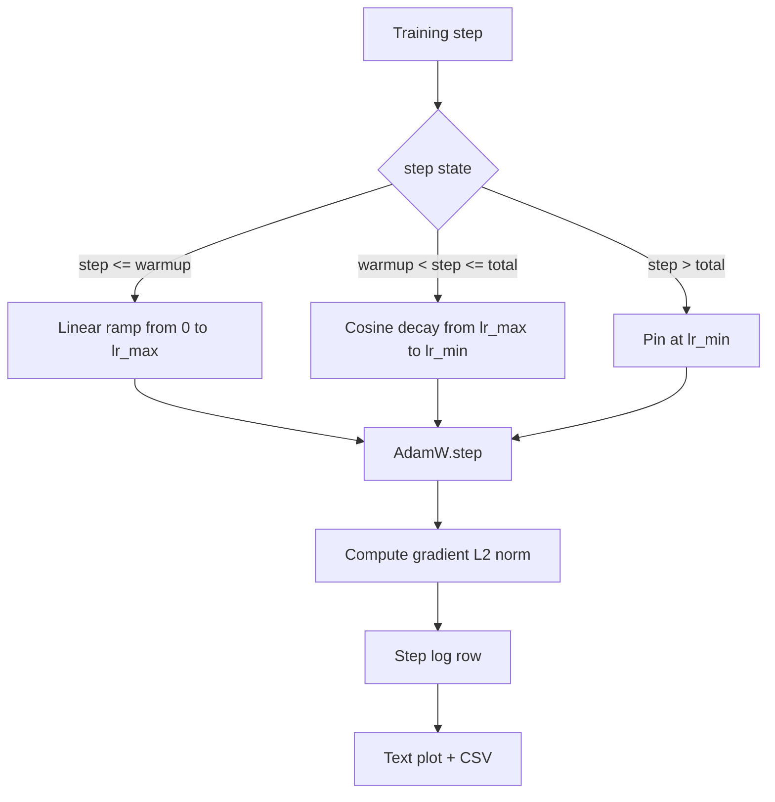

# Cosine LR with Linear Warmup / 带 Linear Warmup 的 Cosine Learning Rate

> learning-rate schedule 是仅次于 loss function 的关键决策。AdamW + cosine decay + linear warmup 是语言模型训练的现代默认：它让模型在脆弱的最初一千次更新中看到较小 effective step size，再 ramp 到配置的 peak，并平滑 decay 回接近零。本课构建该 schedule，绘制训练 steps 上的曲线，把 gradient norms 与 schedule 并排记录，并证明 schedule 正确满足 warmup、peak 和 decay 边界。

**类型：** 构建
**语言：** Python
**前置知识：** 第 19 阶段第 30-37 课
**时间：** 约 90 分钟

## Learning Objectives / 学习目标

- 实现接入 AdamW optimizer 的 cosine learning-rate schedule with linear warmup。
- 精确计算任意 step 的 schedule value，避免跨 run floating-point drift。
- 把 gradient L2 norm 与 learning rate 并排记录，让训练健康度可观察。
- 输出人眼可读的 text plot，以及任意工具都能消费的 CSV。

## The Problem / 问题

训练最初一千次更新噪声最大。模型 weights 仍接近初始化。optimizer 的 running second-moment estimate 尚未稳定。gradient norm 又大又 noisy。如果 learning rate 一开始就在 peak，模型要么直接 diverge，要么落进再也出不来的 loss plateau。两个众所周知的修复是 gradient clipping（Phase 19 lesson 45 的主题）和一个从小开始再 ramp up 的 learning-rate schedule。

cosine-with-warmup schedule 有三个区域。从 step zero 到 `warmup_steps`，learning rate 从零线性升到配置峰值 `lr_max`。从 `warmup_steps` 到 `total_steps`，learning rate 沿 cosine 曲线上半部分从 `lr_max` 衰减到 `lr_min`。超过 `total_steps` 后，learning rate 固定在 `lr_min`，这样 misconfigured trainer 超出 schedule 时不会静默外推。

构建问题是 schedule 很容易 off-by-one。off-by-one 会在六小时后显示为模型开始 overfit 时 learning rate 高或低 1%，如果没有边界测试，几乎不可见。

## The Concept / 概念



### Warmup formula / Warmup 公式

对 `step` 属于 `[0, warmup_steps]` 且 `warmup_steps > 0` 的情况，learning rate 是 `lr_max * step / warmup_steps`。退化情况 `warmup_steps = 0` 被视为“无 warmup”：schedule 从 step zero 直接使用 `lr_max`，并立即进入 cosine decay。一些 test harness 会传 `warmup_steps = 0` 来确认 schedule 仍能产生可用曲线。

### Cosine formula / Cosine 公式

对 `step` 属于 `(warmup_steps, total_steps]` 的情况，learning rate 是 `lr_min + 0.5 * (lr_max - lr_min) * (1 + cos(pi * progress))`，其中 `progress = (step - warmup_steps) / max(1, total_steps - warmup_steps)`。在 `step = warmup_steps` 时，cosine 计算 `cos(0) = 1`，得到 `lr_max`，与 warmup endpoint 完全匹配。在 `step = total_steps` 时，cosine 计算 `cos(pi) = -1`，得到 `lr_min`，与 decay endpoint 完全匹配。

两个 endpoint 的连续性不是偶然。这就是 schedule 被实现成单个 `step` 函数，而不是三段函数拼接的原因。拼接 schedule 在第一次修改 `lr_max` 时就容易丢掉一个边界。

### Floor after total steps / Total steps 后的 floor

对 `step > total_steps`，learning rate 保持 `lr_min`。契约明确：schedule 不报错、不外推；它钉在 floor，并让 trainer 记录 warning。需要延长训练的 trainer 应修改 schedule 的 `total_steps`，而不是改 loop。

### Gradient norm logging alongside the rate / 与 LR 并排记录 gradient norm

schedule 是训练健康度的一半，gradient norm 是另一半。training loop 每步都记录二者。divergent run 会在 loss 前先出现 gradient norm spike；调得好的 warmup 会让 norm 随 rate 线性上升；过激 peak 会表现为 warmup 后 norm 仍居高不下。磁盘上的 dataset 是 `step, lr, grad_l2_norm, loss`。CSV 是唯一 durable record。

## Build It / 动手构建

`code/main.py` 实现：

- `CosineWithWarmup` - 一个 stateless function：`lr(step) -> float`。
- `TrainState` - 把 model、`AdamW` optimizer 和 schedule 包成一个 step function。
- `TrainState.step` - 运行一次 forward、一次 backward，记录 gradient L2 norm，并把 `lr(step)` 应用到 optimizer。
- `plot_schedule_ascii` - 把 schedule 渲染成人眼可读的 text plot。
- `write_schedule_csv` - 每个 step 写一行 learning rate。

文件底部 demo 构建 tiny `nn.Linear` model，在固定 input batch 上训练 20 steps，并打印每步 learning rate、gradient norm 和 loss。schedule 也会渲染成 text plot 用于视觉 sanity check。

运行：

```bash
python3 code/main.py
```

脚本零退出，并打印 per-step training log 和 schedule plot。

## Production Patterns / 生产模式

四种模式把 schedule 变成 production artifact。

**Schedule lives in a config, not in code.** trainer 从 committed YAML 或 JSON config 读取 `warmup_steps`、`total_steps`、`lr_max`、`lr_min`。config content-addressed，所以 schedule 可复现；config 进入 PR diff，所以 schedule 可审计。

**Step counter is monotonic and decoupled from epochs.** dataset sharded 或 dataloader restart 时，一些 framework 会混淆 step 和 epoch。schedule 应读取 trainer checkpoint 中的 `global_step`，而不是 local counter。resumed run 因为 step counter 是 durable axis，会从正确位置继续。

**Schedule plot in the run directory.** 每个 training run 都把 `outputs/lr_schedule.png`（本课是 text plot）写入 run directory。reviewer 浏览目录时可不重跑就 sanity-check schedule。这能在 PR 阶段抓住 misconfigured-schedule 类 bug。

**Log row schema is fixed.** `step, lr, grad_l2_norm, loss` 按这个顺序。下游 notebook 或 dashboard 读取 schema；未 bump version 就改列名，会让所有现有 dashboard 失效。

## Use It / 应用它

生产模式：

- **Sweep peak before sweeping anything else.** `lr_max` 是最敏感 knob。先在小模型上 sweep；optimal `lr_max` 与模型大小的 scaling 很弱，因此小模型 sweep 是强先验。
- **Warmup is a fraction of total steps, not an absolute count.** 200-million-step run 用 2,000 warmup steps 几乎马上到峰值；20,000-step run 用同样数量则 warmup 10%。用 fraction 配置 warmup（常见 1-3%），让 schedule 随训练时长缩放。
- **`lr_min` is non-zero on purpose.** floor 为 `lr_max` 的 10% 可以让 optimizer 在 long tail 继续学习。`lr_min = 0` 的 schedule 图很好看，但模型可能还没真正训完。

## Ship It / 交付它

`outputs/skill-cosine-warmup.md` 在真实项目里会描述哪个 config 携带 schedule、global counter 从 trainer 哪个 step 读取、什么 `lr_max` sweep 产生部署值。本课交付 engine。

## Exercises / 练习

1. 增加 inverse-square-root schedule 变体，并在 200-step toy training run 上比较。哪条曲线 final loss 更低？
2. 增加 `--restart` flag，在 `total_steps / 2` 处加第二次 warmup。判断 warm restarts 在 toy run 上是改善还是伤害。
3. 增加 unit test 验证 schedule 连续性：对 `[0, total_steps]` 内每个 step，`|lr(step+1) - lr(step)|` 被 `lr_max / warmup_steps` 约束。
4. 把 schedule 接入 `torch.optim.lr_scheduler.LambdaLR`，让它与 framework code 组合。本课用 plain step function；wrapper 改变了什么？
5. 增加 `--plot-png` flag，用 `matplotlib` 写真实图。说明本课 text plot 和 PNG 哪个更适合作为 CI 默认。

## Key Terms / 关键术语

| 术语 | 常见说法 | 实际含义 |
|------|-----------------|------------------------|
| Warmup | "Slow start" | Linear ramp from zero to `lr_max` over the first `warmup_steps` updates |
| Cosine decay | "Smooth drop" | Upper-half cosine curve from `lr_max` to `lr_min` over the remaining steps |
| Floor | "After training" | The fixed `lr_min` value the schedule pins at past `total_steps` |
| Gradient norm | "L2 of grads" | The Euclidean norm of the concatenated gradient vector, logged each step |
| Global step | "Schedule axis" | A monotonic step counter that survives restarts and drives the schedule |

## Further Reading / 延伸阅读

- [Loshchilov and Hutter, SGDR: Stochastic Gradient Descent with Warm Restarts (arXiv 1608.03983)](https://arxiv.org/abs/1608.03983) - the cosine schedule's reference paper
- [Loshchilov and Hutter, Decoupled Weight Decay Regularization (arXiv 1711.05101)](https://arxiv.org/abs/1711.05101) - AdamW's reference paper
- [PyTorch torch.optim.lr_scheduler](https://docs.pytorch.org/docs/stable/optim.html#how-to-adjust-learning-rate) - how step functions compose with framework schedulers
- Phase 19 · 42 - the downloader whose corpus this schedule consumes
- Phase 19 · 43 - the dataloader the schedule co-evolves with
- Phase 19 · 45 - gradient clipping and AMP, the next layer in the loop
