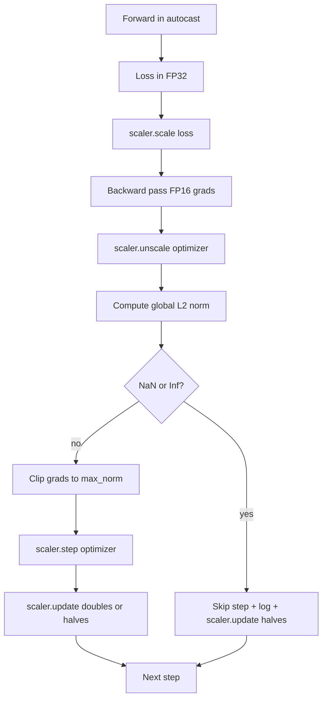

# Gradient Clipping and Mixed Precision / 梯度裁剪与混合精度

> 上一课的 optimizer 和 schedule 假设 gradients 是正常的。但它们经常不是。一个坏 batch 就能让 gradient norm 飙升三个数量级。mixed-precision training 又会因为 FP16 overflow 放大 loss 侧问题。本课构建生产训练不可缺少的两条安全带：把梯度裁剪到配置的 global L2 norm，以及带 autocast 和 GradScaler 的 mixed-precision loop，能检测 NaN/Inf、干净跳过 step，并记录 scaling factor 供事后分析。

**类型：** 构建
**语言：** Python
**前置知识：** 第 19 阶段第 30-37 课
**时间：** 约 90 分钟

## Learning Objectives / 学习目标

- 计算所有 parameter gradients 的 global L2 norm，并在超过阈值时 in-place clip。
- 用 autocast + GradScaler 包住 training step，使 FP16 forward/backward 在 overflow 时仍可恢复。
- 检测 loss 或 gradient 中的 NaN 与 Inf，跳过 optimizer step，并记录 skip。
- 每步报告 GradScaler 的 scaling factor，让连续 skip 立刻可见。

## The Problem / 问题

昨天正常的 training run 在 step 8,217 处 loss curve 直线上升。元凶是某个 batch 的 gradient norm 达到 4,200，是此前峰值的二十倍。没有 clipping，optimizer 会应用一个重置过去一小时学习成果的 step。global L2 clip 到 norm 1.0 后，同一个 batch 只贡献 unit-norm update；loss 留在趋势线上，run 活下来。

mixed-precision training 通过把 forward pass 和大部分 backward pass 放到 FP16，把吞吐推高 2-3x。代价是 FP16 exponent range 窄。典型 gradient 在 FP16 中 overflow 后会变成 Inf，随后在层间传播成 NaN，下一次 optimizer step 会把所有 weights 设为 NaN。PyTorch 的 GradScaler 通过在 backward 前把 loss 乘以大 scaling factor，并在 optimizer step 前按同一 factor 反向缩放 gradients 来解决。如果 unscale 时任一 gradient 是 Inf 或 NaN，scaler 会跳过 step 并把 scaling factor 减半；如果之前 N 步都干净，scaler 会把 factor 翻倍。训练过程中 factor 会找到 FP16 range 能容纳的最大值。

构建难点是顺序。clip 在 unscale 前执行，阈值会作用在 scaled gradients 上；clip 在 unscale 后执行，也必须配合 GradScaler 正确调用。正确顺序是：`scaler.scale(loss).backward()`，然后 `scaler.unscale_(optimizer)`，然后 `clip_grad_norm_`，然后 `scaler.step(optimizer)`，最后 `scaler.update()`。其他顺序会产生静默损坏的 loop。

## The Concept / 概念



### Global L2 norm / Global L2 norm

global L2 norm 是把所有 gradient vector 拼接后得到的 Euclidean norm，不是 per-parameter norm。PyTorch 用 `torch.nn.utils.clip_grad_norm_(parameters, max_norm)` 实现。该函数返回 pre-clip norm，因此本课可以同时记录 natural 和 clipped value，这对诊断“每步都在 clip”很必要。

### autocast and GradScaler / autocast 与 GradScaler

`torch.amp.autocast(device_type)` 是 context manager，会把 eligible operations（多数 matmul 类操作）选择性放到 FP16。`torch.amp.GradScaler(device_type)` 会在 backward 前 scale loss，并在 optimizer step 前 inverse-scale gradients。二者设计为配套使用；只用其中一个应被测试视为配置错误。

本课使用 CPU autocast，因为它能在 CI 中运行；同一模式迁移到 CUDA 只需要把 `device_type="cpu"` 改成 `device_type="cuda"`。CPU 上的 GradScaler 基本是 stub（CPU autocast 默认使用 BF16，不需要 loss scaling），但课程保留调用点，让 wiring 与 GPU loop 完全一致。

### NaN and Inf detection / NaN 与 Inf 检测

检测发生在两个位置。第一，backward 前用 `torch.isfinite` 检查 loss 本身；Inf 或 NaN loss 不会产生有用 gradients，应跳过而不进入 optimizer。第二，`scaler.unscale_(optimizer)` 后，课程用 `has_non_finite_grad(...)` 扫描 unscaled gradients，把任意 Inf 或 NaN 视为 skip。两者一起覆盖 forward-pass 与 backward-pass failure modes。

### Scaling factor diagnostics / Scaling factor 诊断

scaling factor 是 GradScaler 的内部状态。每步课程读取 `scaler.get_scale()`，并与 learning rate 和 gradient norm 一起记录。健康 run 会看到 factor 以 2 的幂上升，直到在 `2^17` 或 `2^18` 附近饱和。异常 run 会看到 factor 在高低之间振荡，说明模型 gradients 有时在 range 内，有时不在。没有 logging，这个诊断不可见。

## Build It / 动手构建

`code/main.py` 实现：

- `clip_global_l2_norm` - 包装 `torch.nn.utils.clip_grad_norm_`，返回 pre-clip 和 post-clip norm。
- `has_non_finite_grad` - 扫描 gradients 中的 NaN 和 Inf。
- `AmpTrainState` - 包住 model、`AdamW` optimizer、GradScaler 和 autocast device。暴露 `step(inputs, targets)`，运行完整 clipping、scaling、skip-on-NaN pipeline。
- `StepLog` 和 `SkipLog` - 结构化 per-step records。
- demo：训练小 `nn.Linear` model 20 steps，在 step 5 注入 Inf 到 gradient，覆盖 skip path，并打印 log。

运行：

```bash
python3 code/main.py
```

脚本零退出，并打印每行带 `STEP` 或 `SKIP` 标签的 per-step log；至少有一行是 `SKIP`。

## Production Patterns / 生产模式

四种模式把 loop 提升成 production training step。

**Skip counter as an alert, not a log line.** 一个 training run 中少量 skipped steps 是健康的。每个 epoch 数百次 skip 是硬告警：模型处在 FP16 无法承受的区域，loop 正在静默失败。本课追踪 1,000-step rolling skip rate；生产中超过 5% 会 page。

**Clip threshold lives in the config.** `max_norm = 1.0` 是语言模型训练的现代默认。先在小模型上 sweep；更大阈值允许模型从困难 batch 中恢复，更小阈值限制最坏情况但让 loss curve 更 noisy。threshold 应与 lesson 44 的 schedule 一起放在 YAML 或 JSON config 中。

**Norm log goes to a CSV with the schedule.** CSV columns 是 `step, lr, grad_l2_pre_clip, grad_l2_post_clip, loss, skipped, skip_reason, scaler_scale`。reviewer 打开一个文件，就能看到 schedule、gradient story、scaling factor 和 skip outcome。把列拆到多个文件，极易造成分析错位。

**`scaler.update()` runs every step, even on skip.** clean step 上，scaler 读取 no-inf counter、递增，并可能翻倍 factor。skipped step 上，scaler 减半 factor 并重置 counter。skip path 忘记 `update()`，会导致“scaling factor 从不变化”。

## Use It / 应用它

生产模式：

- **Autocast device matches optimizer device.** GPU training 用 `torch.amp.autocast(device_type="cuda")`，CPU 用 `torch.amp.autocast(device_type="cpu")`。混用 device 会产生静默 type error，表现为 loss curve 看似正常但模型不学习。
- **Loss check before backward.** `torch.isfinite(loss).all()` 是一次 tensor reduction，成本可忽略，却能在 NaN loss 时省掉整个 training step。总是运行它。
- **`set_to_none=True` in `zero_grad`.** 把 gradients 设为 `None` 而不是 zero，让 optimizer 跳过未受影响 parameter groups 的计算。这个设置是免费的吞吐提升，也稍微降低 bug 表面。

## Ship It / 交付它

`outputs/skill-clip-amp.md` 在真实项目里会描述训练 step 使用哪个 clip threshold 和 autocast device、per-step CSV 放在何处，以及生产 skip-rate alert threshold 是多少。本课交付 engine。

## Exercises / 练习

1. 用真实 loss spike 替换 synthetic Inf injection（例如把某个 batch 的 target 乘以 1e8），验证 skip path 触发。
2. 增加 `--bf16` mode，把 autocast 切到 BF16 而不是 FP16。BF16 exponent range 更宽，很少需要 loss scaling；验证同一 demo 上 skip rate 降到零。
3. 增加 unit test：当没有 clipping 发生时，gradient-clip wrapper 正确返回 pre-clip 和 post-clip norm。
4. 增加 rolling-window skip-rate computation 和 CLI flag，当 100 连续 steps 的 rate 超过阈值时 fail run。
5. 把 loop 接成 canonical CSV（`step, lr, grad_l2_pre_clip, grad_l2_post_clip, loss, skipped, skip_reason, scaler_scale`），并通过每行 flush 确认 Ctrl-C 后文件仍可读。

## Key Terms / 关键术语

| 术语 | 常见说法 | 实际含义 |
|------|-----------------|------------------------|
| Global L2 norm | "Clip target" | Euclidean norm of the concatenated gradient vector across all trainable parameters |
| autocast | "Mixed precision" | Selective FP16 (or BF16) execution of eligible operations inside a `with` block |
| GradScaler | "Loss scaler" | Helper that multiplies the loss before backward and inverse-scales gradients before the optimizer step |
| Skip | "Bad step" | An optimizer step refused because the gradient or loss was non-finite; the scaler halves the factor |
| Scaling factor | "Scaler state" | The GradScaler's current multiplier; doubles after clean stretches and halves on every skip |

## Further Reading / 延伸阅读

- [Micikevicius et al., Mixed Precision Training (arXiv 1710.03740)](https://arxiv.org/abs/1710.03740) - the original loss-scaling proposal
- [Pascanu, Mikolov, Bengio, On the difficulty of training recurrent neural networks (arXiv 1211.5063)](https://arxiv.org/abs/1211.5063) - the gradient-clipping reference paper
- [PyTorch torch.amp.GradScaler](https://docs.pytorch.org/docs/stable/amp.html) - the scaler API this lesson wraps
- [PyTorch torch.nn.utils.clip_grad_norm_](https://docs.pytorch.org/docs/stable/generated/torch.nn.utils.clip_grad_norm_.html) - the clipping primitive this lesson uses
- Phase 19 · 42 - the downloader whose corpus feeds the loop
- Phase 19 · 43 - the dataloader the loop consumes
- Phase 19 · 44 - the schedule this loop composes with
