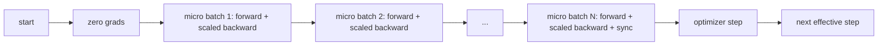
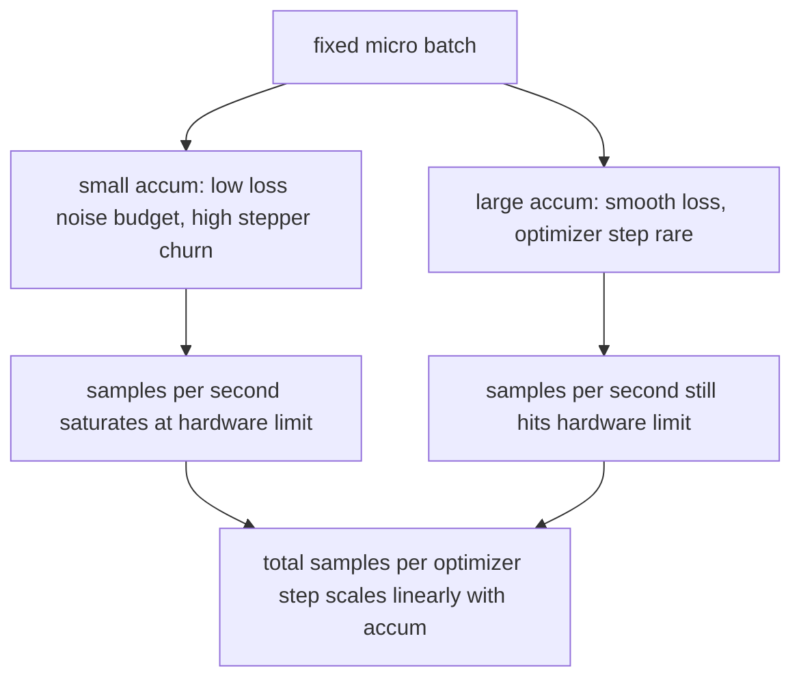

# Gradient Accumulation / 梯度累积

> 在你负担不起的 effective batch 上训练，一次只跑一个 micro-batch。缩放 loss，暂缓 optimizer step，让 gradients 累积起来。

**类型：** 构建
**语言：** Python
**前置知识：** 第 19 阶段第 42-45 课
**时间：** 约 90 分钟

## Learning Objectives / 学习目标

- 推导 effective batch identity：`effective_batch = micro_batch * accum_steps`。
- 实现 per-micro-batch loss scaling，使 accumulated gradient 匹配单次 full-batch backward。
- 在最后一个 micro-batch 前跳过 optimizer synchronization（sync-on-last-step）。
- 读取 throughput against effective batch 曲线，并解释 diminishing return。

## The Problem / 问题

你想用 effective batch 512 训练，因为 loss curve 更平滑，optimizer step 在这个尺度上更合理。桌面上的 accelerator 只能容纳 32 个 examples，再大就 OOM。加 batch 不行，减模型也不行。2017 年以来领域持续使用的技巧是：运行 16 次 backward pass，让 gradients 在 parameter buffers 中累积，只有计数达到目标时才执行 optimizer step。

风险是 loss 不再等价于大 batch 上的 loss。16 个 mini-batches 的 cross entropy 直接求和，会是一个 full batch loss 的 16 倍。没有 scaling 时，gradient 方向正确，但大小错误，optimizer step 变成 16 倍。修复只是一除；也最容易被忘记。

## The Concept / 概念



契约很短：

- 每个 micro-batch 的 loss 在 `backward()` 前除以 `accum_steps`。PyTorch 默认把 gradients 加到 `param.grad` 里；这个除法把 running sum 拉回正确尺度。
- optimizer step 每个 effective batch 只触发一次，在最后一个 micro-batch 的 backward 后执行。累积中途 step 会改变后续 micro-batch 依赖的所有 parameters。
- optimizer state（momentum buffers、Adam moments）每个 effective step 前进一次，而不是每个 micro-batch 前进一次。否则 exponential moving averages 会以错误频率更新，并烧穿 schedule。
- 单设备上这只是 bookkeeping。多 rank 集群中，同一模式会把非最终 micro-batches 包进 `no_sync` context，跳过 gradient all-reduce；最后一个 micro-batch 一次性 reduce 完整 accumulated gradient，避免支付 N 次网络成本。

### The equivalence proof in code / 代码中的等价性证明

```python
loss = criterion(model(x_full), y_full)
loss.backward()
opt.step()
```

等价于：

```python
for x, y in chunks(x_full, y_full, n):
    scaled = criterion(model(x), y) / n
    scaled.backward()
opt.step()
```

除了 floating point summation order。loop 结束时的 accumulated gradient buffer，与单次 full-batch backward 产生的 tensor 相同。本课代码在 `equivalence_check` 中断言 max-abs difference 小于 1e-4。

### Where the cost goes / 成本去了哪里

每个 micro-batch 都要一次 forward 和一次 backward。accumulation 用时间换内存。`outputs/accum-curve.json` 中的 throughput curve 展示了 fixed micro-batch 下 effective batch 增大时会发生什么：



没有免费午餐。`accum_steps` 翻倍，optimizer step 的 wall time 也翻倍。改变的是 gradient estimate 的 variance：同一 wall budget 下，你做了更少 optimizer steps，但每一步平均了更多 samples。文献会把 large batch 和 small batch 当作不同 optimization problem；本课关注 mechanical correctness，而不是统计性质。

## Build It / 动手构建

`code/main.py` 是 runnable artifact，做三件事。

### Step 1: equivalence check / 等价性检查

`equivalence_check()` 用同一 seed 构建两个相同网络。一个一次 forward 看 16-sample batch；另一个看四个 4-sample chunks，并把 loss 除以四。函数在 optimizer step 前比较 gradient buffers，并在 step 后比较 parameters。断言是 `max_abs_diff < 1e-4`。

### Step 2: sync-on-last-step pattern / Sync-on-last-step 模式

`train_one_optimizer_step` 遍历 micro-batches。除最后一个外，每个 micro-batch 都进入 `no_sync_context(model)`。单进程中 context 是 no-op；DDP 中这里会跳过 gradient all-reduce。bookkeeping 不因环境而变。`sync_counter` 记录离开 no_sync scope 的次数；N 个 micro-batches 每个 effective step 只应 sync 一次，而不是 N 次。

### Step 3: the throughput curve / Throughput 曲线

`sweep_effective_batches` 在 fixed micro-batch 和一组 accumulation steps 下运行同一模型。每个设置记录：

- `samples_per_sec`：总 samples 除以 wall time
- `median_step_ms`：每个 effective step 的 50th percentile
- `sync_calls`：触发的 collective points
- `avg_loss`：sweep 的 optimizer steps 平均 loss

输出写到 `outputs/accum-curve.json`，可被 notebook 复用。

运行：

```bash
python3 code/main.py
```

脚本先打印 equivalence diff，再打印 sweep table，然后给出 JSON path。exit code 为零。

## Use It / 应用它

生产训练中，gradient accumulation 通常藏在一个 knob 后面。PyTorch 模式是 `accumulation_steps = effective_batch // (micro_batch * world_size)`。你在本课不允许使用的框架也只是包住同一个 loop：scale loss、在非最终 micros 上 skip sync、accumulate、每个 effective batch step 一次。

三种生产模式：

- micro-batch size 选择为刚好占满 device memory。更小浪费 accelerator cycles，更大 crash。
- effective batch 从 learning rate schedule 中选择。large effective batches 需要 scaled learning rates 和 warmup；这就是 2017 年以来讨论的 linear scaling rule。
- accumulation count 是二者之间的桥，也是你能在 runtime 调整而不重写 data loader 的唯一 knob。

## Ship It / 交付它

`outputs/skill-gradient-accumulation.md` 捕获 recipe，供 peer 放进新 repo：loss 除以 `accum_steps`、非最终 micros 跳过 optimizer sync、每个 effective batch step 一次 optimizer、把 throughput against effective batch 记录为 JSON，让 trade-off 可见。

## Exercises / 练习

1. 用 `--num-steps 100` 重跑 sweep，画 samples per second against effective batch。曲线在哪里变平？
2. 增加错误 scaling 变体（不除以 N），展示 step 1 上与 reference 的 parameter diff。
3. 把 SGD 换成 AdamW，确认 optimizer state 每个 effective step 前进一次，而不是每个 micro-batch。
4. 引入真实 `DistributedDataParallel` wrapper，并把 `no_sync_context` 路由到它的方法。确认每个 effective batch 的 sync_calls 减少 N-1 次。
5. 修改 equivalence check，比较两种不同 micro split（2 by 8 vs 4 by 4），并解释需要放宽的 tolerance。

## Key Terms / 关键术语

| 术语 | 常见说法 | 实际含义 |
|------|-----------------|------------------------|
| Micro batch | The batch you forward | The slice that fits in memory in a single forward pass |
| Accum steps | Backward passes per step | Number of backwards summed before one optimizer step |
| Effective batch | The batch | Micro batch times accum steps times data parallel world size |
| Loss scaling | Divide by N | Per-micro-batch division so summed gradients match full batch |
| Sync on last | Skip the rest | Only run the gradient collective on the last backward in the window |

## Further Reading / 延伸阅读

- PyTorch docs on `DistributedDataParallel.no_sync` for the production version of the sync-on-last-step trick.
- Goyal et al., 2017, on linear scaling for large batch training, the canonical reason to care about effective batch.
- PyTorch issue tracker on gradient accumulation interactions with mixed precision unscaling.
- Phase 19 lessons 42 to 45 cover the model, data loader, optimizer, and trainer scaffolding this lesson assumes.
- Phase 19 lesson 47 covers checkpoint and resume so a long accumulation run survives a wallclock cap.
