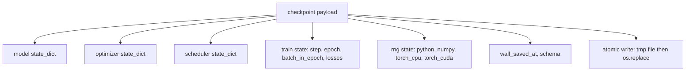
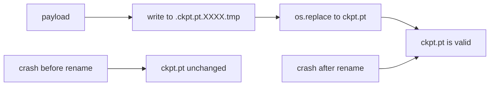
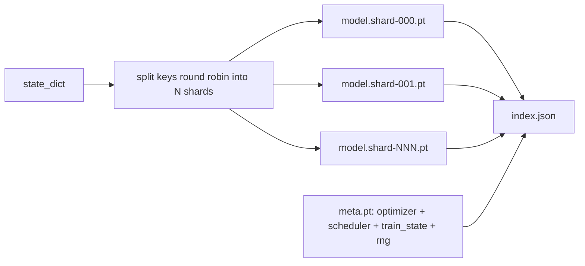

# Checkpoint Save and Resume / Checkpoint 保存与恢复

> training interrupts 会杀掉 run；checkpoints 让它们继续。原子化保存 model、optimizer、scheduler、loss history、step counter 和 RNG state，确保任意时刻被 kill，磁盘上仍留下有效文件。

**类型：** 构建
**语言：** Python
**前置知识：** 第 19 阶段第 42-45 课
**时间：** 约 90 分钟

## Learning Objectives / 学习目标

- 捕获完整 training state，打包成可在 fresh process 中重载的单一 payload。
- 实现 atomic save：先写 temp，再 rename，避免 crash 留下半写文件。
- 恢复 Python、NumPy 和 PyTorch 的 RNG state，使 resume 后 loss 匹配 uninterrupted baseline。
- 为不再适合单文件的大模型构建 sharded checkpoint layout，包含 hash-verified shards 和 JSON index。

## The Problem / 问题

你设置了 18 小时 training job。wallclock cap 是 4 小时。第 11 小时集群因内核升级 reboot。没有 checkpoints 就要重来。没有 resume，你还会丢掉 optimizer state：前 11 小时学到的 AdamW moments 全没了；即便 model weights 活下来，下一步也会朝训练 trajectory 已经离开的方向猛冲。

正确 artifact 是一个包含继续训练所需一切的文件：model parameters、optimizer state、scheduler state、plot 用 loss history、current step 和 epoch 与 batch-in-epoch counters，以及每个随机源的 RNG state。没有 RNG state，resumed loss curve 就是另一条曲线。同一个模型、同一份数据，但 shuffle、dropout mask 和 dashboard 数字都不同。

atomic save 是另一半契约。直接写最终文件名，crash mid-write 会留下 corrupt file；resume 会读垃圾。写入同目录临时文件，再 rename 到目标文件名，crash mid-write 只会留下上一份好文件。POSIX file systems 上 rename 是原子的。

## The Concept / 概念



### The five state buckets / 五类 state

| Bucket | Why it matters |
|--------|----------------|
| Model | Weights and buffers; what the model is. |
| Optimizer | Momentum and adaptive moments; without these the next step is a different optimization problem. |
| Scheduler | Where the learning rate is on its curve; cosine schedules in particular care. |
| Train counters | Step, epoch, batch-in-epoch, plus the loss history that draws the dashboard. |
| RNG state | Determinism for dropout, data shuffling, and any sampling inside the model. |

### Atomic save / 原子保存



两条规则。第一，temporary file 必须与 target 在同一目录，保证 rename 在同一 filesystem 内；cross-device rename 不是原子的。第二，temporary name 每次尝试都唯一，避免两个 writers 互相覆盖。

### Sharded checkpoints / Sharded checkpoints

模型变大后，单文件 payload 会太大、加载慢、难检查，并且网络盘 mid-read 抖一下就很痛。修复方式是把 parameter state 切成 shards，并写一个小 index 把它们绑定起来。



index 记录 shard count、每个 shard 的 sha256，以及 meta file 的 sha256。loader 发现任何 hash mismatch 都要大声失败。shards 可以落在不同物理 disks 上；meta 很小，会先读。

### Resume continues mid epoch / 从 epoch 中间恢复

resume 直接跳到下一个 epoch 会浪费几分钟到一天。修复是保存 `(epoch, batch_in_epoch)` 加 RNG state。load 后，training loop 把 random number generator fast-forward 到当前 epoch 已消费 batches 后的位置，再从 `batch_in_epoch` 继续。本课代码精确执行这一点；断言是 resume 后 loss trajectory 与 uninterrupted baseline 在 1e-4 内匹配。

## Build It / 动手构建

`code/main.py` 提供四个 primitives 和 demo driver。

### Step 1: capture and restore RNG state / 捕获与恢复 RNG state

`capture_rng_state` 返回 dict，包含 Python 的 `random.getstate`、NumPy 的 `np.random.get_state`，以及 PyTorch CPU 和 CUDA RNG bytes。`restore_rng_state` 做逆操作。CPU tensor 是 PyTorch RNG 能消费的 uint8 byte buffer。

### Step 2: atomic save / 原子保存

`atomic_save` 把 payload 写到 target directory 内的 temp file，再用 `os.replace` 交换成最终文件名。`atomic_write_json` 对 sharded index 做同样事情。

### Step 3: full checkpoint round trip / 完整 checkpoint 往返

`save_checkpoint` 把 model、optimizer、scheduler、train state 和 RNG 打成一个 dict。`load_checkpoint` 反向加载并返回 `TrainState`。schema field 是 upgrade hook：未来 format 变化会 bump version string，loader 按 schema 分发。

### Step 4: sharded variant / Sharded 变体

`save_sharded_checkpoint` round-robin parameter keys 到 N 个 shards，分别 atomic save；再写 meta file，里面有 optimizer、scheduler、train state；最后写包含 shard sha256s 的 JSON index。`load_sharded_checkpoint` 在 merge 前验证每个 shard。

### Step 5: resume demo / Resume demo

`run_resume_demo` 训练小模型 `total_steps`，在 `interrupt_at` 保存 checkpoint，然后继续。第二个 process 恢复 checkpoint 并跑剩余 steps。函数返回 interruption point 后两条 loss trajectories 的 max absolute difference。恢复 RNG 后，差异为零或 floating-point noise。

运行：

```bash
python3 code/main.py
```

单文件和 sharded demos 都断言 max-diff 小于 1e-4。summary 写到 `outputs/resume-demo.json`。

## Use It / 应用它

生产 training stacks 把 checkpointing 作为 trainer 的一部分。形状相同：model + optimizer + scheduler + counters + RNG，原子写入，并按 step 命名，方便找到 latest。sharded layouts 用并行读取支撑大模型加载；`index.json` 让这件事成立。

三条必须执行的模式：

- **Schema is a string in the payload.** migrations 按它分支。没有 schema，就无法演进 format 而不破坏旧 run。
- **Sha256 every shard.** silently truncated download 是最糟糕的 bug；loader 要么 fail fast，要么很晚才失败。
- **Keep checkpoint cadence honest.** 每 N steps 保存，或每 wallclock-minute 保存，取更短者。否则 crash 在长 step 中会浪费一个完整窗口。

## Ship It / 交付它

`outputs/skill-checkpoint-save-resume.md` 是任何新 training script 的 recipe：payload shape、atomic write、RNG capture、sharded index。把 skill 放进 repo，在 periodic save site 接 `save_checkpoint`，启动时接 `load_checkpoint`，run 就能挺过 kill。

## Exercises / 练习

1. 把 round-robin sharding 换成按 parameter group sharding（以 `.weight` vs `.bias` 结尾的 layers）。各自在什么时候更合适？
2. 扩展 save loop，只保留最近 K 个 checkpoints 并 prune 旧文件。磁盘小时 K 应该是多少？
3. 增加 `--ckpt-every-seconds` flag，按 wallclock interval 触发保存，而不只是 step count。
4. 增加 checksum verification path：启动时扫描 checkpoint directory 中每个 checkpoint，报告损坏项。
5. 实现 `migrate_v1_to_v2`，给 payload 增加新字段并 bump schema string。让 load 同时兼容两个版本。

## Key Terms / 关键术语

| 术语 | 常见说法 | 实际含义 |
|------|-----------------|------------------------|
| Atomic save | "Write and pray" | Write to a temp file in the same directory, then os.replace into the target name |
| State dict | "The weights" | Model parameters and buffers, keyed by parameter name |
| Sharded checkpoint | "Big model file" | Multiple files, one per shard, plus a meta file and a JSON index with sha256s |
| RNG state | "Random seed" | Captured state for python random, numpy, torch CPU, torch CUDA; not just the seed |
| Mid-epoch resume | "Restart" | Fast-forward the RNG and continue from the next batch in the same epoch |

## Further Reading / 延伸阅读

- POSIX `rename` semantics for the atomicity claim that `os.replace` relies on.
- PyTorch documentation on `torch.save` and `torch.load`, including `map_location` for cross-device restores.
- Phase 19 lesson 46 covers the gradient accumulation that this lesson's checkpoint payload survives across.
- Phase 19 lesson 48 covers the distributed wrappers whose state dict format this scheme accommodates.
- The Linux kernel `fsync` documentation for the durability guarantee behind atomic rename.
