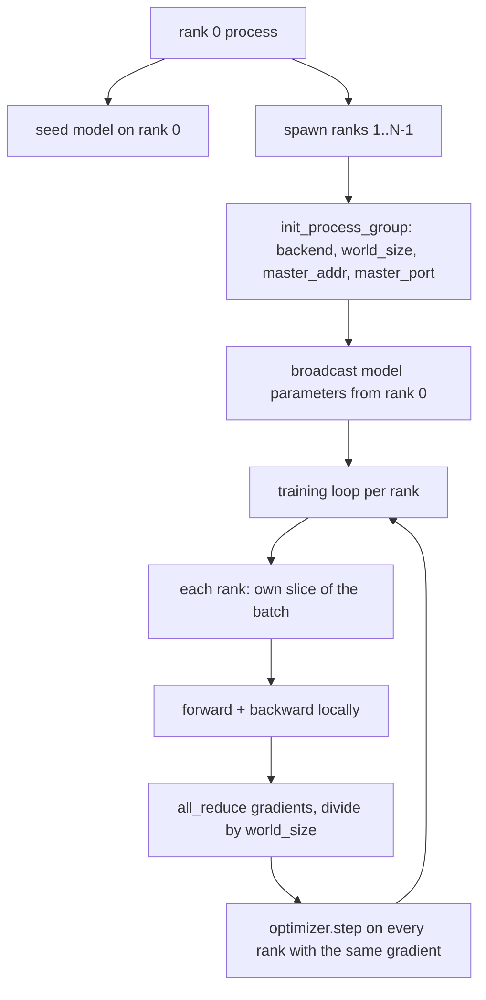
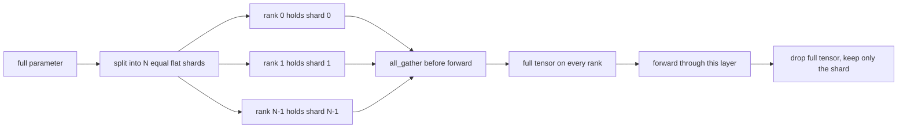

# Distributed Data Parallel and FSDP from Scratch / 从零构建 Distributed Data Parallel 与 FSDP

> 多 rank 训练是两个 collectives 和一条规则。启动时 broadcast parameters，backward 后 average gradients，永远不要让 ranks 对自己处于哪一步产生分歧。

**类型：** 构建
**语言：** Python
**前置知识：** 第 19 阶段第 42-45 课
**时间：** 约 90 分钟

## Learning Objectives / 学习目标

- 用 `gloo` backend 在 N 个 ranks 间启动 process group，无需特殊硬件。
- 实现最小 DDP wrapper：构造时 broadcast parameters，backward 后 all-reduce gradients。
- 证明 per-rank gradients 的 all-reduce 匹配 concatenated input 上的 single-process gradient。
- 描述 FSDP parameter sharding：每个 rank 持有一个 slice，forward 前 gather full tensor，用完后丢弃。

## The Problem / 问题

模型能放进单个 device，但 dataset 放不下。optimization budget 要求每个 wallclock second 看 N 倍 examples。第一根杠杆是 data parallel：每个 rank 在 batch 的不同 slice 上运行同一模型，然后在 optimizer step 前 average gradients。第二根杠杆是 FSDP：模型也放不进一个 device，于是每个 rank 持有每个 parameter 的一部分，并在 forward 时逐层重构 full tensors。

痛点是 bookkeeping。如果 parameters 在 ranks 间漂移，run 会静默损坏。如果你 average gradients 但不处理 loss，dashboard 会撒谎。如果 collective backend 无法就 topology 达成一致，run 会永远 hang。修复方式是手写一次 collectives，然后不要信任任何你无法复现的 wrapper。

本课在 CPU 上运行，不假设 CUDA。`gloo` backend 随每个 PyTorch build 提供，并支持 `torch.multiprocessing` workers；同一代码切到多 GPU 节点上的 `nccl`，结构不变。

## The Concept / 概念



### The two collectives that matter / 关键 collectives

| Collective | What it does | When |
|------------|--------------|------|
| `broadcast` | Copy a tensor from one rank to all others | Parameter init, scheduler state, any one-to-all sync |
| `all_reduce` | Sum (or mean, or max) a tensor across all ranks, every rank gets the result | Gradient averaging after backward |
| `all_gather` | Each rank contributes a tensor, every rank gets the concatenation | Logits collection, FSDP parameter unshard |

DDP 契约是构造时 `broadcast`，backward 后 `all_reduce`。FSDP sketch 在每层 forward 前增加 `all_gather`。

### Gradient averaging matches single-process gradient / Gradient averaging 匹配单进程梯度

跨 N ranks 训练 batch size 为 B 的模型，应产生与单进程训练 N*B batch 相同的 gradient。技巧是把 per-rank gradients 求和并除以 N，得到 full batch 上 mean-reduction cross entropy 的 average loss gradient。本课代码用 `max-abs-diff < 1e-3` 断言 manual all-reduce gradient 与 reference single-process gradient 匹配。

### FSDP sketch / FSDP sketch



memory win 是精确的：per-rank parameter memory 降到 1/N。成本是 gather，每次 forward pass 都要支付。生产 FSDP 会把 gather 与上一层 compute overlap，因此 wallclock cost 远低于 naive accounting。本课对每个 parameter 做 round-trip，并断言 reconstruction 与 original bit-equal。

### CPU and the gloo backend / CPU 与 gloo backend

CUDA 是生产目标，但相同 code paths 在 CPU 上存在。`gloo` 是 CPU collective backend。它在 GPU 上比 `nccl` 慢几个数量级，但 API surface 相同。本课 process group 用 `backend="gloo"` 初始化，并用 `torch.multiprocessing` spawn ranks，而不是 `torchrun`；最终都落到同一组 `torch.distributed` calls。多 GPU 节点上只需改 `backend="nccl"`、device tensors，以及用 `torchrun` 启动。

## Build It / 动手构建

`code/main.py` 是 runnable artifact。

### Step 1: bring up the process group / 启动 process group

```python
os.environ["MASTER_ADDR"] = "127.0.0.1"
os.environ["MASTER_PORT"] = str(port)
dist.init_process_group(backend="gloo", rank=rank, world_size=world_size)
```

`MASTER_ADDR` 和 `MASTER_PORT` 是 rendezvous：每个 rank 都拨同一 host 的同一端口。课程用 bind-and-close trick 选 free port，避免多 run 共用机器时冲突。

### Step 2: broadcast at construction / 构造时 broadcast

`MinimalDDP.__init__` 遍历每个 parameter 和 buffer，并调用 `dist.broadcast(tensor, src=0)`。rank 0 的 values 成为 canonical init。没有这步，每个 rank 用自己的 seed 初始化，从 step one 开始 diverge。

### Step 3: all-reduce gradients after backward / Backward 后 all-reduce gradients

```python
def all_reduce_grads_(module, world_size):
    for p in module.parameters():
        if p.grad is None:
            p.grad = torch.zeros_like(p.data)
        dist.all_reduce(p.grad.data, op=dist.ReduceOp.SUM)
        p.grad.data.div_(world_size)
```

每个 rank 最终得到相同 averaged gradient。optimizer step 现在是每个 rank 上相同 input 的函数，因此 parameters 在 run 中保持同步。

### Step 4: prove the equivalence / 证明等价性

`manual_all_reduce_matches_single_process` 在 rank 0 上构建同一模型，并把 post-all-reduce gradient 与单进程在 concatenated input 上计算出的 gradient 对比。max-abs-diff 约为 1e-8。

### Step 5: FSDP round trip / FSDP round trip

`fsdp_round_trip_sketch` flatten 每个 parameter，pad 到 `world_size` 的倍数，切片，all-gather，再 unpad。每个 rank 的 reconstruction 都等于 original。这就是 unshard step；inverse（forward 后 re-shard）就是从 gathered tensor 取一片。

运行：

```bash
python3 code/main.py
```

默认 world size 是 2。两个 CPU processes spawn，通过 `gloo` 通信，并零退出。输出 `outputs/ddp-demo.json` 捕获每个 rank 的 parameter sums、all-reduce 后 gradient norm、FSDP round-trip result，以及 manual-vs-reference gradient diff。

## Use It / 应用它

生产训练 stack 调用同样 primitives。PyTorch `DistributedDataParallel` 增加了 post-backward gradient hooks，用于把 all-reduce 与 backward overlap；bucketed all-reduce，把多个小 gradients 合成一个 collective；以及第 46 课使用的 `no_sync` context。

PyTorch FSDP 增加了每层一个 flat parameter view，使每个 rank 持有 contiguous buffer；把下一层 unshard 与当前层 compute overlap；以及 optional CPU offload。

形状保持不变：startup broadcast、backward 后 reduce、parameters 放不下时 shard。

## Ship It / 交付它

`outputs/skill-distributed-fsdp-ddp.md` 携带新 training script recipe：用 `gloo`（CPU）或 `nccl`（GPU）启动 process group；用构造时 broadcast、backward 后 reduce 的 DDP shell 包住模型；必要时用 FSDP sketch 中的 all_gather pattern shard parameters。

## Exercises / 练习

1. 用 `--world-size 4` 运行，确认 run 中 param spread 在 ranks 间低于 1e-3。
2. 把手动 averaging 换成 `dist.all_reduce(op=dist.ReduceOp.AVG)` 并计时差异。
3. 给 DDP wrapper 增加 post-backward hook，让 all-reduce 与剩余 backward overlap；测量 wallclock 改善。
4. 实现 FSDP re-shard step：forward 后用 local shard 替换 full tensor。确认 per-rank memory 下降。
5. 在 CUDA 机器上把 backend 切到 `nccl`。记录哪些环境变量变化，哪些保持不变。

## Key Terms / 关键术语

| 术语 | 常见说法 | 实际含义 |
|------|-----------------|------------------------|
| Backend | "gloo or nccl" | The library that implements the collective ops; gloo is CPU, nccl is GPU |
| World size | "Total ranks" | Number of processes in the group; the group is the unit collectives operate on |
| Rank | "Worker id" | Process identifier within the group, zero indexed |
| All-reduce | "Sum the grads" | Sum a tensor across all ranks, every rank ends with the same result |
| Unshard | "Gather the params" | Reconstruct the full tensor from per-rank slices via all_gather |

## Further Reading / 延伸阅读

- PyTorch `torch.distributed` documentation for the collective semantics this lesson relies on.
- The `gloo` library's collective list, identical in shape to the CUDA-backed `nccl` primitives.
- Phase 19 lesson 46 for the gradient accumulation pattern that wraps the DDP all-reduce in `no_sync`.
- Phase 19 lesson 47 for the checkpoint layout that survives DDP and FSDP runs.
- PyTorch FSDP documentation for the production implementation of the parameter sharding sketched here.
