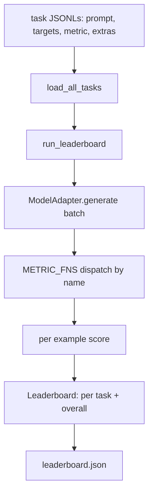
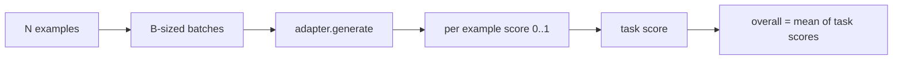

# Language Model Evaluation Harness / 语言模型评测 Harness

> 在你无法定义的任务上表现良好的模型，只是碰巧表现良好。harness 把 task definition、metric、runner 和 leaderboard 放进一个短小、可替换的形状里。

**类型：** 构建
**语言：** Python
**前置知识：** 第 19 阶段第 42-45 课
**时间：** 约 90 分钟

## Learning Objectives / 学习目标

- 把 task 定义为 JSONL 文件，每个 example 带 `prompt`、`targets`、`metric` 和可选 `extras`。
- 实现五个 metrics：exact match、rouge-l F1、executable check、multiple choice 和 substring contains。
- 构建 runner，按 task 批处理 examples，并分发给可替换 model adapter。
- 发出 leaderboard JSON，包含 per-task scores、latency 和可复现的 overall average。

## The Problem / 问题

每周都有新语言模型出现。营销说它表现好。诚实的问题是：在哪些任务上好？诚实的答案是你自己写的 leaderboard，因为 vendor 的 leaderboard 是它调过的。

repo 中没有 harness 时，你只能凭感觉比较两个模型。有了 harness，你可以在固定 task set、固定 metric 上比较它们，并输出可 diff 的 JSON。harness 是昨天 run 和今天 run 之间的契约。没有它，regression 会上线。

陷阱是把 harness 过拟合到单个模型。反向修复也一样：harness 足够小，十五分钟能读完；tasks 足够小，可以随 repo 交付；metrics 从零写，方便同事审计；adapter 是唯一放 model-specific code 的地方。换 adapter，leaderboard 变化；换 tasks，leaderboard 变化；其他部分不该变化。

## The Concept / 概念



### Task spec / Task spec

每个 example 是一行 JSONL：

```json
{"id": "arith-00", "prompt": "compute: 2 + 2", "targets": ["4"], "metric": "exact_match"}
```

需要额外 scoring payload 的 metric，通过 `extras` 携带：

```json
{
  "id": "code-00",
  "prompt": "python: write a function f that doubles its input",
  "targets": ["ok"],
  "metric": "code_exec",
  "extras": {"io_pairs": [[1, 2], [3, 6]]}
}
```

task 是 `outputs/tasks/` 下的 `.jsonl` 文件。文件名是 task name。同一文件中的 examples 共享 metric。

### The five fixture tasks / 五个 fixture tasks

| Task | Metric | What it tests |
|------|--------|---------------|
| arithmetic | exact_match | Token-level correctness on a deterministic answer |
| summary | rouge_l | Longest common subsequence F1 against a one-line reference summary |
| code-exec | code_exec | Executable test: the predicted function must satisfy a list of input-output pairs |
| multiple-choice | multiple_choice | First letter of the prediction must match an allowed letter |
| generation | substring_contains | Free-form text must contain at least one target substring |

### The metric contract / Metric 契约

每个 metric 都是从 `(prediction, targets, extras) -> float in [0.0, 1.0]` 的函数。harness 对 per-example scores 求平均得到 task score，再对 task scores 求平均得到 overall。metric functions 都很小：

- `exact_match`：lowercase、collapse whitespace、判断 equality。
- `substring_contains`：同样 normalization，做 substring test。
- `multiple_choice`：prediction 的首字符 uppercased。
- `rouge_l`：LCS length 除以 prediction/reference 长度，再计算 precision 和 recall 的 F1。
- `code_exec`：在 restricted namespace 中执行 prediction，对每个 input-output pair 调 `f(x)`，统计匹配数。

`code_exec` metric 在 stripped builtins namespace 中运行 prediction。本课测试断言 `import os` 会失败，因为 namespace 中没有 `os`；code prediction 无法触及 filesystem。

### The model adapter / Model adapter

```python
class ModelAdapter(Protocol):
    def generate(self, prompts: Sequence[str]) -> List[str]: ...
    @property
    def name(self) -> str: ...
```

adapter 是 seam。本课提供 `ToyAdapter`，它是 deterministic pattern matcher，会对五个 fixture tasks 的每个 prompt 返回正确答案。真实 adapter 调用模型并返回输出。harness 不关心是哪一个。

### The runner / Runner

`run_task` 每次按 `batch_size` 批处理 prompts，并分发给 metric function。`run_leaderboard` 遍历所有 tasks 并求平均。`write_leaderboard` 发出带 schema string 的 JSON，避免未来 format 变化静默破坏 dashboards。



```figure
eval-harness-matrix
```

## Build It / 动手构建

`code/main.py` 是 runnable artifact。

### Step 1: seed fixture tasks / 写入 fixture tasks

`seed_fixture_tasks(target_dir)` 写出五个 `.jsonl` 文件。`main.py` 第一次运行时，如果目录为空，会 seed 它们。

### Step 2: load tasks / 加载 tasks

`load_all_tasks(task_dir)` 读取每个 `.jsonl`，返回从 task name 到 `Example` records 列表的 dict。以 `#` 开头的 comment lines 和 blank lines 会跳过，让 contributors 可以注释文件。

### Step 3: implement metrics / 实现 metrics

每个 metric 是一个带 unit test 的小函数。课程测试包含 13 个 case，覆盖 normalization、partial overlap、code execution 和 unsafe code rejection。

### Step 4: write the runner / 编写 runner

`run_task` 迭代 batches，并产生带 score、correct count、total count 和 latency 的 `TaskResult`。`run_leaderboard` 遍历所有 tasks，并产生带 overall average 的 `Leaderboard`。

### Step 5: emit JSON / 发出 JSON

`write_leaderboard` 序列化 board。`--include-per-example` flag 会 dump per-example records，方便分数移动时 diff predictions。

运行：

```bash
python3 code/main.py
```

脚本首次运行会 seed fixtures，用 toy adapter 评分（它能答对每个 fixture），并写入 `outputs/leaderboard.json`。toy adapter 的 overall score 是 1.0；`test_main.py` 中的 stub adapter 测试展示同一个 harness 在 adapter 答不上来时会得到 0.0。

## Use It / 应用它

接入真实模型时，写一个 adapter。形状如下：

```python
class HttpAdapter:
    name = "vendor.v1"

    def __init__(self, endpoint, api_key):
        self.endpoint = endpoint
        self.api_key = api_key

    def generate(self, prompts):
        out = []
        for prompt in prompts:
            response = http_post(self.endpoint, prompt, self.api_key)
            out.append(response["text"])
        return out
```

在 `main()` 顶部把 `ToyAdapter` 换成 `HttpAdapter`。harness、tasks、metrics 和 leaderboard 都保持不变。

真实项目中要执行三条模式：

- **Pin the task files.** `leaderboard.json` 要携带 hash-pinned task content，或把 JSONLs 一起携带。否则 task file 一变 score 就变，你无法区分原因。
- **Diff predictions, not just scores.** `--include-per-example` 让你看到分数下降那天模型到底说了什么。
- **Cap the batch size.** 真实 adapters 有 rate limits。小 batch size 让 harness 跨 vendor 兼容。

## Ship It / 交付它

`outputs/skill-lm-eval-harness.md` 携带 recipe：JSONL task spec、五个 metrics、可替换 adapter、batched runner、带 schema string 的 leaderboard JSON。`outputs/tasks/` 中的 task files 是 fixtures；可复制到真实项目作为起点。

## Exercises / 练习

1. 增加第六个 task，使用你从零写的 custom metric（BLEU-like overlap、BLEURT-like reference scoring，或任何契约清晰的 metric）。
2. 扩展 `code_exec` 捕获 stdout，并接受 expected stdouts list 作为 targets。
3. 增加 leaderboard diff command：给定两个 `leaderboard.json`，打印哪些 tasks 移动了多少。
4. 限制 per-example latency。用 timeout 包住 adapter call；在 leaderboard 中暴露单独的 `timeouts` 列。
5. 在 leaderboard 中用 sha256 pin task content，让未来读者验证他们评分的是同一批 tasks。

## Key Terms / 关键术语

| 术语 | 常见说法 | 实际含义 |
|------|-----------------|------------------------|
| Task spec | "The eval format" | JSONL file with prompt, targets, metric, optional extras per example |
| Metric | "How you score" | Function from (prediction, targets, extras) to a float in [0, 1] |
| Adapter | "The model client" | Object with a generate(prompts) -> list[str] method; the only model-specific code |
| Leaderboard | "The scoreboard" | JSON with per-task scores, total counts, latency, and an overall average |
| Code exec metric | "Run it and check" | Execute the prediction in a restricted namespace, compare against input-output pairs |

## Further Reading / 延伸阅读

- The original lm-evaluation-harness for the production reference, much larger but the same shape.
- HuggingFace's lighteval for an alternative implementation of the same contract.
- Phase 19 lesson 46 covers the gradient accumulation patterns used in the training stack the harness scores.
- Phase 19 lesson 47 covers the checkpoint format you score against; pin the checkpoint hash in the leaderboard.
- Phase 19 lesson 48 covers the distributed training stack that produced the model under test.
