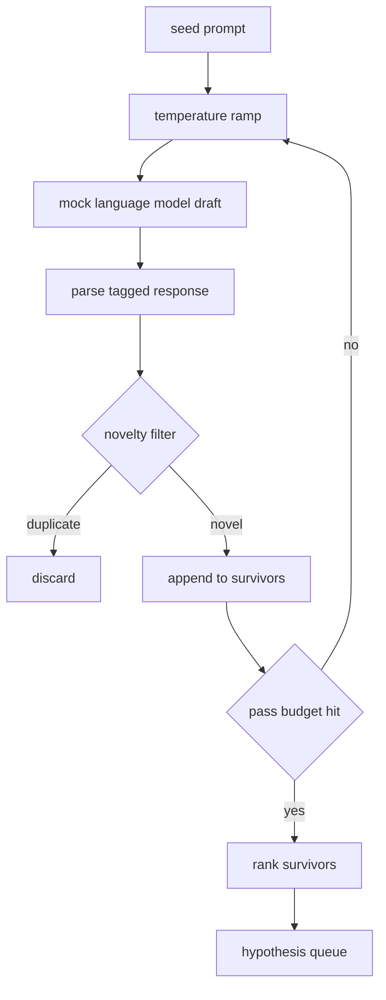

# Hypothesis Generator / 假设生成器

> 如果一个 research agent 连续两次提出同一个问题，它就在浪费 token。关键是让每一版草稿都落在新的方向上。

**类型：** 构建
**语言：** Python
**前置知识：** 第 19 阶段 Track A 第 20-29 课
**时间：** 约 90 分钟

## Learning Objectives / 学习目标

- 从 seed prompt 驱动 sampler，并把输出转换成类型化的 hypothesis 记录。
- 每一轮提高 sampler temperature，让下一版草稿比上一版走得更远。
- 用一个小 embedding 模型和 cosine distance 阈值过滤近重复假设。
- 用混合 novelty、specificity、testability 的 scoring function 对候选排序。
- 保持每一步 deterministic，让同一个 seed 总是产生同一条 queue。

## The Problem / 问题

只调用一次模型的 planner 只能得到一个 hypothesis。这对演示案例够用，但对 research loop 来说形状不对。循环需要的是一条有深度的 ranked queue：第一个 hypothesis 失败时，runner 可以直接拿下一个继续跑，而不用再付出一次完整 sampling pass 的成本。

这条 queue 来自两个机制的组合。第一是 temperature ramping：sampler 每经过一轮就把 temperature 往上推一点，让后面的 draft 更愿意探索。第二是 novelty filtering：每拿到一个 draft，generator 都会计算它到所有已接受 survivor 的 embedding distance，并拒绝落在已有 cluster 内的候选。

本课提供一个 mock language model，它会对固定 prompt 返回脚本化 token 序列。这个 mock 足以覆盖完整路径：输入 seed prompt，应用 temperature ramp，解析 candidates，执行 novelty filter，最后输出 ranked queue。

## The Concept / 概念

`Hypothesis` 是后续课程共享的接口，而不是一段自由文本。

```text
Hypothesis
  id             : int           (monotonic within a run)
  text           : str           (the claim)
  variables      : list[str]     (what changes between conditions)
  metric         : str           (what the runner will measure)
  baseline_ref   : str | None    (which paper or run the comparison cites)
  draft_pass     : int           (which sampler pass produced this)
  temperature    : float         (the sampler setting at draft time)
  novelty_score  : float         (distance from prior survivors, 0..1)
  rank_score     : float         (weighted sum used for ordering)
```

`variables` 和 `metric` 不是随意写的 prose。parser 会从带 tag 的 response 中提取它们。第五十二课的 runner 会直接读取这些字段来构造 experiment config。

`baseline_ref` 是可选字段，但强烈建议提供。第五十三课的 evaluator 需要 baseline 才能比较。如果 hypothesis 没有给出 baseline，evaluator 会回退到同一 metric 上的上一轮 run。

整体结构如下：



这个 loop 很直接，真正重要的是每个 box 都有硬 contract。

## Build It / 动手构建

先实现 temperature schedule。默认从 `0.2` 到 `1.2` 做六轮；低于 `0.2` 时模型容易复述 seed，高于 `1.2` 时 response 往往偏题并导致 parser 失败。`GeneratorConfig.schedule()` 应该返回 `n_passes` 个均匀间隔的值，步长为 `(t_max - t_min) / (n_passes - 1)`。mock model 通过 `(prompt, temp_bucket)` 切换脚本化 response；生产系统里则把 `temperature=t` 透传给真实模型。

然后实现 novelty filter。每个 draft 解析后，把 `text` 编成一个 hashed bag of word tokens，并归一化到 unit length。两个 unit vector 的 cosine distance 是 `1 - dot(a, b)`。如果 draft 到任一 prior survivor 的最小距离大于 `novelty_threshold`，就接受它；默认阈值是 `0.25`。

这个 hashed embedding 并不高级，但它 deterministic、零依赖，并且足以抓住明显重复的情况：两个 draft 共享大部分名词。生产部署可以替换为小型 sentence model，接口不需要变。

最后实现 rank score。

```text
rank_score = w_novelty * novelty_score
           + w_specificity * specificity_score
           + w_testability * testability_score
```

这里有三个子分数。`novelty_score` 是到 prior survivors 的最小 embedding distance。`specificity_score` 是 hypothesis 中具体 variables 的数量除以目标数量。`testability_score` 在同时指定 metric 和 baseline 时为一，只指定 metric 时为半，否则为零。

默认权重是 `0.4`、`0.3`、`0.3`。这些权重放在 generator config 里，这样下游课程可以调整它们，而不需要 fork 代码。

mock sampler 的接口很小：

```python
class MockLLM:
    def sample(self, prompt: str, temperature: float, seed: int) -> str:
        ...
```

sampler 对 `(prompt, temperature, seed)` triple 是 deterministic 的。mock 维护一张由 `(prompt_signature, temperature_bucket)` 索引的 scripted response table。找不到 key 时，sampler 返回一个会让 parser 失败的 fallback；测试里会覆盖这条路径。

`seed` 会混入 response，因此同一个 `(prompt, temperature)` 配不同 seed 会生成不同 draft。测试固定 seed 来保证 reproducible；真实部署中 seed 可以来自 system clock 或 counter。

## Use It / 应用它

输出是一组按 `rank_score` 降序排列的 `Hypothesis` records。第五十二课的 runner 会弹出队首、运行 experiment；第五十三课的 evaluator 会把 verdict 写回。如果 verdict 表明 hypothesis 错了，runner 就继续弹出下一条。

`code/main.py` 定义 `Hypothesis`、`MockLLM`、`HypothesisGenerator` 和 deterministic demo。generator 暴露单个 `run(seed_prompt)` 方法并返回排序后的 queue；pass count 来自 `GeneratorConfig.n_passes`，不是方法参数。embedding 是 hashed bag of tokens；novelty filter 和 rank score 都是单独函数。代码不依赖 `numpy`，embedding math 全部使用 stdlib，因此本课保持 portable。

`code/tests/test_generator.py` 覆盖 linear path、duplicate rejection path、parser failure path、temperature ramp boundaries 和 rank ordering。

## Ship It / 交付它

本课交付的是 research loop 的第一段：有限 hypothesis queue。queue 为空时，orchestrator 可以放宽 seed prompt 后重新运行 generator，也可以停止并报告 budget exhausted。

在完整链路中，第五十课产出 queue。第五十一课拿 queue head 做 literature search，确认它是否已被证明或反驳。第五十二课对同一个 head 运行实际 experiment。第五十三课读取两类输出并写入 verdict。这四课组合成一个没有人工介入的 research loop；人可以在任意边界接管。

## Exercises / 练习

1. 把 `novelty_threshold` 从 `0.25` 调到 `0.15` 和 `0.4`，观察 queue 的重复率和有效长度如何变化。
2. 为 `specificity_score` 增加一条规则：没有明确 `variables` 的 hypothesis 直接降权。比较 rank ordering 是否更符合实验可执行性。
3. 替换 mock embedding 为小型 sentence embedding model，但保持 novelty filter 接口不变。
4. 让 fallback parser failure 进入 trace，记录失败的 `draft_pass`、`temperature` 和 response 摘要。

## Key Terms / 关键术语

| 术语 | 常见说法 | 实际含义 |
|------|-----------------|------------------------|
| Hypothesis queue | “Ranked ideas” | 按 `rank_score` 排序、供 runner 逐个消费的类型化研究假设列表 |
| Temperature ramp | “Explore more each pass” | 每轮提高 sampler temperature，让候选逐步远离 seed 和前序 draft |
| Novelty filter | “Deduplicate ideas” | 用 embedding distance 拒绝与已接受假设过近的 draft |
| Rank score | “Priority” | novelty、specificity、testability 的加权和 |
| Deterministic mock | “Fake LLM” | 固定 `(prompt, temperature, seed)` 时输出稳定的 sampler，用来测试完整 pipeline |

## Further Reading / 延伸阅读

- Okapi BM25、UCB、paired tests 等后续课程会消费本课的 `Hypothesis` queue。
- 生产系统中可以把 `MockLLM` 换成真实 LLM sampler，但应保留 parser、novelty filter 和 rank score 的 contract。
