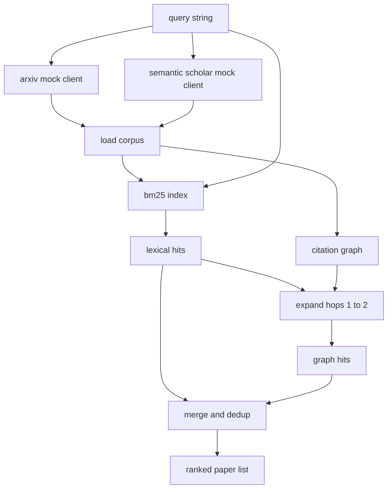

# Literature Retrieval / 文献检索

> Hypothesis 很便宜。昂贵的是知道别人是否已经证明过它。先构建 retrieval layer，在 runner 启动 sandbox 前回答这个问题。

**类型：** 构建
**语言：** Python
**前置知识：** 第 19 阶段 Track A 第 20-29 课
**时间：** 约 90 分钟

## Learning Objectives / 学习目标

- 用下游 loop 会读取的字段建模一个小型 paper record。
- 只用 stdlib data structures 在 abstracts 上构建 BM25 index。
- 遍历 citation graph，找出 lexical search 漏掉的 papers。
- 用稳定 paper id 对 lexical pass 和 graph pass 的命中结果去重。
- 把两个 mock external APIs 包在同一个 client 后面，让真实 endpoint 接入后上游 call site 不变。

## The Problem / 问题

在 abstract 上做 keyword search 可以返回与 query 共享词汇的 papers，这覆盖了大多数表面情况。但它会漏掉两类结果。第一类是 foundational paper 使用了不同词汇，例如查询 `"sparse attention"` 可能漏掉题为 `"block selection in transformer routing"` 的论文。第二类是相关论文是某个已知 anchor 的后续工作；与其暴力扫 abstract pool，不如先找到 anchor 再沿 citation graph 往前或往后走。

本课同时构建这两条 pass。BM25 over abstracts 捕获 lexical hits。citation graph traversal 从 seed set 出发，向前和向后扩展一到两跳。二者的 union 按 paper id 去重，再用一个小的 combined score 排序。

## The Concept / 概念

下游读取的是类型化的 `Paper`，不是原始 API response。

```text
Paper
  id          : str           (stable identifier, "p001" for the mock corpus)
  title       : str
  abstract    : str
  year        : int
  authors     : list[str]
  references  : list[str]     (paper ids this paper cites)
  citations   : list[str]     (paper ids that cite this paper)
  source      : str           (which mock api supplied it, "arxiv" or "s2")
```

`references` 和 `citations` 共同形成 directed citation graph。两个 mock APIs 返回的字段有重叠但并不完全相同，所以 corpus loader 会按 `id` 合并。

整体架构如下：



retrieval client 拥有两条 pass 和 merge。caller 传入 query，拿到 ranked list；每个 entry 都携带解释排序的 per paper score fields：`bm25_score`、`graph_distance`、`recency_score`、`final_score`。

## Build It / 动手构建

先从 BM25 开始。实现标准 Okapi BM25，默认参数为 `k1=1.5`、`b=0.75`。index 是两个字典：`term -> doc_frequency` 和 `term -> list of (doc_id, term_count)`。document length 是 abstract 的 token count。average document length 在 index build time 计算一次。query scoring 是对 query terms 求和：`idf * tf_norm`，其中 `tf_norm` 是标准 BM25 的 length-normalised term frequency。

tokeniser 先 `lower`，再按 non alphanumeric 分割，不做 stemming。生产系统可以替换一个小 stemmer，接口保持不变。

```text
idf(t)      = log((N - df + 0.5) / (df + 0.5) + 1.0)
tf_norm(t)  = (f * (k1 + 1)) / (f + k1 * (1 - b + b * dl / avgdl))
score(d, q) = sum over t in q of idf(t) * tf_norm(t)
```

然后构建 citation graph。graph 从 corpus 一次性建成。forward edges 从 paper 指向它的 references，backward edges 从 paper 指向它的 citations。traversal 是 breadth first search，以 top BM25 hits 为 seed，最多两跳。

两跳是有意设置的上限。一跳太浅，agent 往往需要 immediate ancestor 或 descendant。三跳会在连通图上扩大过快，并开始偏离主题。本课把 hop limit 暴露为 config knob，让下游 loop 可以收紧它。

最后做 dedup 和 ranking。两条 pass 会返回重叠集合，merge 以 paper id 为 key。每篇 paper 的 final score 是加权混合：

```text
final_score = w_bm25 * bm25_score_norm
            + w_graph * graph_score
            + w_recency * recency_score
```

`bm25_score_norm` 是 BM25 score 除以 merged set 中的最大 BM25 score，因此落在 zero to one。`graph_score` 对 direct lexical hits 为一，一跳为 `0.6`，两跳为 `0.3`，其他为零。`recency_score` 从 corpus minimum year 的零线性上升到 maximum year 的一。

默认权重是 `0.5`、`0.3`、`0.2`。这些权重放在 config 中：过时慢的 topic 可以降低 recency，快速变化的 topic 可以提高 recency。

## Use It / 应用它

mock corpus 由 `build_corpus()` 生成，共一百篇 papers。每篇都有手写 title 和 abstract，主题覆盖 attention sparsity、retrieval augmentation、low rank adapters、dataset distillation、evaluation harnesses。references 和 citations 被连起来，让每个 topic 形成连通 sub graph，并带少量 cross topic edges。

两个 mock API clients（`ArxivMockClient`、`SemanticScholarMockClient`）读取同一 corpus，但暴露字段不同。Arxiv 返回 title、abstract、year、authors。Semantic Scholar 额外返回 references 和 citations。retrieval client 按 id 取 union；跨 client 字段冲突的处理留给后续课程。

第五十二课的 runner 会读取 `paper.id`、`paper.title` 和 abstract 的前三句，作为 experiment context。第五十三课的 evaluator 会读取 `paper.year` 和 `paper.references`，把 baseline 归因到具体 paper。

retrieval client 返回 `RetrievalResult`，其中包含 ranked list 和 per query metrics：hit count、average score、top score、total wall time。runner 会记录这些指标，后续 observability pass 可以画出 quality over time。

`code/main.py` 定义 `Paper`、`ArxivMockClient`、`SemanticScholarMockClient`、`BM25Index`、`CitationGraph`、`RetrievalClient` 和 deterministic demo。mock clients 和 corpus 放在同一文件中，确保课程 portable。BM25 是一个 class，大约六十行；graph traversal 是一个 method。

`code/tests/test_retrieval.py` 覆盖 lexical path、graph path、merge、dedup 和 empty query。

## Ship It / 交付它

第五十课产出 hypothesis。第五十一课搜索文献，判断该 hypothesis 是否已经被 settled。若没有，第五十二课才运行 experiment。第五十三课读取 retrieval result 和 experiment metrics 写出 verdict。retrieval client 是四个阶段中最便宜的一段，因此 orchestrator 会先运行它。

## Exercises / 练习

1. 将 graph hop limit 从二跳改成一跳和三跳，比较 hit count、topic drift 和 runtime。
2. 调整 `w_bm25`、`w_graph`、`w_recency`，为一个 stale topic 和一个 fast-moving topic 分别找更合理的排序。
3. 给 tokeniser 增加 stemming，但保持 `BM25Index` 的 public interface 不变。
4. 为 cross topic edges 写一个诊断：当 graph pass 引入过多跨主题 paper 时，在 trace 中标出。

## Key Terms / 关键术语

| 术语 | 常见说法 | 实际含义 |
|------|-----------------|------------------------|
| BM25 | “Keyword search” | 基于 term frequency、document frequency 和 document length 的 lexical ranking |
| Citation graph | “Paper links” | 由 `references` 和 `citations` 构成的 directed graph |
| Graph hop | “One paper away” | 从 seed paper 沿 citation edge 走出的距离 |
| Dedup | “Merge hits” | 用稳定 `paper.id` 合并 lexical 和 graph pass 的重叠结果 |
| Recency score | “Prefer newer work” | 将 paper year 归一化到 zero to one 后参与 final ranking |

## Further Reading / 延伸阅读

- Okapi BM25 是信息检索中的经典 lexical ranking baseline。
- Citation graph traversal 可以与 dense retrieval 组合，但本课先保持零依赖实现。
