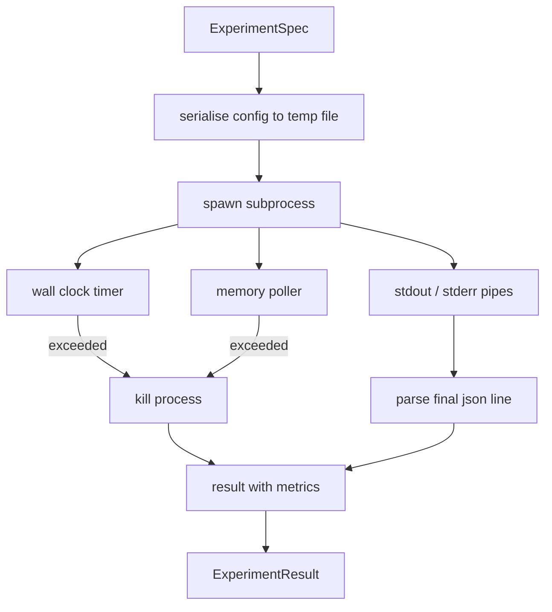

# Experiment Runner / 实验运行器

> 这个 loop 的诚实程度取决于它的测量。构建一个 runner：接收 spec，在 sandboxed subprocess 中执行，并输出 evaluator 可以信任的 json metrics blob。

**类型：** 构建
**语言：** Python
**前置知识：** 第 19 阶段 Track A 第 20-29 课
**时间：** 约 90 分钟

## Learning Objectives / 学习目标

- 把 experiment 编码成 typed spec，让 runner 可以序列化后传给 subprocess。
- 启动带 hard wall clock timeout 和 soft memory cap 的 subprocess，并把二者作为 terminal conditions 暴露出来。
- 将 stdout、stderr 和 structured metrics blob 捕获到同一个 result record 中。
- 构建 ablation table，在固定 base spec 上一次只 sweep 一个 configuration knob。
- 给定 seed 时保持每个 result deterministic，让 evaluator 跨 runs 看到同样的数字。

## The Problem / 问题

research loop 会运行不可信代码。hypothesis 来自 sampler，experiment script 也来自相同路径；如果把它们当成安全的 in-process 代码运行，就是在邀请一次会拖垮 orchestrator 的 crash。subprocess 是语言自带的最简单隔离：独立 process、独立 address space，并且 parent side 有 signal handle。

这里的 runner 并不实现完整 sandboxing。没有 cgroup、没有 seccomp filter、没有 namespace remapping。它提供的是 wall clock timeout、监控 memory growth 的 polling loop，以及在任一 limit 命中时 kill process 的路径。这就是更复杂 sandbox 都会扩展的 runtime contract。本课把 contract 控制在一眼能读完的范围内。

## The Concept / 概念

实验由 `ExperimentSpec` 描述。

```text
ExperimentSpec
  spec_id        : str            (stable id, "exp_001")
  hypothesis_id  : int            (link back to the queue from lesson 50)
  script_path    : str            (path to the python script to run)
  config         : dict           (passed to the script as one json arg)
  seed           : int            (deterministic seed for the experiment)
  wall_timeout_s : float          (hard timeout, killed on exceed)
  memory_cap_mb  : int            (soft cap, polled; killed on exceed)
  metric_keys    : list[str]      (which fields the evaluator will read)
```

script 位于磁盘上；runner 会把 config 写到一个 temp file path，再由 script 读取。script 期望在 stdout 打印一行 json，其中 keys 是 `metric_keys` 的 superset。stdout 上的其他内容会被捕获，但 metrics parser 会忽略它们。

架构如下：



runner 是一个 class 加一个 main method。poller 是一个小 thread，每隔一个 poll interval 醒来一次，在可用时从 proc filesystem 读取 subprocess 的 `psutil` 等价信息；平台不暴露时退化为 no op。

## Build It / 动手构建

先实现 soft memory cap。hard memory caps 需要 `resource.setrlimit`，而且只在 POSIX 上工作。本课采用 portable approach：从平台读取 resident set size，超过 cap 就 kill subprocess。它是 soft cap，因为 poller interval 非零；process 可能在两次 poll 之间短暂超过 cap 又降下来。runner 会记录 maximum observed RSS，让 evaluator 看到 run 距离 limit 有多近。

在不支持 process inspection 的系统上，poller 记录一次 warning 后禁用自己。wall clock timeout 仍然生效。测试会覆盖两条路径。

stdout 和 stderr 需要分别 drained on completion。stdout 逐行扫描；最后一行能解析为 json 且包含所有 required `metric_keys` 的内容，会被视为 metrics blob。更早出现的 json lines 会保存在 result 的 `intermediate_metrics` 中，evaluator 可以用它们绘制 learning curves。

stderr 原样捕获到 result。runner 不会因为 non zero exit code 抛异常，而是把 code 写入 result。任何 non zero exit 都标为 `"crash"`，即使 script 打印过 metrics，evaluator 默认也把 partial run 当作 failure。

ablation helper 的形状如下：

```python
def ablate(base: ExperimentSpec, knob: str, values: list[Any]) -> list[ExperimentSpec]:
    ...
```

给定 base spec 和 knob name，helper 为每个 value 返回一个 spec，并覆盖 `config[knob]`。每个 spec 获得派生的 `spec_id`（`f"{base.spec_id}_{knob}_{value}"`）。runner 提供 `AblationRunner`，按顺序运行这些 specs，并返回按 knob value 索引的 `AblationTable`。

为什么一次只 sweep 一个 knob？full factorial sweep 会指数爆炸，且产生 evaluator 难以解释的结果。一 knob at a time 给出干净轴线，便于绘图。本课只把 multi knob sweep 作为 caller 组合多个 single knob ablations 的结果。

determinism 来自每个 spec 携带的 seed。runner 通过 config dict 转发 seed（`config["__seed"] = spec.seed`）。`code/experiments/` 中的 mock experiment scripts 会尊重 seed，并在多次运行间输出相同 metrics。第五十三课的 evaluator 依赖这个性质；没有 determinism，所谓 “regression” 可能只是不同 random initialisation。

## Use It / 应用它

本课附带一个 experiment script：`code/experiments/sparsity_experiment.py`。它是一个真实 script，会读取 config file，模拟一个小型 training run，经过 numpy random pass 后打印 json metrics blob。它支持 `sleep_s` knob 用来测试 timeout，也支持 `allocate_mb` knob 用来测试 memory poller。

simulation 并不训练真实模型。它是一个数值计算，模仿 training loop 的形状：loss curve、final perplexity、wall time。本课重点是 runner，而不是 simulation。真实 experiment script 会 import 一个 model。

result 的形状如下：

```text
ExperimentResult
  spec_id              : str
  hypothesis_id        : int
  exit_code            : int
  terminal             : "ok" | "timeout" | "oom" | "crash"
  wall_time_s          : float
  peak_rss_mb          : float | None
  metrics              : dict
  intermediate_metrics : list[dict]
  stdout_tail          : str
  stderr_tail          : str
```

evaluator 会优先读取 `metrics` 和 `terminal`。只要 terminal 不是 `"ok"`，experiment 就算 failed run，evaluator 的 verdict 会自动生成。否则 metrics 会进入 significance test。

`code/main.py` 定义 `ExperimentSpec`、`ExperimentResult`、`ExperimentRunner`、`AblationRunner` 和 deterministic demo。subprocess management 是一个 class，memory poller 是一个小 thread，ablation helper 是一个函数。

`code/experiments/sparsity_experiment.py` 是测试使用的 mock experiment。它从 argv 读取 config file path，并在完成时写出一行 json metrics。

`code/tests/test_runner.py` 覆盖 success path、timeout path、crash path、ablation table，以及两次 run 的 determinism check。

## Ship It / 交付它

第五十课生成 hypothesis。第五十一课过滤掉文献已经 settled 的内容。第五十二课对剩余 hypothesis 运行 experiment。第五十三课读取 result、运行 significance test，并写出 orchestrator 挂到 hypothesis id 上的 verdict。

## Exercises / 练习

1. 给 `sparsity_experiment.py` 增加一个会输出多行 intermediate metrics 的模式，并确认 runner 只把最后一行完整 metrics 作为 final。
2. 在不支持 process inspection 的环境中运行测试，确认 memory poller 的 warning 是一次性的，且 wall timeout 仍然生效。
3. 为 `AblationRunner` 增加失败隔离：某个 value crash 时，其他 value 仍继续运行。
4. 把 `wall_timeout_s` 和 `memory_cap_mb` 写入 result rationale，方便 evaluator 报告失败原因。

## Key Terms / 关键术语

| 术语 | 常见说法 | 实际含义 |
|------|-----------------|------------------------|
| ExperimentSpec | “Run config” | 描述 script、config、seed、timeout、memory cap 和 metric keys 的 typed input |
| Soft memory cap | “Memory limit” | 通过 polling RSS 发现超限并 kill process 的 portable 约束 |
| Terminal condition | “How the run ended” | `"ok"`、`"timeout"`、`"oom"` 或 `"crash"` |
| Ablation | “Sweep a knob” | 在同一 base spec 上一次只改变一个 config knob 的实验组 |
| Intermediate metrics | “Learning curve” | stdout 中更早出现的 json metrics lines，供 evaluator 诊断趋势 |

## Further Reading / 延伸阅读

- 更强 sandbox 可以在本课 subprocess contract 外层加入 cgroup、seccomp 或 namespace isolation。
- 第五十三课会消费 `ExperimentResult` 并做 direction-aware paired evaluation。
