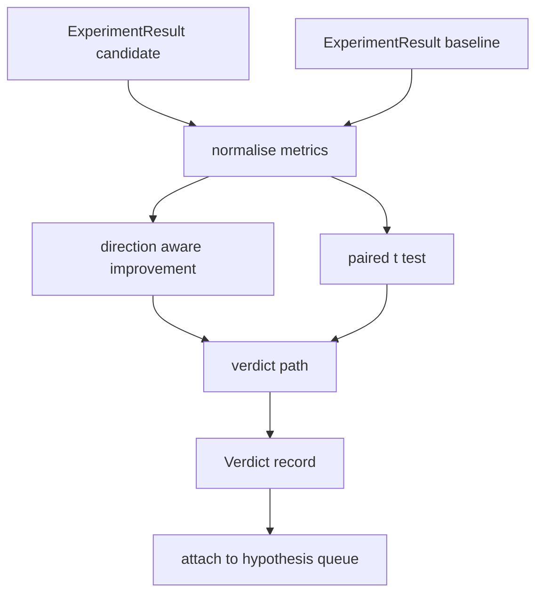

# Result Evaluator / 结果评估器

> runner 产出了数字。evaluator 决定这些数字代表 improvement、regression，还是 noise。构建一条把 metrics 变成一句 verdict 的路径。

**类型：** 构建
**语言：** Python
**前置知识：** 第 19 阶段 Track A 第 20-29 课
**时间：** 约 90 分钟

## Learning Objectives / 学习目标

- 用 direction aware improvement 和固定 threshold 比较 candidate run 与 baseline。
- 从零实现 per seed metrics 上的 paired t test，并读取 resulting p value。
- 归一化 log scaled metrics，让下游 report 能把它们与 linear metrics 混合。
- 产出 per hypothesis verdict，供 orchestrator 挂到第五十课的 queue 上。
- 保持每一步 pure，让相同输入总是产生同一 verdict。

## The Problem / 问题

runner 给出的单个数字不能说明改动是否真实。同一配置换一个 seed 会得到不同 perplexity，变化可能只是 noise。正确的比较方式是 paired：同样的 seeds、同样的数据，candidate 跑一次，baseline 跑一次。每个 seed 贡献一个差值。差值均值是 effect，差值标准误是 noise floor。

本课从零实现这个 test，不使用 `scipy.stats`。数学规模小到一屏可以读完。

```text
diffs    = [a_i - b_i for i in seeds]
mean     = sum(diffs) / n
variance = sum((d - mean) ** 2 for d in diffs) / (n - 1)
t_stat   = mean / sqrt(variance / n)
df       = n - 1
p_value  = two_sided_p(t_stat, df)
```

two sided p value 使用 regularised incomplete beta function。本课提供一个小实现，内部使用 Lentz continued fraction。整段实现大约六十行 stdlib math。

## The Concept / 概念

有些 metrics 越高越好，例如 accuracy、throughput；另一些越低越好，例如 loss、perplexity、wall time。evaluator 在每个 metric 上携带 `direction` 字段。

```text
if direction == "higher_is_better":
    improvement = (candidate - baseline) / abs(baseline)
elif direction == "lower_is_better":
    improvement = (baseline - candidate) / abs(baseline)
```

improvement 是有符号的。在 higher-is-better metric 上，负 improvement 表示 candidate 更差。verdict path 会同时读取 sign 和 magnitude。

flat threshold（`improvement_threshold=0.02`，也就是 2%）用于判断变化是否大到值得报告。低于阈值时，无论 p value 如何，verdict 都是 `"noise"`；loop 不关心用户无法测量的变化。

架构如下：



evaluator 执行三个独立计算，并在 verdict path 中汇总。每个计算都是 pure function，没有共享状态。

## Build It / 动手构建

先实现 log normalisation。perplexity 是 loss 的指数形式。loss 下降 `0.1` 对 perplexity 的影响非常大。直接比较两种配置的 perplexity 没问题，但如果要把它和 linear metrics 混到同一个 report，就需要 normalization。

当 metric 的 `scale` 字段为 `"log"` 时，本课先取 natural log，再计算 improvement。threshold 也在 log space 中应用。perplexity 从 32 降到 28 时，在 lower-is-better metric 上有 `log(28) - log(32) = -0.133`，远高于 2% threshold。

```text
if scale == "log":
    a = log(candidate)
    b = log(baseline)
else:
    a = candidate
    b = baseline
```

`scale="linear"`（默认）的 metrics 跳过 transform。同一条 code path 处理两种情况。

paired test 需要 per seed 输入。第五十二课 runner 每次 run 只输出一个 final metrics blob。为了 paired test，evaluator 需要 candidate 的每个 seed 一个 blob，baseline 的每个 seed 一个 blob。orchestrator 会在同一组 seeds 上分别运行两种配置，然后把两个 `ExperimentResult` lists 交给 evaluator。

evaluator 通过 seed 配对它们，seed 位于 `result.metrics["seed"]`。如果两个 lists 的 seeds 不匹配，evaluator 抛出 `PairingError`，orchestrator 应该重跑。

`Verdict` 的 shape 如下：

```text
Verdict
  hypothesis_id          : int
  metric                 : str
  direction              : "higher_is_better" | "lower_is_better"
  scale                  : "linear" | "log"
  candidate_mean         : float
  baseline_mean          : float
  improvement            : float       (signed, fraction; see direction rules)
  p_value                : float | None  (None if n < 2)
  significance_threshold : float
  improvement_threshold  : float
  verdict                : "improved" | "regressed" | "noise" | "failed"
  rationale              : str
```

verdict path 是一个小 decision table：

```text
1. If any candidate result has terminal != "ok": verdict = "failed"
2. else if |improvement| < improvement_threshold:  verdict = "noise"
3. else if p_value is None or p_value > significance: verdict = "noise"
4. else if improvement > 0:                          verdict = "improved"
5. else:                                             verdict = "regressed"
```

`rationale` 是一句可读句子，orchestrator 可以把它按 hypothesis id 写入日志。

## Use It / 应用它

`code/main.py` 定义 `MetricSpec`、`Verdict`、`Evaluator`、t statistic 和 incomplete beta helpers，以及 deterministic demo。t test 用纯 stdlib math 实现；`numpy` 只用于读取 metrics list 并计算均值和方差。

`code/tests/test_evaluator.py` 覆盖 improved path、regressed path、noise path（small improvement）、noise path（low n）、failed terminal path、log normalised path、t test against a known reference value，以及 pairing error。

四课组合时，orchestrator 的形状如下：

```text
for hypothesis in queue:
    literature = retrieval.search(hypothesis.text)
    if literature_settles(hypothesis, literature):
        attach(hypothesis, verdict="settled")
        continue
    candidates = runner.run_all(specs_for(hypothesis))
    baselines  = runner.run_all(baseline_specs_for(hypothesis))
    metric_spec = MetricSpec("perplexity", direction=LOWER, scale=LOG)
    verdict = evaluator.evaluate(hypothesis.id, metric_spec, candidates, baselines)
    attach(hypothesis, verdict)
```

这个 orchestrator 不在本课实现；四个 lesson 通过各自定义的 dataclasses 组合起来，不需要额外 glue。

## Ship It / 交付它

第五十课产生 hypothesis queue。第五十一课过滤掉 literature 已经 settled 的 hypothesis。第五十二课在 candidate 和 baseline configurations 上跨 seeds 运行 experiment。第五十三课读取这些 runs 并写出 verdict。交付标准是：同一输入稳定产出同一 verdict，且 failure、noise、improvement、regression 都能被清晰解释。

## Exercises / 练习

1. 构造一个 higher-is-better metric 和一个 lower-is-better metric，确认同样的 candidate/baseline 数字不会被错误解读。
2. 把 `improvement_threshold` 从 `0.02` 调到 `0.005`，观察 verdict 中 `"noise"` 的比例如何变化。
3. 写一个 seed mismatch case，确认 `PairingError` 能阻止 evaluator 给出虚假结论。
4. 在 report 中同时展示 raw metric 和 log-normalised metric，解释二者各自适合的读法。

## Key Terms / 关键术语

| 术语 | 常见说法 | 实际含义 |
|------|-----------------|------------------------|
| Paired test | “Compare same seeds” | candidate 和 baseline 在同一 seed 集合上的差值检验 |
| Direction aware | “Higher or lower is better” | 根据 metric direction 计算有符号 improvement |
| Log normalisation | “Compare perplexity sanely” | 对 log-scale metric 先取 natural log 再进入 improvement 计算 |
| p value | “Significance” | 在 noise 假设下观察到至少同样极端差异的概率 |
| Verdict | “One line conclusion” | attach 到 hypothesis 上的 `"improved"`、`"regressed"`、`"noise"` 或 `"failed"` |

## Further Reading / 延伸阅读

- paired t test 是小样本实验中常见的 baseline comparison 方法。
- 第五十四课会把 verdict 和 experiment artifacts 进一步转成 paper skeleton。
