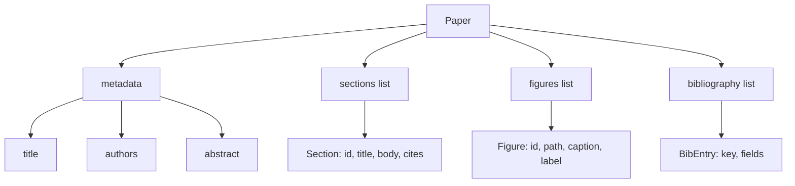
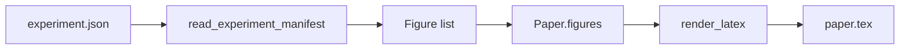
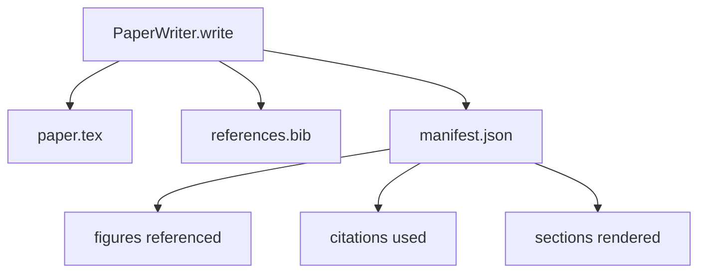

# Paper Writer / 论文写作器

> LaTeX skeleton 是 researcher 和 typesetter 之间的 contract。contract 破了，document 就不会 compile，而且失败会明确暴露。先构建 skeleton，再填内容。

**类型：** 构建
**语言：** Python
**前置知识：** 第 19 阶段第 50-53 课
**时间：** 约 90 分钟

## Learning Objectives / 学习目标

- 把 research paper 当成拥有已知 section graph 的 structured artifact，而不是 freeform document。
- 在写任何 prose 前，生成声明 abstract、sections、figure slots 和 bibliography keys 的 LaTeX skeleton。
- 通过 deterministic slot mechanism，把 experiment outputs（paths 和 captions）注入 skeleton。
- 接入 mocked prose generator，从 structured outline 填充每个 section，让 harness 不依赖真实 model 也能测试。
- 输出单个 `paper.tex`、`references.bib`，以及列出所有 referenced figures 和 used citations 的 manifest。

## The Problem / 问题

从 prose 开始的 draft 会迅速积累 structural debt。introduction 长出三段本该属于 related work 的内容。figure 在定义前被引用。bibliography 里同一篇 paper 出现三个 key。等 author 发现时，rewrite 成本已经高于 write 成本。

skeleton 反过来处理这个问题：结构先以 data 声明。sections 是有 name 和 order 的 slots。figures 是有 id 和 caption 的 slots。bibliography keys 在顶部声明，并指向具体 entries。prose 一次生成进一个 slot。harness 可以在写任何 prose 之前验证：每个 figure 都有 slot，每个 citation 都有 entry，每个 section 都出现在 table of contents 中。

这和前面课程对 plans、tool calls、traces 使用的是同一种纪律：structure 就是 contract。

## The Concept / 概念

`Paper` 的 shape 是纯数据。

每个字段都是普通 Python data。renderer 是从 `Paper` 到 LaTeX string 的 pure function。harness 可以在 rendering 前 introspect paper：统计 sections、列出 missing figure files、检查每个 `\cite{key}` 是否有匹配的 `BibEntry`。

renderer 保证三件事。第一，每个 figure slot 都输出一个 `\begin{figure}` block，并带稳定 label：`fig:<id>`。第二，每个 section 都输出一个 `\section{}`，并带稳定 label：`sec:<id>`，这样 cross-references 可用。第三，bibliography 输出 `\bibliography` block，且 `references.bib` 中只包含 paper 上声明的 entries，不多不少。

违反任何一条都是 render error，不是 warning。skeleton 是 contract；render 时静默丢 figure 就是 contract break。

## Build It / 动手构建

先实现从 experiments 注入 figures。前面的课程会把 experiment outputs 产成 JSON manifests；每个 manifest 都带 artifact paths 和短 captions。paper writer 读取 manifest 并生成 `Figure` records。

注入必须 deterministic。figure ids 由 experiment name 加单调 counter 派生。captions 来自 manifest。paths 相对 paper output directory 归一化，这样即使 experiment outputs 位于别处，LaTeX 也能 compile。

本课不会调用模型。`MockProseGenerator` 读取 outline shape 并 deterministic 地产出 prose。outline shape 是每个 section 一段短 string。generator 把它扩展成两个短 paragraph，并自然嵌入 section title。只有 outline 声明了 figures 和 citations 时，生成 prose 才会 name-drop 它们。

这足以测试 writer 的所有行为。真实实现会把 generator 替换成 model call，但周围 harness 不变。把 prose generator 声明为 callable 的价值就在这里：测试替换成 deterministic one，生产替换成 model one，其余 pipeline 完全相同。

writer 向 output directory 写三个文件：

manifest 是下游 evaluator 或 critic loop 读取的对象。它不解析 LaTeX，而是读 manifest。下一课 critic loop 会把这个 manifest 作为输入，并产出 feedback list。因此 manifest 是 contract 的一部分，LaTeX 本身不是。

writer 在写任何文件前运行四个 gates：

1. 每个 figure id 在 paper 内唯一。
2. 每个 section 的 `cites` 字段都引用 paper 上已声明的 bibliography key。
3. abstract 非空。
4. title 非空。

gate 失败会抛出带精确原因的 `PaperValidationError`。harness 会把这个原因作为 failure mode 暴露出来。没有 partial write：要么三个文件全部输出，要么一个都不写。

## Use It / 应用它

`code/main.py` 定义 `Paper`、`Section`、`Figure`、`BibEntry`、`PaperValidationError`、`MockProseGenerator`、`PaperWriter` 和 `render_latex` function。`write` method 接收 output directory，并输出 `paper.tex`、`references.bib` 和 `manifest.json`。`read_experiment_manifest` helper 会把 experiment manifests list 转为 `Figure` records。

`code/tests/test_paper_writer.py` 覆盖：没有 sections 时的 skeleton render、两 sections 两 figures 的 full render、missing-citation gate、duplicate-figure-id gate、manifest content，以及 LaTeX-string contract（每个 section 输出 `\section{}`，每个 figure 输出 `\begin{figure}`）。

## Ship It / 交付它

交付物是一个结构优先的 paper writer：sections、figures、citations 都以 data 声明，prose 被生成到 slots 中，manifest 与 LaTeX 一起输出。后续 critic loop 和 dashboard 都应该消费 manifest，而不是从 LaTeX 中重新解析状态。

## Exercises / 练习

1. 增加 Markdown renderer：同一个 `Paper` shape 输出 blog-post style Markdown。
2. 增加 HTML preview renderer，但保持 validation gates 与 LaTeX renderer 共用。
3. 为 citation enrichment 接入本地 DOI cache，让 writer 能从 citation key 拉取 BibTeX entries。
4. 故意制造一个 duplicate figure id，确认没有 partial write。

## Key Terms / 关键术语

| 术语 | 常见说法 | 实际含义 |
|------|-----------------|------------------------|
| Skeleton | “Paper template” | 先声明 section、figure、citation slots 的结构 contract |
| Figure slot | “Place for a plot” | 带 stable id、path、caption、label 的 `Figure` record |
| BibEntry | “Citation entry” | `references.bib` 中必须与 `\cite{key}` 对齐的 bibliography data |
| Manifest | “Writer output index” | 下游读取的 JSON contract，列出 figures、citations 和 rendered sections |
| Render error | “Compile safety” | contract break 时直接失败，而不是静默丢内容 |

## Further Reading / 延伸阅读

- 后续可以加入 multi-format render：同一个 `Paper` shape 编译成 Markdown 或 HTML。
- citation enrichment 可以在不改变 skeleton contract 的前提下增加 DOI cache 和 BibTeX lookup。
