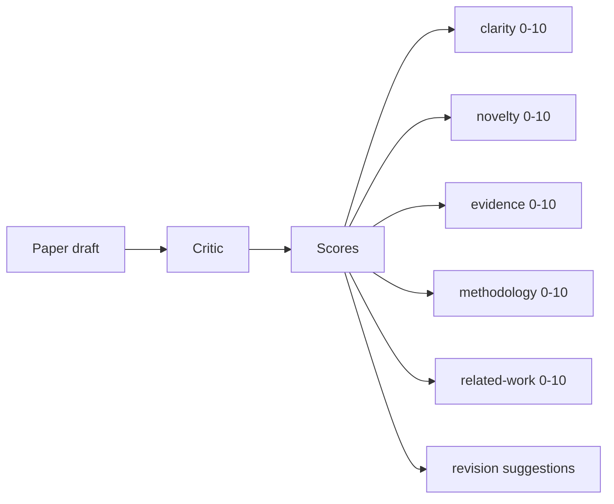
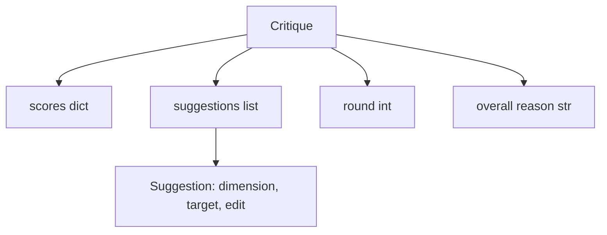
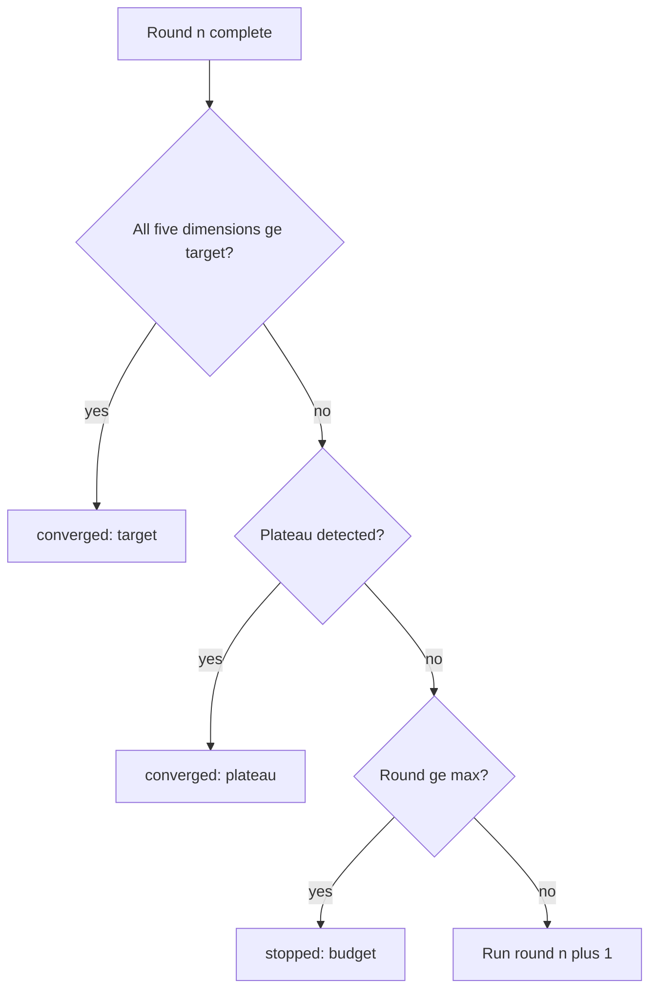
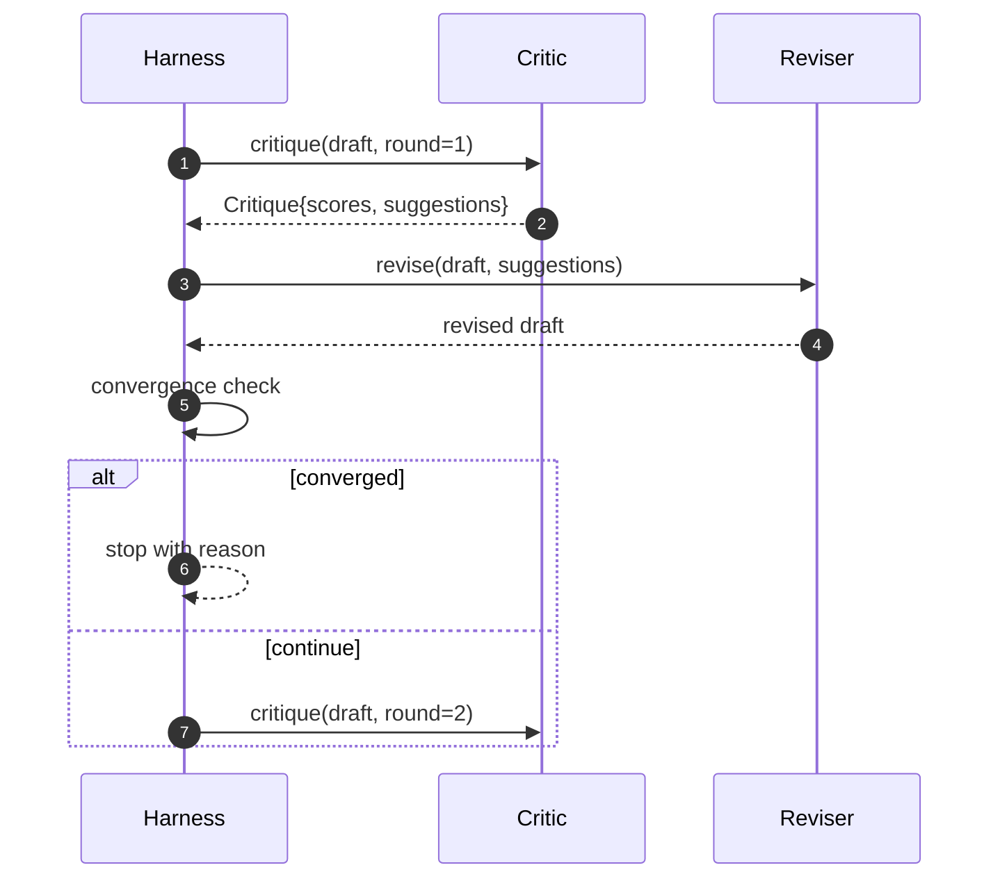

# Critic Loop / 批评循环

> 第一次就返回 “looks good” 的 critic 是坏的。永远返回 “needs work” 的 critic 也是坏的。真正有意思的是能收敛的 critic，而你必须把 convergence 工程化。

**类型：** 构建
**语言：** Python
**前置知识：** 第 19 阶段第 50-53 课
**时间：** 约 90 分钟

## Learning Objectives / 学习目标

- 从 clarity、novelty、evidence、methodology、related-work 五个固定维度给 paper draft 打分。
- 把每轮 critique 作为 structured revision diff 应用，而不是 freeform rewrite。
- 通过比较多轮 scores 检测 convergence；在 plateau、target met 或 budget exhausted 时停止。
- 用 max-iteration budget 限制轮数，避免 non-converging critic 永远运行。
- 输出 per-round trace，让 dashboard 或下一阶段能渲染 score trajectory。

## The Problem / 问题

freeform critic 通常返回一段建议。下一轮 revision 把这段建议当作 ambient context。rewrite 是否真正处理了 criticism 不可验证，因为 criticism 从来没有结构。

固定五个维度能给 harness 一个 contract。



score 是一个 vector。harness 会观察每个 dimension 在多轮中的变化。一个 revision 如果提高 clarity 却拉低 evidence，那就是 evidence 上的 regression，convergence check 能看见它。model-only critic 不能保证这一点。

## The Concept / 概念

`Critique` 的 shape 如下：



每条 suggestion 都携带它要改善的 dimension、目标 section，以及 reviser 可以应用的 `edit` instruction。reviser 也是一个 callable。本课提供 deterministic reviser，把 edit instruction 解释为 append-to-section operation。model-driven reviser 会把同一个字段解释为 prompt。contract 不变。

critic loop 在任一条件触发时终止：



target 是最严格的情况：五个维度（clarity、novelty、evidence、methodology、related_work）全部达到 `>= target_score`（默认 `8.0`），loop 才返回 success。平均值很高但有一个弱项不够。plateau detection 比较当前 round mean 和上一 round mean。如果 improvement 连续两轮低于 `plateau_epsilon`（默认 `0.1`），loop 以 `plateau` 退出。budget 是 hard cap on rounds（默认 `5`），退出 reason 为 `budget`。

顺序很重要。target 优先于 plateau，plateau 优先于 budget。如果第三轮同时命中 target 和 plateau，结果是 `target`，不是 `plateau`。

## Build It / 动手构建

plateau detection 要看两轮，而不是一轮。一轮 plateau 可能只是 noise。真实 critic 即使 deterministic，也会因为 suggestions 的应用顺序和内容不同，在每轮给出略有不同的 score。要求连续两轮 plateau 可以过滤这种 noise。harness 报告 plateau 时，draft 才是真的停止改善。

本课不调用模型。附带 critic 是一个 callable，基于三个 signals 给 draft 打分：average section body length（clarity）、figure count 和 citation count（evidence）、paper metadata 上的 `originality_tag`（novelty）。reviser 知道如何把每个 score 往上推。

```text
clarity      grows when the average section body length increases
novelty      grows when originality_tag is set to "high"
evidence     grows when a section's figure_refs is non-empty
methodology  grows when a section titled "Method" exists with body
related-work grows when a section titled "Related Work" exists with body
```

reviser 会把每条 suggestion 解释为 targeted append。第一轮之后，harness 应该能观察到 score 上升。测试利用这个性质断言 loop 在缩小 gap。

完整 loop contract 如下：



harness 拥有 round counter、trace 和 convergence check。critic 拥有 score。reviser 拥有 diff。三者都不触碰对方的 state。

## Use It / 应用它

每轮输出一个 trace event，包含 round number、score vector、suggestion count 和 convergence verdict。完整 trace 会与 final draft 一起返回。下游 dashboard 可以渲染 score-per-round chart。下一课 iteration scheduler 会读取 trace，判断这个 branch 是否值得保留。

bad critic 需要 budgets 保护。一个不断产出无效 suggestions 的 critic 会把 loop 推到 max-iteration ceiling。trace 会让这件事可见：五轮、scores flat、verdict `budget`。用户应该把它理解为 critic bug，而不是 draft bug。只暴露 final draft 会隐藏诊断；trace-first design 会把诊断显露出来。

`code/main.py` 定义 `Critique`、`Suggestion`、`Critic` protocol、`Reviser` protocol、`CriticLoop`，以及 `make_deterministic_critic_pair` factory，后者返回 deterministic critic 和匹配 reviser。文件中包含一个 minimal `Paper` shape，让本课可以独立运行。

`code/tests/test_critic_loop.py` 覆盖：第一轮后的 monotone improvement、调好 draft 上的 target convergence、两轮 flat 后的 plateau detection、没有 suggestion 能改善时的 budget exhaustion、reviser 的 suggestion application，以及 trace shape。

## Ship It / 交付它

交付物是一个能收敛、能解释、能被 dashboard 读取的 structured critic loop。核心赌注是 score vector：critique 一旦结构化，后续 dimension weights、paired critics、dashboard 和新 convergence rule 都可以在同一个 `Critique` shape 上组合。

## Exercises / 练习

1. 增加 dimension weights，让 workshop paper 更重 novelty，让 journal paper 更重 methodology。
2. 加入 paired critics：一个 critic 打分，第二个 critic 在 reviser 看到 suggestions 前做 adjudication。
3. 构造一个会让 evidence 上升但 clarity 下降的 reviser，确认 trace 能显示维度级 regression。
4. 把 `plateau_epsilon` 调小，观察 loop 是否更容易耗尽 budget。

## Key Terms / 关键术语

| 术语 | 常见说法 | 实际含义 |
|------|-----------------|------------------------|
| Score vector | “Critic score” | clarity、novelty、evidence、methodology、related-work 五维评分 |
| Suggestion | “Revision request” | 带 dimension、target section 和 `edit` instruction 的结构化修改建议 |
| Plateau | “No longer improving” | 连续两轮 mean score improvement 低于阈值 |
| Budget exhaustion | “Max rounds hit” | critic 没收敛时由 hard iteration cap 终止 |
| Trace-first design | “Show every round” | 暴露每轮 scores 和 decisions，便于诊断 critic 或 reviser 的问题 |

## Further Reading / 延伸阅读

- structured critique 比 freeform feedback 更容易接入 convergence、dashboard 和 scheduler。
- model-driven critic 可以替换 deterministic critic，但必须保留 `Critique` contract。
