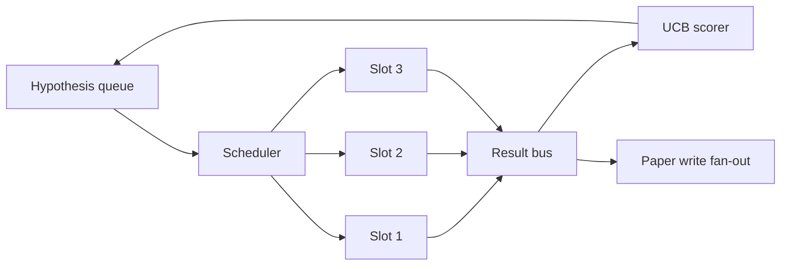
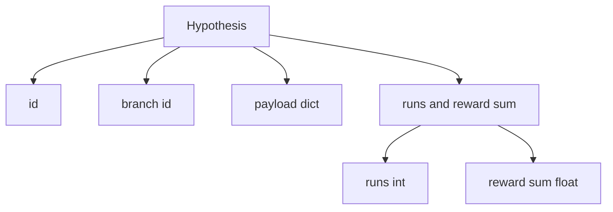
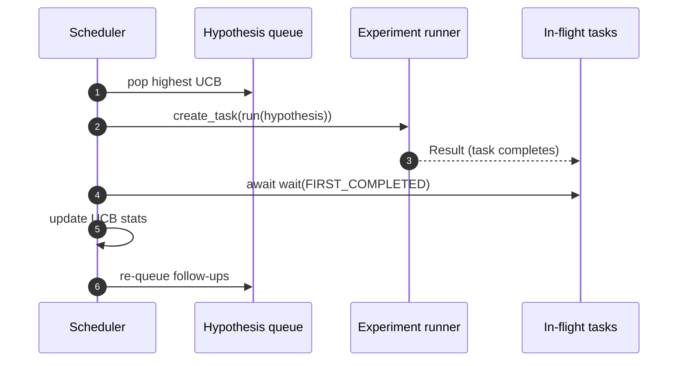

# Iteration Scheduler / 迭代调度器

> 没有 scheduler 的 research loop 只是一个误以为自己很聪明的 queue。scheduler 决定停止探索什么，而这个决定就是整场游戏。

**类型：** 构建
**语言：** Python
**前置知识：** 第 19 阶段第 50-53 课
**时间：** 约 90 分钟

## Learning Objectives / 学习目标

- 把 research workflow 建模为 hypothesis queue，喂给 parallel experiment slots，再把 results fan back in。
- 用 asyncio 并发运行多个 experiments，让 scheduler 保持所有 slots 忙碌。
- 用 UCB 给每条 hypothesis branch 打分，让 scheduler 在不放弃探索的前提下剪掉低收益 branch。
- 把完成的 results fan out 到 paper-write stage 和 re-queue stage，让高收益 branch 生成 follow-up hypotheses。
- 暴露 per-iteration trace，包含 branch scores、slot occupancy 和 pruning decisions。

## The Problem / 问题

flat worklist 按 submission order 跑 jobs。当每个 job 独立时，这没有问题。research 不是独立的：experiment three 的发现会改变 experiments four 和 five 的优先级。能读取 result fan-in 并重排 queue 的 scheduler，会在同样 compute 下完成更有用的工作。

真正重要的设计点是 scoring rule。greedy scorer 总是选择当前 leader，因而永远不探索。uniform scorer 从不利用已知优势。UCB（upper confidence bound）位于中间：利用 leader，同时给尝试次数较少的 branches 保留容量。

## The Concept / 概念

系统形状如下：



queue 保存 hypotheses。某个 slot 空出来时，scheduler 选择最高 UCB 的 hypothesis。每个 slot 异步运行 experiment。完成的 experiments 把 result 发到 bus。bus 更新 originating branch 的 UCB statistics，并在 branch yield 超过 threshold 时 fan out 到 paper-write stage。

`Hypothesis` 的 shape 如下：



`branch` 是 UCB statistics 的 key。多个 hypotheses 可以共享一个 branch：branch 是 research direction，hypothesis 是其中一个 trial。`runs` 是该 branch 已完成 experiments 数量，`reward_sum` 是累计 reward。UCB 会读取二者。

## Build It / 动手构建

本课使用经典 UCB1。

```text
ucb(branch) = mean_reward(branch) + c * sqrt( ln(total_runs) / runs(branch) )
```

`total_runs` 是所有 branches 已完成 experiment 的总数。`c` 是 exploration weight，默认是 `sqrt(2)`。零 runs 的 branch 得到 `+inf`，因此未尝试 branch 总是先被调度。高 mean reward branch 会保持高 score，直到其他 branches 追上；多次运行却 reward 低的 branch 会被尝试更少的 alternatives 超过。

pruning gate 与 picker 分离。当某个 branch 至少运行 `prune_after_runs` 次（默认 `3`），且 mean reward 低于绝对 floor（默认 `0.2`）时，pruning 会把它从后续 scheduling 中移除。这能保持 queue bounded。

scheduler 使用 `asyncio.create_task` 驱动 experiments。每个 task 运行一个 experiment runner（`async def` callable），并返回 `Result`。main loop 用 `asyncio.wait(..., return_when=asyncio.FIRST_COMPLETED)` 等待 in-flight tasks；每个 task 完成时立即触发 scoring update。



三个 slots 并发运行。main loop 不会阻塞在单个 experiment 上。只要 slot 空出来，scheduler 就启动新的 task，直到 queue 为空且没有 in-flight tasks。

## Use It / 应用它

paper trigger 是第一个 fan-out。当 branch 的 mean reward 超过 `paper_threshold`（默认 `0.7`），且该 branch 还没有产出过 paper，scheduler 会把一个 `paper.trigger` event 放入 output list。下游第五十四课的 paper writer 会消费它。本课先把 trigger 捕获为 list，方便测试断言。

follow-up hypotheses 是第二个 fan-out。高收益 result 到达时，scheduler 可以调用用户提供的 `expander`，在同一个 branch 上生成一个或多个 follow-up hypotheses。`expander` 是从 `Result` 到 `list[Hypothesis]` 的 pure function。本课提供 deterministic expander：任何 reward 超过 paper threshold 的 result 都会生成两个 follow-ups。

两个 budgets 防止 scheduler runaway：

```text
max_experiments    : total count of experiments run across all branches
max_seconds        : wall-clock cap (asyncio time)
```

任一 budget 命中后，scheduler 停止调度新 tasks，等待 in-flight ones 完成，然后返回 final trace。trace 中包含 `stop_reason`。

每个 scheduling decision（pick、dispatch、result、prune、fan-out）都会产出一个 event。final report 汇总 per-branch stats、total runs、total wall-clock 和已触发的 paper triggers。下一课 end-to-end demo 会读取这个 report 来驱动 paper writer。

`code/main.py` 定义 `Hypothesis`、`Result`、`BranchStats`、`IterationScheduler` 和 `make_deterministic_runner` factory。factory 返回一个带可预测 rewards 的 asyncio experiment runner。runner 固定 sleep `delay_ms`（默认 `5ms`），因此 concurrency 可观察。

`code/tests/test_scheduler.py` 覆盖：UCB 优先选择 untried branches、parallel slot occupancy、threshold crossed 时的 paper triggers、低收益 trials 后的 branch pruning、fan-out follow-up hypotheses，以及 experiment count 和 wall clock 两类 budget exit。

## Ship It / 交付它

scheduler 是 research 从 worklist 变成 adaptive loop 的位置。交付标准是：UCB 已接入、parallel slots 能保持忙碌、low-yield branches 会被剪掉、high-yield branches 会触发 paper 和 follow-up hypotheses，并且所有 decisions 都有 trace。

## Exercises / 练习

1. 把 UCB stats 持久化到 JSON store，确认重启后不会丢失已经花掉的 exploration budget。
2. 把 scalar reward 改成 reward vector，并尝试一个 Pareto-style picker。
3. 调整 `c`，观察系统在 exploitation 和 exploration 之间如何移动。
4. 构造一个所有 branches 都低收益的场景，确认 pruning 能让 queue bounded。

## Key Terms / 关键术语

| 术语 | 常见说法 | 实际含义 |
|------|-----------------|------------------------|
| UCB | “Explore/exploit score” | mean reward 加上由尝试次数决定的 exploration bonus |
| Branch | “Research direction” | 多个 hypotheses 共享的统计单位 |
| Slot | “Worker lane” | 异步执行 experiment 的并发位置 |
| Fan-out | “Trigger next stages” | result 完成后触发 paper write 或 follow-up hypotheses |
| Pruning gate | “Stop bad branches” | 满足最小运行次数后，低于 reward floor 的 branch 被移除 |

## Further Reading / 延伸阅读

- persistent UCB stats、multi-objective scoring 和 contextual bandits 都能在本课 scheduler contract 上扩展。
- 第五十七课会把 scheduler、critic loop 和 paper writer 端到端接起来。
