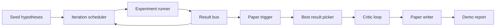
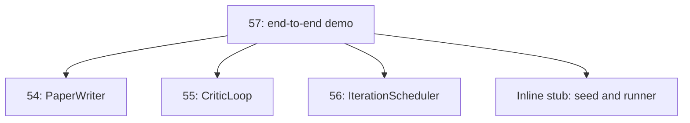
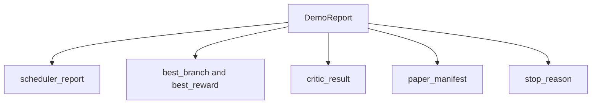

# End-to-End Research Demo / 端到端研究演示

> demo 是你前面写下的所有 contract 必须组合起来的地方。任何一个 contract 漏水，demo 都会抓出来。

**类型：** 构建
**语言：** Python
**前置知识：** 第 19 阶段第 50-53 课
**时间：** 约 90 分钟

## Learning Objectives / 学习目标

- 端到端串起 auto-research loop：hypothesis seed、experiment runner、scheduler、critic loop、paper writer。
- 通过普通 Python imports 组合前面 Track D lessons 的 primitives，而不是引入 framework。
- 运行到 self-terminating 结尾，并输出一个列出各阶段产物的 demo report。
- 保持 demo deterministic，让 test suite 能断言最终 shape。
- 当任一 stage contract 破裂时暴露清晰 failure mode，避免下一阶段消费 broken input。

## The Problem / 问题

单独 lesson 通过测试并不说明系统已经能组合。demo 的职责是让每个 contract 被真实调用：scheduler 的 report 要能喂给 picker，picker 的 branch 要能构造 draft，critic loop 的输出要能升级成 paper，paper writer 的 manifest 要能回到 final report。任何字段命名、错误类型或 determinism 漏洞都会在这里暴露。

## The Concept / 概念

本课组合五个 stages：



seed 是三个 hypotheses 的 list。scheduler 在三条 parallel slots 上运行六个 experiments。bus 报告一个或多个 paper triggers。picker 选择 single best result。critic loop 基于该 result 构造 draft 并迭代。paper writer 输出最终 LaTeX、BibTeX 和 manifest。

为什么 import 而不是 copy？每个前序 lesson 都提供一个带 public dataclasses 和 functions 的 `main.py`。demo 通过调整 `sys.path` 到各 lesson parent directory 来 import 它们。这不是 framework wiring；它和前面 lesson 的 tests 使用的是同一种 import。



inline stub 代替第五十到第五十三课：一个小型 seed hypotheses generator 和一个 synchronous reward function。用户可以通过调整两个 imports，把 inline stub 换成那些课程中的真实 primitives。

## Build It / 动手构建

demo 的 determinism 是构造出来的。experiment runner 使用 seeded numpy。critic loop 的 reviser 按固定维度、固定顺序行走。paper writer 的 prose generator 使用第五十四课的 mocked one。scheduler 的 UCB picker 用 iteration order 解决 ties，而不是 random choice。

同一个 seed 会产生同一个 report。测试通过运行两次 demo 并比较 manifest 来断言这个性质。

demo report 的 shape 如下：



每个字段都原样来自 upstream stage。demo 不转换任何输出；它只组合它们。这正是 demo 要测试的内容。

failure mode handling 要保持 typed。每个 stage 要么成功，要么抛出 typed error。

```text
Scheduler ........ returns SchedulerReport with stop_reason
                   in {queue_empty, max_experiments, deadline}
Best-result pick . raises NoTriggerError if no paper trigger fired
Critic loop ...... returns LoopResult with status converged or stopped
Paper writer ..... raises PaperValidationError on contract break
```

任一 stage 失败都会以 typed exception 短路 demo。测试固定这个 contract：`test_no_triggers_raises_typed_error` 和 `test_best_picker_raises_when_no_triggers` 断言没有 branch 触发 trigger 时，picker 会抛 `NoTriggerError` / `BestResultError`，writer 不会被调用。

## Use It / 应用它

scheduler 会按 branch 产出 paper triggers。picker 选择所有 triggers 中 mean reward 最高的 branch。tie 按 branch id 字母序打破，因此 demo deterministic。picker 是一个小 pure function，测试用固定 scheduler report 锁住它。

第五十五课的 critic loop 操作 `MiniPaper`。demo 从 picked branch 构造一个 `MiniPaper`：abstract 中填入 branch id，seed 两个 sections（Introduction 和 Results），并根据 branch mean reward 设置 `originality_tag`（`>= 0.8` 为 high，`>= 0.6` 为 medium，否则为 low）。

reviser 迭代 draft 直到 convergence。输出再交给 paper writer。

第五十四课 paper writer 操作完整 `Paper` shape，包含 figures 和 bibliography。demo 通过 `mini_to_full_paper` 升级 converged `MiniPaper`：为 selected branch 附上一张 figure，并从 critic 建议过的 cite keys 的 union 生成一个小 synthetic bibliography。demo 添加的每个 cite 也会加入 bibliography list，因此 validation 会通过。

`code/main.py` 定义 `BestResultError`、`NoTriggerError`、`DemoReport`、`pick_best_branch`、`build_mini_paper`、`mini_to_full_paper` 和 `run_demo`。顶部 imports 会调整一次 `sys.path`，并从对应课程中拉入 `PaperWriter`、`CriticLoop` 和 `IterationScheduler`。

`code/tests/test_e2e.py` 覆盖：demo 端到端运行并输出五个字段完整的 report、两次 run 的 determinism、没有 branch 过 threshold 时的 `NoTriggerError`、writer contract 破裂时的 `PaperValidationError`、paper manifest 包含 picked branch 的 figure，以及 scheduler stop reason 属于预期集合。

## Ship It / 交付它

demo 的工作是证明 composition 就是 architecture。五个 lessons、四个 imports、一个 report。下一次你增加一个 stage，wiring 应该只多一条明确边，而不是复制一套新系统。

## Exercises / 练习

1. 加入 persistent state：每个 stage result 写入小型 JSON store，让 restart 能 resume，而不是重跑 cheap stages。
2. 把 scheduler 和 critic loop 的 trace events 渲染成单条 dashboard timeline。
3. 用真实 model calls 替换 mocked prose generator 和 deterministic critic，保持 wiring 不变。
4. 把 inline stub 换成第五十到第五十三课的真实 primitives，并记录新增的 glue code 行数。

## Key Terms / 关键术语

| 术语 | 常见说法 | 实际含义 |
|------|-----------------|------------------------|
| Demo report | “End-to-end output” | 汇总 scheduler、picker、critic、paper writer 输出的 typed record |
| Best-result picker | “Choose winner” | 从 paper triggers 中选择 mean reward 最高 branch 的 pure function |
| Inline stub | “Fake earlier stages” | 代替 lessons 50-53 的小型 seed 和 reward function，便于先验证 composition |
| Typed error | “Fail clearly” | contract break 时抛出的具体异常，而不是让下一阶段消费坏输入 |
| Composition | “Wire stages” | 保持前序 lesson contract 不变，通过 imports 和 dataclasses 串起 pipeline |

## Further Reading / 延伸阅读

- 下一步可以加入 persistent state、timeline dashboard 和真实 model calls。
- demo 通过 contract 组合来验证架构，而不是通过 framework 隐藏边界。
