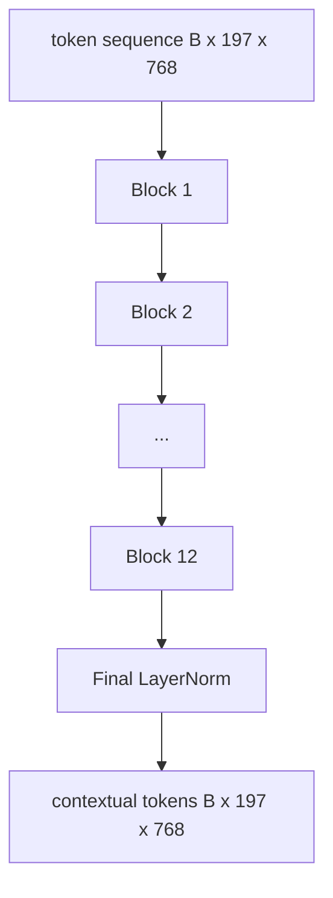
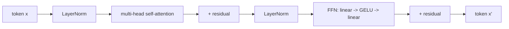

# Vision Transformer Encoder / 视觉 Transformer 编码器

> patches 本身不会“看”。一个 12-layer pre-LN transformer，配 12 个 attention heads，会把 patch token sequence 转成 contextual tokens，并让 CLS token 在最终 hidden state 中聚合整张图的特征。本课是所有现代 vision-language model 的 engine room。

**类型：** 构建
**语言：** Python
**前置知识：** 第 19 阶段第 30-37 课（Track B 基础）
**时间：** 约 90 分钟

## Learning Objectives / 学习目标

- 实现带 multi-head self-attention 和 feed-forward sub-layer 的 pre-LN transformer block。
- 堆叠 12 个 blocks、12 个 heads，形成 ViT-Base encoder。
- 接入第 58 课的 patch front end，并完成一次 forward pass。
- 验证 CLS token 确实从每个 patch 聚合信息。

## The Problem / 问题

patch embedding 会产生 197 个 tokens，每个 token 都是一个还不知道其他 patch 的 vector。一张猫图需要每个 patch 知道哪些 patches 是胡须、哪些是背景、哪些是眼睛。transformer 正是逐层建立这种 awareness 的机制。没有它，patch front end 只是一个聪明 tokenizer，还谈不上理解。

标准配方是十二层深、十二 heads 宽、pre-LayerNorm placement、GELU activation，以及 4x 的 feed-forward expansion。这条配方是 CLIP ViT-L、SigLIP、DINOv2、Qwen-VL family、InternVL 以及 2025-2026 年几乎所有 open-weight vision encoder 的 spine。它足够稳定，所以读这些 papers 时，如果作者没有特别说明，通常可以默认 block shape 就是这个。

## The Concept / 概念





### Pre-LN vs post-LN / Pre-LN 与 post-LN

Original Transformer 把 LayerNorm 放在 residual 之后。Pre-LN（在每个 sub-layer 之前做 LayerNorm）是所有现代 vision-language model 使用的版本，因为它不用复杂 learning-rate warm-up tricks 也能稳定训练。forward pass 里只差一行，但在 depth 12+ 的梯度流上差异巨大。

### Multi-head self-attention / 多头自注意力

每个 head 都把 token vector 投影到自己的 `(query, key, value)` triple，维度为 `head_dim = hidden / num_heads`。当 `hidden = 768`、`heads = 12` 时，每个 head 的 `dim = 64`。12 个 heads 并行 attend，输出 concat 回 768 维，再经过 output projection。multi-head 的意义在于，一个 head 可以学 “attend to the cat eye”，另一个 head 可以学 “attend to the background gradient”，彼此不干扰。

### Why the 4x feed-forward expansion / 为什么 FFN 要扩到 4x

FFN 走 `hidden -> 4 * hidden -> hidden`，中间用 GELU。factor 4 是经验选择，自 2017 年以来在 language 和 vision transformers 中都很稳定。更小（2x）容易 underfit；更大（8x）在固定 data budget 下容易 overfit。MLP 是模型存放大部分 learned facts 的地方，而更宽的中间层就是这些 facts 的容器。

| Component | Parameters at ViT-Base scale |
|-----------|------------------------------|
| qkv projection per block | `3 * 768 * 768 = 1.77M` |
| output projection per block | `768 * 768 = 590K` |
| FFN per block (4x expansion) | `2 * 768 * 4 * 768 = 4.72M` |
| LayerNorm per block | `4 * 768 = 3K` |
| Total per block | about 7.1M |
| 12 blocks | about 85M |
| Plus front end | about 86M total |

ViT-Base 是 86M-parameter encoder。以 2026 标准看它很小（SigLIP-So400M 是 400M，Qwen-VL ViT 是 675M），但 architecture 只是在 width 和 depth 上变大，核心 block 相同。

### Causal mask or not? / 要不要 causal mask

Vision Transformers 是 encoder-only 且 bidirectional：任意 token `i` 都可以 attend 到任意 token `j`。不需要 mask。第 61 课 decoder-side cross-attention 会用 causal mask，但 vision encoder 内部 attention 是 fully connected。

### What the CLS token learns / CLS token 学到了什么

CLS token 一开始是 learned parameter，本身没有 patch content。它通过每个 block 的 attention 聚合全图信息。到最后一层，CLS row 是整张图的 vector summary；下游 heads 会把这个单一 vector 投影到 class logits、contrastive embeddings，或 text decoder 的 cross-attention keys。

## Build It / 动手构建

`code/main.py` implements:

- `MultiHeadSelfAttention`, with `qkv` and output projections, the scaled-dot-product attention math, and shape assertions.
- `FeedForward`, the 4x-expansion GELU MLP.
- `Block`, a pre-LN block composing attention and feed-forward sub-layers with residuals.
- `ViT`, a stack of 12 blocks with a final LayerNorm.
- `VisionEncoder`, which wires `VisionFrontEnd` from lesson 58 to the `ViT` stack and exposes a `forward()` returning the contextual sequence and the pooled CLS vector.
- A demo that runs a synthesized 224x224 fixture image through the full encoder and prints input shape, output shape, parameter count, and the CLS norm at every other layer.

Run it:

```bash
python3 code/main.py
```

输出：fixture 会被编码成 `(1, 197, 768)` tensor。随着 layers 组合，CLS norm 会上升，然后在 final LayerNorm 处稳定。total parameters 约为 86M。

## Use It / 应用它

这里定义的 encoder，在 width 和 depth 之外，与 2025-2026 年每个 open-weight VLM 内部的 block stack 相同。差异主要在：

- **Width and depth.** ViT-Large 是 `hidden=1024, depth=24, heads=16`；SigLIP So400M 是 `hidden=1152, depth=27, heads=16`。同一个 block。
- **Pooling head.** 本课使用 CLS pooling；SigLIP 用 average pooling；后续 VLMs 也会使用 attention pooling。
- **Position handling.** 第 58 课用 fixed sinusoidal；其他模型可能用 learned 1D、ALiBi 或 2D RoPE。block math 不变。
- **Register tokens.** DINOv2 会 prepend 4 个额外 learned tokens。代码只多一行。

这个 block stack 是基底。后续 60-63 课都建立在它上面。

## Tests / 测试

`code/test_main.py` covers:

- a single block preserves shape and is invariant to input batch size
- attention scores sum to one along the key axis (softmax sanity)
- residual paths are wired (zero input still produces non-zero output via the CLS token)
- a 4-layer stacked forward pass produces the right shape
- gradients flow to the patch projection from the CLS output

Run them:

```bash
python3 -m unittest code/test_main.py
```

## Ship It / 交付它

交付物是 `VisionEncoder`：从 image tensor 到 contextual token sequence 和 pooled CLS vector 的完整 ViT front stack。它应该能作为 projection layer、contrastive pretraining 和 cross-attention fusion 的视觉侧输入，并通过 shape、softmax、residual、gradient flow 测试。

## Exercises / 练习

1. 添加 register tokens（在 CLS 后 prepend 4 个 learned vectors）并重新运行。通过最后一层 softmax distribution 的 entropy 比较 attention map smoothness。

2. 把 pre-LN 换成 post-LN，并在 synthetic shape classifier 上训练一个 epoch。观察哪个版本不用 LR warm-up 也能稳定训练。

3. 把 causal masking 实现为 `attn_mask` argument，让同一个 block 可以复用为 decoder block。mask shape 是 `(seq, seq)`，lower-triangular。

4. 用 `torch.profiler` 在 batch sizes 1、8、64 下 profile forward pass。主导 wall time 的是 MLP layer，不是 attention。

5. 用 low-rank LoRA adapter 替换某个 attention head 的 q-k-v projections，冻结其他部分，并验证 gradient 只流向预期位置。

## Key Terms / 关键术语

| Term | What it means |
|------|---------------|
| Pre-LN | LayerNorm 放在每个 sub-layer 之前，而不是之后 |
| Self-attention | 每个 token attend 到同一 sequence 中的所有其他 tokens |
| Multi-head | hidden dim 被拆到 `H` 个独立 attention heads 上 |
| FFN expansion | feed-forward layer 先扩到 `4 * hidden`，再收回 |
| CLS pooling | 使用第一个 token 的 final hidden state 作为 image summary |

## Further Reading / 延伸阅读

- An Image is Worth 16x16 Words (ViT, 2021) for the encoder recipe.
- DINOv2 (2023) for register tokens and the self-supervised pretraining objective.
- SigLIP (2023) for the average-pooling variant and the sigmoid contrastive loss used in lesson 62.
