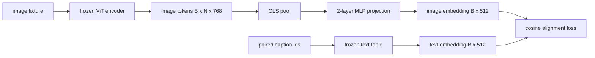

# Projection Layer for Modality Alignment / 用于模态对齐的投影层

> vision encoder 产出 image tokens。text decoder 消费 text tokens。二者处在不同 vector spaces。一个小型 two-layer MLP 把 image tokens 投影到 text embedding space，再用 paired caption 上的 cosine alignment loss 拉近两个空间。这个 projection 是 vision-language model 中最小的一块，也是迁移时最关键的一块。

**类型：** 构建
**语言：** Python
**前置知识：** 第 19 阶段第 30-37 课（Track B 基础）
**时间：** 约 90 分钟

## Learning Objectives / 学习目标

- 构建 two-layer MLP projection，把 image features 映射到 text embedding space。
- 构建 mock text embedding table（不使用 pretrained tokenizer，也不下载真实 corpus）。
- 计算 projected image tokens 与 paired caption embedding 之间的 cosine alignment loss。
- 在 frozen vision encoder 和 frozen text table 下，只训练 projection。

## The Problem / 问题

你已经有一个 vision encoder（第 58-59 课），输出维度为 `vision_hidden = 768` 的 tokens。你还想接一个 text decoder，它的 embedding dimension 是 `text_hidden = 512`（其他数字同样合理）。decoder 期待 text-shaped tokens。image tokens 不是 text-shaped：它们活在 encoder 通过 vision-only pretraining 学到的 basis 中，与 decoder 的 word vectors 没有关系。

two-layer MLP projection（linear、GELU、linear）弥合这个 gap。它足够小（大约 `768 * 1024 + 1024 * 512 = 1.3M` parameters），在单张 GPU 上几分钟就能训练；alignment phase 中只有它需要学习。vision encoder 冻结，text embedding table 冻结，只有 projection 会动。这是 LLaVA 2023 年采用的 recipe，BLIP-2 把它重构为 Q-Former，此后每个 open-weight VLM 都以某种形式采用了类似方案。

## The Concept / 概念



### Pooling before projection / 投影前先 pooling

vision encoder 输出 197 个 tokens。text side 只有一个 caption-level embedding。要对齐二者，你需要每个 sample 一个 image-level vector。CLS pooling 是最简单做法：取 encoder 的第一个 token 并投影它。也可以对全部 197 个 tokens 做 mean pooling，SigLIP 就是这么做的。两者都把 197 个 vectors 压到一个。

### Why two layers and not one / 为什么是两层而不是一层

单层 linear projection 可以旋转和缩放，但如果两个空间存在 curvature mismatch，它无法修正 basis。两个 linear layers 中间加 GELU，让 projection 有一次 non-linear bend；经验上这足以把 CLIP-style features 对齐到 language model embeddings。更深 projection 是扩展形式：LLaVA-NeXT 用 GLU，Qwen-VL 用一组 attention layers。two-layer MLP 是 canonical baseline，也对应 BLIP-2 的 Q-Former projection head 末端。

| Layer | Shape | Parameters |
|-------|-------|------------|
| fc1 | `(vision_hidden, projection_hidden)` | `768 * 1024 + 1024` |
| activation | GELU | 0 |
| fc2 | `(projection_hidden, text_hidden)` | `1024 * 512 + 512` |

对 `768 -> 1024 -> 512` head 来说，约 1.3M parameters。

### Cosine alignment loss / 余弦对齐损失

align 不等于 `image_emb == text_emb`。align 的意思是，在 joint space 中 `image_emb` 与 `text_emb` 指向相同方向。cosine loss 是 `1 - cos_sim(image, text)`，范围从 0（完全对齐）到 2（方向相反）。训练会把每对样本的 loss 往零推。第 62 课会把它推广为 contrastive batch（InfoNCE），要求每张 image 更靠近自己的 caption，而不是 batch 中其他 captions；本课使用 per-pair version，让动态更容易观察。

### Frozen encoder is the trick / 冻结 encoder 是关键

vision encoder 有 86M parameters。text table 也有几百万。用 mock corpus 同时训练它们不可行。冻结两者意味着只有 projection 的 1.3M parameters 会改变，在 synthetic pairs 上跑几百步就足以让 loss 下降。这正是每个 adapter-based VLM 的运行形状：重的部分冻结，轻的桥接层训练。

## Build It / 动手构建

`code/main.py` implements:

- `MLPProjector(in_dim, hidden_dim, out_dim)`, two-layer linear MLP with GELU activation.
- `MockTextEmbedding(vocab_size, dim)`, a frozen embedding table with deterministic init from a seed.
- `make_pair(seed, vocab_size)`, which synthesizes one paired (image, caption) sample. Captions are short id sequences; the caption embedding is mean-pooled over token embeddings.
- `cosine_alignment_loss(image_emb, text_emb)`, the per-pair `1 - cos_sim` objective.
- A training loop that runs the projection for 200 steps over 32 synthetic pairs (cycled), with the vision encoder and text table frozen, and prints the loss every 25 steps.

Run it:

```bash
python3 code/main.py
```

输出：training 会报告 loss 从初始约 1.07 下降到 200 steps 内约 0.80，说明只训练 projection 也能把 image tokens 拉向 text space。最终每对样本的 cosine similarity 也会打印出来。

## Use It / 应用它

同一模式出现在所有 open-weight VLM 中：

- **LLaVA 1.5.** 从 CLIP-ViT-L hidden 到 LLaMA embedding dim 的 two-layer GELU MLP projection。vision encoder 冻结，LLM 冻结，只训练 projection（第二阶段再 unfreeze LLM）。
- **BLIP-2.** Q-Former 让 32 个 learned query tokens 通过 cross-attention 读取 image tokens，再投影到 LLM embedding dim。Q-Former 末端的 projection head 就对应本课 MLP 的角色。
- **MiniGPT-4.** 从 BLIP-2 Q-Former output 到 Vicuna embedding dim 的 single linear projection。
- **Qwen-VL.** 使用多层 cross-attention adapter，但最后一步依旧是投影到 LM embedding dim。

形状会变，但角色相同：pool image tokens，project to text embedding dim，单独训练它。

## Tests / 测试

`code/test_main.py` covers:

- projector output shape matches the configured `out_dim`
- frozen text embedding table has zero `requires_grad` parameters
- cosine loss is zero on identical vectors and is 2 on anti-parallel vectors
- projector gradient flows after one backward pass
- the training loop reduces loss between step 0 and step 200

Run them:

```bash
python3 -m unittest code/test_main.py
```

## Ship It / 交付它

交付物是一个可训练、可冻结周边组件的 `MLPProjector` alignment stage。部署时只需要加载 projection weights；vision encoder 和 text table 不需要 backward pass。它应该能作为第 62 课多目标 pretraining 前的最小对齐桥。

## Exercises / 练习

1. 把 CLS pooling 换成 196 个 patch tokens 上的 mean pooling，并比较 200 steps 后的 final loss。synthetic data 上 mean pooling 通常训练更快；natural images 上 CLS 更 sample-efficient。

2. 给 cosine loss 添加 learned scalar temperature（`cos / tau`），观察 `tau` 太小（gradient noise）或太大（loss 高位 plateau）时会发生什么。

3. 把 two-layer MLP 换成 single linear layer，并量化 loss gap。non-linearity 在 natural image features 上更重要，在 synthetic features 上影响更小。

4. 给 projector weights 加小的 L2 penalty，观察它如何与 cosine alignment 互动（cosine scale-invariant，因此 penalty 主要收缩未使用方向）。

5. 持久化 projector weights，然后 reload 并在不对 vision encoder 做 backward pass 的情况下推理，验证部署时只需要 projector。

## Key Terms / 关键术语

| Term | What it means |
|------|---------------|
| Modality alignment | 让 image 和 text embeddings 在同一 shared space 中可比较 |
| Projection head | 把一个空间映射到另一个空间的小模块，通常是 2-layer MLP |
| Cosine similarity | dot product 除以两个 vector 的 L2 norms 乘积 |
| Frozen encoder | vision 或 text model 的所有 parameters 都设置为 `requires_grad=False` |
| Mock corpus | synthetic pairs，用来避免下载真实数据集 |

## Further Reading / 延伸阅读

- LLaVA paper for the two-stage train (project, then unfreeze LM).
- BLIP-2 paper for Q-Former as a learnable projection alternative.
- Qwen-VL technical report for cross-attention adapters as deeper projection heads.
