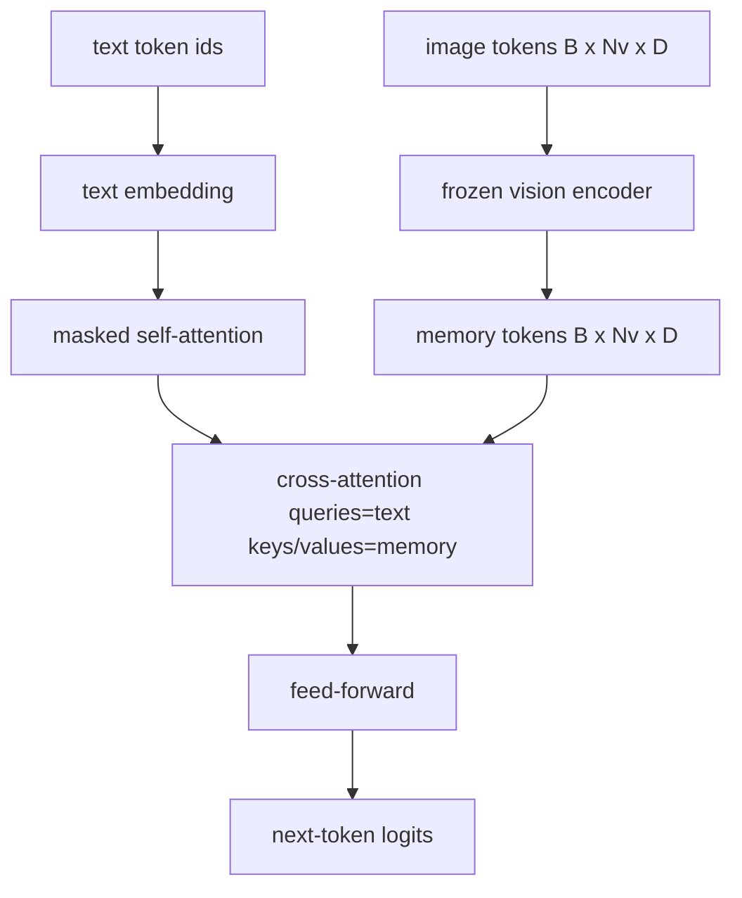
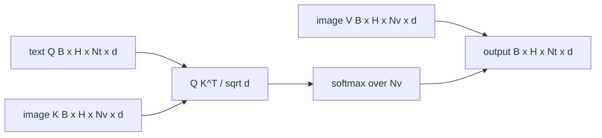

# Cross-Attention Fusion / 交叉注意力融合

> projection layer 会把一个 image vector 与一个 caption vector 对齐。真实 vision-language decoder 需要每个 text token 都能 attend 到每个 patch token，这样模型才能把每个词 grounding 到图像区域。cross-attention 就是 grounding 发生的地方：text 提问，vision keys 和 values 回答。本课构建 cross-attention block、causal text self-attention，以及让二者合法的 mask shapes。

**类型：** 构建
**语言：** Python
**前置知识：** 第 19 阶段第 30-37 课（Track B 基础）
**时间：** 约 90 分钟

## Learning Objectives / 学习目标

- 实现 multi-head cross-attention，其中 query stream 是 text，key/value stream 是 vision。
- 组合 decoder block：causal self-attention + cross-attention + feed-forward。
- 正确处理 mask shapes：self-attention 用 causal mask，cross-attention 不用 mask。
- 用 batched text tokens 和固定 image token pool 跑一次 forward pass。

## The Problem / 问题

把 image tokens 和 text tokens 拼成一个 sequence 是一种 fusion 方案（early fusion，Chameleon 和 Emu3 走这条路）。cross-attention 是另一种方案（late fusion，Flamingo 首次引入，之后所有 Flamingo-shaped decoder 都复制了它）。late fusion 中，text decoder 只在 text-only tokens 上运行，并在每一层通过 cross-attention 伸手读取 image stream。

late fusion 有两个优势。第一，text stream 保持干净，模型能保留 text-only 能力。第二，image stream 每张图只计算一次，并能在每个 decode step 复用，因此长 caption generation 也便宜。代价是每个 block 多一个 attention sub-layer。

## The Concept / 概念





### Mask shapes / Mask 形状

decoder block 内的两种 attention 需要不同 masks：

| Attention | Query length | Key length | Mask | Why |
|-----------|--------------|------------|------|-----|
| Self-attention | `Nt` (text) | `Nt` (text) | Causal: lower-triangular `(Nt, Nt)` | Text tokens may not look ahead during autoregression |
| Cross-attention | `Nt` (text) | `Nv` (vision) | No mask | The whole image is visible to every text position |

本课包含一个 shape-validation function，让 mask 混用时直接抛 `ValueError`，而不是悄悄训练出一条坏 loss curve。

### Why no mask on cross-attention / 为什么 cross-attention 不需要 mask

图像在生成任何 text 前已经完全观测。caption 的 token `t` 可以 attend 到图像任意 patch；image patches 上没有 temporal order。某些 Flamingo variants 在 interleaving multiple images 和 text segments 时会加 per-sample masking pattern，但对单图加 caption 来说，cross-attention 可以看见全部图像。

### Key/value caching / Key/value 缓存

image keys 和 values 在 decode 开始时计算一次并保存在 cache 中。每个新的 text token 都复用这个 cache，不重新计算。这让 captioning inference 很快：重的 ViT 只跑一次；cross-attention 在每步复用它的 keys 和 values。本课暴露 cache 并测试 cache-hit path。

### Block composition / Block 组合

decoder block 顺序是：pre-LN -> self-attention -> residual -> pre-LN -> cross-attention -> residual -> pre-LN -> feed-forward -> residual。三个 sub-layers 各自有 LayerNorm。Flamingo paper 在 cross-attention 上加 learned gate，让模型可以选择暂时不用 image path，以换取 training-time stability；本课使用 canonical baseline，不加 gate。

```python
class DecoderBlock:
  def forward(self, text_tokens, image_tokens, text_mask, cross_mask):
      text_tokens = text_tokens + self.self_attn(self.ln1(text_tokens),
                                                 mask=text_mask)
      text_tokens = text_tokens + self.cross_attn(self.ln2(text_tokens),
                                                  image_tokens,
                                                  mask=cross_mask)
      text_tokens = text_tokens + self.ffn(self.ln3(text_tokens))
      return text_tokens
```

## Build It / 动手构建

`code/main.py` implements:

- `CrossAttention(hidden, heads)`, multi-head cross-attention with separate `q` and `kv` projections.
- `CausalSelfAttention(hidden, heads)`, the masked self-attention from a standard decoder.
- `DecoderBlock`, composing the three sub-layers with pre-LN residuals.
- `VisionLanguageDecoder`, four-layer decoder fed by a mock vision encoder output and a small text embedding table.
- `causal_mask(length)` returning a `(length, length)` lower-triangular boolean tensor.
- A demo that feeds a batch of two text sequences of length 10 with image memory of length 197 and prints output shape, the self-attention mask shape, and the cross-attention output norm per position.

Run it:

```bash
python3 code/main.py
```

输出：decoder 产生 `(2, 10, text_vocab)` logits tensor。mask shape 是 `(10, 10)`。KV-cache reuse check 会确认 cached 和 uncached paths 的 logits 完全一致。

## Use It / 应用它

cross-attention 出现在两类生产系统中：

- **Flamingo and IDEFICS.** 每隔 K 个 language model blocks 插入一个 cross-attention sub-layer，并冻结 LM。vision-language adapter 就是 cross-attention block 加 gate。
- **BLIP-2.** Q-Former 使用固定 32 个 query tokens 对 image features 做 cross-attention，然后把 queries 投影到 LM embedding space。

本课 block shape 能直接映射到二者。mask discipline（self 上 causal，cross 上 none）也相同。

## Tests / 测试

`code/test_main.py` covers:

- causal mask is lower-triangular and matches expected boolean shape
- cross-attention output shape is `(B, Nt, hidden)` regardless of key length
- KV-cache path matches uncached path to float tolerance
- shape mismatch between text and image streams raises a clear `ValueError`
- a full decoder forward pass produces the right batch and sequence shape

Run them:

```bash
python3 -m unittest code/test_main.py
```

## Ship It / 交付它

交付物是一个可复用的 late-fusion decoder block：text self-attention 受 causal mask 约束，cross-attention 读取完整 image memory，并能通过 KV cache 复用 image keys/values。它是第 62 课 captioning loss 和后续 VLM decoder 的核心连接点。

## Exercises / 练习

1. 给 cross-attention residual 加 learned tanh gate（Flamingo trick），并验证从 near-zero initial gate 开始也能收敛。gate 从 0 开始；模型先恢复 text-only 行为，再混入 image stream。

2. 实现 interleaved attention，让同一个 decoder 消费多个 images 加多个 text segments。构建 per-sample cross-attention mask，阻止 text segment 2 attend 到 image 1。

3. 在 `Nt=64, Nv=576`（24x24 high-resolution grid）下 profile cross-attention 与 self-attention layer。cross-attention 成本是 `Nt * Nv`，高 image resolution 下会主导。

4. 在 cross-attention map 上增加 query-side dropout，并测量 demo 的 caption diversity（cross map dropout 越大，caption sample variance 越高）。

5. 把 cross-attention layer 替换为 Q-Former-style attention block，让固定 32-token query pool 每层 attend 到 image features。

## Key Terms / 关键术语

| Term | What it means |
|------|---------------|
| Late fusion | text 和 vision 保持独立 streams；每个 block 用 cross-attention 桥接 |
| Cross-attention | Q 来自一个 stream，K 和 V 来自另一个 stream |
| Causal mask | lower-triangular boolean mask，阻止 autoregression 中看未来 |
| KV cache | image keys 和 values 只存一次，并在每个 decode step 复用 |
| Memory tokens | decoder 会读取的 frozen image tokens |

## Further Reading / 延伸阅读

- Flamingo (2022) for the canonical late-fusion design with gated cross-attention.
- BLIP-2 (2023) for the Q-Former, which is a cross-attention block dressed as a learned query pool.
- IDEFICS (2023) for an open-weight reproduction of the Flamingo recipe.
