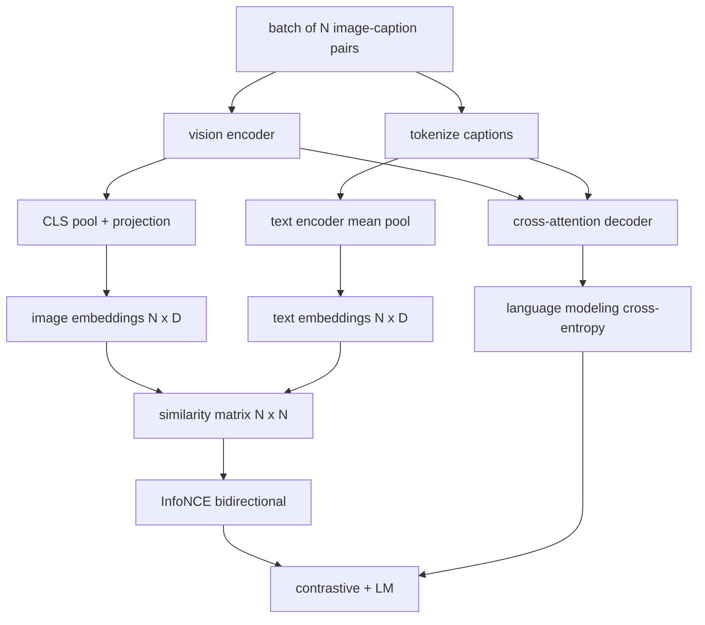

# Vision-Language Pretraining / 视觉语言预训练

> encoder、projection 和 decoder 已经接好。现在把它们一起训练。两个 objectives 推动学习：contrastive image-text loss（InfoNCE）把匹配样本拉到 joint embedding space 中更近的位置；language modeling loss 要求 decoder 为每张图写 caption。合在一起，它们教会网络既能为 caption 找到正确 image，也能为 image 写 caption。

**类型：** 构建
**语言：** Python
**前置知识：** 第 19 阶段第 30-37 课（Track B 基础）
**时间：** 约 90 分钟

## Learning Objectives / 学习目标

- 在一批 image-caption pairs 上实现 InfoNCE contrastive loss。
- 将 contrastive loss 与 autoregressive language modeling loss 组合起来。
- 合成一个 200-pair mock image-caption corpus，不下载真实 dataset。
- 运行 50-step demo training loop，并观察两个 losses 都下降。

## The Problem / 问题

vision-language model 需要两类能力。第一是 ranking：给定 caption，在很多 images 中找到正确 image。第二是 generation：给定 image，写出 caption。只训练其中一种能力，会得到半个系统。CLIP 做好了 ranking，但不能 caption。GPT-4V 能 caption，但 ranking 需要 separate retrieval head。multi-objective pretraining 能在一次训练中获得两者。

InfoNCE 处理 ranking half。对 N 对样本组成的 batch，模型把 N 个匹配对作为 positives，把 `N^2 - N` 个错配对作为 negatives，然后在 `(N, N)` similarity matrix 上跑 cross-entropy loss。LM loss 处理 generation half：在 image 条件下做标准 next-token prediction。两个 losses 都可微，并且共享 encoder、projector、decoder weights。

## The Concept / 概念



### InfoNCE in one paragraph / 一段话解释 InfoNCE

把 N 个 image embeddings 按行堆起来，把 N 个 text embeddings 也按行堆起来。两者都做 L2-normalize。计算 `N x N` matrix `S = I T^T / tau`，其中 `tau` 是 learned temperature。对角线 entries 是 matching pairs；非对角线 entries 是 negatives。用沿对角线移动的 target `argmax` 做 cross-entropy：第 `i` 行应在第 `i` 列取得最高值。列方向也对称做一次。总 loss 是两者平均。这就是八行能写完的 CLIP loss。

### Temperature matters / Temperature 很重要

temperature `tau` 控制 softmax 的尖锐程度。太小（例如 `tau = 0.01`）时，gradient 几乎只来自最难 negative，training 很 noisy。太大时 softmax 变平，gradient 消失。CLIP 把 `tau` 作为 parameter 学习，本 demo 也一样。

### Language modeling loss / 语言建模损失

decoder 通过 cross-attention 消费 image memory tokens，并在每个位置预测下一个 text token。loss 是标准 cross-entropy，target 是 next-position token。padding positions 会从 loss 中 mask 掉。

### Combining the losses / 组合损失

`total = contrastive + lm_weight * lm`，其中 `lm_weight` 是 scalar（常见为 1.0）。两个 losses 都会把 gradient 传入 encoder 和 projection；只有 decoder 会接收 LM-loss gradient。这是 CoCa、BLIP、SigLIP-style models 都使用的 multi-task recipe，只是 weightings 各不相同。

| Component | Loss surface | Affects |
|-----------|--------------|---------|
| InfoNCE | Pair ranking in the joint space | Encoder + projection + text head |
| LM | Token prediction conditioned on image | Encoder + projection + decoder |
| Combined | Multi-task | Whole stack |

### Why 50 steps is enough for a demo / 为什么 demo 只需要 50 steps

mock corpus 是 synthetic 200-pair set，包含 random images 和 random caption ids。batch size 16 下跑 50 个 SGD steps，两个 losses 都会明显下降，即便绝对值仍高于真实数据模型。本 demo 的目标是确认 gradient plumbing 端到端正确，并确认加入 LM loss 不会 destabilize contrastive objective。

## Build It / 动手构建

`code/main.py` implements:

- `MultimodalModel`, combining a small ViT encoder, the MLP projector, a tiny text-side encoder (mean-pool over embedded ids), and the cross-attention decoder from lesson 61.
- `info_nce_loss(image_emb, text_emb, temperature)`, the bidirectional CLIP-style contrastive loss.
- `lm_loss(logits, target_ids, padding_id)`, masked next-token cross-entropy.
- `make_mock_corpus(seed, n_pairs)`, returning 200 deterministic (image, caption_ids) pairs.
- A training loop running 50 steps with batch size 16, Adam optimizer, and a learned log-temperature parameter. Both losses are printed every 5 steps.

Run it:

```bash
python3 code/main.py
```

输出：contrastive loss 会从约 `ln(16) = 2.77` 下降到 2.4 左右；LM loss 会从 random-uniform baseline `ln(512) ≈ 6.24` 下降到约 4.7。两个下降都证明 gradient wiring 正确。真实模型会训练数百万 steps，但动态相同。

## Use It / 应用它

这个 loss recipe 与下列系统相同：

- **CLIP (2021).** 只做 image-text contrastive，并用 separate frozen-encoder caption probe。
- **CoCa (2022).** 在同一个模型中组合 image-text contrastive 和 image-captioning LM loss。本课正是在构建这个 pattern。
- **BLIP (2022) and BLIP-2.** contrastive + LM + image-text matching head，三个 losses 组合。
- **SigLIP (2023).** 用 sigmoid pair loss 替换 InfoNCE；contrastive role 相同，functional form 不同。
- **LLaVA family.** two-stage training：stage one 是 alignment（在 frozen LM 上做 cosine），stage two 加入 LM loss 并 unfreeze LM。第 60 课对应 stage one，本课对应 stage two。

## Tests / 测试

`code/test_main.py` covers:

- InfoNCE loss is symmetric across image/text rows
- InfoNCE loss returns 0 when the similarity matrix is a perfect diagonal of large positive numbers
- LM loss correctly masks padding positions
- model forward pass produces both losses without errors
- 5-step training loop reduces the combined loss

Run them:

```bash
python3 -m unittest code/test_main.py
```

## Ship It / 交付它

交付物是一个端到端可训练的 `MultimodalModel` pretraining loop：同一 batch 同时产出 contrastive loss 和 LM loss，temperature 可学习，padding mask 正确，且 50-step smoke training 能稳定降低 combined loss。它是第 63 课 evaluation 的训练输入。

## Exercises / 练习

1. 把 InfoNCE 换成 SigLIP-style sigmoid pair loss，并比较 mock corpus 上的 convergence。

2. 加入 hard-negative mining：每隔一个 batch，从上一 batch 中选择最难的 off-diagonal pair 并追加进来。训练后检查 contrastive loss 是否下降更快。

3. 在 joint embedding 上增加 image-text matching binary head（true/false：二者是否匹配？）作为第三个 loss，复现 BLIP 的 three-head setup。

4. 把 mock corpus 换成由 Markov chain 生成的 caption-id sequences，transition matrix 由 image hash 条件化。captioning loss 应该进一步下降，因为存在真实可学习信号。

5. 分别用 `lm_weight = 0` 和 `lm_weight = 1` 训练同一模型。比较 contrastive loss；LM loss 不应该让 ranking objective regress。

## Key Terms / 关键术语

| Term | What it means |
|------|---------------|
| InfoNCE | Noise contrastive estimation：similarity matrix 上的 cross-entropy |
| Temperature | 控制 contrastive softmax 尖锐程度的 scalar |
| Hard negative | 模型容易混淆的 off-diagonal pair，对采样很有用 |
| LM loss | captioning side 上的标准 next-token cross-entropy |
| Joint embedding space | projection 后 image 和 text vectors 共存的 shared space |

## Further Reading / 延伸阅读

- CLIP paper for the original contrastive recipe.
- CoCa paper for contrastive plus captioning in one model.
- SigLIP paper for the sigmoid pair-loss variant and why it scales better.
