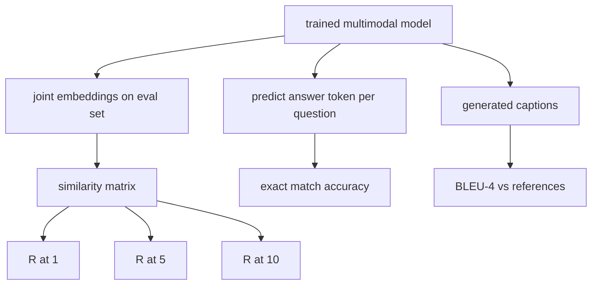

# Multimodal Evaluation / 多模态评估

> 训练只是 loop 的一半，另一半是 measurement。本课从 primitives 构建三个 evaluation surfaces：image-caption retrieval 报告 R@1、R@5、R@10；visual question answering 报告 exact match accuracy；image captioning 报告 BLEU-4。每个 metric 都是 model outputs 上的函数，并且 synthetic eval suite 几秒内可跑完。

**类型：** 构建
**语言：** Python
**前置知识：** 第 19 阶段第 58-62 课（Track E 基础: encoder, transformer, projection, cross-attention fusion, pretraining）
**时间：** 约 90 分钟

## Learning Objectives / 学习目标

- 从 image 和 caption embeddings 的 similarity matrix 计算 Recall@K。
- 从将 (image, question) pairs 映射到 fixed answer vocabulary 的 model 计算 exact-match VQA accuracy。
- 不依赖外部库，从 generated 和 reference token sequences 计算 BLEU-4。
- 在第 62 课 trained model 之上构建 synthetic suite，并运行三类 evals。

## The Problem / 问题

当 training loss plateau 时，很容易误以为 multimodal model 已经完成。training loss 衡量的是训练分布上的 fit；它不衡量模型能否在 held-out batch 中 rank pairs、回答问题，或写出人能接受的 caption。标准上至少需要三个 eval surfaces：

- **Retrieval (R@1, R@5, R@10).** 为 query caption 构建 joint embedding；按 cosine 排序 eval pool 中每张 image；报告 matching image 是否落入 top 1、top 5、top 10。对称的 image-to-text 形式也同样运行。
- **Visual question answering (exact match).** 给定 (image, question)，模型输出 answer token。exact match 对每个 sample 是一位：predicted answer 是否等于 reference answer？再对 eval set 求平均。
- **Captioning (BLEU-4).** 生成 caption。对 reference captions 计算 1-gram 到 4-gram precisions 的几何均值，并加 brevity penalty。multi-reference 是标准形式（一张 image，多条 reference captions）。

每个 metric 都是一个很薄的函数。本课把它们全部写出来，让数学具体、接口可控。真实 benchmark suites（MS-COCO、VQA v2、GQA、OK-VQA）都能接入同样的函数形状。

## The Concept / 概念



### Recall@K from a similarity matrix / 从相似度矩阵计算 Recall@K

构建 image 和 caption embeddings 之间的 `(N, N)` cosine similarity matrix。对每一行，按 similarity 降序排列 columns。Recall@K 是 diagonal column index 落在 top K positions 中的 row 比例。symmetric Recall@K（caption-to-image）在 transposed matrix 上计算，并同时报告。对 N=100 的 eval，R@1 = 0.6 表示 100 个 captions 中有 60 个把正确 image 排在第一。

### VQA exact match / VQA 精确匹配

对每个 (image, question, answer)，先 encode image、embed question，再通过 decoder fuse，并读出 next token。predicted token id 与 reference id 比较，相等即 correct。最后对 eval set 求平均。真实 VQA datasets 会为每个 question 提供多个人类标注答案，并使用 soft-accuracy formula（10 个 annotators 中至少 3 个一致时为 1.0，低于则缩放）；本课为了清晰使用 single-answer exact match。

### BLEU-4

```text
BLEU-4 = BP * exp(mean(log p1, log p2, log p3, log p4))
```

其中 `p_n` 是 modified n-gram precision（generated n-grams 中出现在任一 reference 的 clipped count，除以 generated n-grams 总数），`BP` 是 brevity penalty：

```text
BP = 1                if generated length > reference length
   = exp(1 - r/g)     otherwise, where r is reference length and g is generated
```

小样本下某些 `p_n` 可能为零，因此需要 smoothing。实现使用 Chen and Cherry "method 1"：任何 zero count 都给 numerator 和 denominator 加 1，这是 low-count regimes 下最安全的默认。

### Synthetic eval suite / 合成评估集

50-sample eval suite 在内存中构建，使用第 62 课 mock corpus 的同类 pattern，但使用 held-out seed。suite 由三个 lists 组成：

- `pairs`: 50 (image, caption_ids) pairs for retrieval.
- `vqa`: 50 (image, question_ids, answer_id) triples.
- `caps`: 50 (image, [reference_caption_ids, ...]) entries with up to 3 references per image.

suite 由 seed deterministic 生成，并且与 training corpus held out，因此 metrics 会在模型没见过的数据上计算。把 suite 持久化为 JSON 留作练习。

| Metric | Range | Random baseline (N=50) |
|--------|-------|------------------------|
| R@1 | 0 to 1 | 0.02 (1 / N) |
| R@5 | 0 to 1 | 0.10 |
| R@10 | 0 to 1 | 0.20 |
| VQA EM | 0 to 1 | 1 / vocab |
| BLEU-4 | 0 to 1 | small but nonzero |

在 synthetic data 上训练 50 steps 后，不要求 metrics 很高；要求它们高于 random baseline。demo 会检查这一点。

## Build It / 动手构建

`code/main.py` implements:

- `recall_at_k(sim_matrix, k)`, returning a float in `[0, 1]` for both directions.
- `vqa_exact_match(predictions, references)`, returning the mean over `int` equality.
- `bleu4(generated, references, smoothing=True)`, with multi-reference support.
- `build_eval_suite(seed, n_samples, vocab_size, max_len)`, returning three deterministic eval lists.
- `evaluate(model, suite)`, which runs all three metrics and returns a `dict` of numbers.
- A demo that loads a freshly-initialized multimodal model from lesson 62, evaluates it, then trains it for 50 steps and evaluates again, printing the before/after metrics.

Run it:

```bash
python3 code/main.py
```

输出：before/after metric table 会显示 retrieval 从 near-random 向 model learned signal 改善，VQA 超过 random，BLEU-4 也上升（synthetic structure 足以带来 4-gram precision lift）。

## Use It / 应用它

每个 metric 都能直接映射到生产 benchmark：

- **Retrieval.** MS-COCO 5K val、Flickr30K、ImageNet zero-shot 都是同一 similarity matrix 上的 R@K 问题。把 synthetic eval 替换为真实文件即可，function signature 不变。
- **VQA.** VQA v2、GQA、OK-VQA 使用同样的 exact-match shape（VQA v2 用 soft-acc 替代 single-answer EM）。
- **BLEU-4.** MS-COCO captioning、NoCaps、Flickr30K captioning 都使用 BLEU-4，再加 CIDEr 和 METEOR。CIDEr 只是多一个函数。

真实 benchmarks 中，替换 `build_eval_suite` 为真实 loader，保留 function bodies。metric math 与 benchmark 无关。

## Tests / 测试

`code/test_main.py` covers:

- recall@k returns 1.0 on a perfect identity similarity matrix and 0.0 on a flipped one for k < N
- recall@k respects `k <= N` upper bound
- bleu4 returns 1.0 when generated equals one of the references exactly
- bleu4 returns 0.0 on disjoint vocabulary
- vqa exact match equals the fraction of equal pairs
- build_eval_suite returns the expected number of pairs, vqa items, and caption entries

Run them:

```bash
python3 -m unittest code/test_main.py
```

## Ship It / 交付它

交付物是一个 benchmark-agnostic evaluation surface：`evaluate(model, suite)` 返回 retrieval、VQA 和 captioning metrics，且 synthetic suite 能做秒级 smoke test。后续替换真实 loader 时，不应该改动 metric functions。

## Exercises / 练习

1. 给 captioning metrics 增加 CIDEr。CIDEr 对 n-grams 做 TF-IDF weighting，会奖励信息量更高的 tokens。

2. 实现 soft-accuracy VQA：每个问题有多个人类答案，如果任一匹配，accuracy 是 `min(human_count / 3, 1)`。这复现 VQA v2。

3. 增加 NaN-safe 版 `bleu4`，处理 empty generated sequences 时不崩溃。

4. 在 R@K 之外计算 mean reciprocal rank (MRR)。MRR 对正确 item 落在 top K 之外的位置更敏感；R@K 只关心是否落入 top K。

5. 在训练过程的五个 checkpoints（step 0、10、20、30、40、50）上运行 eval 并画 learning curve。确认 metric trajectories 与 loss trajectory 一致。

## Key Terms / 关键术语

| Term | What it means |
|------|---------------|
| R@K | query 的正确 match 落在 top K results 中的比例 |
| Exact match | 最简单的 VQA scoring：predicted answer 等于 reference |
| BLEU-4 | 带 brevity penalty 的 1- 到 4-gram precisions 几何均值 |
| Multi-reference | captioning metric 对每张 image 接受多条 reference captions |
| Held-out | eval set 使用与 training corpus 不同的 seed 采样 |

## Further Reading / 延伸阅读

- VQA v2 paper for the soft-accuracy formula and dataset statistics.
- CIDEr paper for TF-IDF-weighted n-gram captioning.
- BLEU original (Papineni et al., 2002) for the smoothing variants.
- MS-COCO captioning eval scripts for the canonical reference implementation.
