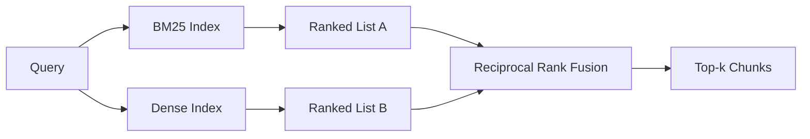

# Hybrid Retrieval with BM25 and Dense Embeddings / BM25 与 Dense Embeddings 混合检索

> lexical retrieval 和 semantic retrieval 会在相反的 query distributions 上失败。使用 reciprocal rank fusion 的 hybrid retrieval 不是插值，而是投票；而投票在每类 query 上都会赢。

**类型：** 构建
**语言：** Python
**前置知识：** 第 11 阶段第 04 课（embeddings）, 06（RAG）; 第 19 阶段 Track B 基础（第 20-29 课）; 第 19 阶段第 64 课（chunking strategies）
**时间：** 约 90 分钟

## Learning Objectives / 学习目标

- 按 Robertson and Sparck Jones formulation 从零实现 BM25，包含 field weighting、document length normalization，以及可调 `k1` 和 `b`。
- 在 deterministic mock embedding 上构建 dense retriever，让 loop 离线运行。
- 精确实现 Cormack、Clarke、Buettcher 2009 年发布的 reciprocal rank fusion，并解释它为什么优于 score-weighted interpolation。
- 调整 RRF `k` constant 和 per-modality weights，并读懂小型 fixture corpus 上的 trade-offs。

## The Problem / 问题

当 query 带有 corpus 中逐字出现的 literal identifier 时，lexical search 胜出。查询 `AbortMultipartOnFail` 时，BM25 可以在微秒级返回正确的 Go function。相同 query 被 embedding 后，向量可能落在三个 similarity clusters 边界上，dense retriever 反而把错误文件排到第一。

当 query 与 corpus literal tokens 完全改写时，dense search 胜出。用户问 “how do we handle cancelled uploads” 时，没有输入 abort 或 multipart。BM25 可能返回包含 uploads 一词的 “uploading large files” 文档。Dense retrieval 则会找到 summary 中提到 cancellation 的 abort function。

两者之间的选择不是静态的。query distribution 才是变量。生产 RAG system 从同一个 endpoint 同时处理两类 query，因此 retrieval 必须同时覆盖二者。这就是 hybrid retrieval。merge step 必须做对。

## The Concept / 概念



### BM25 in one paragraph / 一段话解释 BM25

BM25 对 query-document pair 的打分，是对 query terms 求和：inverse document frequency factor 乘以 saturating term-frequency factor，并带 document length normalization。两个 knob。`k1` 控制 term-frequency saturation；默认 1.5 是 published recommendation，没有 benchmark 不要乱动。`b` 控制 document length 的影响；默认 0.75 表示 longer documents 会被惩罚，但不是线性惩罚。

IDF 使用 smoothed Robertson and Sparck Jones definition：`log((N - df + 0.5) / (df + 0.5) + 1)`。log 内的 plus-one 会在某个 term 出现在超过半数 corpus 时仍保持 IDF 为正。这对小 corpus 很重要，因为 stopwords 技术上也可能不算常见。

field weighting 允许你告诉 BM25：symbol name 中的匹配比 body 中的匹配更重要。实现方式是在 indexing 时给 term counts 乘 multiplier，而不是在 scoring time 单独处理。这样数学形式不变，也避免每个 field 单独算 score。

### Dense retrieval in one paragraph / 一段话解释 Dense retrieval

用 embedding model 把每个 chunk 编进固定维度 vector。query time 时，embed query，对所有 chunks 按 cosine similarity 排序，返回 top-k。model 决定质量；retrieval algorithm 本身只有两行：dot product 和 sort。

本课使用 deterministic hash-based embedding，这样你可以不做 network call 就读懂 fusion math。hash 会把 token-keyed offsets 累加到 96-dimensional vector 中并归一化。cosine ranks 跨 runs deterministic，这是 test suite 需要的。

### Reciprocal rank fusion, the published formula / Reciprocal rank fusion 的发布公式

给定两个 ranked lists。对出现在任一 list 中的每个 candidate，求 reciprocal-rank contributions 的和。2009 年论文使用 `1 / (k + rank)`，默认 k 等于 60。按总分排序。这就是完整算法。

published constant k = 60 不是随便选的。k = 60 时，rank-1 contribution 是 1 / 61，rank-10 contribution 是 1 / 70。贡献衰减慢，因此 deep candidates 仍能投票。更小的 k 会让 top results 主导。更大的 k 会把 contribution curve 拉平。

我们的实现有两个可调 knob：`k` constant；以及一对 per-modality weights，让你在有先验时 boost BM25 或 dense。把 rank contribution 乘以 weight 是最简单且有原则的实现：它保留 rank-decay shape，并保持 scale-free。

### Why fusion beats score-weighted interpolation / 为什么 fusion 优于 score-weighted interpolation

BM25 scores 无上界且依赖 corpus。cosine similarities 被限制在 -1 到 1。线性组合 `alpha * bm25 + (1 - alpha) * cosine` 需要每个 corpus 单独调 alpha，而且每次 reindex 都可能失效。rank-based fusion 不会。两个 ranks 可跨 modalities 比较。published RRF baseline 自 2010 年以来在公开 TREC tracks 上一直优于 score-interpolation。

这也是 Vespa 和 Weaviate 文档中 RankFusion vs RRF 的核心论点。它们得到同样结论：除非有非常强的证据要做 score interpolation，否则保持 rank-based。

## Build It / 动手构建

`code/main.py` implements:

- `tokenize(text)` - a fast regex tokenizer.
- `BM25Index` - field-weighted, with `add` and `search` and tunable k1, b.
- `mock_embed`, `DenseIndex` - the same deterministic embedding as lesson 64 so chunks are comparable.
- `rrf(rankings, k, weights)` - the published fusion with multi-modality weights.
- `HybridRetriever` - combines BM25 and dense.
- A demo `main()` that loads a small fixture corpus, runs three queries that target each retriever's strength and weakness, and prints the rankings each modality produced plus the fused list.

Run it:

```bash
python3 code/main.py
```

并排阅读 demo output。literal identifier query 在 BM25 rank 1、dense rank 4、RRF rank 1。paraphrased query 在 BM25 rank 6、dense rank 1、RRF rank 1。ambiguous query 在 BM25 rank 3、dense rank 3、RRF rank 1。fusion 不是 tie-breaker；它是在每类 query 上取胜的系统。

## Tuning the knobs / 调参

| Knob | Default | Move it up when | Move it down when |
|------|---------|----------------|------------------|
| BM25 k1 | 1.5 | Terms repeat in documents and you want frequency to matter more | Documents are short and term repetition is noise |
| BM25 b | 0.75 | Long documents really do say less per word | Document length is uncorrelated with topic |
| RRF k | 60 | Deep candidates should keep voting | The top-1 should dominate |
| BM25 weight | 1.0 | Your corpus contains literal identifiers and queries match them | Your queries are user-paraphrased |
| Dense weight | 1.0 | Queries are paraphrased | Queries are literal |

调参要通过第 68 课的 eval harness 在 held-out query set 上重跑，而不是靠直觉。

## Failure modes the demo will hide / demo 会隐藏的失败模式

**Out-of-vocabulary tokens.** BM25 的 IDF 从 corpus 计算，因此只出现在 query 中的 terms 贡献为零。Dense embeddings 会为同一 term hallucinate 一个 vector。对 out-of-corpus identifiers，dense modality 会返回看似合理但错误的 neighbors。fusion 能吸收这个问题，因为 BM25 没返回结果时 rank contribution 会消失，但前提是按 document 去重，而不是按 chunk 去重。

**Stop-token domination.** BM25 查询词 `"the"` 会在 corpus 上产生近乎 uniform ranking。要么在 indexer 中过滤 stop tokens，要么接受 high-IDF terms 会自然主导。

**Identical content across modalities.** 如果 corpus 小到 BM25 top-1 和 dense top-1 是同一个结果，RRF 会给你同样的 top-1 和 neighbors。这是正确行为，不是失败，但会让 fusion 看起来隐形。向 eval 加一个 adversarial query pair，验证 fusion 确实工作。

## Use It / 应用它

Production patterns:

- BM25 可以 in process 建 index；瓶颈是 term-frequency dictionary，不是 vectors。
- dense vectors 放在单独 store 中建 index（本课使用 flat list；生产中会用 HNSW）。
- 两类 queries 并行运行；fusion 是对 union 做 constant-time merge。
- 持久化每个 retrieved hit 的 modality，让下游 reranker 知道是谁投了票。

## Ship It / 交付它

第 66 课会拿本课 fused top-k，并用 cross-encoder rerank。第 68 课会用 precision、recall、MRR、nDCG 评估完整 pipeline。本课 hybrid retriever 是第 69 课 end-to-end system 的第一检索阶段。

## Exercises / 练习

1. 用 provider 的真实模型替换 `mock_embed`。重跑 demo，并报告 paraphrased query 上 dense-only ranking 的变化。
2. 增加第三种 modality：单独 index chunk summaries，并作为第三个 ranked list 融合。测量收益。
3. 在 10、30、60、100、200 上 sweep RRF k。画出第 68 课的 recall@k curve，并报告你的 corpus 上 curve peak 对应的 k。
4. 正确实现 BM25F（per-field length normalization，而不是 multiplier trick），并在 symbol matches 最重要的 corpus 上比较。

## Key Terms / 关键术语

| 术语 | 常见说法 | 实际含义 |
|------|-----------------|------------------------|
| BM25 | "Lexical search" | idf x saturating tf x length normalization 的 probabilistic ranking |
| RRF | "Rank fusion" | 在 ranked lists 上求 1 / (k + rank) 的和；默认 k = 60 |
| k1 | "TF saturation" | 控制 repeated term 停止增加更多 score 的速度 |
| b | "Length penalty" | 0 表示忽略 document length，1 表示完整 normalization |
| Field weighting | "Symbol boost" | indexing 时重复 tokens，以 boost 特定 field 的 matches |
| Rank-based vs score-based fusion | "Why RRF beats linear" | ranks 可跨 modalities 比较；scores 不行 |

## Further Reading / 延伸阅读

- Cormack, Clarke, Buettcher, "Reciprocal Rank Fusion outperforms Condorcet and individual rank learning methods", SIGIR 2009
- Robertson, Walker, Beaulieu, Gatford, Payne, "Okapi at TREC-3" (the original BM25 paper)
- [Vespa: Hybrid Retrieval with BM25 and Embeddings](https://docs.vespa.ai/en/tutorials/hybrid-search.html)
- [Weaviate: Hybrid Search](https://weaviate.io/developers/weaviate/search/hybrid)
- Phase 11 lesson 06 - RAG fundamentals
- Phase 19 lesson 64 - chunkers whose output is indexed here
- Phase 19 lesson 66 - cross-encoder reranker that consumes the fused top-k
