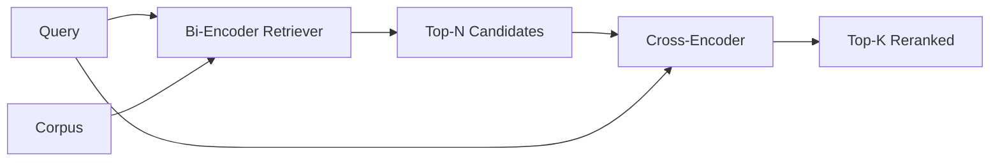

# Cross-Encoder Reranker / Cross-Encoder 重排器

> bi-encoder 会独立 embed query 和 document。cross-encoder 会把它们拼起来并同时阅读。cross-encoder 是最聪明的 reader，也是最慢的 reader。把它作为 bi-encoder top-k 之后的第二阶段使用，成本是值得的。

**类型：** 构建
**语言：** Python
**前置知识：** 第 11 阶段第 06 课（RAG）, 第 11 阶段第 07 课（advanced RAG）; 第 19 阶段 Track B 基础（第 20-29 课）; 第 19 阶段第 65 课（hybrid retrieval feeding this stage）
**时间：** 约 90 分钟

## Learning Objectives / 学习目标

- 按 input shape、parameter count、per-query cost 区分 bi-encoder retriever 和 cross-encoder reranker。
- 从零实现一个小型 cross-encoder：它是消费 packed (query, document) sequence 并输出单个 relevance scalar 的 transformer block。
- 接入 two-stage retrieve-then-rerank pipeline：cheap retriever 返回 top-N，cross-encoder 把 N 重排为 top-K，然后返回 K。
- 在小型 fixture corpus 上测量 latency-vs-quality trade-off，并为给定 latency budget 选择正确的 N。

## The Problem / 问题

bi-encoder 把 query 和 document 映射到同一个 vector space，然后按 cosine 排序。两个 encodings 从不互相看见。模型必须在不了解 query 的情况下，把 document 中所有有用信息压进单个 vector。这样很快：document 在 index time embed 一次，query 在 query time embed 一次；它也是 corpus scale ranking 唯一可行的方式。

代价是 precision。两个 documents 如果整体 topic 相同，即使一个回答 query、另一个不回答，embedding 也可能非常接近。bi-encoder 分不清。

cross-encoder 通过一起阅读 query 和 document 来解决。模型接收 `[query] [SEP] [document]` 作为单个 sequence，在 join 上运行 full attention，并输出一个 relevance scalar。document 的每个 token 都能 attend 到 query 的每个 token。模型用完整 context 决定 score。

代价是 throughput。bi-encoder embed 一次可长期查询；cross-encoder 每个 (query, document) pair 都要跑一次。对一千万文档 corpus，这意味着每个 query 一千万次 forward pass。在 request budget 内不可运行。

解决方案是 staging。先用 bi-encoder 取 top-N，再用 cross-encoder 把 N 重排成 top-K。N 很小（50 到 200），cross-encoder 的 quality lift 集中在最有价值的候选上。total latency 仍在 request budget 内。total quality 是 cross-encoder 的质量，但上限受 bi-encoder recall at N 约束。

## The Concept / 概念



### The cross-encoder's input shape / Cross-encoder 的输入形状

标准 packing 是 `[CLS] query_tokens [SEP] document_tokens [SEP]`。CLS-position output 送入单个 linear head，输出 relevance scalar。有些实现用 mean-pooling 代替 CLS，差异不大。重点是模型为每个 pair 产出一个数字。

22M-parameter cross-encoder（published `ms-marco-MiniLM-L-6-v2` weight class）是常见生产点。更小的模型损失质量比节省 latency 更快。更大的模型（例如 568M parameters 的 `bge-reranker-v2-m3`）通常留给 offline reranking，或 K 很小的 first-page reranking。

### Why this lesson trains a tiny one / 为什么本课训练一个 tiny 版本

真实 cross-encoder 是 finetuned encoder transformer。生产中你会加载 checkpoint 并运行它。本课目标是展示 model shape 和 latency-quality curve，不是训练 SOTA ranker。因此我们构建一个小型 `nn.Module`：一个 transformer block、multi-head attention（默认 4 heads）和一个 regression head。它从 seed deterministic 初始化，因此 demo 不需要磁盘 weights 也可复现。

toy model 会从 fixture corpus 学到正确形状：relevant query-document pairs 的 predicted scores 高于 irrelevant pairs。端到端 pipeline 会重排 bi-encoder output，且 rerank top-k 与 gold labels 相关。

### Latency vs quality / 延迟与质量

two-stage pipeline 只有一个可调参数：N。在 held-out query set 上把 N 从 5 sweep 到 100，会得到如下曲线形状。

| N | Recall@1 of stage 2 | Cross-encoder forward passes per query | Latency |
|---|--------------------|---------------------------------------|---------|
| 5 | 0.62 | 5 | low |
| 20 | 0.81 | 20 | medium |
| 50 | 0.86 | 50 | high |
| 100 | 0.86 | 100 | very high |

上面的数字用于说明 shape，不是本 fixture 的测量值。shape 是真实的：20 到 50 candidates 附近通常有一个 knee，之后 rerank lift 饱和，再往后就是白付成本。

N 应由 eval curve 加 latency budget 决定。cross-encoder 不能把 recall 提高到 bi-encoder recall at N 以上，所以过低的 N 不只是限制 latency，也限制 quality。

## Build It / 动手构建

`code/main.py` implements:

- `CrossEncoder` - a small `torch.nn.Module`: token embedding, one transformer block with multi-head attention and feedforward, mean-pooled head producing one scalar.
- `tokenize_pair(query, document)` - packs the two strings into a single id sequence with type ids that mark the boundary, deterministic and stdlib.
- `train_tiny(pairs)` - one pass of supervised training on a hand-labeled (query, document, relevance) triple list, so the model produces sensible scores on the fixture.
- `rerank(query, candidates, top_k)` - the production interface.
- `pipeline(query, retriever, top_n, top_k)` - the two-stage flow.
- A demo `main()` that loads the corpus from lesson 65's pattern, retrieves top-N, reranks to top-K, prints both lists side by side, and reports the latency of each stage.

Run it:

```bash
python3 code/main.py
```

输出会展示 bi-encoder top-N、cross-encoder top-K 和 timing summary。cross-encoder 每次调用更慢，但不会在完整 corpus 上运行。two-stage total 仍能留在 request budget 内，同时选出 bi-encoder 排在第二或第三的正确答案。

## Failure modes the demo will hide / demo 会隐藏的失败模式

**Cross-encoder is not symmetric.** `rerank(q, d)` 和 `rerank(d, q)` 是不同分数。永远把 query 放前面。如果不小心交换，recall 会崩。

**N is too low to expose the bug.** 如果 N = K，cross-encoder 无法重新排序，只能重新加权。lift 看起来为零。N 至少选 K 的三倍。

**Training data leaks into the eval.** 如果 hand-labeled training pairs 包含 eval queries，rerank 会看起来像魔法。即使在 fixture 上，也要严格分离 train 和 eval。

**Production weights are dense.** 22M-parameter cross-encoder 在 float32 下约 88MB。承诺 sub-100ms p95 前，先规划 model server memory。

**Batching matters.** 真实 cross-encoder 会把 N 个 candidates 放进一个 batch。本课在 `_batch_encode` 中这么做：构造 batched id 和 type-id tensors（`torch.tensor(...)`），然后跑一次 forward pass。跳过 batching，latency 会乘以 N。

## Use It / 应用它

Production patterns:

- 把 bi-encoder、cross-encoder 和 N 绑定在一起 pin 住。任何一个改变都会使 eval 失效。
- 按 (query, document_id) hash 缓存 reranker output。同一个 query 面向稳定 corpus 会重排到同一顺序；cache hit 能免费削 latency。
- 记录 rank-1 cross-encoder score。top-1 score 低于 corpus-specific threshold 的 query 是 out-of-domain hit；传给 LLM 时要标记 “I am not confident”。

## Ship It / 交付它

第 68 课会端到端评估这个 two-stage pipeline。第 69 课会把本 reranker 接在第 65 课 hybrid retriever 之后、answer generator 之前。reranker 是 end-to-end system 的第二阶段。

## Exercises / 练习

1. 从 5 到 50 sweep N，并画出 reranked output 的 recall@1。找出该 fixture 上的 knee。
2. 把 cross-encoder 训练十个 epochs，而不是一个。测量每个 epoch positive 和 negative pairs 的 score-margin。
3. 用 CLS-token head 替换 mean-pooling。比较本 fixture 上的 convergence。
4. 增加第二个 cross-encoder head，预测 binary “is this answer in the document” label。inference 时两个 heads 都用：一个排序，一个 threshold。
5. 用第 65 课的 retriever 替换 deterministic mock bi-encoder，并串起两阶段。测量 top-K 相比 bi-encoder alone 的变化。

## Key Terms / 关键术语

| 术语 | 常见说法 | 实际含义 |
|------|-----------------|------------------------|
| Bi-encoder | "Vector retriever" | 独立 encode query 和 doc，再用 cosine 排序 |
| Cross-encoder | "Reranker" | 联合 encode (query, doc)，输出一个 relevance scalar |
| Two-stage pipeline | "Retrieve and rerank" | cheap retriever 返回 N，expensive reranker 保留 K |
| N (candidate budget) | "Rerank pool" | cross-encoder 每个 query 要打分的 candidates 数量 |
| Mean-pooling head | "Mean of last hidden" | 把 encoder last-layer outputs 平均成一个 vector |

## Further Reading / 延伸阅读

- Nogueira, Cho, "Passage Re-ranking with BERT", 2019 - the canonical cross-encoder ranker paper
- Reimers, Gurevych, "Sentence-BERT: Sentence Embeddings using Siamese BERT-Networks", 2019 - on bi-encoders vs cross-encoders
- [SentenceTransformers Cross-Encoders documentation](https://www.sbert.net/examples/applications/cross-encoder/README.html)
- [BGE Reranker v2 model card](https://huggingface.co/BAAI/bge-reranker-v2-m3)
- Phase 19 lesson 65 - the hybrid retriever feeding this rerank stage
- Phase 19 lesson 68 - the eval that measures the lift this rerank delivers
