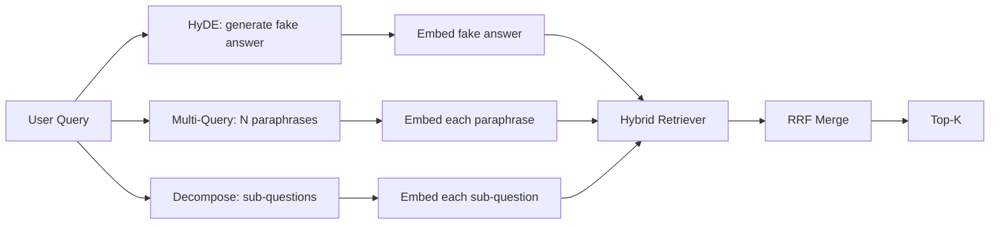

# Query Rewriting: HyDE, Multi-Query, and Decomposition / 查询改写：HyDE、多查询与分解

> 用户输入的 query 通常不是 retriever 想要的 query。rewriting 在 retrieval 前弥合这个 gap，让 index 看到更接近答案形态的内容。

**类型：** 构建
**语言：** Python
**前置知识：** 第 11 阶段第 04 课（embeddings）, 06（RAG）; 第 19 阶段 Track B 基础（第 20-29 课）; 第 19 阶段第 64、65 课
**时间：** 约 90 分钟

## Learning Objectives / 学习目标

- 实现 Hypothetical Document Embeddings (HyDE)：生成 fake answer，embed 它，并用该 vector 而不是 query vector 检索。
- 实现 multi-query expansion：把一个 query 改写成 N 个 paraphrases，用每个版本检索，并通过 reciprocal rank fusion 合并 union。
- 实现 query decomposition：把复杂问题拆成 sub-questions，逐个检索，再合并。
- 在同一 fixture 上正面对比三种 rewriters，并解释每种策略何时胜出。
- 接入 mock LLM，产出 deterministic、on-fixture outputs，让 rewriter loop 离线运行。

## The Problem / 问题

用户输入 “what does our team do when uploads fail and the budget is gone?”。corpus 中的文档写的是 “AbortMultipartOnFail aborts an in-flight S3 multipart upload and decrements the per-bucket retry budget when the upload fails”。query 和 document 没有共享 noun phrase。BM25 会错过。bi-encoder 会把该文档排第三或第四，因为 query vector 落入 embedding space 中偏向 cancelled jobs 文档的区域，而不是 aborted uploads 文档区域。第 66 课的 two-stage rerank 如果它进入 top-N，还能救回来；但如果连 top-N 都进不去，reranker 永远看不到它。

修复方式是在 query 触达 retriever 前先改写。Gao 等人在 2023 年论文 "Precise Zero-Shot Dense Retrieval without Relevance Labels" 中提出 HyDE：让 LLM 写出能回答该 query 的 document，embed 这个 hypothetical document，并把它的 embedding 作为 retrieval vector。hypothetical document 位于 embedding space 的正确区域，因为它用的是 corpus 的语气。原 query vector 没做到这一点。

HyDE 还有两个近亲技术。Multi-query expansion（Microsoft GraphRAG 使用的术语）生成 query 的 N 个 paraphrases，分别检索后合并。Decomposition（2024 Stanford DSPy work 中作为 “subquery decomposition” 推广）把 “what does our team do when uploads fail and the budget is gone” 拆成两个问题：“what happens when an upload fails” 和 “what happens when the retry budget is gone”。两次 retrieval，一个 merged result，答案的两个部分都可达。

本课实现三者，并在同一 fixture corpus 上运行。

## The Concept / 概念



### HyDE in detail / HyDE 细节

HyDE 用 LLM 写出的 hypothetical document vector 替换用户 query vector。prompt 很短：

```
You are a domain expert. Write a one-paragraph passage that answers the question
below. Use the same vocabulary and phrasing the documentation in this domain would
use. Do not refuse. Do not say you do not know.

Question: {user_query}

Passage:
```

LLM 的 answer 作为事实答案是错的，因为 LLM 不知道你的 corpus。这没关系。retriever 不关心 factual correctness，只关心 token distribution。hypothetical passage 包含 “abort”、"multipart"、"bucket"、"budget" 等词，因为这个 topic 的 documentation passage 会这么写。embed 这个 passage，vector 就会落在真实 passage 附近。

生产中要把 hypothetical document 限制在两三句话内。更长的 hypotheticals 会收集更多 noise；更短的会失去 HyDE 需要的 lexical signal。

### Multi-query expansion in detail / 多查询扩展细节

生成用户 query 的 N 个 paraphrases。最简单的 prompt：

```
Rewrite the following question in {N} different ways. Each rewrite must preserve
the original intent. Number them 1 to {N}. Do not add explanations.
```

对每个 paraphrase 检索 top-k。用第 65 课相同的 RRF 合并 N 个 ranked lists。便宜、并行、deterministic。

当用户 phrasing 只是众多同义问法中的一种，且某个 rewrite 能问得更好时，multi-query 胜出。当所有 rewrites 都以同样方式很差时，它会失败。

### Decomposition in detail / 分解细节

单次 retrieval 无法满足 multi-faceted question。decomposition 让 LLM 把问题拆成 sub-questions，系统再按 sub-question 检索。prompt：

```
The following question may require information from multiple distinct topics.
Decompose it into a list of sub-questions. Each sub-question must be answerable
independently. If the question is already atomic, return it unchanged.

Question: {user_query}
```

每个 sub-question 各自检索，再合并。对包含 conjunctions、multi-clause comparisons 或两个无关 topics 的问题，decomposition 是正确工具。对 atomic questions 它是错误工具；decomposer 在这种场景的职责是返回原问题，而不是发明 fake sub-questions。

### Why all three exist / 为什么三者都需要

三者互补。HyDE 弥合 query-corpus token gap。Multi-query 覆盖 paraphrase variance。Decomposition 覆盖 multi-topic queries。生产系统通常三者都跑，并按 query 选择策略（第 69 课的 end-to-end system 展示 selector）。

## The Mock LLM / Mock LLM

本课离线运行。mock LLM 是一张小 lookup table，以用户 query 为 key，并为未见 query 提供 fallback。lookup table 包含：

- 每个 fixture query：一段 hypothetical passage、三个 paraphrases 和一个 decomposition。
- 未知 query：deterministic transformation：取 query 的 content words，通过 synonym map 扩展，并返回结果。

mock 的 shape 比数据更重要。生产中你会把 mock 换成真实 model call。retriever 不变。

## Build It / 动手构建

`code/main.py` implements:

- `MockLLM` - the deterministic stand-in described above.
- `HyDERewriter` - calls the LLM to write the hypothetical document, returns the rewriter output as `RewriteResult` with the hypothetical text and the query the retriever should use.
- `MultiQueryRewriter` - calls the LLM for N paraphrases, returns a list of queries.
- `DecomposeRewriter` - calls the LLM to decompose, returns sub-questions.
- `retrieve_with_rewriter` - takes a rewriter and a retriever, runs the rewrites, fuses the results.
- A demo that runs the three rewriters on a fixture and prints which strategy returned the gold answer document first.

retriever shape 复用第 65 课（hybrid BM25 + dense）。fusion 仍是 RRF。唯一的新 shape 是 rewriter interface，而且它很小。

Run it:

```bash
python3 code/main.py
```

输出包含 per-strategy ranking 和 final summary。HyDE 在 phrasing-mismatched query 上胜出。Multi-query 在 paraphrase-variance query 上胜出。Decomposition 在 multi-topic query 上胜出。fallback（no rewriter）至少会输掉三者之一。

## Failure modes the demo will hide / demo 会隐藏的失败模式

**HyDE hallucinates corpus-specific identifiers wrong.** 模型发明一个 function name。hypothetical 对正确 doc 的 BM25 score 崩掉，因为发明的名称是高权重 token，但不在 index 中。限制 hypothetical 长度，并在 fusion 中降低 BM25 权重。

**Multi-query rewrites all converge.** 弱模型生成三个近乎相同的 paraphrases。N 次 retrieval 返回同样 top-k。RRF merge 不比单次 retrieval 更好。给 rewrite prompt 增加明确 diversity instruction，并用 Jaccard 检测重复。

**Decomposition over-splits.** decomposer 把 atomic question 拆成 list。retrievals 都返回同一 document，但 rank 降低。merge 比原 query 更差。fan-out 前加一轮 “are these sub-questions distinct enough” 检测。

**Latency multiplies.** HyDE 需要一次 LLM call。Multi-query 需要一次 LLM call 生成 N rewrites，然后 N 次 retrieval。Decomposition 需要一次 LLM call 分解，然后 M 次 retrieval。retrievals 可以并行；LLM call 是延迟底线。

## Use It / 应用它

Production patterns:

- 按 query length 做 per-query strategy selection：atomic short queries 用 multi-query，complex multi-clause queries 用 decomposition，jargon-heavy queries 用 HyDE。
- 按 query hash 缓存 rewriter output。很多 queries 会重复。
- 三种策略全部并行运行，并用 RRF 把三组结果合成一组。成本是三次 LLM calls 和一次 fusion；质量是三种策略 coverage 的 union。

## Ship It / 交付它

第 69 课会把这个 rewriter stage 接在第 65 课 retriever 和第 66 课 reranker 前。第 68 课会评估 rewriter 对 retrieval recall 的 lift。

## Exercises / 练习

1. 实现 RAG-Fusion（multi-query 的 2024 变体）：rewriter 生成刻意多样化 paraphrases，再由第 66 课 rerank step 选出 final list。
2. 增加第四种策略：step-back prompting（让 LLM 生成更一般的问题，在其上检索，再缩小范围）。在 fixture 上比较。
3. 给 decomposer 增加 “is the question atomic” head，训练它识别 atomic queries。测量前后的 over-split rate。
4. 用真实 model call 替换 mock LLM。测量你的 stack 上每种 strategy 的 latency。
5. 给每个 rewrite 增加 confidence score，丢弃低于 threshold 的 rewrites。测量对 recall 的影响。

## Key Terms / 关键术语

| 术语 | 常见说法 | 实际含义 |
|------|-----------------|------------------------|
| HyDE | "Fake-document retrieval" | LLM 写出答案；embed 该答案并检索，而不是 embed 原 query |
| Multi-query | "Paraphrase expansion" | query 的 N 个 rewrites；检索 N 次，用 RRF 合并 |
| Decomposition | "Subquery split" | multi-topic queries 拆成 sub-questions，分别检索 |
| Atomic query | "Single-topic" | 不能在不发明 fake sub-questions 的情况下继续分解 |
| Step-back | "Abstract the query" | 先问更一般的问题，检索后再缩窄 |

## Further Reading / 延伸阅读

- Gao, Ma, Lin, Callan, "Precise Zero-Shot Dense Retrieval without Relevance Labels" (HyDE), 2023
- Microsoft Research, "Multi-Query Expansion for Retrieval"
- Stanford DSPy, "Subquery Decomposition for Multi-Hop QA"
- [LlamaIndex query transformations documentation](https://docs.llamaindex.ai/en/stable/optimizing/advanced_retrieval/query_transformations/)
- Phase 11 lesson 07 - advanced RAG patterns
- Phase 19 lesson 65 - the retriever this rewriter feeds
- Phase 19 lesson 68 - the eval that measures the rewriter lift
