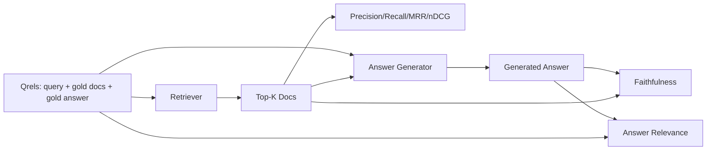

# RAG Evaluation: Precision, Recall, MRR, nDCG, Faithfulness, Answer Relevance / RAG 评估：Precision、Recall、MRR、nDCG、Faithfulness、Answer Relevance

> 如果你不能同时给 retrieval 和 answer 打分，就不能交付这个系统。它们不是同一个 metric，同一个 prompt 也会在不同轴上失败。

**类型：** 构建
**语言：** Python
**前置知识：** 第 11 阶段第 06 课（RAG）, 10（evaluation）; 第 19 阶段 Track B 基础（第 20-29 课）; 第 19 阶段第 64, 65, 66, 67 课
**时间：** 约 90 分钟

## Learning Objectives / 学习目标

- 从 gold qrels 计算四个 retrieval metrics：precision@k、recall@k、MRR (mean reciprocal rank)、nDCG@k。
- 计算两个 answer-grade metrics：faithfulness（每条 claim 都被 retrieved context 支持）和 answer relevance（answer 回答了 question）。
- 构建 fixture qrels file（queries、gold doc ids、gold answer text），让 eval 可以端到端读取。
- 根据 metric values 诊断 pipeline 的失败位置：retrieval、ranking、generation，还是 grounding。

## The Problem / 问题

一个 RAG system 至少有四个 moving parts：chunker、retriever、reranker、generator。任何一个都可能导致错误答案。没有 per-stage metrics，你就是盲飞。

用户报告 wrong answer。原因是什么？chunker 切断了 answer span？retriever 没把 chunk 放进 top-k？reranker 把正确 chunk 推到第一名之后？generator 忽略 chunk 自己编了内容？只看 answer 无法判断。你需要：

- Retrieval metrics 给 retriever 输出打分。
- Ranking metrics 给正确 chunk 在结果中的位置打分。
- Faithfulness 给 generator 是否停留在 retrieved context 内打分。
- Answer relevance 给 answer 是否真正回应 question 打分。

本课在 fixture qrels file 上构建全部六个 metrics。eval 离线且 deterministic；生产中把 mock LLM-as-judge 换成真实 judge。

## The Concept / 概念



### Precision@k

retriever 返回的 top-k documents 中，有多少比例属于 gold set？如果 gold 有三个 documents，top-3 返回其中两个和一个错误文档，则 precision@3 是 2 / 3。当 irrelevant retrieved chunk 的成本很高时使用 precision：generator 会浪费 tokens，或者 chunk 会污染答案。

### Recall@k

gold documents 中有多少比例出现在 top-k？如果 gold 有三个 documents，top-5 包含全部三个，则 recall@5 是 1.0。当 missed answer 的成本很高时使用 recall：你宁愿多看一个错误 chunk，也不愿完全错过 answer chunk。

生产 RAG 中最常引用的是 recall@k。generation 可以轻易丢弃 irrelevant chunks；但它不能凭空从没见过的 chunk 中发明答案。

### MRR (Mean Reciprocal Rank)

对每个 query，找出 ranked list 中第一个 relevant document 的位置。reciprocal rank 是 1 / position。对 query set 求平均。MRR 是 retriever 是否把最佳答案放到顶部的单数摘要。

MRR 对 position-1 权重很高。gold doc 在 rank 1 的 query 贡献 1.0；rank 2 贡献 0.5；rank 10 贡献 0.1。metric 会被列表顶部主导。

### nDCG@k

Normalized Discounted Cumulative Gain。完整公式会给每个 retrieved document 分配 gain（通常 relevant 为 1，irrelevant 为 0），按 position 的 log discount，求和后除以 ideal DCG（完美排序时的 DCG）。范围 0 到 1。

nDCG 支持 graded relevance：gold 可以说 “doc A 是 3，doc B 是 2，doc C 是 1”。MRR 和 recall@k 会把所有相关性压成 binary。一个 query 有多个部分相关 documents 时，使用 nDCG。

### Faithfulness / 事实支撑性

对 generated answer 中的每条 claim，检查该 claim 是否被 retrieved context 支持。标准实现使用 LLM-as-judge prompt，输入 (claim, context)，返回 yes 或 no。metric 是通过的 claims 比例。

Faithfulness 捕获 generator failure mode：模型发明内容。即使 retriever 返回了正确 chunks，hallucinating generator 仍然是坏的。Faithfulness 也常被称为 groundedness、support、attribution。

本课用 deterministic mock judge 实现 faithfulness：检查每条 claim 的 tokens 与 retrieved context 的 overlap 是否超过 threshold。生产中换成真实 model call。metric shape 不变。

### Answer relevance / 答案相关性

answer 是否真正回应 question？Faithfulness 问的是 “answer 是否 grounded in context?”；Answer relevance 问的是 “answer 是否 grounded in question?”。一个 faithful 但 off-topic 的答案 faithfulness 高、relevance 低。一个短而 on-topic 但忽略 context 的答案 relevance 高、faithfulness 低。

标准实现同样使用 LLM-as-judge：输入 (question, answer)，询问 answer 是否 addresses the question。本课使用 token-overlap-plus-judge stand-in。

## The fixture qrels / fixture qrels

```python
{
  "qid": "q1",
  "query": "what is the abort threshold for multipart uploads",
  "gold_doc_ids": ["d1", "d3"],
  "gold_answer_substring": "three failed parts",
  "graded_relevance": {"d1": 3, "d3": 2},
}
```

每个 query 携带：

- query string，
- gold doc ids set（用于 precision / recall / MRR），
- graded relevance dict（用于 nDCG），
- gold answer substring（作为每条 qrel 的 reference metadata；本课 faithfulness 是用 retrieved context 判断 extracted claims，而不是与该 substring 比对）。

生产中这些需要人工标注。本课提供 hand-built fixture，让 eval 开箱运行。

## Build It / 动手构建

`code/main.py` implements:

- `precision_at_k(retrieved, gold, k)` - the literal definition.
- `recall_at_k(retrieved, gold, k)` - the literal definition.
- `mean_reciprocal_rank(retrieved_list_of_lists, gold_list)` - the mean over queries.
- `ndcg_at_k(retrieved, graded_relevance, k)` - DCG / IDCG with binary or graded gains.
- `extract_claims(answer)` - splits an answer into sentence-shaped claims.
- `faithfulness(claims, context_texts, judge)` - fraction of claims judged supported.
- `answer_relevance(question, answer, judge)` - judge on whether the answer addresses the question.
- `MockJudge` - deterministic token-overlap judge so the eval runs offline.
- `evaluate_pipeline(pipeline_fn, qrels, ks)` - the orchestrator that runs every metric.
- A demo that runs three pipeline variants (chunker baseline, hybrid retrieval, hybrid + rerank) against the qrels and prints a metrics table.

Run it:

```bash
python3 code/main.py
```

输出会在一张 metrics table 中展示每个 variant 的 precision@k、recall@k、MRR、nDCG@k、faithfulness 和 answer relevance。hybrid retrieval 行在 recall 上超过 chunker baseline；rerank 行在 MRR 上超过 hybrid。

## Reading the metrics to diagnose failures / 读指标诊断失败

| Symptom | Likely cause | What to fix |
|---------|-------------|-------------|
| Low recall@k, low precision@k | Chunker cut the answer or retriever cannot find it | Chunker boundaries (lesson 64) or retriever modality (lesson 65) |
| Decent recall@k, low MRR | Right chunk is in top-k but not at position 1 | Reranker (lesson 66) |
| High MRR, low faithfulness | Generator invents content despite right context | Generation prompt; force-cite-or-refuse |
| High faithfulness, low relevance | Answer is grounded but off-topic | Query rewriter (lesson 67) or generation prompt |
| All four high, users still complain | Eval set is unrepresentative | Expand qrels with real user queries |

## Failure modes the demo will hide / demo 会隐藏的失败模式

**LLM-as-judge bias.** 模型会把自己的输出判得比实际更 faithful。judge 和 generator 使用不同 model family，或手工抽样标注。

**Qrels rot.** corpus 改变后 gold answers 会漂移。某个 doc 在 January 2024 是 q1 的 gold answer，但 October 2024 team 重命名 function 后就不再正确。安排季度 qrels review。

**Faithfulness micro-checks miss macro-claims.** per-sentence faithfulness 可能通过，但整体 answer structure 会误导。自动 metric 之外再加 sample-level qualitative review。

**Recall@k masks per-query failures.** 90% average recall 可能掩盖某类 query 永远 miss。按 query class（literal、paraphrased、multi-topic）切分 qrels，并报告 per-slice。

## Use It / 应用它

Production patterns:

- 每次 retriever 或 generator 变更都跑 eval。把 recall@k regression 当成 test failure。
- 持久化 per query metric trace。用户投诉时，查找匹配的 qrels entry，看它是否本应被捕获。
- 分层 qrels：20 条 smoke set 跑在 CI；200 条 regression set 每晚跑；2000 条 deep set 每周跑。

## Ship It / 交付它

第 69 课会把整个 pipeline（chunker、retriever、reranker、generator）接起来，并用本 eval 评估 end-to-end system。

## Exercises / 练习

1. 增加第五个 retrieval metric：hit-rate@k。与 recall@k 对比，解释二者什么时候不同。
2. 实现 graded faithfulness：0（unsupported）、1（partially supported）、2（fully supported）。相应更新 metric。
3. 用真实 model call 替换 mock judge。测量 fixture 上 mock 与 real judge 的 disagreement。
4. 增加 query-class slice（"literal"、"paraphrased"、"multi-topic"），报告 per-slice metrics。
5. 增加 answer length metric，并与 faithfulness 做 correlation。画出曲线。

## Key Terms / 关键术语

| 术语 | 常见说法 | 实际含义 |
|------|-----------------|------------------------|
| Precision@k | "Hit rate over retrieved" | top-k 中属于 gold 的比例 |
| Recall@k | "Hit rate over gold" | gold 中出现在 top-k 的比例 |
| MRR | "First-hit position" | 第一个 relevant document 的 1 / rank 的平均 |
| nDCG@k | "Graded ranking quality" | top-k DCG 除以 ideal DCG |
| Faithfulness | "Groundedness" | answer claims 中被 retrieved context 支持的比例 |
| Answer relevance | "Did it address the question?" | answer 是否匹配 question intent |
| Qrels | "Gold labels" | 带 query、gold documents 和 answers 的标注集合 |

## Further Reading / 延伸阅读

- Buckley, Voorhees, "Evaluating Evaluation Measure Stability", SIGIR 2000 - the canonical paper on ranking metrics
- Jarvelin, Kekalainen, "Cumulated Gain-based Evaluation of IR Techniques" - the nDCG paper
- [Ragas: Automated Evaluation of RAG Pipelines](https://docs.ragas.io)
- [Anthropic, Evaluating RAG](https://www.anthropic.com/news/evaluating-rag)
- Phase 11 lesson 10 - evaluation framework foundations
- Phase 19 lessons 64-67 - components evaluated here
- Phase 19 lesson 69 - the end-to-end pipeline this eval grades
