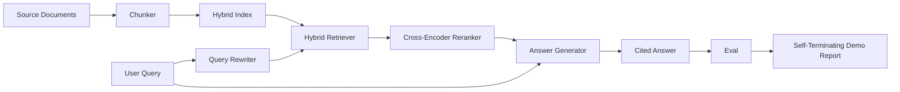

# End-to-End RAG System / 端到端 RAG 系统

> 六课组件。一个 pipeline。一个 eval loop。一个 self-terminating demo。这就是你要交付的系统。

**类型：** 构建
**语言：** Python
**前置知识：** 第 11 阶段第 06 课（RAG）, 10（evaluation）; 第 19 阶段 Track B 基础（第 20-29 课）; 第 19 阶段第 64, 65, 66, 67, 68 课
**时间：** 约 90 分钟

## Learning Objectives / 学习目标

- 把 chunker、hybrid retriever、query rewriter、cross-encoder reranker 和 answer generator 组合成单个 end-to-end pipeline。
- 实现一个 answer generator，它按 chunk anchor 引用每条 claim，并在 low-confidence 时 refuse。
- 运行第 68 课 eval，评估 assembled pipeline，并证明 staged build 在每个 metric 上都优于同组件 isolated 状态。
- 构建 self-terminating CLI demo：ingest fixture corpus、运行固定 query set，并以 summary report 和 exit zero 结束。

## The Problem / 问题

六个独立组件本身不能证明系统成立。chunker 可以在 corpus 上赢得 recall@5，却在 system recall@5 上失败，因为 retriever 无法正确 rank 它产出的 chunks。reranker 可以在 synthetic candidate pool 上提升 MRR，却在真实 bi-encoder candidates 上失败，因为 bi-encoder 的 recall at rerank budget 太低。query rewriter 可以在单个 query 上提升 gold doc，却在下一个 query 上崩掉，因为 LLM mock 返回了 degenerate hypothetical。

integration test 必须是整个 pipeline 端到端运行：同一个 fixture qrels、同一个 metric、一个 orchestrator file 把所有内容接起来。本课就是构建这个测试。如果 integrated pipeline 的 metrics 超过各阶段 isolated demo 的 metrics，就证明了系统。

## The Concept / 概念



### Wiring choices / 接线选择

pipeline 是一个小 graph。每个 stage 都是 signature 清晰的 function。

| Stage | Input | Output |
|-------|-------|--------|
| Chunker | Document text | List of Chunk records |
| Retriever | Query string | Top-N Chunk records |
| Rewriter (optional) | Query string | List of rewrites + hypothetical |
| Reranker | Query, candidates | Top-K Chunk records with cross scores |
| Generator | Query, top-K Chunk records | Answer string with citations |

当每个 signature 稳定时，composition 很直接。本课的 `Pipeline` class 持有五个 stages，并提供按顺序运行它们的 `query` method。每个 stage 都可替换：传入不同 chunker、retriever、rewriter、reranker 或 generator，pipeline 仍能运行。

### Answer generator with citations / 带引用的答案生成器

generator 是最后一段，也最容易坏。本课提供 deterministic mock generator：

1. Takes the top-K reranked chunks.
2. Selects up to two chunks whose text contains the highest content-token overlap with the query.
3. Emits an answer that is a concatenation of one-sentence-from-each-selected-chunk, with each sentence followed by a `[doc_id:chunk_index]` anchor.
4. If no chunk has overlap above a refuse threshold, emits "I do not know" with no citation.

生产中把 mock 换成真实 LLM call，prompt template 如下：

```
You are answering a question using only the snippets below.
Cite every claim with the anchor in parentheses.
If the snippets do not answer the question, say "I do not know".

Question: {query}

Snippets:
{enumerated chunks with anchors}

Answer:
```

refuse-on-low-confidence path 是记录 cross-encoder rank-1 score 的原因。如果它低于 corpus threshold，generator 就拒答。这是防止 hallucinated answers 的 safety valve。

### The self-terminating demo / 自终止 demo

demo 会端到端运行所有内容。它打印一个 query 的 per-stage breakdown，随后在四条 fixture qrels 上运行 eval，打印 metrics table，并在所有第 68 课 metrics 都达到 demo thresholds 时以 status zero 退出。任何 metric 低于 threshold，demo 都会非零退出，并说明失败 metric。

这就是 CI smoke test 的形状。pipeline 离线、快速、deterministic。thresholds 在 fixture 上刻意设紧，因此六课中任何一处 regression 都会让 demo 失败。

## Build It / 动手构建

`code/main.py` implements:

- `Chunk` - the record carried through all stages (extends lesson 64's shape with a chunk_index and source doc_id).
- `Chunker` - selects a strategy from lesson 64 (default recursive split).
- `HybridIndex` - bundles BM25 + dense + RRF from lesson 65.
- `Rewriter` (optional) - picks one of HyDE, multi-query, decomposition from lesson 67 by query length and presence of conjunctions.
- `Reranker` - the trained cross-encoder from lesson 66, with a smaller fixture training set so it converges in seconds.
- `Generator` - the deterministic mock generator with citations and refuse-on-low-confidence.
- `Pipeline` - composes the five stages with a `query(question)` method that returns `Result(answer, top_k, latency_ms_per_stage)`.
- `run_demo()` - ingests the corpus, runs three fixture queries, runs the eval, prints results, sets exit code by threshold.

Run it:

```bash
python3 code/main.py
```

输出包括一个 printed query trace、完整 eval table 和最终 pass/fail status。fixture 上返回 exit code 0。

## Failure modes the demo will hide / demo 会隐藏的失败模式

**Chunker boundary drift.** 如果你在 eval qrels labeling pass 和 demo 之间换了 chunker strategy，gold doc ids 就不再对齐。把 chunker strategy 锁进 qrels file。demo header 会写出 chunker 名称。

**Reranker training set leaks into the eval.** 第 66 课的 14 条 training triples 包含与 eval queries 相似的问题。生产中必须严格 hold out eval queries。demo 的 eval queries 刻意与 rerank training set 不重叠。

**Mock generator hides hallucination risk.** mock 只会输出 retrieved chunks 中的文本，所以它不会 hallucinate。本课明确说明这一点，并指向 production swap-in 的真实 model 路径。

**No streaming.** pipeline 每个 stage 结束后才返回完整 answer。生产系统会 stream generator output。streaming 不在本课范围内；answer-grade metrics 无论如何都作用于 final string。

**Latency is offline.** mock LLM calls 是 constant time。真实 LLM calls 会主导延迟。request scope 中要规划 latency budget；本课 per-stage timing 只测 CPU work。

## Use It / 应用它

Production patterns:

- 把 pipeline file 放在一个 orchestrator 中，并显式定义 stage interfaces。不要把 wiring 分散到整个 repo。
- 每次 merge 涉及 stage 变更前都跑 eval。如果 eval 下降，merge 不落地。
- 持久化每次 CI run 的 metric trace，这样可以把 regression 归因到某个 stage swap。
- 增加 20 queries 的 smoke set（regression set 的子集），30 秒内跑完；完整 regression set 每晚跑。

## Ship It / 交付它

本课 pipeline file 是 Phase 19 Track F 后续课程默认的形状。后续可以在上面增加 ingestion automation、incremental re-index、telemetry 和 serving layer。retrieval、rerank、rewrite、eval 这几半在这里已经完整。

## Exercises / 练习

1. 在 rewriter 内部加入 per-query strategy selector：用第 67 课 heuristics（length、conjunctions、jargon ratio）选择 HyDE、multi-query 或 decomposition。
2. 在 env flag 后接入真实 LLM generator call。默认仍使用 mock。测量 latency delta。
3. 扩展 demo，支持 `--corpus path` flag 加载真实 corpus。重跑 eval 和 threshold check。
4. 给 chunker 加 `--strategy` flag。测量每种 strategy 对 end-to-end recall 的贡献。
5. 增加 streaming generator interface 并接入 eval。确认 faithfulness 计算的是 final string，而不是 streamed prefix。

## Key Terms / 关键术语

| 术语 | 常见说法 | 实际含义 |
|------|-----------------|------------------------|
| Pipeline | "RAG pipeline" | 从 ingestion 到 cited answer 的 composed stages |
| Citation anchor | "Source link" | 附在每条 claim 上的 (doc_id, chunk_index) reference |
| Refuse-on-low-confidence | "I do not know" | reranker top-1 score 低于 threshold 时 generator 不回答 |
| Smoke set | "CI eval" | 每个 PR check 中运行的最小 qrels 子集 |
| Stage interface | "Function signature" | 每个 pipeline stage 的稳定 input 与 output type |

## Further Reading / 延伸阅读

- [Anthropic, Building search and retrieval](https://www.anthropic.com/news/contextual-retrieval)
- [Pinterest, MCP internal search](https://medium.com/pinterest-engineering) - reference production architecture
- [Ragas: Automated Evaluation of RAG Pipelines](https://docs.ragas.io)
- Phase 11 lesson 06 - RAG fundamentals
- Phase 19 lessons 64-68 - the components composed here
