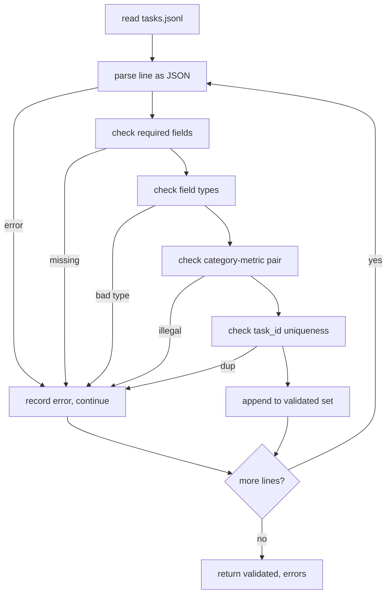

# Task Spec Format / 任务规范格式

> eval harness 的质量，首先取决于任务遵守的契约。在写任何评分函数之前，先冻结 JSONL 形状和 metric 词表。

**类型：** 构建
**语言：** Python
**前置知识：** 第 19 阶段 Track B 基础
**时间：** 约 90 分钟

## Learning Objectives / 学习目标

- 定义一个 JSONL 任务记录 schema，用同一种形状覆盖 arithmetic、multiple-choice、code execution、classification 和 free-text summarisation。
- 固定一组封闭的 metric 名称，让后续课程（71-73）只根据一个字段完成分发。
- 把 few-shot examples 和 post-processing rules 写进任务本身，而不是写进 runner，保证同一个 prompt 在不同模型上对应同一个 target。
- 实现严格 validator，在 malformed records 进入 runner 前就拒绝它们。
- 交付一组 10-task fixture，覆盖规范的每个分支，让 validator 有真实输入可验证。

## The Problem / 问题

研究代码库积累 eval scripts 的速度，通常比积累 tests 更快。半年之后，每个 notebook 都有自己的 JSON 形状，每个 metric 都被重复实现两遍，任何两次 run 都无法可靠比较。修法很朴素：选定一个 schema，写 validator，拒绝其他所有形状。本课做的就是这件事。

这个形状借鉴了 BIG-bench、HELM 和 lm-eval 风格的 harness，但字段名由本课程定义。每个字段只有一个所有者。runner 读取 task。metric 读取 targets。post-process step 归一化 generation。pipeline 中途没有任何字段可以被随意改写。

## The Concept / 概念

### The record shape / 记录形状

一个 task 是单行 JSON object。harness 读取 `tasks.jsonl`，并独立验证每一行。某一行坏掉，只会让那条 record 失败，而不是让整次 run 崩掉。

```json
{
  "task_id": "arith_001",
  "category": "arithmetic",
  "prompt": "Compute the result. Question: 17 + 24\nAnswer:",
  "targets": ["41"],
  "metric_name": "exact_match",
  "few_shot_examples": [
    {"prompt": "Question: 2 + 2\nAnswer:", "completion": "4"}
  ],
  "post_process": "strip_whitespace",
  "metadata": {"difficulty": "easy"}
}
```

必填字段是 `task_id`、`category`、`prompt`、`targets`、`metric_name`、`post_process`。`few_shot_examples` 和 `metadata` 是可选字段。未知的 top-level field 会导致 validation 失败。

### Field rules / 字段规则

`task_id` 是不含空白字符的 string。validator 会保证它在整个文件中唯一。

`category` 只能是 `arithmetic`、`mcq`、`code_exec`、`classification`、`summary` 之一。category 会约束哪一组 metric 和 post-process 合法。`code_exec` task 必须使用 `metric_name = code_exec`；`mcq` task 必须使用 `metric_name = exact_match`，并且 target 是单个字母。

`prompt` 是非空 string。validator 禁止 trailing whitespace，也拒绝 prompt body 中已经塞入 few-shot block 的 record。few-shot rendering 发生在 runner 中，而不是由 task author 手写进 prompt。

`targets` 是非空 string list。对 `exact_match` 来说，任意一个元素匹配就算通过。对 `f1` 和 `rouge_l` 来说，取分数最高的 target。对 `mcq` 来说，list 必须正好包含一个元素。

`metric_name` 只能是 `exact_match`、`f1`、`bleu_4`、`rouge_l`、`accuracy`、`code_exec` 之一。词表是封闭的。新增 metric 需要新增课程，也需要在这里新增条目。

`few_shot_examples` 是 `{prompt, completion}` pair 的 list。validator 把数量限制在 8 条以内，避免 prompt 无界增长。

`post_process` 只能是 `none`、`strip_whitespace`、`lower`、`extract_letter`、`extract_code_block`、`extract_first_line` 之一。每条规则只有一种确定行为。validator 禁止组合多条规则。

### Validator behaviour / Validator 行为



validator 返回两个 list：validated records，以及 error records。error record 会包含出错的行、违反的规则和对应字段。除非显式设置 `--allow-bad-tasks`，否则 runner 在 error list 非空时拒绝启动。

### Few-shot rendering / Few-shot 渲染

runner 把 few-shot examples 用空行分隔后拼到 prompt 前面。每个模型都走同一段代码，因此唯一的差异来源应该是模型本身。author 只写一次 example，而不是每个 provider 写一次。

```python
def render(task):
    parts = []
    for ex in task.get("few_shot_examples", []):
        parts.append(ex["prompt"] + " " + ex["completion"])
    parts.append(task["prompt"])
    return "\n\n".join(parts)
```

### Post-process rules / 后处理规则

post-process step 在 generation 之后、metric 之前运行。它是确定性的、无状态的。

- `none` 原样返回 string。
- `strip_whitespace` 去掉首尾空白。
- `lower` 将 string 转为小写。
- `extract_letter` 返回第一个匹配 `[A-E]` 的字符，用于 MCQ。
- `extract_code_block` 返回第一个 triple-backtick fenced block 的 body，用于 code-exec。
- `extract_first_line` 返回第一个非空行，用于 summary classification。

需要上述列表以外规则的 task，应该进入一节新课程。

## Build It / 动手构建

`main.py` 定义 `TaskSpec`、`validate_task`、`validate_file` 和 CLI 入口。fixture loader 是 `load_fixtures`。render 和 post-process helpers 与 validation 放在一起，这样 lesson 75 的 runner 只需要 import 一个 module。

本课不做 scoring，不调用模型，也不执行代码。这些会在 lessons 71、72 和 75 中完成。本课冻结所有后续模块都要遵守的契约。

10-task fixture 覆盖两道 arithmetic、两道 MCQ、两道 code-exec、两道 classification 和两道 summarisation。validator 会通过全部 10 条。另一个 fixture（`tasks_bad.jsonl`）会触发每条规则，validator 返回的错误数也应完全一致。

## Use It / 应用它

从头到尾阅读 `main.py`。然后阅读 `code/tests/test_spec.py`。tests 固定了每条 validation rule 和每种 post-process 行为。`main.py` 底部的 demo 会验证 bundled fixture 并打印 summary。

这个模块会成为后续 runner 的入口契约：作者写 `tasks.jsonl`，validator 先筛掉坏数据，runner 只处理 validated records。

## Ship It / 交付它

把 spec 当作数据库 migration 来维护。真实 eval suites 会像 schema 增长列一样增长 categories。清醒的做法是：没有 metric、post-process rule 和至少一个 fixture task，就不要新增 category。每次变更都要 review、version，并配套 tests。这个 validator 就是入口 gate。

## Exercises / 练习

1. 新增一个 `translation` category，但必须同时定义合法的 `metric_name`、`post_process` 和至少两条 fixture。
2. 给 `metadata` 增加允许字段列表，例如 `difficulty`、`source`、`split`，并让未知 metadata key 失败。
3. 为 `tasks_bad.jsonl` 增加一条重复 `task_id` 和一条 illegal category-metric pair，确认错误报告能定位到对应 field。
4. 增加一个 `schema_version` 字段，并让 validator 拒绝未知版本。
5. 写一个小脚本统计 fixture 中每个 `category`、`metric_name` 和 `post_process` 的覆盖率。

## Key Terms / 关键术语

| 术语 | 常见说法 | 实际含义 |
|------|-----------------|------------------------|
| Task spec | “Eval JSON” | runner、metric 和 post-process 共同遵守的冻结契约 |
| JSONL | “One JSON per line” | 每行独立验证，坏行不污染其他 record |
| `metric_name` | “Scoring choice” | 下游 dispatcher 使用的封闭词表 |
| `post_process` | “Cleanup” | generation 到 metric 之间的确定性归一化步骤 |
| Validator | “Input checker” | 在 runner 前拒绝 malformed records 的 gate |
| Fixture | “Example task” | 用来覆盖并固定 spec 行为的可运行样例 |

## Further Reading / 延伸阅读

- BIG-bench、HELM 和 lm-eval 的 task shape 是值得对照的设计来源。
- Phase 19 Lesson 71 - classical metrics that consume `metric_name`
- Phase 19 Lesson 72 - `code_exec` metric implementation
- Phase 19 Lesson 75 - end-to-end runner that consumes this spec
