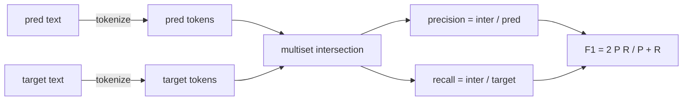
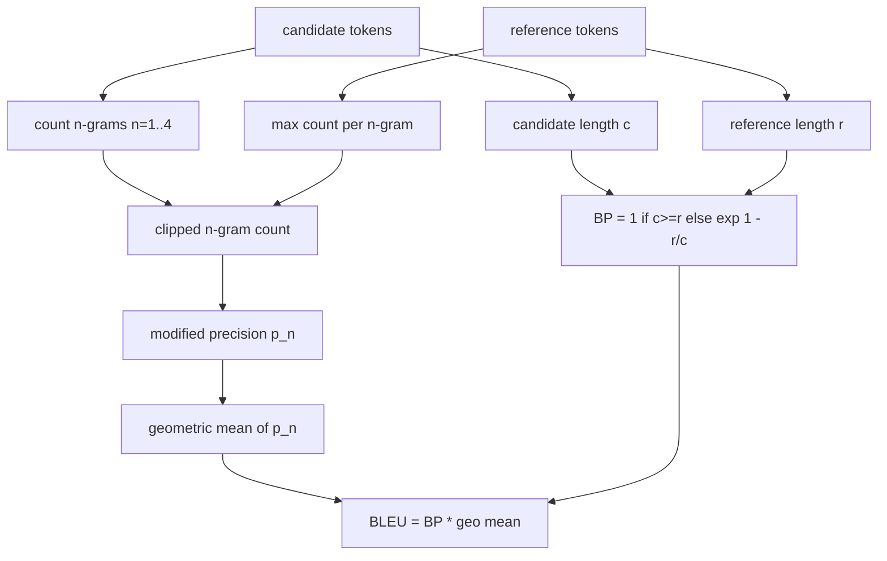

# Classical Metrics / 经典指标

> BLEU、ROUGE-L、F1、exact-match、accuracy。五个指标仍然覆盖了大多数已发表的 LLM eval 数字。把它们从第一性原理实现一遍，你才知道分数到底在说什么。

**类型：** 构建
**语言：** Python
**前置知识：** 第 19 阶段 Track B 基础, 课 70
**时间：** 约 90 分钟

## Learning Objectives / 学习目标

- 用明确的 tokenisation rules 实现 token-level exact-match、F1 和 accuracy。
- 从零实现 BLEU-4：modified n-gram precision、n=1 到 4 的 geometric mean，以及 brevity penalty。
- 用 longest common subsequence 实现 ROUGE-L，并用 F-beta 组合 precision 和 recall。
- 根据 lesson 70 的 `metric_name` 字段进行 dispatch，让 runner 保持 metric-agnostic。
- 用 worked examples 得到的 reference vectors 固定行为，而不是依赖第三方库的输出。

## The Problem / 问题

你会读到一篇论文报告 BLEU 28.3，另一篇报告 BLEU 0.283。你会发现两个库给出的 ROUGE-L 分数相差十个百分点，因为一个库先 lowercase，另一个没有。摆脱困惑最快的方法，是自己写一遍指标，然后明确指出 tokenizer 在哪一行确定，smoothing 在哪一行应用。之后比较论文数字，就变成阅读 metric setup，而不是争论库。

stdlib 加 numpy 就够了。BLEU 是计数和 clamp。ROUGE-L 是 dynamic programming。F1 是 tokens 上的 set/multiset intersection。最难的部分不是代码，而是选择 tokenizer 并坚持这个选择。

## The Concept / 概念

### Tokenisation / 分词契约

tokenizer 是 `re.findall(r"\w+", text.lower())`。小写化，保留 alphanumeric runs，丢掉标点。本课每个 metric 都使用这一个 tokenizer。runner 没有权利选择。如果你替换 tokenizer，你运行的就是另一个 benchmark。

```python
TOKEN_RE = re.compile(r"\w+", re.UNICODE)
def tokenize(text):
    return TOKEN_RE.findall(text.lower())
```

这是有意的简化。生产环境会关心 CJK、contractions 和 code identifiers。本课重点是：tokenizer 是 contract，不是随手调的 knob。

### Exact match / 精确匹配

```python
def exact_match(pred, targets):
    return float(any(pred.strip() == t.strip() for t in targets))
```

它对每个 task 返回 1.0 或 0.0。dataset aggregate 就是均值。arithmetic、MCQ 和短 classification tasks 都主要依赖它。

### Token-level F1 / Token 级 F1

为 prediction 和 target 建立 token multiset。Precision 是 multiset intersection 除以 prediction 的 multiset 大小。Recall 是同一个 intersection 除以 target 的 multiset 大小。F1 是 harmonic mean。实现需要处理 empty prediction 和 empty target 这两个边界条件。



对于 multi-target tasks，我们取 target list 中最高的 F1。这与文献里常见的 SQuAD-style 行为一致。

### BLEU-4 / BLEU-4

BLEU 是机器翻译的经典指标，也仍然出现在 summarisation 工作中。本课使用 corpus-level BLEU-4，带标准 brevity penalty，并对 modified n-gram counts 使用 additive-one smoothing，这样单个缺失的 4-gram 不会把分数直接打到 0。

对每个 candidate-reference pair，我们分别计算 n=1、2、3、4 的 modified n-gram precision。modified precision 会用任意 reference 中该 n-gram 的最大计数来 clip candidate n-gram count，所以 candidate 不能通过重复同一个 phrase 来刷分。四个 precision 的 geometric mean 再乘上 brevity penalty。



smoothing rule 采用 Lin and Och 所称的 method 1：在取 log 前，对每个 n-gram precision 的 numerator 和 denominator 都加 1。这样 reference 没有匹配 4-gram 时不会出现 `log 0`，同时在长 candidate 上仍接近 unsmoothed value。

### ROUGE-L / ROUGE-L

ROUGE-L 比较 candidate 和 reference token sequences 的 longest common subsequence。LCS 能捕获词序，但不要求连续，因此它是 summarisation 的默认指标之一。我们用标准 dynamic-programming table 计算 LCS length，然后得到 recall = `lcs / reference length`、precision = `lcs / candidate length`，再用 beta=1 的 F-beta 组合成对称 F1。

```python
def lcs_length(a, b):
    n, m = len(a), len(b)
    dp = numpy.zeros((n + 1, m + 1), dtype=int)
    for i in range(n):
        for j in range(m):
            if a[i] == b[j]:
                dp[i+1, j+1] = dp[i, j] + 1
            else:
                dp[i+1, j+1] = max(dp[i+1, j], dp[i, j+1])
    return int(dp[n, m])
```

numpy table 让实现更清楚；纯 Python list 也可以。选择 ROUGE-L 的 task 会为每个 task 支付 O(n m) 成本。典型 summary length 下，这通常仍在毫秒以内。

### Accuracy / 准确率

对于 multi-target classification tasks，accuracy 会退化成对单个 normalised target 的 exact-match。我们把它暴露成独立函数，是为了让 dispatcher 根据 `metric_name` 分发，而不让 runner 内部散落字符串比较。

### Dispatch contract / 分发契约

唯一入口是 `score(metric_name, prediction, targets)`。它返回 `[0, 1]` 中的 float。runner 不根据 metric name 分支，只把调用交给 metric 层并写下结果。这就是 lesson 75 要粘合 lesson 70 task spec 的表面。

```python
def score(metric_name, pred, targets):
    if metric_name == "exact_match":
        return exact_match(pred, targets)
    if metric_name == "f1":
        return max(f1_score(pred, t) for t in targets)
    if metric_name == "bleu_4":
        return max(bleu4(pred, t) for t in targets)
    if metric_name == "rouge_l":
        return max(rouge_l(pred, t) for t in targets)
    if metric_name == "accuracy":
        return accuracy(pred, targets)
    raise ValueError(f"unknown metric_name: {metric_name}")
```

`code_exec` 在 lesson 72 中处理，并在那里接入 dispatcher。

## Build It / 动手构建

`main.py` 把每个 metric 定义成 free function，再提供 dispatcher。reference vectors 放在文件底部的 `_reference_examples` block。demo 会用八个 examples 跑 dispatcher，并打印每个 metric 的分数。`code/tests/test_metrics.py` 固定 reference vectors，并覆盖所有边界条件：empty prediction、empty reference、no shared tokens、exact match、repeated phrase clipping。

从头到尾阅读 `main.py`。函数按复杂度排序：`exact_match` 和 `accuracy` 各一行；F1 六行；BLEU 和 ROUGE-L 是重头戏，里面有关于 smoothing rule 和 LCS recurrence 的细注释。

## Use It / 应用它

runner 应该只调用 `score(metric_name, prediction, targets)`，不在业务代码里复制 metric 逻辑。这样后续要调整 tokenizer 或 smoothing 时，只有 metric module 需要版本化和回归测试。

## Ship It / 交付它

本课不调用模型，不在 lesson 70 的 post-process rules 之外额外 normalise generations，不计算 confidence intervals，也不实现 BLEURT 或 BERTScore（这些需要模型，属于别的课程）。交付的是底座：五个指标、一个 tokenizer、一个 dispatch table。

## Exercises / 练习

1. 为 tokenizer 增加 CJK-aware 版本，并用同一批 examples 比较分数变化。
2. 实现 sentence-level BLEU，并解释为什么短句上 smoothing 影响更大。
3. 给 ROUGE-L 增加 beta 参数，观察偏 recall 与偏 precision 的排序变化。
4. 添加 per-metric JSON report，把 intermediate counts（例如 BLEU 的 clipped counts）写出来用于审计。
5. 用第三方库跑同一批 examples，定位每个差异来自 tokenizer、smoothing 还是 aggregation。

## Key Terms / 关键术语

| 术语 | 常见说法 | 实际含义 |
|------|-----------------|------------------------|
| Tokenizer | “Text split” | 每个 metric 共享的、会改变 benchmark 含义的契约 |
| Exact match | “Right or wrong” | strip 后 prediction 与任一 target 完全相等 |
| F1 | “Overlap score” | token multiset precision 与 recall 的 harmonic mean |
| BLEU-4 | “Translation score” | clipped n-gram precision、brevity penalty 和 smoothing 的组合 |
| ROUGE-L | “Summary score” | 基于 longest common subsequence 的 order-aware overlap |
| Dispatcher | “Metric switch” | `metric_name` 到具体 scoring function 的唯一入口 |

## Further Reading / 延伸阅读

经典指标是必要条件，不是充分条件。它们奖励表面 overlap，却会错过语义。后续可以在可靠 classical floor 之上叠加 model-based metrics（BLEURT、BERTScore、GEval）。现在先让这五个指标可审计、快速、可复现。
