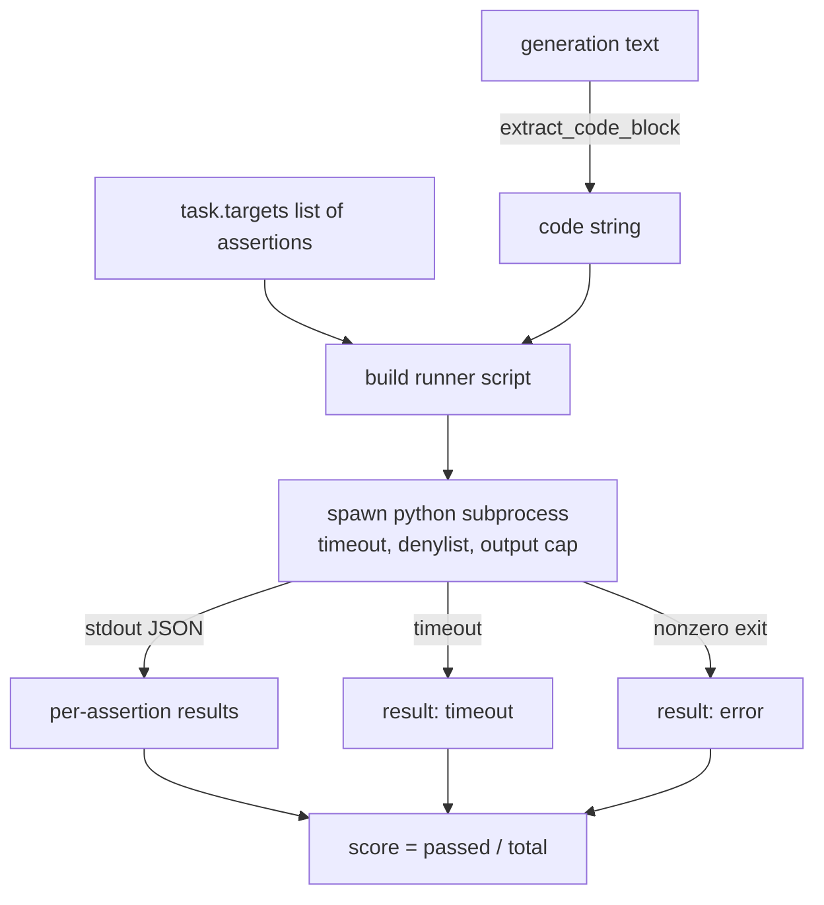
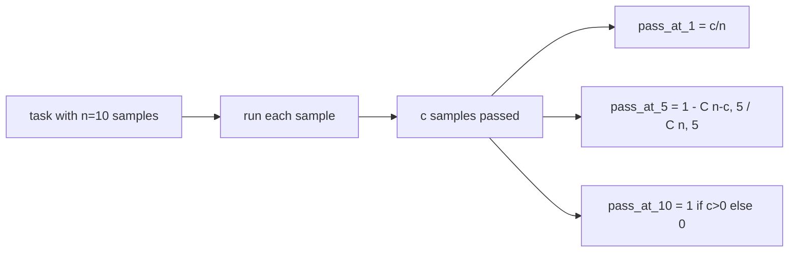

# Code Exec Metric / 代码执行指标

> 生成代码是否正确，最终要看它是否通过测试。eval harness 必须提取代码、在不拖垮 host 的情况下运行它，并诚实统计 pass-rates。本课构建这个代码执行评测接口。

**类型：** 构建
**语言：** Python
**前置知识：** 第 19 阶段 Track B 基础, 第 70、71 课
**时间：** 约 90 分钟

## Learning Objectives / 学习目标

- 从自由形式 generation 中提取 code block，并与 lesson 70 的 post-process rule 保持一致。
- 在隔离 subprocess 中执行 candidate code，带 wall-clock timeout、output cap 和 import denylist。
- 把一个 task 评分为 supplied assertion strings 中通过的比例。
- 为一个模型对同一 task 采样多个 generations 的场景计算 pass-at-k。
- 把 sandbox crashes、syntax errors 和 timeouts 当作 first-class fail modes，并给 runner 可记录的 distinct exit codes。

## The Problem / 问题

inline `exec` 是安全和稳定性风险。生成的 `while True: pass` 会让 eval 永远卡住。生成的 `import shutil; shutil.rmtree('/')` 的灾难性也正如它看起来那样。修法是：每个 candidate 启动一个新的 Python interpreter，把代码从 stdin 传进去，把 assertion results 写到 stdout，超时就杀掉进程。host eval process 继续运行。

HumanEval、MBPP、BigCodeBench、LiveCodeBench 等真实 eval 都使用 subprocess sandbox。有些还会在上面叠 Docker。本课停在 subprocess 层是有理由的：它 portable、stdlib-only，并且能捕获教育型 eval 中最重要的失败模式。生产部署还会增加 seccomp、network isolation 和 read-only filesystem。更强 hardening 属于本 track 之外的后续课程。

## The Concept / 概念

### The shape of a code-exec task / code-exec task 的形状

`code_exec` task 在 `targets` 中携带 assertion strings。runner 从 generation 中提取 fenced code block，围绕它构造 test harness，然后运行结果。



score 是 `[0, 1]` 中的 fraction。一个有三条 assertions、其中两条通过的 task 得分 0.667。无论失败方式是什么，runner 都返回同一种 shape：subprocess crash 被映射成 normalised error code，而不是让 Python traceback 冒泡到 harness。

### The denylist / denylist

denylist 基于 import。运行 candidate code 前，runner script 会把危险模块的 import 改写成一个会抛出 `ImportError("denied")` 的 stub。列表刻意保守：`os.system`、`subprocess`、`socket`、`requests`、`urllib`、`urllib.request`、`urllib.error`、`urllib.parse`、`ctypes`、`shutil`、`http.client`、`asyncio.subprocess`。

我们不假装它坚不可摧。认真对抗的 Python code 可以逃出任何 in-process sandbox。denylist 是兜底。真正承重的是 wall-clock timeout 和 output cap。

```python
DENIED = {
    "os.system": True,
    "subprocess": True,
    "socket": True,
    "shutil": True,
    "requests": True,
    "urllib": True,
    "ctypes": True,
}
```

我们会在 candidate 前面 prepend `import sys`，并加 guard monkey-patch `os.system` 让它抛错。完整 template 在 `main.py` 里。

### Wall-clock timeout / 墙钟超时

每个 subprocess 默认有三秒 wall-clock budget。runner 使用 `subprocess.run(..., timeout=t)`。如果 timeout 触发，runner 捕获 `TimeoutExpired`，杀掉进程，并把这个 task 记录为 `timeout` exit reason。该 task 得分为零。runner 继续处理后续任务。

timeout 可以通过 `task.metadata.timeout_s` 按 task 配置。耗时更长的 unit tests 可以申请更多时间；lesson 70 的 validator 会把这个值限制在三十秒以内，保证 suite 有界。

### Output cap / 输出上限

subprocess 可以疯狂刷 stdout，耗尽 host memory。runner 把 stdout 流式写入 buffer，一旦累计大小超过 256 KB 就杀掉 child。结果记录为 `exit_code = error`，detail string 是 `"output overflow"`。实践中，generation 意外写出一个无限 print loop 时就会触发它。

### Pass-at-k / Pass-at-k

Pass-at-k 是 HumanEval 等 benchmark 使用的 unbiased estimator。给定每个 task 的 `n` 个 independent samples，以及其中通过的 `c` 个，大小为 `k` 的 sample 中至少含有一个 passing solution 的概率是：

```
pass_at_k(n, c, k) = 1 - C(n - c, k) / C(n, k)
```

当 `n - c < k` 时 numerator 未定义，此时值为 `1`。实现会直接处理这个边界。我们暴露 `pass_at_k(n, c, k)`，供 lesson 74 的 leaderboard layer 使用。



### Exit codes / 退出码

runner 对每个 task 返回五种 outcomes 之一：

- `pass`：所有 assertions 都通过。
- `assertion_fail`：代码能运行，但至少一个 assertion 失败。
- `syntax_error`：代码无法 import 或有 SyntaxError。
- `timeout`：wall clock 过期。
- `error`：其他 crash，包括 denylist 命中和 output overflow（overflow 会带 detail `"output overflow"`）。

score 仍然是 fraction。exit code 是 metadata。下游课程可以决定 timeout 是计为零，还是计为 missing data。

## Build It / 动手构建

`main.py` 定义 `extract_code`、`run_candidate`、`score_code_exec` 和 `pass_at_k`。subprocess runner script 被构造成 string，然后通过 `-c` 传给一个新的 Python interpreter。`code/tests/test_exec.py` 用 HumanEval 风格 worked examples 覆盖四类 exit codes 和 pass-at-k。

本课不提供真正 sandbox，不运行来自 open web 的 untrusted code，也不处理 file I/O 或 network calls 这类 stateful tasks。那些需要 container 或 microVM。本课的重点是 contract：隔离 subprocess、denylist、timeout、output cap、干净的 exit-code vocabulary 和 pass-at-k math。

## Use It / 应用它

从头到尾读 `main.py`。runner template 是承重结构。仔细看 assertion loop，直到你能预测它写回 parent process 的 JSON envelope。

在 lesson 75 的 runner 中，`code_exec` task 应该先用 lesson 70 的 `extract_code_block` 后处理提取 candidate，再调用本课的 `score_code_exec`。不要在 runner 里重写 sandbox 逻辑。

## Ship It / 交付它

subprocess 形状跑通后，下一个问题是 portability。不同 Python versions 在 Windows 上处理 SIGKILL 的方式不同。最干净的修法是把 runner 放进 Docker image。再下一步，是用真实 unit test files 替代 assertion strings，让 eval 更接近 production CI。到那一步就不要再把 assertion strings 称为 tests；它们是 toy tests，也有 toy failure modes。

## Exercises / 练习

1. 增加 per-task `memory_mb` 限制，并让超过限制的 candidate 以 `error` 退出。
2. 支持多个 fenced code blocks，并明确选择第一个、最后一个还是 language-tagged `python` block。
3. 把 assertion strings 替换成真实 `unittest` 文件，比较失败报告的可诊断性。
4. 用 Docker 包一层 runner，保留同样的 JSON envelope。
5. 在 10 个 samples 上计算 `pass_at_1`、`pass_at_5`、`pass_at_10`，并解释它们与简单 pass rate 的区别。

## Key Terms / 关键术语

| 术语 | 常见说法 | 实际含义 |
|------|-----------------|------------------------|
| `code_exec` | “Run generated code” | 提取 code block，在隔离 subprocess 中运行 assertions 并计分 |
| Denylist | “Sandbox” | import-level backstop，不是真正安全边界 |
| Timeout | “Do not hang” | wall-clock budget 过期时终止 child process |
| Output cap | “Limit logs” | 防止 stdout flood 耗尽 host memory |
| Pass-at-k | “Sampling score” | n 个 samples 中抽 k 个至少一个通过的 unbiased probability |
| Exit code | “Failure reason” | runner 记录的 structured outcome，不是 Python traceback |

## Further Reading / 延伸阅读

- HumanEval、MBPP、BigCodeBench 和 LiveCodeBench 都是理解 code eval 形状的好参照。
- Phase 19 Lesson 70 - task spec and `extract_code_block`
- Phase 19 Lesson 74 - leaderboard layer that consumes `pass_at_k`
- Phase 19 Lesson 75 - end-to-end runner integration
