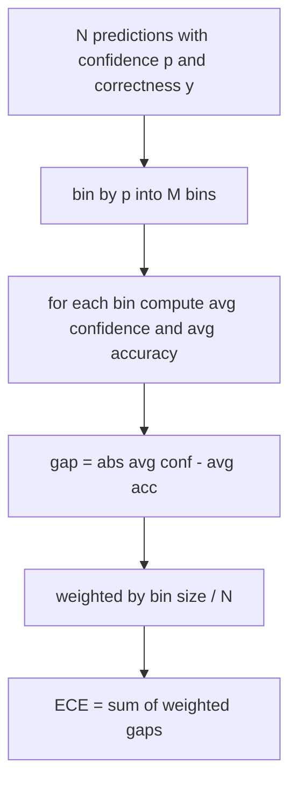
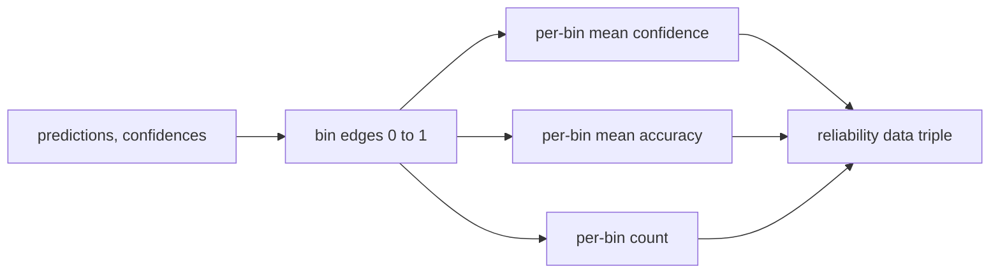

# Perplexity and Calibration / 困惑度与校准

> 如果模型在一千个答案上都说自己有 90% 把握，结果只答对六百个，它就没有校准好。calibration 是可信 eval 的一半。另一半是 perplexity，它告诉你模型是否认为 held-out text 本身合理。

**类型：** 构建
**语言：** Python
**前置知识：** 第 19 阶段 Track B 基础, 第 70、71 课
**时间：** 约 90 分钟

## Learning Objectives / 学习目标

- 根据 model adapter 提供的 token negative log-probabilities，在 held-out corpus 上计算 token-level perplexity。
- 根据 binned predicted probabilities，为 classifier 或 multiple-choice eval 计算 expected calibration error（ECE）。
- 计算 Brier score（相对 correctness indicator 的 mean squared error），并解释它能补上 ECE 的哪些盲点。
- 构建 reliability diagram data，用来绘制 confidence-versus-accuracy curve。
- 把三者接入 eval harness，让 runner 能在 model report 中附带 `perplexity`、`ece` 和 `brier`。

## The Problem / 问题

大多数 eval 会报告 accuracy，然后就停止。但生产系统还需要知道模型是否知道自己什么时候可能错。一个 accuracy 高但 Brier 很差的模型，可能比 accuracy 低几分但不确定性可靠的模型更难部署。与此同时，perplexity 能检查模型对 held-out text 的语言建模质量：它是否给真实 token 分配了合理概率。

本课不从模型内部计算 log-probabilities，也不替模型生成 confidence。adapter 负责提供信号；harness 负责聚合并把数学做对。

## The Concept / 概念

### What perplexity tells you / Perplexity 告诉你什么

Perplexity 是每个 token 平均 negative log-likelihood 的指数。越低越好。perplexity 为 1 表示模型给每个真实 token 都分配了概率 1。perplexity 等于 vocabulary size 表示模型是 uniform 的，什么都没学到。真实数字介于两者之间：强 2026 base model 在 WikiText-103 上大约是 8 到 12；差模型在同一文本上会到 50 以上。

harness 不自己计算 log-probabilities。这些来自 model adapter。harness 做聚合：输入 per-token log-probabilities list 和每个 sequence 的 token count list，返回 corpus perplexity。

```python
def perplexity(neg_log_probs, token_counts):
    total_nll = sum(neg_log_probs)
    total_tokens = sum(token_counts)
    return math.exp(total_nll / total_tokens)
```

实现会处理 zero-token edge cases，并断言 negative log-probabilities 非负。常见错误是忘记取负：adapter 返回 `log p` 而不是 `-log p`，会得到小于 1 的 perplexity，这是不可能的。函数会把它抓成 contract violation。

### What ECE measures / ECE 衡量什么

Expected calibration error 会按 confidence 把 predictions 分到固定数量的 bins，然后计算每个 bin 中 average confidence 与 accuracy 的 gap，再按 bin size 加权平均。



标准写法是在 `[0, 1]` 上使用 10 个 equal-width bins。实现支持任意正整数 bins。我们暴露 `bins` 参数，让 runner 可以在 publishing convention（10）和 comparison convention（15）之间选择。

ECE 会受 bin count 和 sample size 偏置影响。10 个 bins、100 条 predictions 时，你无法区分 0.02 ECE 和随机噪声。实现会同时返回 populated bins 数量，让 runner 在样本太少时拒绝报告单一数字。

### What Brier score does that ECE does not / Brier score 补了 ECE 的什么

ECE 只关心平均 gap。一个模型如果一半 bins 过度自信、另一半 bins 不够自信，可能得到低 ECE，但局部校准很差。Brier score 逐 prediction 衡量相对真实 outcome 的 squared error，因此直接惩罚 spread。

对 binary outcomes，Brier 是 `mean((p_i - y_i)^2)`。它可以分解为 reliability、resolution 和 uncertainty。我们计算 score 和 decomposition。runner 报告 scalar，但把 decomposition 记录给 dashboard。

```python
def brier(p, y):
    return float(np.mean((p - y) ** 2))
```

### Reliability diagram data / 可靠性图数据

reliability diagram 会把 predicted confidence 对上每个 bin 的 empirical accuracy。对角线表示完美校准。函数返回三个 arrays：per-bin average confidence、per-bin average accuracy、per-bin count。plotting code 属于下游；本课停在 data shape。



返回的 tuple 是调用层绘图或计算 custom ECE variant（adaptive ECE、sweep ECE 等）所需的形状。我们返回 numpy arrays，避免下游再转换。

### Confidence sources / Confidence 来源

harness 不假设 confidence 来自 softmax。它接受每个 prediction 的任意 `[0, 1]` 数值。multiple-choice tasks 的自然 confidence 是 `softmax over option log-likelihoods`。free-text 的自然 confidence 可以是模型自报概率，也可以是 average log-likelihood 的指数。eval 只消费这个数。它从哪里来，是 adapter 的责任。

### Edge cases / 边界情况

- 全错：ECE 是 average confidence，Brier 高，perplexity 取决于模型怎么看文本。
- 全对且 high confidence：ECE 接近 0，Brier 接近 0。
- p=0.5 的完全不确定 predictor：ECE 是 0.5 减 accuracy，Brier 是 0.25 减一个 correction term。
- 空输入：ECE、Brier 和 reliability 返回 `0.0`（或 zero-filled arrays）。zero-token case 下 perplexity 返回 `NaN`。这些路径都不发 warning；runner 检查值后决定 report 或 skip。

这些情况都写进 tests。真实模型在真实 benchmark 上不常命中，但 buggy adapter 或 tiny sample 会命中，runner 不应该崩。

### Dispatch / 分发

Calibration 不是像 F1 那样的 per-task metric，而是 per-model report。runner 在整次 eval 中累积 `(confidence, correct)` pairs，然后一次性计算 ECE、Brier 和 reliability data。Perplexity 则在 held-out text corpus 上计算，与 task-by-task scoring 分开。

接口是：

```python
report = CalibrationReport.from_predictions(confidences, correct)
report.ece          # float
report.brier        # float
report.reliability  # tuple of three numpy arrays
report.populated_bins  # int
```

`PerplexityResult.from_token_nll(neg_log_probs, token_counts)` 返回 perplexity 和 average negative log-likelihood per token。

## Build It / 动手构建

`main.py` 定义 `perplexity`、`expected_calibration_error`、`brier_score`、`reliability_diagram`，以及 `CalibrationReport` / `PerplexityResult` dataclasses。demo 在 ground truth 已知的 synthetic predictions 上运行：well-calibrated model、overconfident model、underconfident model。`code/tests/test_calibration.py` 固定所有 edge cases，并给 synthetic predictors 提供 reference values。

本课不调用模型，不实现 softmax，不从 output tokens 估计 confidence；那是 adapter 的工作。它也不做 temperature scaling 或 Platt scaling；这些 post-hoc fixes 属于另一课。本课目标是让 perplexity、ECE、Brier 这三个数字可信且可复现。

## Use It / 应用它

从头到尾阅读 `main.py`。函数顺序是 scalar 到 vector 再到 report。每个函数都有短 docstring，写明数学含义和 contract。runner 应在整次 eval 后按 model 聚合 calibration，而不是每个 task 单独报告一个校准数。

## Ship It / 交付它

校准是 published eval 中最常被忽略的轴。leaderboard 经常只报一个 accuracy 就结束。一个 accuracy 赢了但 Brier 输掉的模型，在生产部署上可能比 accuracy 低几分但能可靠表达不确定性的模型更差。把 calibration plumbing 建好后，可以在 held-out validation slice 上加 temperature scaling，重新计算 ECE，看 gap 收缩。那是另一课；底座在这里。

## Exercises / 练习

1. 实现 adaptive ECE，让每个 bin 拥有相近样本数，并比较 equal-width ECE。
2. 加入 temperature scaling，在 validation slice 上调温后重新计算 ECE 与 Brier。
3. 为 multiple-choice task 写一个 adapter stub，把 option log-likelihoods 转成 confidence。
4. 对 tiny sample 加入 minimum populated bins policy，样本不足时跳过校准报告。
5. 输出 reliability diagram 的 JSON，让下游 notebook 可以直接绘图。

## Key Terms / 关键术语

| 术语 | 常见说法 | 实际含义 |
|------|-----------------|------------------------|
| Perplexity | “Language-model score” | average negative log-likelihood per token 的指数 |
| ECE | “Calibration error” | confidence 与 empirical accuracy 的加权 bin gap |
| Brier score | “Confidence loss” | predicted probability 与 correctness indicator 的 mean squared error |
| Reliability diagram | “Calibration plot” | 每个 bin 的 average confidence、accuracy 和 count |
| Confidence | “Model certainty” | adapter 提供的 `[0, 1]` 信号，来源可以不同 |

## Further Reading / 延伸阅读

- Reliability diagrams 和 ECE 是分类模型校准的基本工具。
- Phase 19 Lesson 75 - runner that attaches `CalibrationReport`
- 校准管线可扩展到 temperature scaling、Platt scaling 和 adaptive ECE。
