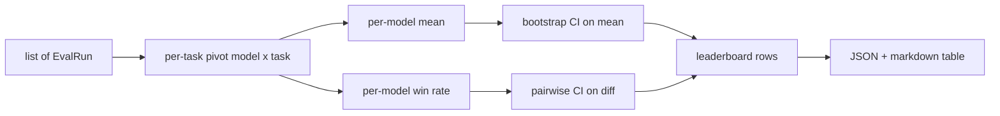
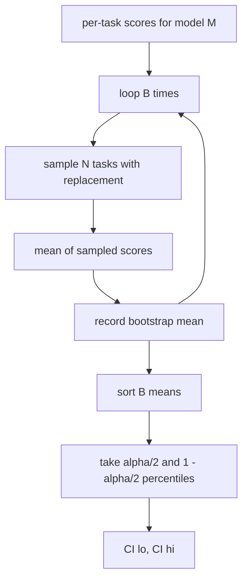

# Leaderboard Aggregation / 排行榜聚合

> per-task scores 很简单。跨异构任务给多个模型排序更难。千级 prediction leaderboard 上的 statistical significance，恰恰是大家最容易跳过的部分。本课不跳过。

**类型：** 构建
**语言：** Python
**前置知识：** 第 19 阶段 Track B 基础, 第 70、71、73 课
**时间：** 约 90 分钟

## Learning Objectives / 学习目标

- 把多个模型、多个任务上的 per-task scores 聚合成整洁的 per-model row。
- 归一化异构分数，避免 pass rates 和 BLEU values 对 aggregate 产生不成比例的影响。
- 按 mean 和 win-rate 排名，并解释各自适合总结什么。
- 计算每个模型 mean score 和 pairwise differences 的 bootstrap confidence intervals。
- 输出 JSON report 和 markdown table，让 lesson 75 的 runner 可以粘贴到 CI comment。

## The Problem / 问题

单个 task 的 score 只是原材料。真正的 leaderboard 要回答的是：模型 A 是否真的比模型 B 好，还是只是这批任务上的噪声？如果一个 task 是 `[0, 1]`，另一个是 `[0, 100]`，后者会静默支配均值。如果两个模型都跑了同一百个 task，差异就应该按 paired task differences 来看，而不是把两组样本当独立。没有聚合契约的 leaderboard，会给出看似精确、实际不可辩护的排名。

## The Concept / 概念

### The shape of input / 输入形状

aggregator 消费一组 `EvalRun` records：

```python
@dataclass
class EvalRun:
    model_id: str
    task_id: str
    metric_name: str
    score: float          # in [0, 1]
    category: str
```

lesson 75 的 runner 会为每个 `(model, task)` pair 输出一条 record。aggregator 不关心 score 是怎么产生的。它只要求 normalisation 已经完成：每个 score 都在 `[0, 1]`。

### The output / 输出

会产出三张表：



leaderboard row 包含：`model_id`、`mean_score`、`mean_ci_lo`、`mean_ci_hi`、`win_rate`、`tasks_completed`，以及可选的 `categories` map 用于 per-category mean。

### Normalisation / 归一化

如果一个 task 分数在 `[0, 1]`，另一个在 `[0, 100]`，第二个会静默支配 mean。aggregator 会验证每个 input score 都在 `[0, 1]`，否则拒绝本次 run。修法在 upstream：metric 本就应该返回 fraction。lessons 71 到 73 会强制这个契约。

### Mean and win-rate / 均值与胜率

两种 ranking schemes 服务不同目标。

Mean score 是某个模型的 per-task scores 平均值。它是 leaderboard 常见 headline number。它对 outliers 和 task imbalance 敏感。

Win-rate 统计模型在同一 task 上击败其他所有模型的频率。对每个 task，score 最高的模型获胜（ties split）。Win rate 等于 wins 除以该模型有 score 的 task 数。它对 outliers 和 scale differences 不那么敏感，但会损失信息。

```python
def win_rate(model_id, runs_by_task, all_models):
    wins, total = 0, 0
    for task_id, runs in runs_by_task.items():
        scores = {r.model_id: r.score for r in runs if r.model_id in all_models}
        if model_id not in scores:
            continue
        total += 1
        best = max(scores.values())
        if scores[model_id] >= best:
            wins += 1
    return wins / total if total else 0.0
```

harness 两者都报告。lesson 75 的 runner 默认按 mean 排名；markdown 里也保留 win-rate 列，方便用户按需阅读。

### Bootstrap confidence intervals / Bootstrap 置信区间

per-model means 带一个通过 task bootstrap resampling 估计的 confidence interval。我们有放回地重采样 task ids，计算 resampled set 上的 mean，重复 `B` 次，然后按 `alpha` 取 percentile interval。



pairwise comparisons 会 bootstrap per-task difference `score_A - score_B`，然后取 percentile interval 并报告它。用户查看 interval 是否排除 0。如果排除，差异在 level alpha 下显著；否则 leaderboard 把模型视为 tied。

low-level helpers（`bootstrap_mean_ci`、`bootstrap_pairwise_diff`）默认 `B=1000`；public aggregators（`aggregate`、`pairwise_diffs`）默认 `b=500`，让 demo 和 tests 保持快速。默认 alpha 是 0.05。本课只用 numpy，不用 scipy。

### Categories / 类别

如果设置了 `EvalRun.category`，aggregator 还会报告 per-category mean。这就是 leaderboard 上常见的 `math`、`reasoning`、`code`、`safety` 列。它能让 runner 发现“整体不错但 code 很弱”的模型，这类信息会被 headline mean 掩盖。

### Markdown rendering / Markdown 渲染

leaderboard 会渲染成 markdown table：

```text
| Rank | Model | Mean | 95% CI | Win rate | Tasks |
|------|-------|------|--------|----------|-------|
| 1    | gpt   | 0.78 | 0.74-0.82 | 0.62 | 50 |
| 2    | claude| 0.75 | 0.71-0.79 | 0.34 | 50 |
| 3    | random| 0.10 | 0.07-0.13 | 0.04 | 50 |
```

table 按 mean score 排序。CI 渲染到两位小数。过长的 model id 会截断到二十个字符。

## Build It / 动手构建

`main.py` 定义 `EvalRun`、`LeaderboardRow`、`aggregate`、`bootstrap_mean_ci`、`bootstrap_pairwise_diff` 和 `render_markdown`。demo 构造三个模型、十二个 tasks 的 synthetic suite，聚合后打印 leaderboard 和 pairwise diff table。`code/tests/test_leaderboard.py` 固定 bootstrap、markdown rendering、win-rate edge cases 和 empty-input 行为。

从头到尾读 `main.py`。data shape（`EvalRun`、`LeaderboardRow`）在前，aggregator 其次，bootstrap 第三，rendering 最后。每个函数都有聚焦的 contract。

## Use It / 应用它

lesson 75 的 runner 会把每个 `(model, task)` result 转成 `EvalRun`，然后直接调用 `aggregate` 和 `pairwise_diffs`。不要把 leaderboard 排序逻辑写在 runner 里；runner 负责执行，aggregator 负责统计解释。

## Ship It / 交付它

本课不运行模型，不调用 metric layer，不实现 adaptive ECE 等 calibration variants（那是 lesson 73），也不实现 task weighting。这里每个 task 权重相同。生产 leaderboard 会为 tasks 加权；我们通过 `weight` field 留下 hook，但 aggregator 暂时忽略它。需要时把 weighting 作为后续课程添加。

自然下一步是 paired-task significance，而不是 unpaired bootstrap。如果 model A 和 B 都跑了同一百个 tasks，正确检验就是 task-by-task differences 的 paired bootstrap，本课已经实现。再往后，你会需要尊重 task families 的 hierarchical bootstrap（math problems 之间并不独立）。本课目标是把底座做好，让 eval report 的数字可以被辩护。

## Exercises / 练习

1. 增加 task weighting，并比较 weighted mean 与 unweighted mean 的排序差异。
2. 实现 category-balanced mean：每个 category 先求均值，再对 categories 平均。
3. 为 pairwise diff table 增加 “significant/tied” 标记。
4. 把 long model ids 的 truncation 改成中间省略，并保持 table alignment。
5. 在 synthetic suite 中制造一个 outlier task，比较 mean 和 win-rate 排名变化。

## Key Terms / 关键术语

| 术语 | 常见说法 | 实际含义 |
|------|-----------------|------------------------|
| `EvalRun` | “One result” | 一个 `(model, task)` pair 的 normalized score record |
| Mean score | “Leaderboard number” | 某模型所有 per-task scores 的平均 |
| Win-rate | “Head-to-head wins” | 同一 task 上击败其他模型的频率 |
| Bootstrap CI | “Uncertainty band” | 对 tasks 重采样得到的 percentile interval |
| Pairwise diff | “A beats B” | 同一 task 上 `score_A - score_B` 的分布 |
| Category mean | “Subscore” | 按 task category 聚合的诊断性分数 |

## Further Reading / 延伸阅读

- Paired bootstrap 是比较同一任务集合上两个模型时的基础工具。
- Phase 19 Lesson 75 - end-to-end runner that emits `EvalRun`
- Phase 19 Lesson 73 - calibration reports that complement leaderboard scores
