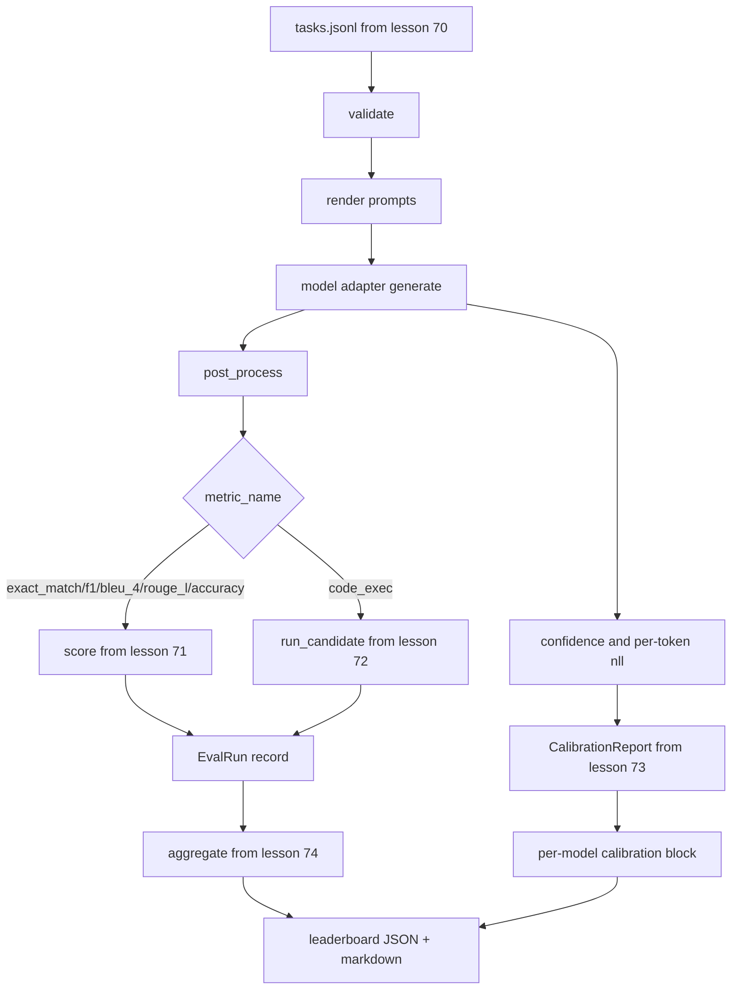

# End-to-End Eval Runner / 端到端评测 Runner

> 五节课搭管线，一节课把它们粘起来。runner 读取 lesson 70 的 task spec，通过 adapter 调模型，用 lessons 71 和 72 评分，附上 lesson 73 的 calibration report，并输出 lesson 74 的 leaderboard。demo 会自终止。

**类型：** 构建
**语言：** Python
**前置知识：** 第 19 阶段 Track B 基础, 第 70-74 课
**时间：** 约 90 分钟

## Learning Objectives / 学习目标

- 定义一个 `ModelAdapter` interface，让任意模型（mock、local、API）都能用很小的方法表面接入。
- 在 worker pool 中并行执行 fixture JSONL 上的 eval。
- 单次 pass 内组合 metric layer（exact_match、F1、BLEU-4、ROUGE-L、code_exec）和 calibration layer。
- 产出 per-model `EvalRun` records，并直接送进 leaderboard aggregator。
- 输出 JSON report 和 markdown table；clean run 时 exit zero，validation 或 runtime failure 时 non-zero。

## The Problem / 问题

lessons 70 到 74 分别拥有 task spec、classical metrics、code-exec metric、calibration 和 leaderboard。没有 runner，它们只是零件。runner 是 integration point：它必须保证每个 task 都经过同一条 render、generate、post-process、score、aggregate 路径，同时不能复制任何模块逻辑。否则 eval 系统会回到多个脚本各算各的状态。

## The Concept / 概念

### The pipeline / 管线



runner 是 integration point。lessons 70 到 74 每节课拥有一个 module，runner 只是组合它们。runner 不复制这些模块里的任何逻辑，而是 import 它们。

### The adapter interface / Adapter 接口

adapter 是 runner 与任意模型之间的边界。接口刻意保持很小。

```python
class ModelAdapter:
    model_id: str

    def generate(self, prompt: str, task: TaskSpec) -> Generation: ...
```

`Generation` 是 dataclass，包含：

- `text`：模型的 free-form output
- `confidence`：`[0, 1]` 中的 float，表示模型对答案的 self-reported probability
- `token_nll`：可选，generated tokens 上的 negative log-likelihood 总和
- `token_count`：可选，generated tokens 数量

runner 中的 mock adapters 提供三种风格：`RuleBasedAdapter`（deterministic、near-perfect）、`NoisyAdapter`（overconfident、often wrong）、`BiasedAdapter`（擅长一个 category、另一个 category 很差）。demo 会把三者都跑在 lesson 70 fixture 上。

### Parallel execution / 并行执行

runner 使用 `concurrent.futures.ThreadPoolExecutor` 按 model 并行跑 tasks。worker count 默认为 task count 和 8 中较小者。真实 model calls 的瓶颈通常是 network I/O，因此 threads 足够。code-exec 路径会在 task 内部启动自己的 subprocess，executor 只负责调度等待。

为了 deterministic tests，runner 暴露 `run_eval(adapters, tasks, parallel=False)`，让 tests 可以固定执行顺序。

### The single-pass scoring loop / 单 pass 评分循环

对每个 task：

1. 渲染 prompt（few-shot prefix 加 prompt body）。
2. 调用 adapter，并记录调用耗时。
3. 按 task 的 rule 后处理 generation。
4. 分发到 metric layer。
5. 用 score 和 metric metadata 构造 `EvalRun` record。
6. 把 `(confidence, correct)` pair 加入 calibration buffer。

`correct` signal 对 exact_match-style metrics（`exact_match`、`accuracy`、`code_exec`）使用 `score >= 1.0`，对 graded metrics 使用 `score >= 0.5`。threshold 放在 `_correct_from_score` 中，runner 不暴露 public override。

### Aggregation / 聚合

所有 task 都有结果后，runner 调用 lesson 74 的 `aggregate` 和 `pairwise_diffs`，以及 lesson 73 的 `CalibrationReport.from_predictions`。输出是单个 JSON envelope：

```json
{
  "leaderboard": [...],
  "pairwise": [...],
  "calibration": {
    "model_id_a": {"ece": 0.04, "brier": 0.10, "populated_bins": 8, ...},
    ...
  },
  "summary": {
    "tasks": 10,
    "models": 3,
    "wall_seconds": 1.2
  }
}
```

runner 还会把 markdown table 写到 stdout，方便用户粘进 PR review。

### Self-terminating demo / 自终止 demo

demo 会用 lesson 70 的十条 fixture tasks 跑三个 mock adapters。wall time 应该低于十秒。clean run 的 exit code 是零。

clean-run criteria：

- 每个 task 都通过 lesson 70 validation。
- 每个 task 都由 lessons 71 和 72 评分。
- calibration report 能通过 lesson 73 聚合且无错误。
- leaderboard 把 rule-based adapter 严格排在 random adapter 之上。

如果任何一项失败，runner 用 non-zero 退出，并在 JSON envelope 中给出 structured error。

## Build It / 动手构建

`main.py` 是 integration。它通过一个小的 `_load_sibling` helper，用 relative path 从其他五节课的 modules import。`Generation`、`EvalReport` 和 `ModelAdapter` dataclasses 在本地定义。mock adapters 位于文件底部。

从头到尾读 `main.py`。先扫 imports，再看 `run_eval`，然后看 `_score_one`，最后看 adapters。文件末尾的 demo 是入口。

`code/tests/test_runner.py` 固定 adapter interface、single-pass loop、parallel-vs-sequential equivalence、calibration buffer 和 JSON envelope shape。

## Use It / 应用它

运行 demo 后，你会得到 JSON report 和 stdout 中的 markdown leaderboard。要接入真实 provider，只需要实现一个新的 `ModelAdapter`：给它 `model_id`，并让 `generate(prompt, task)` 返回 `Generation`。metric、calibration 和 leaderboard 代码不需要改。

## Ship It / 交付它

这个 runner 是底座。生产 eval system 还会增加：按 `(task_id, model_id, model_version)` 建 key 的 results cache、跟踪 dollars 和 tokens 的 cost ledger、对 rate limits 做 backoff 的 retry layer、pass-at-k tasks 的 sampling policy，以及长 suites 的 streaming output format。每一项都应该作为一个 wrapper concern 接在 runner 外侧，而不改变 metric 或 aggregation layers。这种分离就是契约的价值。

先让 mocks 工作，再为真实 provider 写 adapter。选一个有 free tier 的 provider，写三十行 glue，看 leaderboard 亮起来。然后接第二个 provider，让 harness 做剩下的工作。

## Exercises / 练习

1. 实现一个真实 API provider 的 `ModelAdapter`，并把 token/cost 写入 summary。
2. 增加 results cache，key 为 `(task_id, model_id, model_version)`。
3. 给 adapter call 加 retry/backoff，但不要影响 deterministic mock tests。
4. 为 pass-at-k task 增加 sampling policy，并把 lesson 72 的 `pass_at_k` 接到 report。
5. 把 JSON envelope 流式写入 JSONL，支持长 suite 中途查看进度。

## Key Terms / 关键术语

| 术语 | 常见说法 | 实际含义 |
|------|-----------------|------------------------|
| Runner | “Eval script” | 组合 task spec、adapter、metrics、calibration 和 leaderboard 的 integration layer |
| `ModelAdapter` | “Model wrapper” | runner 与 mock/local/API model 之间的最小接口 |
| `Generation` | “Model output” | text、confidence、token_nll、token_count 的 structured record |
| `EvalRun` | “Score row” | 一个 `(model, task)` pair 的 normalized result |
| Self-terminating | “Demo finishes” | clean run 固定任务量、exit zero、失败时 structured non-zero |

## Further Reading / 延伸阅读

- Phase 19 Lessons 70-74 - runner 组合的五个模块
- 生产 eval 系统通常还需要 cache、cost ledger、retry、rate-limit handling 和 streaming reports。
