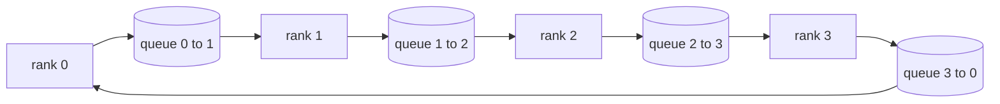

# Collective Ops From Scratch / 从零实现 Collective Ops

> 支撑分布式训练的四个 collective operations 是 allreduce、broadcast、allgather 和 reduce_scatter。训练框架提供的其他 primitive 基本都包在这些之上。先在 `multiprocessing.Queue` mesh 上实现一次，再用 reference implementation 验证，后续 track 就只剩管线连接。

**类型：** 构建
**语言：** Python
**前置知识：** 第 19 阶段 Track C 第 42-49 课
**时间：** 约 90 分钟

## Learning Objectives / 学习目标

- 用两轮（reduce-scatter 再 allgather）实现 ring allreduce，并证明每个 rank 的通信量是每个元素 2(N-1)/N bytes。
- 基于 `multiprocessing.Queue` 上的 point-to-point sends 构建 broadcast、allgather 和 reduce_scatter。
- 针对相同输入，把每个 primitive 与 `torch.distributed` gloo reference 对齐验证。
- 从 cluster shape、latency floor 和 bandwidth ceiling 出发，解释什么时候选 ring、什么时候选 tree。

## The Problem / 问题

N 个 ranks 上的 naive allreduce 会把 N 份 tensor 发送到 root，再广播 N 份回来。每个 rank 的 bandwidth 按 O(N) 增长，root 成为瓶颈，wall-clock floor 变成最慢链路乘以 N。Ring allreduce 把它摊平成 2(N-1) 个大小为 T/N 的 chunks，因此 per-rank bytes 降到 2T(N-1)/N，与 cluster size 无关。Tree allreduce 在小 N 和高延迟链路上更有优势，因为它的 depth 是 log2(N) hops，而不是 2(N-1)。给 cluster shape 选错 topology，最慢 GPU 就会决定 step time。

本 track 中你会读到的每个 distributed training framework 都依赖这四个 primitives。PyTorch DDP 用每个 parameter bucket 一次 allreduce 来同步 gradients。ZeRO 用 reduce_scatter 分片 optimiser state，用 allgather 广播 updated parameters。FSDP 把完整 forward 变成 allgather 加 reduce_scatter。Pipeline parallel 需要 broadcast 在 stage groups 之间传 activations。如果你不能实现这四个 collectives，就无法判断训练为什么 stall，为什么 gradient mismatch 出现在 rank 3，或者为什么换 topology 后 pipeline bubble 翻倍。

## The Concept / 概念



### Ring allreduce in two passes / 两轮 ring allreduce

把 tensor 分成 N 个相等 chunks，索引为 0..N-1。每个 rank 拥有与自己 rank 相同的 chunk index。第一轮 reduce-scatter 运行 N-1 steps。在 step s，rank r 把 chunk (r - s) mod N 发送给 rank (r + 1) mod N，并从 rank (r - 1) mod N 接收 chunk (r - s - 1) mod N，把收到的 chunk 累加到本地副本。N-1 steps 之后，rank r 拥有 chunk r 的完整 sum。第二轮 allgather 再运行 N-1 steps，把已经完成的 chunks 沿 ring 旋转，直到每个 rank 都持有每个 chunk 的完整 sum。

| Primitive | Per-rank bytes | Steps | When to use |
|-----------|---------------|-------|-------------|
| Ring allreduce | 2T(N-1)/N | 2(N-1) | Large T, fat-pipe homogeneous cluster |
| Tree allreduce | T log2(N) | 2 log2(N) | Small T or high-latency links |
| Broadcast | T | log2(N) tree | Parameter init, scalar config |
| Allgather | T(N-1)/N | N-1 | Sharded forward, ZeRO unshard |
| Reduce_scatter | T(N-1)/N | N-1 | ZeRO gradient sharding |

### Queue mesh as a stand-in for NCCL / 用 queue mesh 替代 NCCL

NCCL 运行在 PCIe 和 NVLink 之上，并有 hardware-offloaded reductions。CPU 上没有这些能力。每个 ring edge 放一个 `multiprocessing.Queue`，可以得到有序 point-to-point delivery，且每条边只有一个 producer 和一个 consumer。reduction 在 user space 中完成，所以会支付 Python overhead，但 wire pattern 与 NCCL ring allreduce 一致。先在 queue version 上推理正确性，cluster 行为就能迁移。

### Verify against gloo / 对照 gloo 验证

每个 primitive 都带一个 unit test：在相同 world size、相同 tensor 上，用 gloo backend 初始化 `torch.distributed`，再比较输出。如果你的 ring allreduce 与 gloo 差异超过 float32 epsilon，test 就失败。对 reference implementation 的验证不可谈判；没有它，primitive 会看起来正确，直到真实 training run 的第 10000 step 才暴露问题。

## Build It / 动手构建

`code/main.py` 实现：

- `Mesh` class：把 N 个 `multiprocessing.Queue` 接成 ring，并为每个 rank 暴露 `send(dst, tensor)` 和 `recv(src)`。
- `ring_allreduce(mesh, rank, world_size, tensor)`：运行两轮算法。
- `broadcast(mesh, rank, world_size, tensor, src)`：在 logarithmic tree 上广播。
- `allgather(mesh, rank, world_size, tensor)`：使用 N-1 次 rotations。
- `reduce_scatter(mesh, rank, world_size, tensor)`：allreduce 的前半段。
- `_gloo_reference(op, world_size, tensor)`：把相同输入通过 `torch.distributed` gloo 跑一遍，做 byte-equal comparison。

运行：

```bash
python3 code/main.py
```

输出：每个 primitive 的 verification table，对比 queue-mesh 与 gloo outputs，然后打印 per-rank byte counter，证明 2T(N-1)/N scaling。

## Production patterns in the wild / 生产模式

三个模式会把 primitives 加固到可交付水平。

**Bucket gradients before allreduce.** 1B-parameter model 有成千上万个 gradient tensors。每个 tensor 一次 allreduce 会反复支付 latency floor。DDP 把 gradients 打包成约 25 MB buckets，每个 bucket 做一次 allreduce；小 tensors 搭大 bucket 的顺风车。没有 bucketing，latency overhead 会主导 step。

**Overlap communication with computation.** backward 会按反向逐层计算 gradients。最后一层 gradient 一就绪，就启动它的 allreduce，同时下一层继续计算。PyTorch DDP 用 bucket-ready hooks 实现这个过程。当网络有余量时，overlap 能把可见 communication time 减半。

**Pick ring or tree by message size, not religion.** NCCL 带 topology detector，通常对约 1 MB 以上 messages 选 ring，对更小 messages 选 tree。交叉点来自 bandwidth-versus-latency：1 MB 以上，2T(N-1)/N 的 bandwidth term 主导，ring 胜出；1 MB 以下，log2(N) hop count 胜出。硬编码单一 topology 会在错误 message size 上损失吞吐。

## Use It / 应用它

生产模式：

- **PyTorch DDP.** backward 后对 bucketed gradients 调用 `dist.all_reduce`。bucket size 可调；默认 25 MB 对 100Gbit Ethernet 是合理起点。
- **DeepSpeed ZeRO.** 发起 reduce_scatter 来分片 gradients，并用 allgather 在 forward 前重构完整 parameters。本课 primitives 正是 ZeRO 会调用的 primitives。
- **FSDP.** forward 以 allgather unshard layer 开始，计算后用 reduce_scatter reduce 并丢弃 unshard。还是同样的 primitives，只是 schedule 不同。

## Ship It / 交付它

在 lessons 77-81 中使用 queue-mesh primitives。lesson 77 把 allreduce 接进 DDP。lesson 78 把 reduce_scatter 接进 ZeRO。lesson 79 把 broadcast 接进 pipeline activations。lesson 81 把四者组合进 end-to-end demo。

## Exercises / 练习

1. 添加 tree allreduce variant，并按 message size 在 ring 和 tree 之间切换。测量 crossover。
2. 添加 `recv_timeout_ms`，让 stalled rank 暴露 deadline error，而不是永远挂住。
3. 用 TCP sockets 替换 `multiprocessing.Queue`，四个 primitives 保持同样 tests，换成真实 wire。
4. 加一个 bandwidth instrumentation hook，把 per-rank byte counter 写入 JSONL。
5. 在 4 ranks 上对 1KB、1MB、16MB tensors 比较 ring 和 tree 的 wall-clock time，并用实测结果解释 crossover。

## Key Terms / 关键术语

| 术语 | 常见说法 | 实际含义 |
|------|----------------|------------------------|
| Allreduce | "Sum across ranks" | 调用结束后每个 rank 都持有同一个 reduced tensor |
| Ring | "The fast topology" | 大小为 T/N 的 N-1 个 chunks 沿 cycle 流动两轮 |
| Tree | "The log topology" | reduction 沿 binary tree 进行；depth 是 log2(N) hops |
| Allgather | "Concatenate shards" | 每个 rank 最终拿到其他所有 rank 的 shard |
| Reduce_scatter | "Split the sum" | 每个 rank 只拿到一个 chunk 的 sum |
| Bucket | "Fuse small tensors" | 把 N 个小 allreduces 合并成一个大 allreduce |

## Further Reading / 延伸阅读

- [PyTorch Distributed: NCCL collectives](https://pytorch.org/docs/stable/distributed.html#collective-functions)
- [Horovod ring allreduce paper](https://arxiv.org/abs/1802.05799)
- [NCCL topology and algorithm selection](https://docs.nvidia.com/deeplearning/nccl/user-guide/docs/index.html)
- [Patarasuk and Yuan, Bandwidth optimal allreduce algorithms](https://www.cs.fsu.edu/~xyuan/paper/09jpdc.pdf)
- Phase 10 Lesson 05 - distributed training overview
- Phase 19 Lesson 77 - DDP wired on top of these primitives
