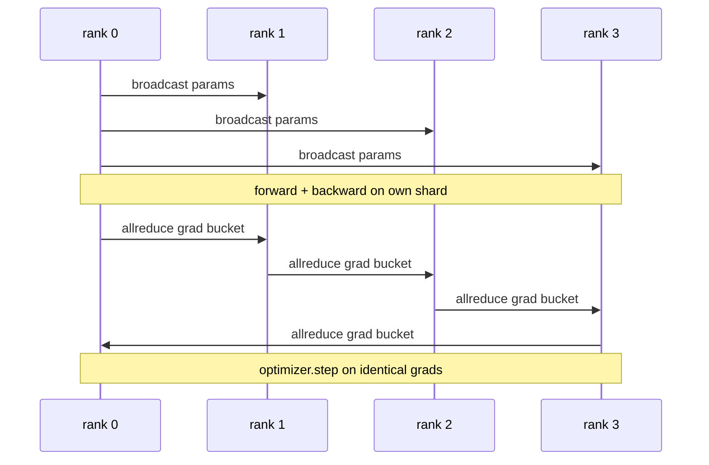

# Data Parallel DDP From Scratch / 从零实现 Data Parallel DDP

> DistributedDataParallel 本质上是 allreduce 之上的 hook。包一层 model，从 rank 0 广播初始 parameters，确保每个 rank 起点相同；给每个 parameter 安装 backward hook，对 gradient 发起 allreduce；剩下的就是 gradient descent。整个模式 200 行就能讲清楚。

**类型：** 构建
**语言：** Python
**前置知识：** 第 19 阶段 Track C 第 42-49 课
**时间：** 约 90 分钟

## Learning Objectives / 学习目标

- 接出一个 `DistributedDataParallel` 形状的 wrapper，在 backward 后广播初始 parameters 并 allreduce gradients。
- 用 `torch.multiprocessing.spawn` 在 gloo backend 上启动 N 个 CPU ranks，并使用 file-based rendezvous。
- 通过同一模型、同一数据上的 sequential training baseline，证明每步 parameter equivalence，从而验证 gradient sync 正确。
- 解释 buckets（gradient fusion）和 overlap（backward 期间通信）为什么是把可工作的 DDP 变成生产 DDP 的两个关键变化。

## The Problem / 问题

一个有 1B parameters、12 GB activations 的模型放不进单张 consumer GPU。即使放得下，训练也可能要几周。Data parallel 把 batch 分到 N 个 ranks，每个 rank 在自己的 shard 上计算 forward 和 backward，每一步把所有 rank 的 gradients 求和，让 N 份副本保持一致。求和后的 gradient 才是 optimiser 使用的 gradient。

没有 gradient sync，N 个 replicas 到 step 2 就开始分叉。它不再是“一个模型在更多数据上训练”，而是 N 个共享初始权重的独立模型。gradient sync 做得很差时（每个 parameter 一次 allreduce、没有 overlap、没有 bucketing），网络成为瓶颈，GPU 闲等 wire。DDP 的工艺是让 gradient sync 相对 compute 几乎免费。标准 PyTorch DDP 通过 bucketing gradients、把 allreduce 与下一层 backward overlap，以及在 NVLink 上使用 NCCL 实现这一点。我们在 CPU 上用 gloo 也能做三件事，并学到同样的经验。

## The Concept / 概念



### The three operations DDP needs / DDP 需要的三个操作

| Stage | Collective | Why |
|-------|-----------|-----|
| Init | broadcast from rank 0 | Every rank starts with the same parameters |
| After backward | allreduce of each grad | The mean gradient is what the optimiser steps on |
| Sometimes | broadcast of buffers | Batchnorm running stats stay synchronised |

### Why mean and not sum / 为什么是 mean 而不是 sum

Allreduce-SUM 除以 world_size 得到 mean gradient。mean 对 world_size 不敏感：在一个 rank 上调好的 learning rate，到了四个 ranks 仍然有效，因为每步 gradient magnitude 不变。Allreduce-SUM 如果不除，会迫使你每次改变 cluster size 都重新调 learning rate。DDP 包装 SUM 并除以 world_size；本课也要这样做。

### Why bucket gradients / 为什么要 bucket gradients

transformer 有成千上万个 parameter tensors。每个 tensor 一次 allreduce 会支付成千上万次 gloo latency floor。DDP 把 gradients 分组成约 25 MB buckets，每个 bucket 一次 allreduce。同样总 bytes 经过网络，但 latency 被摊到 bucket 上。本课的小模型把所有 gradient 放进一个 bucket；结构才是可以迁移到生产的部分。

### Why pin the seed / 为什么要固定 seed

每个 rank 必须在 shuffling 上调用 `torch.manual_seed(seed + rank)`，但在 parameter init 上调用 `torch.manual_seed(seed)`。单一共享 seed 会让每个 rank 看到相同 batch order（破坏 data parallel）；rank-specific params seed 会让初始 parameters 产生 float epsilon 差异，gradient sync 后也不再保证 replicas 相同。seed pattern 一错，step 1 的 parameter equivalence test 就会失败。

## Build It / 动手构建

`code/main.py` 实现：

- `MiniMLP`：一个 3-layer MLP，小到几秒内收敛，大到能暴露 DDP wiring。
- `DistributedDataParallel(model, world_size)`：construct 时广播 params，返回 wrapper，其 `sync_grads` 会把 allreduce-summed grads 除以 world_size。
- `worker(rank, world_size, ...)`：完整 training loop，包含 gloo 上的 `torch.distributed` init、forward、backward、sync、step。
- `_reference_single_process_loop(...)`：在一个 rank 上用同一数据顺序训练同一模型，用于测试每一步后 byte-equal parameter equivalence。

运行：

```bash
python3 code/main.py
```

输出：per-step training table，对比 single-process loss 和 4 ranks DDP run 的 parameter checksum。两条路径的 loss curves 在 float epsilon 内一致，证明 gradient sync 正确。

## Production patterns in the wild / 生产模式

三个模式会把 DDP 加固到可交付水平。

**Find unused parameters.** 一些 forward paths 会有条件跳过 parameters（early exit、mixture-of-experts router）。被跳过的 parameters 没有 gradient，但 DDP 的 bucket-ready hook 仍然会等它们，于是 allreduce deadlock。`find_unused_parameters=True` 会让 DDP 在 reduce 前检查哪些 params 有 gradients。代价是每步 graph walk，所以只有 forward 有分支时才打开。

**Static graph optimisation.** 当 forward 跨 steps 稳定时，`static_graph=True` 让 DDP 预计算 bucket schedule。这个优化在 scale 上有意义：每步省几 ms，乘以 10000 steps 就很可观。

**Gradient accumulation needs care.** 累积 K 个 microbatches 的 gradients 而不在每个 microbatch sync，是 10x throughput win。DDP 暴露 `no_sync()` context manager 来暂停 post-backward allreduce。忘记这个 manager，就会白白 allreduce K 次，throughput 掉到底。

## Use It / 应用它

生产模式：

- **PyTorch DDP.** 标准实现。`torch.nn.parallel.DistributedDataParallel(model)` 接好 bucketing、overlap 和 no_sync context。
- **HuggingFace Accelerate.** 增加 launcher，处理 `torchrun` env vars 和 model wrap；底层仍是 DDP。
- **Megatron-LM data parallel.** 把 DDP 与 tensor parallel 组合用于大模型；data-parallel 部分仍是 backward 后 allreduce 的模式。

## Ship It / 交付它

Lesson 78（ZeRO sharding）会用 reduce_scatter 替换 per-parameter allreduce，让每个 rank 只存自己的 optimiser state shard。Lesson 81 会把 DDP 与 ZeRO 组合进 end-to-end demo。

## Exercises / 练习

1. 添加 configurable size 的 gradient buckets，并在更深模型上测量相对 one-allreduce-per-parameter 的加速。
2. 把 `no_sync()` 实现成 context manager，并验证 K 个 microbatches 的 gradient accumulation 匹配 single-process baseline。
3. 增加 `find_unused_parameters` mode，让 forward 有时跳过一个 MLP layer；不打开 flag 时 run 应该 deadlock。
4. 用只包含 `torch.distributed.barrier()` 的 synchronisation 替换 gloo，感受 allreduce-based sync 与 barrier-based sync 的差别。
5. 对 batch sizes 1、16、256 测量 gradient-sync overhead 占 step time 的比例，并解释 scaling。

## Key Terms / 关键术语

| 术语 | 常见说法 | 实际含义 |
|------|----------------|------------------------|
| DDP | "Data parallel" | 每步广播 params 并 allreduce grads 的 wrapper |
| Bucket | "Fuse grads" | 把 N 个小 allreduces 分组成一个大 allreduce |
| Overlap | "Hide comm" | 在后续 layers 还在 backward compute 时发起 allreduce |
| no_sync | "Accumulate" | gradient accumulation 时跳过 post-backward allreduce |
| find_unused | "Branchy forward" | reduce 前检测没有 grad 的 parameters |

## Further Reading / 延伸阅读

- [PyTorch DistributedDataParallel docs](https://pytorch.org/docs/stable/generated/torch.nn.parallel.DistributedDataParallel.html)
- [PyTorch DDP internals tutorial](https://pytorch.org/tutorials/intermediate/ddp_tutorial.html)
- [Li et al, PyTorch Distributed: Experiences on Accelerating Data Parallel Training](https://arxiv.org/abs/2006.15704)
- Phase 19 Lesson 76 - the collectives DDP is built on
- Phase 19 Lesson 78 - ZeRO sharding replaces the per-param allreduce with reduce_scatter
