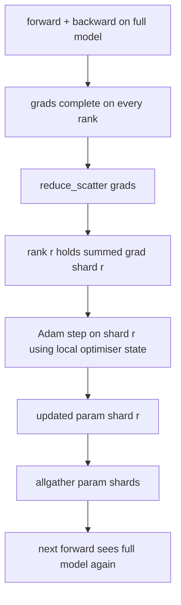

# ZeRO Optimizer State Sharding / ZeRO 优化器状态分片

> Adam 为每个 parameter 保存两个 moment estimates，二者都是 float32。一个 7B-parameter model 会携带 56 GB optimiser state。ZeRO stage 1 把它们分片到 N 个 ranks；每个 rank 只拥有 optimiser 的 1/N。local step 后，updated parameter shards 广播回来，每个 rank 重构 full model，下一步继续。收益是训练栈里最大单项 allocation 的线性内存下降。

**类型：** 构建
**语言：** Python
**前置知识：** 第 19 阶段 Track C 第 42-49 课
**时间：** 约 90 分钟

## Learning Objectives / 学习目标

- 在 N 个 ranks 上分片 optimiser state（first moment、second moment、fp32 master copy），让每个 rank 只拥有 1/N。
- 使用 reduce_scatter 只把每个 rank 自己 shard 的 gradient sum 送到本 rank，然后用 allgather 广播 updated parameter shards。
- 计算 stage 1、stage 2、stage 3 相对 vanilla DDP 的 memory savings table。
- 根据 model size 和 bandwidth budget，解释什么时候选择 stage 1、stage 2 或 stage 3。

## The Problem / 问题

Vanilla DDP 会复制一切：parameters、gradients 和 optimiser state 在每个 rank 上都有完整副本。对于 fp16 训练的 7B-parameter model，这意味着每个 rank 上有 14 GB parameters、14 GB gradients 和 28 GB optimiser state。optimiser state 是最大的项，也最容易分片，因为它只在 step 期间被触碰，不参与 forward 或 backward。

ZeRO stage 1 分片 optimiser state。每个 rank 持有 1/N 的 Adam moments。backward 后，ZeRO 不再 allreduce 完整 gradient 并在本地 step，而是 reduce_scatter，让每个 rank 只收到自己 shard 的 summed gradient。该 rank 用本地 master parameters shard 应用 optimiser step。updated parameter shards 再 allgather 回来，让每个 rank 在下一次 forward 前都有 full model。optimiser memory 下降 N 倍。每步 wire traffic 与 DDP 相同：一次 reduce_scatter 加一次 allgather，在 bandwidth 上等于一次 allreduce。memory 赢了，throughput 保持。

## The Concept / 概念



### Stages of ZeRO / ZeRO 的阶段

| Stage | What is sharded | Memory per rank | Comm per step |
|-------|----------------|------------------|---------------|
| DDP | nothing | params + grads + optim | 1x allreduce |
| ZeRO-1 | optimiser state | params + grads + optim/N | 1x reduce_scatter + 1x allgather |
| ZeRO-2 | optim + grads | params + grads/N + optim/N | 1x reduce_scatter + 1x allgather |
| ZeRO-3 | optim + grads + params | params/N + grads/N + optim/N | 1x allgather per layer + 1x reduce_scatter per layer |

Stage 1 是最便宜的收益，因为 optimiser state 主导 budget。Stage 2 需要 gradient-shard accumulation 逻辑，但 bandwidth 相同。Stage 3（FSDP）为每次 forward 和 backward 支付 per-layer comm，换来 parameter-shard memory 下降。本课完整实现 stage 1。

### The memory math, real numbers / 内存数学与真实量级

对一个使用 Adam mixed precision 训练、拥有 P 个 parameters 的模型：

| Term | Vanilla | ZeRO-1 | Why |
|------|---------|--------|-----|
| fp16 params | 2P bytes | 2P bytes | needed for forward |
| fp16 grads | 2P bytes | 2P bytes | needed for backward |
| fp32 master copy | 4P bytes | 4P/N bytes | only the optim uses it |
| fp32 first moment | 4P bytes | 4P/N bytes | only the optim uses it |
| fp32 second moment | 4P bytes | 4P/N bytes | only the optim uses it |
| Total | 16P bytes | 4P + 12P/N bytes |   |

N=8 时：vanilla 是 16P，ZeRO-1 是 5.5P，下降 65%。N=64 时：vanilla 是 16P，ZeRO-1 是 4.19P，下降 74%。

### Why reduce_scatter beats allreduce-then-shard / 为什么 reduce_scatter 胜过 allreduce 后再分片

allreduce 会让每个 rank 拿到完整 summed gradient。如果你只需要 shard r，那么 rank r 上被 reduce 出来的 (N-1)/N gradient 是浪费的。reduce_scatter 精确送达每个 rank 拥有的 shard；per-rank bytes 与 allreduce 相同（因为 allreduce = reduce_scatter + allgather），但第二半被之后的 parameter-shard allgather 取代。净 wire 与 DDP 相同，memory 被分掉。

## Build It / 动手构建

`code/main.py` 实现：

- `flatten_params(module)` 和 `unflatten_into(module, flat)`：把 model parameters 打包成一个 contiguous tensor，并解包回去。flat layout 让按 rank 分片变成简单 slice。
- `ZeroOptimizer(model, world_size, rank, lr)`：拥有本 rank 的 master copy shard 和 Adam moments。
- `step()`：对 flat gradient 运行 reduce_scatter，对 rank shard 应用 Adam，再 allgather updated parameters。
- 一个 demo：训练 3-layer MLP 20 steps，并打印 per-step memory budget，与 vanilla DDP baseline 对比。

运行：

```bash
python3 code/main.py
```

输出：per-step loss，以及 memory table，展示 ZeRO-1 每个 rank 只持有 optimiser state 的 1/N，而 DDP 持有完整副本。

## Production patterns in the wild / 生产模式

三个模式会把 ZeRO 加固到可交付水平。

**Sharded checkpointing matters.** ZeRO-1 的 optimiser state 跨 ranks 分裂；checkpoint 必须记录哪个 rank 拥有什么。Lesson 80 会构建 sharded checkpoint manifest，在相同 world size 上恢复 ZeRO run。没有它，保存状态在重启时不可读。

**Mixed precision is the point.** ZeRO 是 mixed-precision technique；被分片的是 fp32 master copy。不配 mixed precision 运行 ZeRO，会支付 fp32 master 的内存税，却没有 fp16 forward 的收益。生产 runs 总是把 ZeRO 与 autocast 或 bf16 weights 配对。

**Stage 1 is a near-free win.** bandwidth 上 comm 与 DDP 相同。memory savings 随 N 线性增长。唯一成本是 optimiser shard 的 bookkeeping。生产 stacks 默认 stage 1，除非 parameter shard memory 也成为问题；那时 stage 2 或 3 用 comm 换 memory。

## Use It / 应用它

生产模式：

- **DeepSpeed ZeRO.** reference implementation。`deepspeed_config.json` 选择 stage 1/2/3 和 partition sizes。
- **PyTorch FSDP.** PyTorch-native equivalent。`ShardingStrategy.SHARD_GRAD_OP` 是 ZeRO-2；`FULL_SHARD` 是 ZeRO-3。
- **HuggingFace Accelerate.** 用统一 config 包装 DeepSpeed 和 FSDP。

## Ship It / 交付它

Lesson 79（pipeline parallel）是正交的 sharding axis：它不是在同一个模型上分片 optimiser state，而是把 layers 分到 ranks。Lesson 81 会在 end-to-end demo 中组合 DDP + ZeRO。

## Exercises / 练习

1. 扩展到 ZeRO-2，分片 gradients：backward 后把 non-shard 部分清零，让每个 rank 只存自己的 gradient shard。
2. 增加 memory profiler，打印 rank 0 上实际 fp32 byte usage 与公式预测的对比。
3. 测量 vanilla DDP 与 ZeRO-1 的 per-step wall-clock time，并拆分 forward、backward、comm。
4. 在 ZeRO-1 下实现 gradient clipping：L2 norm 必须通过 local norm squared 的 allreduce 跨所有 shards 计算。
5. 实现一个用 allreduce 替代 reduce_scatter 的 “naive ZeRO”，测量 wire-time difference，并用数字解释 reduce_scatter 的选择。

## Key Terms / 关键术语

| 术语 | 常见说法 | 实际含义 |
|------|----------------|------------------------|
| ZeRO-1 | "Shard the optimiser" | 每个 rank 持有 1/N 的 fp32 master + Adam moments |
| ZeRO-2 | "Shard grads too" | reduce_scatter 后每个 rank 也丢掉 non-shard gradients |
| ZeRO-3 | "Shard params" | 每个 rank 只持有 1/N fp16 params；forward 中 per layer allgather |
| Master copy | "fp32 weights" | optimiser 更新的 high-precision parameter copy |
| Reduce_scatter | "Split the sum" | 只把每个 rank 自己 shard 的 summed gradient 送到该 rank |

## Further Reading / 延伸阅读

- [Rajbhandari et al, ZeRO: Memory Optimizations Toward Training Trillion Parameter Models](https://arxiv.org/abs/1910.02054)
- [DeepSpeed ZeRO documentation](https://www.deepspeed.ai/tutorials/zero/)
- [PyTorch FSDP documentation](https://pytorch.org/docs/stable/fsdp.html)
- Phase 19 Lesson 76 - the reduce_scatter and allgather this lesson stands on
- Phase 19 Lesson 80 - sharded checkpointing the ZeRO state must use
