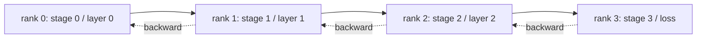

# Pipeline Parallel and Bubble Analysis / Pipeline Parallel 与 Bubble 分析

> Tensor parallelism 把 matrix multiply 分到多个 ranks。Pipeline parallelism 把 model 分到多个 ranks，每个 rank 一个 stage。microbatches 在 pipeline 中流动。开头和结尾的空转时间就是 bubble；最小化它就是这门手艺的核心。

**类型：** 构建
**语言：** Python
**前置知识：** 第 19 阶段 Track C 第 42-49 课
**时间：** 约 90 分钟

## Learning Objectives / 学习目标

- 把 sequential model 分成 N 个 stages，并模拟 N 个 ranks 上的 forward pipeline。
- 使用 GPipe schedule（forward-only fill，然后 backward）把 M 个 microbatches 调度进 pipeline，并计算 bubble fraction。
- 对比 Megatron-LM 和 PipeDream 使用的 interleaved 1F1B schedule。
- 解释 stage assignment：让每个 stage 的 compute 接近相等，比让 parameter count 相等更重要。

## The Problem / 问题

70B-parameter model 仅 fp16 parameters 就需要 140 GB。没有 consumer GPU 能装下。ZeRO-3 会把 parameters 分片到 ranks，但每次 forward step 仍需要每个 rank allgather full layer，并为每层支付 log(N) hops。Pipeline parallel 走另一条路：把 model 切成 N 个 stages，每个 rank 放一个 stage。layer 1 的 forward 在 rank 0 完成后，把 activation tensor 交给 rank 1；rank 1 运行 layer 2 再交给 rank 2；依此类推。backward 反向流动。memory 线性下降，因为每个 rank 只持有一个 stage；compute 变成顺序流，这就是 bubble problem。

bubble 是 pipeline 开头的 idle time（等第一个 microbatch 到达最后 stage）和结尾的 idle time（等最后一个 microbatch 反向 drain 回来）。M 个 microbatches、N 个 stages 时，per-stage bubble fraction 是 (N-1)/(M+N-1)。M=8、N=4 时是 27%。M=64、N=4 时是 4.5%。microbatches 越多，bubble 越小；这意味着 per-microbatch batch size 更小，也正是 microbatch design 的约束来源。

## The Concept / 概念



### GPipe schedule / GPipe 调度

先用所有 M 个 microbatches 做 forward，把 pipeline 填满，然后再反向 drain backward。每个 microbatch 的 activations 必须保留到对应 backward，因此 memory 随 M 线性增长。forward 需要 M+N-1 cycles，backward 再需要 M+N-1 cycles。per-stage useful work 是 2M cycles；per-stage bubble 是 2(N-1) cycles。当每个 forward 和 backward 都用一个 time unit 时，bubble fraction 是 (N-1)/(M+N-1)。选择 M 远大于 N 可以隐藏 bubble。

### 1F1B schedule / 1F1B 调度

interleave：某个 microbatch 的 forward 一到最后 stage，就启动它的 backward 并让它流回去。schedule 在每个 stage 上交替 one forward 和 one backward。bubble 仍然是 N-1，但 activation memory 受 pipeline depth 约束，而不是受 microbatch count 约束。生产 pipelines 使用 1F1B（Megatron、PipeDream）。本课先实现更简单的 GPipe，把 1F1B 留作练习。

### Why equal compute per stage matters / 为什么 stage compute 要均衡

如果 stage 0 用 50 ms、stage 1 用 100 ms，每个 cycle 都被 stage 1 gate 住。其他 stages 每个 cycle 都会 idle 50 ms 等 stage 1 释放。equal parameter count 是错误轴：transformer 的 compute 主要来自 attention 加 MLP，每层 embedding layers 可能参数很多但 compute 很少。stage assignment 应该均衡每个 stage 的 FLOPs，而不是权重数量。

### Microbatch versus batch / Microbatch 与 batch

pipeline 运行 M 个 microbatches，每个大小为 B。effective batch size 是 M*B。pipeline step 结束时的 gradient 是合并的 M*B 个 examples 上的 gradient。bubble fraction 取决于 M；optimiser 看到的是 M*B。调 M 就是在 bubble（高 M 更低）和 per-microbatch memory（GPipe 下高 M 会带来更高 activation memory）之间做权衡。

## Build It / 动手构建

`code/main.py` 实现：

- `PipelineStage`：一个小 `nn.Module`，持有一个 stage 的 parameters，并暴露 `forward(activation)`。
- `Pipeline(stages, num_microbatches)`：在 simulated stages 上用 simulated wall-clock per stage 编排 GPipe schedule。
- `bubble_fraction(num_stages, num_microbatches)`：closed-form (N-1)/(M+N-1)。
- 一个 4-stage demo：打印 per-microbatch trace 和 measured bubble fraction。

运行：

```bash
python3 code/main.py
```

输出：stage-by-microbatch Gantt chart，以及 bubble percentage 与 closed-form prediction 的对比。

## Production patterns in the wild / 生产模式

三个模式会把 pipeline parallel 加固到可交付水平。

**Activation checkpointing pairs with pipeline.** GPipe 中有 M 个 microbatches in flight 时，activation memory 是一个 microbatch 的 M 倍。activation checkpointing 在 backward 时重算 forward，用 compute 换 memory；二者组合才让长序列 pipeline 可行。

**Stage balance is measured, not assumed.** 生产团队会跑 profiling pass，在 target hardware 上测量真实 per-layer compute（FLOPs 和 wall-clock），然后按测量结果 partition。Megatron-LM 的 `--num-layers-per-stage` flag 接受 list，允许不同 stage 有不均匀 layer counts，以适配不同 per-layer cost。

**Send-recv schedule must avoid deadlock.** 如果 pipeline 中每个 stage 都先 send 再 receive，就会在 wire 上 deadlock。标准修法是 interleave：even-rank stages 先 send 后 recv，odd-rank stages 先 recv 后 send。本课会显式调度 ranks，让这个模式可见。

## Use It / 应用它

生产模式：

- **Megatron-LM.** 大规模 pipeline parallel 的参考实现。使用 1F1B，并支持 tensor + pipeline + data parallel 组合。
- **DeepSpeed Pipeline.** 与 ZeRO 集成；ZeRO-1 + pipeline 是最大 open models 的常见组合。
- **PyTorch Pipe.** PyTorch-native pipeline wrapper，基于 `torch.distributed.pipeline.sync.Pipe`。

## Ship It / 交付它

Lesson 80 会把 per-stage parameter shards 存入 sharded checkpoint。Lesson 81 会在 end-to-end demo 中组合 DDP + ZeRO + pipeline（精神上组合；demo 为了 runtime 仍保持 pipeline simulated）。

## Exercises / 练习

1. 实现 1F1B，并验证 bubble fraction 匹配 GPipe，但 activation memory 受限。
2. 在更深模型上 profile 真实 per-stage time，并按 measured wall-clock 重新 balance stages。
3. 增加跨 pipeline microbatches 的 gradient accumulation，并检查 gradient 等于等价 full-batch forward 的 gradient。
4. 把 pipeline 与 activation checkpointing 配对，测量 memory drop 与 compute cost。
5. 组合 pipeline 和 DDP（每个 pipeline rank 在 data-parallel group 中被复制），推演 2D schedule。

## Key Terms / 关键术语

| 术语 | 常见说法 | 实际含义 |
|------|----------------|------------------------|
| Pipeline | "Model parallel along depth" | 每个 rank 一个 stage，activations 在 stages 之间流动 |
| Bubble | "Pipeline idle time" | 开头和结尾各有 (N-1) steps，部分 stages 无事可做 |
| Microbatch | "Slice of the batch" | 一个 forward/backward unit；M 越大 bubble 越小 |
| GPipe | "Fill then drain" | 先做所有 M 个 forwards 再 backward；activation memory 高 |
| 1F1B | "Interleaved schedule" | 每个 stage 交替 one forward one backward；activation memory 有界 |

## Further Reading / 延伸阅读

- [Huang et al, GPipe: Efficient Training of Giant Neural Networks](https://arxiv.org/abs/1811.06965)
- [Narayanan et al, PipeDream: Generalized Pipeline Parallelism for DNN Training](https://arxiv.org/abs/1806.03377)
- [Megatron-LM pipeline parallel docs](https://github.com/NVIDIA/Megatron-LM)
- Phase 19 Lesson 76 - the send/recv primitives the schedule uses
- Phase 19 Lesson 78 - ZeRO is orthogonal to pipeline and often combined
